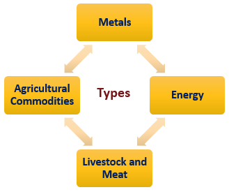

Commodities are foundational to the electronics industry, serving as the essential raw materials for a wide array of electronic components and devices. Items such as silicon, copper, gold, lithium, and rare earth elements form the backbone of this sector. Silicon, fundamental to the creation of semiconductors, is a crucial component of processors and integrated circuits. Copper is vital for manufacturing electrical wiring and printed circuit boards due to its excellent conductivity. Gold, with its outstanding corrosion resistance, is routinely used in high-quality connectors and contacts. Lithium powers the rechargeable batteries that drive portable electronics, while rare earth elements, although used in small quantities, are indispensable for producing strong magnets, phosphors, and catalysts crucial for smartphones, displays, and green technologies.

The sourcing and availability of these raw materials significantly influence the electronics industry's production costs and innovation capabilities. As technology evolves at an unprecedented pace, the demand for these commodities intensifies, necessitating more efficient and sophisticated approaches to sourcing and trading.

Algorithmic trading represents a significant development in the financial markets, and its impact is growing within the commodities sector. By harnessing advanced algorithms, traders can execute large volumes of transactions at enhanced speed and accuracy, capitalizing on market opportunities swiftly. This method leverages computational power and big data analytics to identify trading signals and price trends that are not immediately apparent through traditional trading methods.

This article's primary objective is to explore how the integration of algorithmic trading can revolutionize the sourcing of raw materials in the electronics industry. By examining this intersection, the article aims to provide insights into how improved trading strategies can optimize supply chains and reduce costs, ultimately influencing the industry’s ability to innovate and compete.

In a world where technological advancements are rapidly shifting paradigms, understanding and adapting to these shifts in commodities sourcing and trading is crucial. This topic’s relevance extends beyond the electronics industry, offering implications for the broader global economy as financial technologies and industrial requirements continually intertwine.

## Table of Contents

## The Role of Raw Materials in the Electronics Industry

Raw materials are the foundation of the electronics industry, powering the production of myriad devices that drive modern technology. Core materials such as silicon, copper, gold, lithium, and rare earth elements play pivotal roles in this sector, each offering specific properties essential for various applications.

**Silicon** is the backbone of semiconductor devices, making it indispensable in the manufacturing of integrated circuits and microchips. Its ability to withstand high temperatures and conduct electricity effectively makes it the material of choice for computer processors and photovoltaic cells. **Copper**, known for its excellent conductivity, is widely used in electrical wiring, circuit boards, and electromagnetic interference shielding. It is crucial in enabling the reliable transmission of electric signals and ensuring electrical equipment efficiency.

**Gold**, prized for its corrosion resistance and superior conductivity, is utilized in high-precision electronic connectors, contacts, and switching mechanisms. Despite its cost, gold is favored in devices where reliability is paramount, such as smartphones and computers. **Lithium** is essential for battery production, particularly in lithium-ion batteries, which power a large spectrum of portable electronic devices, including laptops, smartphones, and electric vehicles. Its high energy density and rechargability make it a vital resource in the energy storage sector.

**Rare earth elements** encompass a group of 17 elements, including neodymium and cerium, that are critical for the development of high-performance magnets, phosphors in LED displays, and rechargeable batteries. Their unique magnetic and optical properties are indispensable for modern electronics, enhancing device performance and efficiency.

The sourcing and management of these raw materials present significant challenges. Geographic concentration of these resources in politically unstable regions poses risks related to supply disruption. For instance, over 60% of cobalt, often sourced for lithium-ion batteries, comes from the Democratic Republic of Congo, raising concerns over both supply stability and ethical procurement practices due to child labor and poor working conditions.

Environmental considerations are also paramount. Mining and processing activities associated with these materials often result in significant ecological disturbances, including deforestation, habitat destruction, and pollution. The electronics industry must seek sustainable and responsible sourcing practices to address these impacts, through improved recycling and the adoption of substitute materials.

Price fluctuations in these commodities can have cascading effects on the electronics industry. Volatile markets can increase production costs, affecting pricing strategies and, ultimately, consumer costs. For example, price spikes in copper or rare earth elements can lead to increased prices for end products, potentially stifling innovation if companies reallocate resources to manage expenses instead of developing new technologies.

Understanding these dynamics is crucial for maintaining supply chain stability. By investing in sustainable practices and diversifying supply chains, the electronics industry can mitigate some of these challenges, ensuring the continued development of innovative technologies while addressing ethical and environmental concerns.

## Understanding Algorithmic Trading

Algorithmic trading refers to the use of computer algorithms to execute trading orders in financial markets. These algorithms, operating at speeds and complexities beyond human capability, are designed to determine aspects such as timing, price, and quantity of orders, often with minimal human intervention. The automation provided by [algorithmic trading](/wiki/algorithmic-trading) is crucial for navigating the high-frequency environments prevalent in today’s markets.

One of the principal advantages of algorithmic trading is its speed. Algorithms can process large volumes of data and execute trades in milliseconds, enabling traders to capitalize on fleeting market opportunities that would be inaccessible through manual trading. This speed is complemented by increased efficiency, as algorithms can manage multiple trades across various markets simultaneously, optimizing execution and reducing transaction costs. Moreover, algorithmic trading leverages advanced data analysis, utilizing historical data and real-time information to identify patterns and make informed trading decisions. 

There are several types of algorithmic trading strategies commonly applied within commodities markets:

1. **Trend Following**: This strategy exploits movements in market prices, capitalizing on upward or downward price trends without predicting specific levels.

2. **Arbitrage**: Algorithms look for price discrepancies between different markets or securities and execute trades to profit from these discrepancies.

3. **Market Making**: This involves placing simultaneous buy and sell orders to capture the spread, thereby earning profits through high volumes of transactions.

4. **Statistical Arbitrage**: This uses statistical models to forecast price movements based on historical data, relying on statistical methods and machine learning.

5. **High-Frequency Trading (HFT)**: This involves executing a large number of orders at extremely fast speeds, often using sophisticated algorithms to achieve micromovements within the market.

Fintech advancements and big data have further revolutionized commodities trading. Fintech innovations facilitate the integration of cutting-edge technologies such as [machine learning](/wiki/machine-learning), [artificial intelligence](/wiki/ai-artificial-intelligence), and blockchain into trading processes. Big data analytics enable traders to sift through vast datasets to extract actionable insights, thus enhancing their predictive accuracy and decision-making capabilities. This symbiotic relationship between fintech and algorithmic trading allows for more precise market evaluations and strategic positioning.

Despite its advantages, algorithmic trading is not without potential risks and criticisms. One significant concern is market [volatility](/wiki/volatility-trading-strategies). The rapid execution of orders can exacerbate price fluctuations, particularly in relatively illiquid markets. Flash crashes, where markets experience steep and abrupt declines, have been linked to algorithm-based trading. Additionally, there are concerns about fairness and market accessibility, as algorithmic trading can create an uneven playing field for those without the technological resources to compete. Finally, the black-box nature of some algorithms poses transparency issues, making it difficult to understand and regulate the decisions made by these automated systems.

Overall, algorithmic trading represents a fundamental shift in how commodities and other financial instruments are traded, driven by digitalization and enhanced computational power. While it offers remarkable capabilities, it also necessitates careful consideration of regulatory frameworks to mitigate its associated risks and ensure market integrity.

## Algorithmic Trading in Commodities

Algorithmic trading involves the use of computer programs to automate trading strategies based on predefined rules. In commodities such as metals and minerals, algorithmic trading has become an integral part of the market dynamics, greatly impacting pricing and overall market stability. These algorithms use complex mathematical models and vast amounts of historical data to make trading decisions at speeds and frequencies that are impossible for humans to match.

The impact on commodities pricing is significant. Algorithmic trading can lead to tighter bid-ask spreads and increased market [liquidity](/wiki/liquidity-risk-premium), making it easier for traders to enter and [exit](/wiki/exit-strategy) positions. However, it can also contribute to price volatility, especially during periods of low liquidity or in response to unexpected market events. This is because algorithmic systems can respond instantaneously to market developments, sometimes amplifying trends and leading to rapid price swings.

Commodities traders and producers benefit from employing algorithmic methods in several ways. Firstly, algorithms allow for high-frequency trading ([HFT](/wiki/high-frequency-trading-strategies)), which can capitalize on small price discrepancies across different markets. Secondly, algorithms can enhance risk management by automatically executing hedging strategies in response to market movements. This leads to more efficient trading operations and can improve the accuracy of price forecasts, which are crucial for decision-making.

The use of real-time data and predictive analytics further enhances decision-making in commodities trading. Real-time data feeds provide up-to-the-second information on market conditions, while predictive analytics use historical and live data to model future price movements. This capability allows traders to anticipate market trends and adjust their strategies accordingly, thereby maximizing profit potential and minimizing risk.

Regulatory frameworks play a crucial role in shaping algorithmic trading practices. Authorities like the Commodity Futures Trading Commission (CFTC) in the United States and the European Securities and Markets Authority (ESMA) in the European Union set rules to ensure market integrity and protect against systemic risks. These may include requirements for testing and monitoring algorithms, maintaining audit trails, and implementing risk controls to prevent erroneous trades.

In summary, algorithmic trading has revolutionized commodities markets, offering numerous advantages such as increased efficiency and enhanced risk management. However, it also poses risks related to market volatility and regulatory compliance. As technology and data analysis capabilities continue to advance, the integration of sophisticated algorithmic strategies in commodities trading is likely to increase, shaping the future landscape of the industry.

## Impact on the Electronics Industry

Improvements in commodities trading through algorithmic methods present a myriad of benefits for electronics manufacturers. One of the foremost advantages is the enhanced ability to predict and stabilize the costs of importing raw materials, such as silicon, copper, lithium, and rare earth elements. Algorithms can process vast datasets to identify patterns, trends, and anomalies in real-time, which can lead to more informed and timely decisions regarding raw materials procurement. This capability allows manufacturers to anticipate market fluctuations and adjust their purchasing strategies accordingly, thereby minimizing unexpected price increases and ensuring a more stable supply chain.

Several case studies illustrate the influential role of algorithmic trading in redefining sourcing strategies within the electronics sector. For instance, some electronics companies have employed machine learning models to forecast commodity price trends more accurately. These models integrate various data streams, including historical pricing data, macroeconomic indicators, and market sentiment analysis from social media and news outlets. The application of these advanced trading algorithms has enabled companies to negotiate better long-term contracts with suppliers and hedge against adverse price movements, thus securing significant cost advantages.

The potential for cost savings and risk mitigation inherent in algorithmic trading is particularly significant. Algorithms can improve procurement efficiency by optimizing purchase timing and quantity, ensuring that electronics manufacturers acquire raw materials at the most opportune moments. This optimization reduces both holding costs and the risks associated with market volatility. Moreover, algorithmic trading facilitates more accurate demand forecasting, enabling companies to maintain optimal inventory levels and avoid production delays caused by shortages.

The implications on supply chain transparency and efficiency are equally profound. Algorithmic trading systems can enhance transparency by providing stakeholders with real-time access to transactions and historical trading records. This transparency facilitates trust and accountability across the supply chain, which, in turn, leads to improved collaboration between manufacturers and suppliers. Additionally, algorithms can streamline supply chain operations by automating routine tasks such as order processing and shipment tracking, thus reducing errors and enhancing operational efficiency.

Looking ahead, technology is anticipated to become even more intertwined with commodities sourcing. The advent of blockchain technology, for instance, promises to revolutionize supply chain management by offering a decentralized, tamper-proof ledger for recording transactions. This innovation could lead to greater traceability of raw materials, allowing electronics manufacturers to monitor the entire journey of products from extraction to the final consumer. Furthermore, advances in artificial intelligence and machine learning are expected to drive even more sophisticated algorithms that can model complex market dynamics and predict future trends with unprecedented accuracy. 

In conclusion, as the electronics industry continues to embrace algorithmic trading, it stands to gain from increased cost-effectiveness, reduced risk, and heightened supply chain transparency. By leveraging these advances, manufacturers can better navigate the challenges of raw materials procurement and position themselves for sustainable growth in an increasingly competitive landscape.

## Challenges and Opportunities

Integrating algorithmic trading into the electronics industry's raw materials procurement process presents several challenges and opportunities. The first major challenge is navigating the complex regulatory landscape. Financial markets, particularly those involving commodities, are tightly regulated to prevent abuses such as market manipulation and insider trading. Algorithmic trading, with its high-speed transactions and heavy reliance on data analytics, can obscure the clarity regulators require to oversee trading activities. This complexity may invite additional scrutiny, creating potential regulatory obstacles for electronics companies looking to implement advanced trading strategies.

Moreover, the technological infrastructure necessary for effective algorithmic trading is both sophisticated and costly. Companies need robust data processing capabilities and advanced algorithms capable of analyzing real-time market data to make split-second trading decisions. The integration of such technology requires significant upfront investment in both hardware and software, along with the recruitment of skilled personnel capable of maintaining and innovating these systems.

Despite these challenges, significant opportunities exist for businesses willing to embrace algorithmic trading. By leveraging advanced trading strategies, electronics manufacturers can optimize their procurement processes, leading to cost savings and enhanced competitiveness. For example, predictive analytics powered by machine learning can help anticipate price fluctuations in raw materials, enabling more strategic purchasing decisions that minimize costs and reduce supply chain risks.

Furthermore, partnerships between technology firms and financial institutions could spur innovation and facilitate the adoption of algorithmic trading in the electronics sector. These collaborations can foster the development of specialized algorithms tailored for commodities trading, improve data sharing protocols, and enhance overall market intelligence. By combining the technological expertise of the tech sector with the financial acumen of trading firms, these partnerships could unlock new growth avenues and resilience for the electronics industry.

To adapt to advancements in algorithmic trading, industries should focus on developing flexible strategies that align with their specific operational needs and regulatory environment. Investing in continuous training and development for staff to effectively manage and innovate trading technologies is crucial. Additionally, maintaining open dialogue with regulators can help businesses navigate the evolving legal landscape effectively.

In conclusion, while integrating algorithmic trading in the electronics industry's supply chain poses notable challenges, it also offers considerable opportunities for growth and innovation. Adapting to these developments requires strategic investment and collaboration across technology and finance sectors, potentially reshaping the efficiency and transparency of global supply chains.

## Conclusion

The intersection of commodities, electronics, and algorithmic trading reveals complex interdependencies fostering transformative impacts on the electronics supply chain. As the electronics industry relies heavily on raw materials such as silicon, copper, and rare earth elements, sourcing strategies can be significantly enhanced through algorithmic trading. This integration improves price predictions, stabilizes supply chains, and lowers operational risks, providing a competitive edge to manufacturers.

Adapting to the evolving technologies in trading and sourcing is crucial. Algorithmic trading enables faster, more informed decision-making processes that target efficiency and cost-effectiveness. This dynamic shift requires the electronics sector to innovate continuously, fostering collaboration between tech companies and financial markets to maximize resources and maintain industry resilience.

Looking forward, the integration of finance and technology will likely expand, augmenting global economic frameworks. Advanced data analytics and machine learning will further refine trading algorithms, shifting how raw materials are sourced and procured. As the digital economy evolves, embracing technological advances will ensure the sustainability and growth of the electronics supply chain, underscoring the significant promise at this intersection of industries.

## References & Further Reading

[1]: Veiga, L. F., & Salazar, D. (2017). ["What's behind the increasing cause of equity market volatility? The role of algorithmic trading and high-frequency trading."](https://digital.csic.es/bitstream/10261/373872/1/1-s2.0-S0269749124020621-main.pdf) Research in International Business and Finance, 39, 194-205.

[2]: Lopez de Prado, M. (2018). ["Advances in Financial Machine Learning."](https://www.amazon.com/Advances-Financial-Machine-Learning-Marcos/dp/1119482089) Wiley Finance.

[3]: Hayes, B. J. (2018). ["The Importance and Impacts of Lithium Ion Batteries."](https://www.sciencedirect.com/science/article/pii/S2214629624003475) IEEE Electromagnetic Compatibility Magazine, 7(3), 23-26.

[4]: Jansen, S. (2020). ["Machine Learning for Algorithmic Trading."](https://github.com/stefan-jansen/machine-learning-for-trading) Packt Publishing.

[5]: Green, J. M., Weeks, J., & Liu, E. K. (2013). ["Rare Earth Elements: The Global Supply Chain."](https://www.researchgate.net/publication/369737109_Global_rare_earth_elements_projects_New_developments_and_supply_chains) Congressional Research Service.

[6]: U.S. Geological Survey. (2021). ["Minerals Yearbook."](https://www.usgs.gov/centers/national-minerals-information-center/minerals-yearbook-metals-and-minerals) U.S. Department of the Interior.

[7]: Chan, E. P. (2009). ["Quantitative Trading: How to Build Your Own Algorithmic Trading Business."](https://github.com/ftvision/quant_trading_echan_book) John Wiley & Sons.