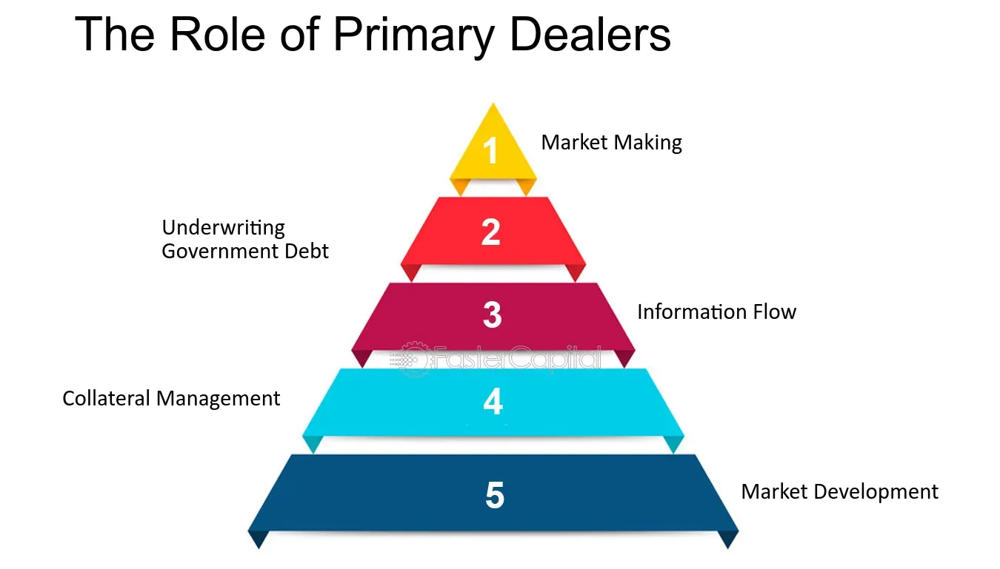

## Table of Contents

## What is a primary dealer?

A primary dealer is a bank or financial institution that is allowed to buy government securities directly from the government. These securities can be things like treasury bonds or bills. Governments use primary dealers to help them sell these securities to the public. This helps the government raise money it needs for different projects or to pay its bills.

Primary dealers also play a big role in the financial markets. They have to buy a certain amount of securities from the government and then sell them to other investors. This helps keep the market for these securities active and liquid, meaning it's easier for people to buy and sell them. Primary dealers also give the government important information about what's happening in the market, which helps the government make better decisions about its borrowing.

## What is the role of a primary dealer in the financial market?

A primary dealer is like a special helper in the financial market. They work directly with the government to buy securities like treasury bonds or bills. When the government needs to raise money, it sells these securities to primary dealers. The dealers then sell these securities to other people and businesses who want to invest their money. This helps the government get the money it needs for different projects or to pay its bills.

Primary dealers also keep the market for these securities busy and easy to use. They have to buy a certain amount of securities from the government, which makes sure there are always securities available for others to buy. This makes it easier for people to trade these securities without waiting too long or paying too much. Plus, primary dealers tell the government what's happening in the market, which helps the government make smart choices about borrowing money.

## How does one become a primary dealer?

To become a primary dealer, a bank or financial institution needs to apply to the central bank or the government's debt management office. They have to show that they are good at trading government securities and that they have enough money and resources to do the job well. The central bank or government will check if the bank meets all the rules and requirements. If they do, they might get chosen as a primary dealer.

Once chosen, primary dealers have to follow certain rules. They need to buy a certain amount of government securities and help sell them to other investors. They also have to give the government information about what's happening in the market. If a primary dealer doesn't follow these rules, they might lose their special status. It's a big responsibility, but it also gives them a special role in the financial market.

## What are the responsibilities of a primary dealer?

A primary dealer has to buy government securities like treasury bonds or bills directly from the government. They need to buy a certain amount of these securities to help the government raise money for different projects or to pay its bills. This is a big responsibility because the government counts on them to help sell these securities to other investors.

Primary dealers also have to help keep the market for these securities active and easy to use. They do this by selling the securities they bought from the government to other people and businesses who want to invest their money. They also need to give the government important information about what's happening in the market. This helps the government make smart choices about borrowing money. If a primary dealer doesn't follow these rules, they might lose their special status.

## What are the benefits of being a primary dealer?

Being a primary dealer comes with some big benefits. One of the main benefits is that primary dealers get to buy government securities directly from the government. This means they can get these securities before anyone else, which can be a big advantage in the financial market. They can then sell these securities to other investors and make a profit from the difference between what they paid and what they sell them for.

Another benefit is that primary dealers have a special role in the financial market. They are seen as important players because they help the government raise money and keep the market for government securities active and easy to use. This special status can help primary dealers build strong relationships with the government and other big investors. These relationships can lead to more business opportunities and help the primary dealer grow and succeed in the financial market.

## How do primary dealers interact with central banks?

Primary dealers work closely with central banks. They buy government securities directly from the central bank or the government's debt management office. This helps the government raise money it needs. The central bank sets rules that primary dealers have to follow, like how much securities they need to buy. This makes sure there are always securities available for other investors to buy.

Primary dealers also give the central bank important information about what's happening in the financial market. They tell the central bank about things like how much people want to buy securities and what prices they are willing to pay. This helps the central bank make smart decisions about how much money to borrow and at what interest rates. By working together, primary dealers and central banks help keep the financial market stable and working well.

## What is the difference between a primary dealer and a secondary dealer?

A primary dealer is a special kind of bank or financial institution that can buy government securities directly from the government. They help the government raise money by buying securities like treasury bonds or bills and then selling them to other investors. Primary dealers have to follow certain rules set by the central bank, like buying a certain amount of securities and giving the government information about the market. This helps keep the market for these securities active and easy to use.

A secondary dealer, on the other hand, does not buy securities directly from the government. Instead, they buy and sell these securities in the market after they have been sold by primary dealers. Secondary dealers help make the market more liquid by providing a place for investors to trade securities after they have been issued. They don't have the same special relationship with the government or central bank that primary dealers do, but they still play an important role in the financial market by helping investors buy and sell securities.

## How do primary dealers influence government securities markets?

Primary dealers help shape the government securities market by buying securities directly from the government and then selling them to other investors. This helps the government raise money for different projects or to pay its bills. When primary dealers buy a lot of securities, it makes sure there are always securities available for others to buy. This keeps the market active and easy to use, which means people can buy and sell securities without waiting too long or paying too much.

Primary dealers also give the government important information about what's happening in the market. They tell the government how much people want to buy securities and what prices they are willing to pay. This helps the government make smart choices about how much money to borrow and at what interest rates. By working closely with the government and central bank, primary dealers help keep the financial market stable and working well.

## What are the risks associated with being a primary dealer?

Being a primary dealer comes with some risks. One big risk is that they have to buy a lot of government securities, and if the market changes and the value of these securities goes down, the primary dealer could lose money. They might have to sell the securities for less than what they paid for them. This can be a problem if they bought a lot of securities and the market suddenly drops.

Another risk is that primary dealers have to follow strict rules set by the central bank. If they don't follow these rules, they could lose their special status as a primary dealer. This would mean they can't buy securities directly from the government anymore, which could hurt their business. They also have to give the government good information about the market, and if they get it wrong, it could lead to problems for both the primary dealer and the government.

## How do primary dealers manage their inventory of securities?

Primary dealers manage their inventory of securities by carefully watching the market and making smart decisions about when to buy and sell. They buy securities directly from the government and then sell them to other investors. To keep their inventory balanced, they need to make sure they have enough securities to meet the demand from investors but not so many that they lose money if the market goes down. They use different tools and strategies to figure out the best times to buy and sell, helping them manage their inventory in a way that keeps their business strong.

Another important part of managing their inventory is keeping good relationships with other market players. Primary dealers often work with other banks and financial institutions to trade securities. This helps them move their inventory around and find the best prices for buying and selling. By staying active in the market and using their connections, primary dealers can manage their inventory effectively and make sure they are always ready to meet the needs of their clients and the government.

## What impact do primary dealers have on monetary policy?

Primary dealers help shape monetary policy by working closely with the central bank. They buy government securities directly from the government, which helps the government raise money. When the central bank wants to change the amount of money in the economy, it can use primary dealers to buy or sell securities. If the central bank wants to increase the money supply, it can buy securities from primary dealers, putting more money into the economy. If it wants to decrease the money supply, it can sell securities to primary dealers, taking money out of the economy. This way, primary dealers play a big role in helping the central bank control the money supply and influence interest rates.

Primary dealers also give the central bank important information about what's happening in the market. They tell the central bank how much people want to buy securities and what prices they are willing to pay. This helps the central bank make smart decisions about how much money to borrow and at what interest rates. By working together, primary dealers and the central bank can keep the financial market stable and help guide the economy in the right direction.

## How has the role of primary dealers evolved in recent years?

The role of primary dealers has changed a lot in recent years. They used to just buy and sell government securities, but now they do more. They help the government and central bank understand the market better by giving them important information. This helps the government make better decisions about borrowing money. Primary dealers also use new technology to trade securities faster and more efficiently. This makes the market more active and easier to use for everyone.

Another big change is that primary dealers now have to follow even stricter rules. The central bank wants to make sure they are doing a good job, so they have to meet higher standards. This means primary dealers have to be more careful about how they manage their inventory and how they trade. They also have to be ready to help the government and central bank during times when the market is not doing well. All these changes make the role of primary dealers more important and more challenging than ever before.

## References & Further Reading

[1]: Fleming, M. J. (2003). ["Measuring Treasury Market Liquidity."](https://www.newyorkfed.org/medialibrary/media/research/epr/03v09n3/0309flempdf.pdf) Federal Reserve Bank of New York Staff Reports, no. 133.

[2]: Hendershott, T. (2003). ["Electronic Trading in Financial Markets."](https://faculty.haas.berkeley.edu/hender/ITpro.pdf) Federal Reserve Bank of San Francisco, Working Paper.

[3]: ["Advances in Financial Machine Learning"](https://www.amazon.com/Advances-Financial-Machine-Learning-Marcos/dp/1119482089) by Marcos Lopez de Prado

[4]: Treynor, J. L. (1962). ["Toward a Theory of Market Value of Risky Assets."](https://papers.ssrn.com/sol3/papers.cfm?abstract_id=628187) The Journal of Finance, 17(3), 425-442.

[5]: ["Quantitative Trading: How to Build Your Own Algorithmic Trading Business"](https://www.amazon.com/Quantitative-Trading-Build-Algorithmic-Business/dp/1119800064) by Ernest P. Chan