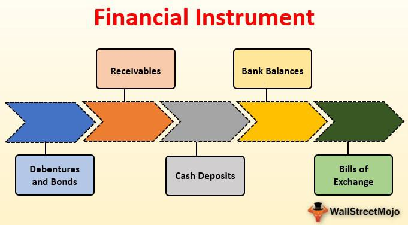

Algorithmic trading, commonly referred to as algo trading, employs computer algorithms to automate both investment decisions and trade executions in financial markets. These algorithms work on predefined rules and conditions, which determine the best times to buy and sell financial instruments. The appeal of algo trading has surged in recent years, primarily because of its remarkable ability to process large volumes of data at extremely high speeds, executing trades more efficiently and accurately than human traders.

Algo trading is distinguished by its reliance on computational efficiency and processing power. In volatile markets where prices fluctuate rapidly, the speed at which trades are executed can significantly impact profitability. Algorithms can analyze real-time data, perform complex calculations, and make decisions within milliseconds, providing a distinct advantage over manual trading methods. Furthermore, the automation involved in algo trading minimizes human intervention, thereby reducing the likelihood of emotional or irrational decisions that often negatively affect trading outcomes.



This article aims to elucidate the workings of algo trading by explaining its core functionality and the primary financial instruments it involves. Understanding these elements allows investors to leverage algorithmic strategies to optimize their trading effectiveness. Additionally, the article provides insights into various types of algo trading strategies and their applicability across different market conditions, highlighting the flexibility and adaptability of algorithmic methods in enhancing trading strategies.

In essence, algo trading represents a transformative approach to trading, offering unparalleled speed and efficiency. By mastering the core components and benefits, investors can improve their market participation, paving the way for potentially increased returns.

## Table of Contents

## What is Algo Trading?

Algo trading, an abbreviation of algorithmic trading, refers to the utilization of complex mathematical models and sophisticated computer algorithms to automate trading decisions and executions. This form of trading involves pre-defined sets of rules that decide the timing, price, and quantity of orders, operating with minimal human intervention. These rules can encompass criteria such as price thresholds, timing constraints, and volume conditions.

In essence, algo trading is designed to exploit market opportunities with greater speed and efficiency than human traders could achieve manually. Its prevalence is notable in financial markets such as stocks, forex, and cryptocurrencies. The primary reason for this prevalence lies in the ability of algorithms to process information at high speeds, thus allowing trading systems to capitalize on fleeting price discrepancies.

Algorithms employed in algo trading can follow several differing strategies. Among these are trend-following systems, which identify and act upon the [momentum](/wiki/momentum) of prices in a given direction. Mean reversion strategies, conversely, rely on the tendency of asset prices to return to their historical averages. Another strategy, statistical [arbitrage](/wiki/arbitrage), takes advantage of pricing inefficiencies between related assets, allowing simultaneous buying and selling to lock in differential gains.

Moreover, high-frequency trading ([HFT](/wiki/high-frequency-trading-strategies)) represents a specialized subset of algo trading, characterized by the execution of a large [volume](/wiki/volume-trading-strategy) of orders within extremely short timeframes, typically measured in milliseconds. HFT is highly reliant on algo trading techniques due to its demand for rapid order execution and vast data handling capabilities. Advanced statistical formulas and programming languages like Python are often used to code the specific rules and parameters defining these strategies. Below is a simplified example of a moving average crossover strategy in Python:

```python
def moving_average(prices, window_size):
    return [sum(prices[i:i+window_size])/window_size for i in range(len(prices)-window_size+1)]

def crossover_strategy(price_data, short_window, long_window):
    short_ma = moving_average(price_data, short_window)
    long_ma = moving_average(price_data, long_window)
    signals = []

    for i in range(1, len(short_ma)):
        if short_ma[i] > long_ma[i] and short_ma[i-1] <= long_ma[i-1]:
            signals.append('Buy')
        elif short_ma[i] < long_ma[i] and short_ma[i-1] >= long_ma[i-1]:
            signals.append('Sell')
        else:
            signals.append('Hold')
    return signals

price_data = [105, 108, 111, 114, 115, 118, 120, 123, 126, 129, 130, 133]
signals = crossover_strategy(price_data, short_window=3, long_window=5)
print(signals)
```

In this simple strategy, 'Buy' and 'Sell' signals are generated based on the crossover points of short-term and long-term moving averages, illustrating the basic function of an [algorithmic trading](/wiki/algorithmic-trading) system. Through these powerful computational tools, algo trading enables investors to execute trades with precision and discipline, aligning with pre-defined strategic goals.

## Primary Instruments in Algo Trading

Primary instruments are fundamental components in the landscape of algo trading, as their prices are determined directly by market forces. These include financial assets such as stocks, bonds, currencies, and commodities, which are traded on established exchanges and possess high [liquidity](/wiki/liquidity-risk-premium). The liquidity and transparent pricing of these instruments make them highly favorable for algorithmic trading, enabling traders to optimize execution costs and manage risks effectively.

Stocks represent equity ownership in companies and are among the most actively traded primary instruments. Their market value is influenced by a multitude of factors, including corporate earnings, economic indicators, and market sentiment. The complexity and volume of data associated with stock prices make them prime candidates for algorithmic trading strategies that require rapid execution and precise timing.

Bonds, another category of primary instruments, are fixed-income securities that represent loans made by investors to borrowers. Their value is primarily determined by interest rates, inflation expectations, and credit risk. Algo trading strategies can capitalize on these variables by automating the analysis of [interest rate](/wiki/interest-rate-trading-strategies) trends and exploiting temporary mispricings or yield curve shifts.

Currencies, or [forex](/wiki/forex-system) instruments, are traded in the foreign exchange market, which is the largest financial market globally. Currency prices fluctuate based on economic factors such as interest rates, trade balances, and geopolitical events. Algorithmic trading facilitates the execution of currency trades at high speed and accuracy, which is crucial for exploiting minute price movements in this highly volatile market.

Commodities, encompassing raw materials like oil, gold, and agricultural products, are traded on commodity exchanges. Their prices are subject to supply and demand dynamics, geopolitical tensions, and climatic conditions. Algo trading strategies can leverage these price determinants to identify profitable trading opportunities across commodity markets.

A comprehensive understanding of primary instruments is also vital for designing strategies involving derivative instruments like options and futures, which derive their value from underlying assets. By grasping the characteristics and behaviors of primary instruments, traders can construct sophisticated algo trading systems that exploit derivative market inefficiencies.

In conclusion, the selection of primary instruments in algo trading is critical for strategy formulation. High liquidity, transparent pricing, and the wealth of available data make stocks, bonds, currencies, and commodities attractive for algorithmic traders seeking to leverage automated systems to gain a competitive edge in financial markets.

## How Does Algo Trading Work?

Algorithmic trading, often known as algo trading, operates through a systematic process, utilizing key components such as data input, algorithm analysis, and trade execution. This process enhances trading precision by leveraging technology to make swift and informed decisions.

**Data Input**  
The foundation of algo trading is predicated on real-time data acquisition. This involves collecting a wide array of market data, including price movements, [order book](/wiki/order-book-trading-strategies) details, and historical trends. This data forms the essential inputs for algorithmic models and is typically harvested from financial exchanges, data providers, or through APIs offering market feeds. Real-time data is crucial to ensure that trades are executed at the most advantageous moments, while historical data is used for [backtesting](/wiki/backtesting) and validating algorithms against past market scenarios.

**Algorithm Analysis**  
Once data is collected, algorithms analyze this information to identify potential trading opportunities. The algorithmic analysis is governed by pre-established rules and parameters such as price thresholds, timing, and volume constraints. By employing sophisticated mathematical models, algorithms can process vast datasets to detect patterns and signals that might indicate profitable trading opportunities. For instance, if a mean reversion strategy is deployed, the algorithm continuously assesses whether an asset's price has deviated significantly from its historical average, suggesting a potential reversal. In many cases, algorithms incorporate techniques like statistical analysis, [machine learning](/wiki/machine-learning), and predictive modeling to refine their decision-making process.

**Trade Execution**  
When a viable trading opportunity surfaces, the algorithm initiates trade execution automatically. This phase involves placing orders (buy or sell) in the market per the identified strategy. For example, a simple Python code snippet for executing a trade could look like the following:

```python
import trading_api

def execute_trade(symbol, action, quantity):
    trade_order = {
        'symbol': symbol,
        'action': action,
        'quantity': quantity,
    }
    response = trading_api.place_order(trade_order)
    return response
```

Here, the function `execute_trade` uses an API call to a trading platform, placing orders as dictated by the algorithm.

This automated process allows for dynamic management of trading positions, enabling the system to modify or close positions as dictated by market conditions and the trading strategy in use. Algorithmic trading systems are designed to minimize human intervention, hence significantly reducing the likelihood of emotional biases impacting trading decisions. This consistency in execution is one of the main advantages of algo trading over manual trading methods.

In summary, understanding the workflow of algorithmic trading—from data gathering through analysis to execution—illustrates how technology can optimize trading operations. By streamlining these processes, traders and financial institutions can achieve greater accuracy, speed, and consistency in their market activities.

## Types of Algo Trading Strategies

Algo trading strategies can be categorized based on their approach to market data and trading objectives. Here are the primary types:

1. **Trend-Following Algorithms**: These algorithms identify and exploit market trends by executing buy and sell orders based on momentum. The core idea is to capitalize on sustained movements in the market. For example, a simple Moving Average Crossover strategy uses two moving averages—a shorter-term and a longer-term one. A buy signal is generated when the short-term moving average crosses above the long-term moving average, indicating a potential upward trend. Conversely, a sell signal occurs when it crosses below.

   Python Example:
   ```python
   def moving_average(data, window_size):
       return data.rolling(window=window_size).mean()

   short_ma = moving_average(prices, 20)
   long_ma = moving_average(prices, 50)

   buy_signals = (short_ma > long_ma) & (short_ma.shift() <= long_ma.shift())
   sell_signals = (short_ma < long_ma) & (short_ma.shift() >= long_ma.shift())
   ```

2. **Mean Reversion Strategies**: These strategies are based on the premise that asset prices tend to revert to their historical average over time. To implement this, traders might use the Relative Strength Index (RSI) to identify overbought or oversold conditions. A common rule is to buy when the RSI drops below 30 and sell when it rises above 70, anticipating a reversion to the mean.

3. **Statistical Arbitrage**: This strategy exploits pricing inefficiencies between different assets by executing offsetting trades that arbitrage these discrepancies. Pairs trading is a popular form, where traders identify two historically correlated securities, wait for their prices to diverge, and place long and short positions accordingly, betting on their convergence.

   Formula:
$$
   \text{Spread} = \text{Price of Asset A} - \beta \times \text{Price of Asset B}

$$
   where $\beta$ is derived from historical regression analysis.

4. **Market-Making Algorithms**: These algorithms provide liquidity to the market by continuously placing buy and sell orders. Market makers aim to profit from the bid-ask spread, maintaining a neutral market position by updating their quotes in response to market conditions.

   Basic Logic:
   ```python
   def place_order(bid_price, ask_price):
       if current_price < bid_price:
           # place buy order
       elif current_price > ask_price:
           # place sell order
   ```

5. **High-Frequency Trading (HFT)**: This involves executing a high volume of trades in fractions of a second to capitalize on minuscule price fluctuations. HFT strategies rely heavily on cutting-edge technology and minimal latency to ensure the fastest execution times. Techniques such as co-location with exchanges are often employed to gain speed advantages.

Each algo trading strategy has specific market conditions where it is most effective. Trend-following strategies perform well in trending markets, mean reversion strategies suit range-bound markets, and [statistical arbitrage](/wiki/statistical-arbitrage) thrives when there are pricing discrepancies. Market-making is advantageous in liquid markets with tight spreads, while HFT is effective in highly volatile and liquid environments. Understanding and selecting the appropriate strategy is crucial for optimizing trading outcomes.

## Advantages of Algo Trading

Algo trading has emerged as a preferred method for investors looking to enhance trading performance through automation and data analysis. One of its primary advantages is speed and efficiency. Algorithms can process large volumes of information and execute trades significantly faster than humans. This rapid execution is particularly important in volatile markets, where prices can change in milliseconds. For instance, an algorithm can analyze current market conditions, historical data, and other relevant factors almost instantaneously, allowing it to capitalize on short-term market opportunities that a human might miss.

Another significant advantage of algo trading is the ability for backtesting and optimization. Algorithms can be tested against historical market data to evaluate their performance and refine their strategy. This process ensures that the algorithm behaves as expected under different market conditions before it is deployed in live trading. The ability to optimize algorithms based on past performance enhances their effectiveness and reliability in real-world trading scenarios.

Algo trading also eliminates the influence of emotions on trading decisions. Human traders may be susceptible to emotions such as fear and greed, which can lead to inconsistent decision-making and deviation from planned strategies. In contrast, algorithms operate based on predefined rules and logic, ensuring consistent execution of trades without emotional interference. This rule-based approach promotes discipline and can lead to more predictable outcomes.

Enhanced diversification is another key benefit of algo trading. Algorithms allow traders to manage multiple portfolios and trade across various markets simultaneously. This capacity for diversification reduces the risk associated with concentrating investments in a single market or asset class and can potentially improve overall portfolio performance.

Lastly, algo trading improves precision by identifying patterns and trends that might be overlooked by human traders. Algorithms utilize sophisticated mathematical models to analyze data, making it possible to detect subtle market signals and execute trades with greater accuracy. This precision can be critical in executing complex trading strategies that depend on timing and exact market conditions.

In conclusion, algo trading offers numerous advantages to traders, including speed, efficiency, emotion-free decision-making, improved diversification, and enhanced precision. These factors contribute to a more systematic and potentially profitable trading approach, appealing to both novice and experienced investors.

## Conclusion

Algo trading, short for algorithmic trading, has transformed the landscape of financial markets by delivering unparalleled speed, efficiency, and precision. By utilizing sophisticated algorithms and automated strategies, traders can execute trades with a level of accuracy and consistency that surpasses human capability. This has significant implications for improving profitability, as algorithmic systems can process vast amounts of data at high speeds to identify and capitalize on market opportunities that might be missed by manual trading.

A deep understanding of the functionalities and primary instruments involved in algo trading is crucial for harnessing its full potential. Knowledge of these elements enables traders to develop and deploy strategies that align with specific market conditions and investment goals. As the financial markets continue to evolve, the role of algo trading will likely expand, making it essential for traders to engage in ongoing learning and adaptation. This ensures that they remain competitive and can leverage the latest developments in technology and strategy.

For both novice and experienced traders, selecting the appropriate strategies and platforms is critical to leveraging algo trading effectively. Platforms like MetaTrader, [Interactive Brokers](/wiki/interactive-brokers-api), and others provide the necessary tools and infrastructure to craft and execute custom trading algorithms. With the right setup, algo trading becomes a formidable tool that enhances trading performance, allowing for better risk management, greater diversification, and more consistent returns.

Overall, the adoption of algo trading represents a significant shift in trading practices, democratizing access to advanced trading techniques and leveling the playing field across various market participants. As technology progresses, the opportunities for innovation in trading strategies will expand, offering even more potential for those willing to embrace and adapt to these changes.

## References & Further Reading

[1]: Bergstra, J., Bardenet, R., Bengio, Y., & Kégl, B. (2011). ["Algorithms for Hyper-Parameter Optimization."](https://dl.acm.org/doi/10.5555/2986459.2986743) Advances in Neural Information Processing Systems 24.

[2]: ["Advances in Financial Machine Learning"](https://www.amazon.com/Advances-Financial-Machine-Learning-Marcos/dp/1119482089) by Marcos Lopez de Prado

[3]: ["Evidence-Based Technical Analysis: Applying the Scientific Method and Statistical Inference to Trading Signals"](https://www.amazon.com/Evidence-Based-Technical-Analysis-Scientific-Statistical/dp/0470008741) by David Aronson

[4]: ["Machine Learning for Algorithmic Trading"](https://github.com/stefan-jansen/machine-learning-for-trading) by Stefan Jansen

[5]: ["Quantitative Trading: How to Build Your Own Algorithmic Trading Business"](https://www.amazon.com/Quantitative-Trading-Build-Algorithmic-Business/dp/1119800064) by Ernest P. Chan