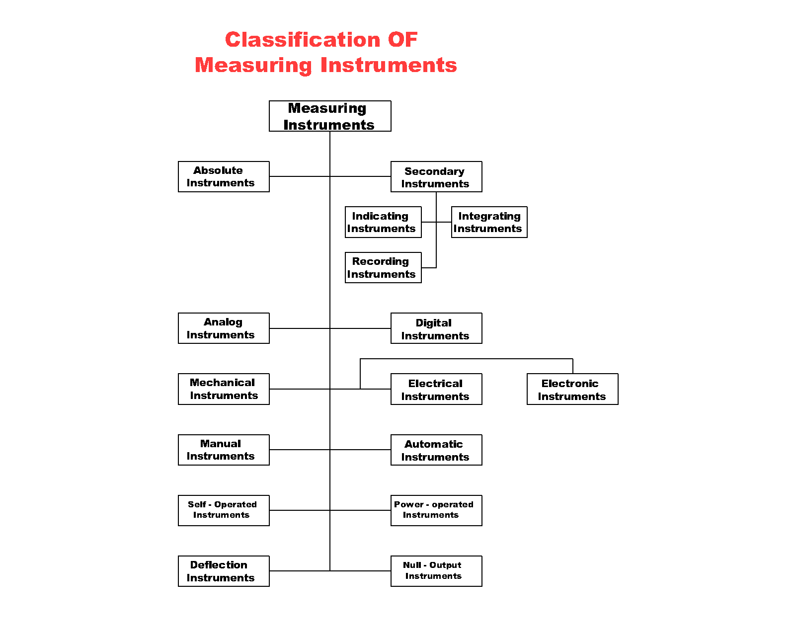

## Table of Contents

## What is a primary instrument?

A primary instrument is a tool or device used to directly measure or observe something important. In many fields, like science or music, primary instruments help gather accurate information or create sounds. For example, in science, a thermometer is a primary instrument because it directly measures temperature. In music, a guitar is a primary instrument because it produces sound directly when played.

Primary instruments are important because they give us direct and reliable information or results. They are often the first tool used in a process or experiment. For instance, in weather forecasting, a barometer is a primary instrument that measures air pressure to help predict the weather. Without primary instruments, it would be much harder to get accurate data or create music, making them essential in many areas of life.

## How does a primary instrument differ from a secondary instrument?

A primary instrument is the main tool used to measure something directly or to create something like sound in music. It gives us the first and most important information. For example, a thermometer is a primary instrument because it directly measures temperature. In music, a piano is a primary instrument because it makes music when you play it.

A secondary instrument, on the other hand, helps to check or support the information from the primary instrument. It might not measure things directly but can be used to confirm or add to what the primary instrument tells us. For example, in science, a data logger might be a secondary instrument that records the temperature readings from a thermometer over time. In music, a metronome is a secondary instrument that helps keep the rhythm but doesn't make the music itself.

In summary, primary instruments are essential for getting direct measurements or creating something, while secondary instruments support or enhance the work of primary instruments. Both are important, but they serve different roles in gathering information or making music.

## What are the common types of primary instruments?

Primary instruments are tools that measure things directly or create something like sound in music. In science, common primary instruments include thermometers for measuring temperature, barometers for measuring air pressure, and scales for measuring weight. These instruments give us the first and most important information about what we are studying. For example, a thermometer directly tells us how hot or cold something is, which is crucial for experiments or daily life.

In music, primary instruments are those that make sound when played. Common examples include pianos, guitars, drums, and violins. These instruments produce music directly, which is why they are considered primary. When someone plays a guitar, the sound comes straight from the strings, making it a primary instrument in music.

In other fields like engineering, primary instruments might include calipers for measuring distances or flow meters for measuring the rate of fluid movement. These tools are essential because they provide direct measurements that are needed to design and build things accurately. Whether in science, music, or engineering, primary instruments are vital for getting the information or results we need directly and reliably.

## What is the basic functionality of a primary instrument?

A primary instrument is a tool that measures something directly or makes something like sound in music. It gives us the most important information first. For example, a thermometer is a primary instrument because it tells us the temperature right away. In music, a guitar is a primary instrument because it makes music when you play it. These instruments are important because they give us the first and most accurate information we need.

In science, primary instruments like scales measure weight directly. In engineering, tools like calipers measure distances. These tools help us understand and work with the world around us. They are the first step in getting the information we need to do experiments, build things, or make music. Without primary instruments, it would be hard to get accurate and reliable data or create sounds.

## How do primary instruments measure physical quantities?

Primary instruments measure physical quantities by directly interacting with what they are measuring. For example, a thermometer measures temperature by using a liquid like mercury or alcohol that expands when it gets warmer. When the temperature changes, the liquid moves up or down in a tube, and we can read the temperature from the scale on the thermometer. This direct measurement is what makes the thermometer a primary instrument.

In another case, a scale measures weight by using springs or electronic sensors. When you put something on the scale, it presses down on the springs or sensors, which then show the weight on a display. This direct measurement of weight is why a scale is considered a primary instrument. By directly measuring things like temperature, weight, or pressure, primary instruments give us accurate and reliable information about the physical world.

## What are the key components of a primary instrument?

The key components of a primary instrument include a sensor or a mechanism that directly measures the physical quantity. For example, in a thermometer, the sensor is the liquid like mercury or alcohol that expands with temperature changes. This liquid moves in a tube, and the movement is what we see and read as temperature. In a scale, the key component might be a spring or an electronic sensor that reacts to weight and shows it on a display. These components are essential because they make the direct measurement happen.

Another important part is the display or indicator, which shows the measurement in a way we can understand. In a thermometer, the display is the scale on the tube that shows temperature numbers. In a scale, the display might be a digital screen or a needle pointing to numbers. This part helps us read the measurement easily. Together, the sensor or mechanism and the display or indicator work to give us accurate and useful information about the physical world.

## How do you calibrate a primary instrument?

Calibrating a primary instrument means making sure it gives correct measurements. You do this by comparing the instrument to a known standard. For example, if you have a thermometer, you can put it in ice water, which should be 0 degrees Celsius. If the thermometer shows 0 degrees, it's accurate. If not, you adjust it until it reads 0 degrees. This way, you know the thermometer will give the right temperature readings.

For other instruments, like a scale, you might use known weights. You put a weight that you know is 1 kilogram on the scale. If the scale shows 1 kilogram, it's correct. If it doesn't, you adjust the scale until it reads 1 kilogram. Calibration is important because it makes sure the instrument gives accurate information, which is crucial for science, engineering, and everyday use. Regular calibration helps keep the instrument working right over time.

## What are the accuracy standards for primary instruments?

Accuracy standards for primary instruments are rules that tell us how close the instrument's measurements should be to the real value. These standards are important because they make sure the instruments give us correct information. For example, a thermometer might have an accuracy standard that says it should be within 0.1 degrees Celsius of the true temperature. This means if the real temperature is 20 degrees, the thermometer should read between 19.9 and 20.1 degrees. Different types of instruments have different accuracy standards, depending on what they measure and how they are used.

These standards are set by organizations like the National Institute of Standards and Technology (NIST) in the United States or the International Organization for Standardization (ISO) worldwide. They test and certify instruments to make sure they meet these standards. For example, a scale used in a lab might need to be very accurate, so its standard might be tighter than a scale used at home. Regular checks and calibration help keep the instruments accurate over time. This is important in fields like science, medicine, and engineering, where even small errors can make a big difference.

## What are the typical applications of primary instruments in industry?

Primary instruments are used a lot in industry to measure things accurately. For example, in factories, thermometers measure the temperature of machines to make sure they don't get too hot and break. Scales are used to weigh materials like chemicals or food products to make sure the right amount is used. Flow meters help measure how much liquid or gas is moving through pipes, which is important for making sure everything works right. These instruments help keep the factory running smoothly and safely.

In other industries, like oil and gas, primary instruments are also very important. Pressure gauges measure how much pressure is in the pipelines to prevent accidents. In the pharmaceutical industry, accurate measurements from primary instruments are crucial for making medicines that are safe and effective. Without these instruments, it would be hard to control the processes and ensure the quality of the products. Primary instruments help industries work better and make sure their products are safe and reliable.

## How do environmental factors affect the performance of primary instruments?

Environmental factors like temperature, humidity, and dust can change how well primary instruments work. For example, if it's very hot or cold, a thermometer might not read the temperature right. This is because the materials in the thermometer can expand or shrink with the temperature. Humidity can also mess with instruments like scales, making them less accurate because moisture can affect the springs or sensors. Dust and dirt can get into the instruments and stop them from working properly. It's important to keep primary instruments in a clean and stable environment to make sure they give accurate readings.

In some cases, primary instruments are made to handle tough environmental conditions. For example, industrial thermometers might be built to work in very hot or cold places. But even these special instruments can still be affected by extreme conditions over time. Regular checks and calibration can help fix any problems caused by the environment. By understanding how environmental factors can affect primary instruments, we can take steps to protect them and keep them working well.

## What advancements have been made in primary instrument technology?

New technology has made primary instruments better and more accurate. For example, digital thermometers are now more common than old ones with mercury. They can measure temperature very quickly and show the numbers on a screen. Also, smart scales can now connect to the internet and send weight data to your phone or computer. These improvements make it easier to use the instruments and get more accurate information.

Another big change is in how primary instruments are made. Now, they use special materials that can handle tough conditions better. For example, some industrial instruments are made to work in very hot or cold places without losing accuracy. Also, new sensors and technology let instruments measure things in more ways. For example, a new type of flow meter can measure how fast liquid is moving and also how much liquid there is. These advancements help industries work better and make sure their products are safe and reliable.

## How can primary instruments be integrated into automated systems?

Primary instruments can be added to automated systems by connecting them to computers or control systems. For example, a thermometer in a factory can be linked to a computer that controls the temperature of machines. When the thermometer senses a change, it sends the information to the computer. The computer then makes the machines cooler or warmer to keep everything working right. This way, the primary instrument helps the system run automatically without people having to check the temperature all the time.

In another example, a scale in a food factory can be part of an automated system that weighs ingredients. The scale sends the weight data to a computer, which then tells the machines how much of each ingredient to add. This makes sure the food is made correctly every time. By adding primary instruments to automated systems, industries can work more efficiently and make better products.

## What are the types of algo trading strategies?

Algo trading strategies can be categorized based on their approach to market data and trading objectives. Here are the primary types:

1. **Trend-Following Algorithms**: These algorithms identify and exploit market trends by executing buy and sell orders based on momentum. The core idea is to capitalize on sustained movements in the market. For example, a simple Moving Average Crossover strategy uses two moving averages—a shorter-term and a longer-term one. A buy signal is generated when the short-term moving average crosses above the long-term moving average, indicating a potential upward trend. Conversely, a sell signal occurs when it crosses below.

   Python Example:
   ```python
   def moving_average(data, window_size):
       return data.rolling(window=window_size).mean()

   short_ma = moving_average(prices, 20)
   long_ma = moving_average(prices, 50)

   buy_signals = (short_ma > long_ma) & (short_ma.shift() <= long_ma.shift())
   sell_signals = (short_ma < long_ma) & (short_ma.shift() >= long_ma.shift())
   ```

2. **Mean Reversion Strategies**: These strategies are based on the premise that asset prices tend to revert to their historical average over time. To implement this, traders might use the Relative Strength Index (RSI) to identify overbought or oversold conditions. A common rule is to buy when the RSI drops below 30 and sell when it rises above 70, anticipating a reversion to the mean.

3. **Statistical Arbitrage**: This strategy exploits pricing inefficiencies between different assets by executing offsetting trades that arbitrage these discrepancies. Pairs trading is a popular form, where traders identify two historically correlated securities, wait for their prices to diverge, and place long and short positions accordingly, betting on their convergence.

   Formula:
$$
   \text{Spread} = \text{Price of Asset A} - \beta \times \text{Price of Asset B}

$$
   where $\beta$ is derived from historical regression analysis.

4. **Market-Making Algorithms**: These algorithms provide liquidity to the market by continuously placing buy and sell orders. Market makers aim to profit from the bid-ask spread, maintaining a neutral market position by updating their quotes in response to market conditions.

   Basic Logic:
   ```python
   def place_order(bid_price, ask_price):
       if current_price < bid_price:
           # place buy order
       elif current_price > ask_price:
           # place sell order
   ```

5. **High-Frequency Trading (HFT)**: This involves executing a high volume of trades in fractions of a second to capitalize on minuscule price fluctuations. HFT strategies rely heavily on cutting-edge technology and minimal latency to ensure the fastest execution times. Techniques such as co-location with exchanges are often employed to gain speed advantages.

Each algo trading strategy has specific market conditions where it is most effective. Trend-following strategies perform well in trending markets, mean reversion strategies suit range-bound markets, and [statistical [arbitrage](/wiki/arbitrage)](/wiki/statistical-arbitrage) thrives when there are pricing discrepancies. Market-making is advantageous in liquid markets with tight spreads, while [HFT](/wiki/high-frequency-trading-strategies) is effective in highly volatile and liquid environments. Understanding and selecting the appropriate strategy is crucial for optimizing trading outcomes.

## References & Further Reading

[1]: Bergstra, J., Bardenet, R., Bengio, Y., & Kégl, B. (2011). ["Algorithms for Hyper-Parameter Optimization."](https://dl.acm.org/doi/10.5555/2986459.2986743) Advances in Neural Information Processing Systems 24.

[2]: ["Advances in Financial Machine Learning"](https://www.amazon.com/Advances-Financial-Machine-Learning-Marcos/dp/1119482089) by Marcos Lopez de Prado

[3]: ["Evidence-Based Technical Analysis: Applying the Scientific Method and Statistical Inference to Trading Signals"](https://www.amazon.com/Evidence-Based-Technical-Analysis-Scientific-Statistical/dp/0470008741) by David Aronson

[4]: ["Machine Learning for Algorithmic Trading"](https://github.com/stefan-jansen/machine-learning-for-trading) by Stefan Jansen

[5]: ["Quantitative Trading: How to Build Your Own Algorithmic Trading Business"](https://www.amazon.com/Quantitative-Trading-Build-Algorithmic-Business/dp/1119800064) by Ernest P. Chan