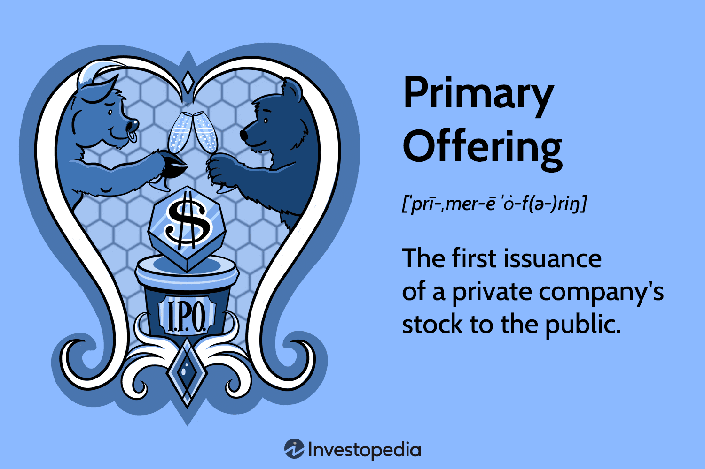

An initial public offering (IPO) is a significant milestone for a private company, signifying its shift to a publicly traded entity. This transformation offers the company access to capital markets, enabling it to raise funds by selling stock to the public. The IPO process not only helps a company to grow and expand but also increases its visibility and credibility in the market.

This article will provide an in-depth exploration of IPOs, specifically focusing on the primary offering's details within the securities market. We'll examine how companies can generate equity capital through the issuance of new shares and the pivotal role these offerings play in a company's developmental trajectory.

Additionally, the article will address the impact of algorithmic trading on the IPO landscape. Algorithmic trading involves using computer programs to execute trades based on predefined criteria, offering speed and efficiency that are reshaping financial markets. This technological advancement has significant implications for IPOs, affecting liquidity, pricing, and the overall market dynamics post-IPO.

Understanding IPOs, from the foundational mechanics to the latest technological influences, is essential for investors seeking opportunities and companies aiming to leverage their resources. By unpacking these elements, we aim to equip stakeholders with the knowledge required to navigate the complex process of public offerings effectively.

## Table of Contents

## What is an Initial Public Offering (IPO)?

An Initial Public Offering (IPO) is the inaugural sale of a company’s shares to the public on a stock exchange. This transformative event allows a private firm to access equity capital by publicly offering its shares. The primary motivation for undertaking an IPO is to raise capital, which can be invested in business expansion, debt reduction, research and development, or marketing initiatives. By becoming a public entity, a company gains increased visibility, potentially attracting further investment and strategic partners.

The IPO process is frequently pursued by emerging companies that require significant funding to accelerate growth strategies. These young enterprises use the capital raised to expand operations, invest in new projects, or enter new markets. Although IPOs are common among burgeoning firms, established companies may also opt for public offerings. Such companies may use IPOs to provide liquidity to existing shareholders or to leverage the prestige and credibility associated with being publicly traded.

To manage an IPO, a company typically collaborates with investment banks, known as underwriters, who help in determining the offer price, the number of shares to be issued, and the timing of the market entry. The process involves extensive regulatory compliance, including registering with the Securities and Exchange Commission (SEC) in the United States, or equivalent authorities in other jurisdictions, ensuring transparency and protection for investors.

An IPO can introduce certain complexities, including market reception and pricing dynamics. The offering price is crucial as it impacts both company valuation and investor perception. By issuing shares to the public, existing ownership stakes may be diluted, but the trade-off often results in increased capital and opportunities for future growth. Through an IPO, companies gain access to a broader base of institutional and retail investors, enabling diversified ownership and improved capital structure.

## Understanding Primary Offerings

A primary offering is a financial event where a company issues new stock to raise capital. This process is distinct from a secondary offering, which involves the sale of existing shares. In a primary offering, the company generates new shares, thereby increasing the total number of shares outstanding in the market. The main objective of this offering is to collect funds for various corporate purposes, such as expansion, reducing debt, or funding new projects.

The funds raised through a primary offering are directed straight to the issuing company. This capital influx can significantly aid a company's strategic goals, providing it with the necessary resources to grow or stabilize its financial status. This direct financial benefit contrasts with a secondary offering, where proceeds typically go to selling shareholders and not the company itself.

A crucial component of a primary offering is the requirement for registration with the Securities and Exchange Commission (SEC) in the United States. The registration process necessitates the filing of a detailed prospectus, which outlines the company's financial status, its business model, and other pertinent information. This transparency is designed to protect potential investors by providing them with the necessary information to make informed investment decisions. The SEC's role is to ensure that all necessary disclosures are made and that the offering complies with federal securities laws, thus maintaining fair practices and investor confidence in the financial markets. 

Overall, primary offerings are foundational to a company’s ability to secure funding from the public, marking a significant step in a company's financial strategy and lifecycle.

## Role of Securities Market in IPOs

The securities market plays a crucial role in facilitating initial public offerings (IPOs), providing a structured platform where companies can offer their stocks to the public for the first time. This process begins in the primary market, where newly issued securities are sold directly to investors. The primary market is essential for companies seeking capital, as it is here that they raise funds by issuing new shares.

Upon the completion of an IPO, the company's shares transition to the secondary market. This shift is significant, as it allows previously issued securities to be bought and sold among investors without the company's direct involvement. The secondary market, therefore, provides [liquidity](/wiki/liquidity-risk-premium), enabling investors to trade shares freely. It also helps establish a company's market value post-IPO through the dynamics of supply and demand.

Prominent secondary markets where post-IPO trading occurs include the New York Stock Exchange (NYSE) and the NASDAQ. These platforms are characterized by their electronic trading systems and market makers, which facilitate efficient and transparent trading processes. The NYSE, known for its auction-based trading system, is one of the largest equity exchanges globally. In contrast, NASDAQ operates as a dealer's market, relying on multiple market participants to trade company stocks electronically.

Both markets are integral to the overall securities market structure, providing the necessary infrastructure that supports the trading of shares, which is vital for maintaining confidence and stability in the financial markets. As such, the interplay between the primary and secondary markets is fundamental for companies and investors navigating the IPO landscape, ensuring that the transition from private to public ownership occurs smoothly and efficiently.

## Algo Trading and Its Impact on IPOs

Algorithmic trading, commonly referred to as algo trading, employs sophisticated computer algorithms to execute trades based on predefined criteria. These criteria can range from timing and price to complex mathematical models. In the context of initial public offerings (IPOs), algo trading plays a crucial role by enabling the rapid execution of trades, thus enhancing market efficiency and liquidity.

Algo trading's ability to process vast amounts of market data in real time allows for the execution of large orders with minimal market impact. This is particularly valuable during IPOs, where the initial offering and subsequent trading activities can generate significant market [volatility](/wiki/volatility-trading-strategies). By employing algo trading strategies, investors and trading firms can react to market movements nearly instantaneously, facilitating smoother price discovery and reducing transaction costs.

However, the integration of algo trading in IPOs also presents several risks and regulatory challenges. One primary concern is that the rapid pace of automated trading can exacerbate market volatility, potentially leading to flash crashes or distortions in stock prices. Moreover, the complexity of algorithms may introduce unforeseen systemic risks, triggering chain reactions in trading activities that can destabilize markets.

Regulatory bodies closely monitor [algorithmic trading](/wiki/algorithmic-trading) activities to mitigate these risks. For instance, they may impose circuit breakers or trading halts to prevent excessive volatility, and require the implementation of robust risk management protocols. Additionally, there is a need for transparency in the algorithms used, ensuring that they comply with fair market practices.

For IPO investors, understanding the mechanics of algo trading can offer critical insights into post-IPO market behaviors. Investors equipped with knowledge of algorithmic patterns and tendencies can better anticipate market movements, allowing them to strategically position their trades for optimal outcomes. As algo trading continues to evolve, its impact on IPOs underscores the necessity for investors and companies alike to remain informed about the technological and regulatory landscapes shaping modern financial markets.

## Challenges and Risks in Primary Offerings

Market volatility and underpricing present significant challenges during an initial public offering (IPO). Market volatility can lead to unpredictable price fluctuations, making it difficult for companies to set an appropriate initial price for their shares. When stock prices are volatile, investor confidence may waver, potentially reducing demand for the new shares. This unpredictability can lead to mispricing, either pricing the stock too high, deterring investors, or too low, causing potential capital loss for the company. Underpricing, the practice of setting the IPO price below the market price, although often intended to ensure successful uptake and trading in the secondary market, can result in substantial opportunity costs for the issuing company.

Regulatory hurdles are another critical [factor](/wiki/factor-investing) affecting the timing and success of an offering. Companies must navigate complex regulatory requirements to ensure compliance with the Securities and Exchange Commission (SEC) and other relevant regulatory bodies. This includes filing comprehensive documentation, which demands significant time and resources and may delay the IPO process. Additionally, regulation changes can further complicate compliance efforts, affecting the offering's timing and success.

Underwriters, who are crucial players in the IPO process, introduce additional complexities. They are responsible for determining the offering price, buying the shares from the issuer, and selling them to the public. The involvement of underwriters means incurring underwriting fees, which can be a substantial cost to the issuing company. Moreover, conflicts of interest may arise if underwriters have incentives to price the IPO shares in a manner that benefits their interests over the issuing company.

Investors need to be aware of potential risks, including dilution and changing market conditions. Dilution can occur when a company issues more shares, reducing the ownership percentage of existing shareholders. This can affect earnings per share and the value of each share. Additionally, changing market conditions, such as economic downturns or shifts in investor sentiment, can adversely impact the performance of newly public shares, posing risks to investors’ expected returns.

Overall, understanding these complexities and risks is essential for companies considering an IPO and investors interested in participating in primary offerings. By being proactive in managing these challenges, stakeholders can make more informed decisions and optimize the outcomes of IPO engagements.

## Conclusion

IPOs and primary offerings are integral to the business lifecycle by providing a pathway for companies to access capital and pursue growth opportunities. Transforming from a private entity to a public one through an IPO allows a company not only to gather substantial funds to fuel expansion but also to enhance its visibility and credibility in the business world. Such transitions often attract a broader investor base, thereby aligning corporate investments with strategic growth objectives.

Understanding the intricate relationship among the IPO process, the securities market, and algorithmic trading equips investors and companies with the ability to navigate the complexities of going public. The securities market offers a structured environment for the buying and selling of these newly issued shares, hence facilitating the efficient distribution of capital. Meanwhile, algorithmic trading plays a crucial role in modern financial markets by ensuring faster transaction times and increased liquidity. This method can significantly influence the pricing and performance of stocks, including those newly introduced in public markets.

By arming themselves with comprehensive knowledge of these dynamics, stakeholders are better positioned to make strategic decisions that optimize their potential returns while minimizing risks. The interplay of these elements defines not only the success of the IPO but also the long-term financial health of the company and its investors. As the landscape of public offerings continues to evolve, the insights gained from understanding this process can be invaluable for future planning and execution.

## References & Further Reading

[1]: Loughran, T., & Ritter, J. R. (2004). ["Why Has IPO Underpricing Changed Over Time?"](https://www.jstor.org/stable/3666262) Financial Management.

[2]: Madhavan, A. (2000). ["Market Microstructure: A Survey."](https://www.sciencedirect.com/science/article/pii/S1386418100000070) Journal of Financial Markets.

[3]: O'Hara, M. (1995). ["Market Microstructure Theory,"](https://www.wiley.com/en-us/Market+Microstructure+Theory-p-9780631207610) Blackwell.

[4]: Harris, L. (2003). ["Trading and Exchanges: Market Microstructure for Practitioners"](https://www.amazon.com/Trading-Exchanges-Market-Microstructure-Practitioners/dp/0195144708) Oxford University Press.

[5]: Gomber, P., Arndt, B., Lutat, M., & Uhle, T. (2011). ["High-frequency trading."](https://papers.ssrn.com/sol3/papers.cfm?abstract_id=1858626) E-Finance Lab.

[6]: Hasbrouck, J. (2007). ["Empirical Market Microstructure: The Institutions, Economics, and Econometrics of Securities Trading."](https://academic.oup.com/book/52241) Oxford University Press.

[7]: Ritter, J. R. (1998). ["Initial Public Offerings."](https://www.researchgate.net/publication/284772074_Initial_public_offerings) Contemporary Finance Digest.

[8]: Hendershott, T., & Riordan, R. (2013). ["Algorithmic trading and the market for liquidity."](https://www.jstor.org/stable/43303831) The Review of Financial Studies.

[9]: Agarwal, S., & Kumar, K. (2013). ["The IPO Handbook: An In-Depth Guide to Initial Public Offerings."](https://perkinscoie.com/insights/publication/ipo-handbook) Springer.