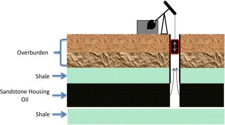

The petroleum industry is a cornerstone of the global economy, providing essential energy resources that power transportation, manufacturing, and numerous other sectors. As the world seeks new ways to meet its energy demands, the extraction of oil remains a vital endeavor. This process begins with primary recovery, the foundational stage of oil extraction. Primary recovery capitalizes on the natural pressure within oil reservoirs to drive oil to the surface, setting the stage for subsequent extraction methods.

In parallel with advancements in extraction techniques, the financial aspects of the petroleum industry have also evolved. Algorithmic trading, or algo trading, has gained prominence in commodities markets, including oil. This sophisticated trading approach leverages complex algorithms to conduct trades at optimal times and prices, thereby enhancing efficiency and maximizing profits. The integration of algo trading presents new opportunities for oil producers and investors alike, offering tools to navigate fluctuating markets with greater precision.

This article will explore the conjunction of oil extraction methodologies, specifically focusing on primary recovery, and the burgeoning influence of algo trading within the petroleum sector. By examining key concepts, methodologies, and current trends, this discussion aims to shed light on how these advancements are reshaping the petroleum industry's landscape. As technology continues to transform the ways in which oil is produced, traded, and consumed, understanding these intersections will be critical for industry stakeholders seeking to optimize their strategies in an ever-evolving market.

## Table of Contents

## Understanding Primary Recovery in Oil Extraction

Primary recovery, also referred to as primary production, signifies the initial stage of oil extraction, employing cost-effective methods to draw oil to the surface. This phase fundamentally relies on the natural pressure difference between the oil reservoir and the Earth’s surface. The intrinsic reservoir pressure propels oil to the surface through production wells, making the use of complex technologies relatively unnecessary.

In primary recovery, specific techniques such as water drive and gas drive are utilized to enhance and maintain reservoir pressure, thereby optimizing the amount of oil extracted. A water drive system involves the use of water present in the nearby aquifer to maintain reservoir pressure. As oil is extracted, the water moves into the space left by the removed oil, effectively pushing more oil towards the production wells. In contrast, a gas drive system uses natural gas of the reservoir to pressurize the oil. The gas expands as pressure is relieved, pushing oil towards production wells.

Despite its advantages in cost-saving measures, primary recovery often falls short in overall oil yield compared to secondary and tertiary methods. Typically, primary recovery can extract about 5-20% of an oil reservoir’s total volume. In comparison, secondary recovery techniques, such as water injection or gas injection, and tertiary methods like thermal recovery or chemical injection, can significantly enhance recovery efficiency but at a higher cost [1].

Recognizing both the limitations and benefits of primary recovery is crucial for optimizing oil production strategies. While primary methods are economically viable due to their lower costs, they might not recover a substantial volume of oil, necessitating further recovery techniques. Thus, the knowledge of the primary recovery process enables producers to design better comprehensive recovery strategies, balancing economic feasibility and oil yield.

[1] Tertiary oil recovery. (2023). In *Wikipedia*. Retrieved from https://en.wikipedia.org/wiki/Tertiary_oil_recovery

## Algorithmic Trading: An Overview

Algorithmic trading employs sophisticated computer algorithms to execute trades at optimal times and prices, significantly reducing human error and increasing market efficiency. This method leverages the computational power of modern technology to analyze a wide array of market signals and initiate trades based on predefined criteria.

In the commodities market, including oil, [algorithmic trading](/wiki/algorithmic-trading) is crucial due to the substantial data it can process rapidly. This capability enables the prediction of price movements and supports real-time trading decisions. For example, algorithms can analyze historical price data, statistical market patterns, and current news events to forecast potential price fluctuations, likely leading to more favorable trading outcomes. This form of trading is particularly beneficial in a volatile market environment, where prices can change swiftly due to geopolitical or economic developments.

The adoption of algorithmic trading in the oil market has enabled more sophisticated trading strategies and enhanced market [liquidity](/wiki/liquidity-risk-premium). By automating trades, algorithms can execute buy or sell orders with precision, leading to higher trading volumes and narrower bid-ask spreads. This liquidity enhancement benefits all market participants by facilitating smoother and more efficient transactions.

Geopolitical, environmental, and economic factors heavily influence the oil market. Algorithmic trading systems are designed to process these complex variables to define investment strategies. For example, an algorithm might be programmed to buy oil futures when certain geopolitical tensions arise, predicting a subsequent price increase due to potential supply disruptions. Similarly, algorithms can incorporate environmental policy changes or economic indicators, such as [interest rate](/wiki/interest-rate-trading-strategies) shifts, into their trading models to align strategies with emerging market conditions.

Understanding the role of algorithmic trading in the petroleum market can lead to more informed decision-making for investors and oil companies. By analyzing intricate patterns and market signals that would be challenging for humans to detect independently, algorithms provide significant insights into price direction and trading opportunities. Consequently, firms that harness these technologies can achieve a competitive advantage, optimizing their trading strategies based on rapidly processed and accurate market data.

The continued evolution of algorithmic trading systems, incorporating [artificial intelligence](/wiki/ai-artificial-intelligence) and [machine learning](/wiki/machine-learning) techniques, promises even greater advancements in predictive analytics and automated decision-making outcomes. By embracing these technologies, stakeholders in the petroleum market can enhance their ability to navigate the complexities of global energy trading.

## Integration of Algo Trading in Oil and Gas Markets

The integration of algorithmic trading in oil and gas markets has transformed how companies manage risks associated with fluctuating oil prices. Algorithmic trading allows firms to automate the processes of buying, selling, and hedging oil futures. This automation helps in optimizing portfolios to better handle market [volatility](/wiki/volatility-trading-strategies).

Algorithmic trading employs advanced data analysis tools capable of processing vast datasets to predict price movements and estimate future oil reserves. By analyzing historical and real-time data on production rates, consumption levels, and geopolitical factors, algorithms enhance the accuracy of supply-demand forecasts. This precision enables more effective planning and resource allocation.

Furthermore, algorithms identify patterns and anomalies in market behavior, which might indicate broader economic trends. For example, by analyzing trading volumes, price changes, and external factors such as governmental regulations or natural disasters, algorithms can forecast potential market shifts.

The rapid execution of trades in response to market signals is another advantage of algorithmic trading. Speed is crucial in the fast-paced oil market, where prices can change swiftly due to various influencing factors. By executing trades at optimal times, companies maintain competitive advantages, ensuring they capitalize on favorable market conditions or safeguard against adverse movements.

Algorithmic trading provides oil and gas companies with sophisticated tools to hedge risks, optimize trading strategies, and improve operational efficiencies, making it an invaluable asset in the contemporary petroleum market.

## Challenges and Opportunities

The application of algorithmic trading in the oil markets encounters several challenges primarily linked to the inherent complexity of these markets. A significant obstacle is accurately forecasting price movements, which are heavily influenced by geopolitical factors and environmental policies. These elements introduce substantial uncertainty, as unexpected geopolitical developments or shifts in environmental regulations can alter supply and demand dynamics that algorithms must rapidly adapt to.

Another prominent issue is the heavy reliance on technology and data, which exposes the market to cybersecurity threats and data integrity risks. The dependence on digital platforms and large datasets increases vulnerability to hacking and data corruption, potentially leading to market disruptions or financial losses.

Nonetheless, algorithmic trading offers substantial opportunities to the oil market. One notable advantage is the enhancement of market liquidity. By automating trades, algorithmic trading can facilitate a higher [volume](/wiki/volume-trading-strategy) of transactions and reduce the bid-ask spread, resulting in a more fluid market environment. Additionally, it allows for superior risk management. Algorithms can quickly analyze market conditions and execute trades that hedge positions against volatility, improving the stability of investment portfolios.

In terms of primary recovery, advancements in technology and data analysis hold promise for refining resource estimation and improving recovery rates. The integration of sophisticated computational techniques can aid in better modeling of oil reservoirs, potentially unlocking previously inaccessible resources.

Furthermore, the collaboration between petroleum engineers and data scientists is poised to drive innovation, blending expertise from both fields to optimize recovery methods and trading strategies. This interdisciplinary approach can lead to the development of more efficient algorithms and enhance the overall effectiveness of oil market operations, addressing current challenges while exploiting emerging opportunities.

## Future Trends

The petroleum industry's future is poised for significant transformation with the integration of advanced technologies, particularly artificial intelligence (AI) and machine learning (ML). These innovations are expected to enhance the efficiency and precision of algorithmic trading practices already prevalent in the sector. By harnessing AI and ML, oil companies can improve predictive analytics, leading to better decision-making and optimization of trading strategies. For instance, machine learning models can analyze vast datasets to detect patterns and predict market trends, enhancing the agility and responsiveness of trading systems.

Sustainability concerns also play a pivotal role in shaping the future of oil recovery methods. As global emphasis on environmental responsibility increases, the industry is compelled to adopt more efficient and less environmentally harmful extraction techniques. This could involve the development of new technologies or the refinement of existing methods to reduce carbon footprints and preserve natural ecosystems. For example, employing AI to optimize drilling operations can minimize resource wastage and enhance the sustainability of oil recovery.

Collaboration between technology firms and oil companies is another critical trend. Such partnerships can facilitate the creation of integrated models for resource management and market trading, leveraging the strengths of both sectors. By working together, tech companies can provide the digital infrastructure and expertise, while oil firms contribute industry knowledge and resources. This collaboration can lead to innovative solutions like advanced data analytics platforms and automated trading systems that streamline operations and reduce costs.

As algorithmic models evolve, they are anticipated to offer increasingly sophisticated approaches to market analysis. This evolution will further refine trading strategies, enabling companies to capitalize on market inefficiencies and mitigate risks more effectively. Advanced algorithms can incorporate a multitude of variables—such as geopolitical events, supply chain disruptions, and weather patterns—into their analyses, offering a comprehensive view that informs strategic decisions.

For stakeholders in the petroleum market, understanding these future trends is essential for maintaining relevance and a competitive advantage. The industry's landscape is shifting, and those who can adapt to technological advancements and sustainability demands will be better positioned to succeed. Adopting AI-driven solutions and fostering collaborations between disparate sectors will be fundamental strategies for navigating the complexities of the future petroleum market. Through these efforts, the industry can achieve greater efficiency, sustainability, and profitability while meeting the evolving demands of global energy consumption.

## Conclusion

The intersection of oil extraction methods, such as primary recovery, with algorithmic trading offers both notable challenges and significant opportunities within the petroleum industry. As technology advances, integrating these fields is expected to revolutionize oil production, trading, and consumption processes. Efficient use of technology can optimize the extraction process, improving yield rates from primary recovery, while algorithmic trading offers enhanced market efficiencies and decision-making capabilities.

By understanding and leveraging these technological tools, stakeholders have the potential to enhance efficiency, sustainability, and profitability in the oil market. For example, data analytics derived from algorithmic trading can inform better forecasting models for oil price movements, allowing companies to hedge against risks effectively. Similarly, insights gained from advanced analytics can guide petroleum engineers in optimizing extraction processes, thereby increasing resource efficiency.

Continued innovation and adaptation are necessary as the oil industry's landscape evolves. The integration of artificial intelligence and machine learning in both recovery and trading could lead to more nuanced and responsive market strategies. The need for sustainability will also drive changes in recovery methods, focusing on reducing environmental impact and conserving resources.

For stakeholders, staying informed about the latest technological developments is crucial to capitalizing on market opportunities and mitigating potential risks. Engaging in collaborative efforts that bring together expertise from sectors like data science, engineering, and finance will be essential. This multidisciplinary approach can foster new solutions that address both current and emerging challenges in the oil industry, ensuring a competitive edge in an increasingly complex market.

## References & Further Reading

[1]: ["Tertiary oil recovery."](https://www.investopedia.com/terms/t/tertiary-recovery.asp) *Wikipedia*.

[2]: ["Advances in Financial Machine Learning"](https://www.amazon.com/Advances-Financial-Machine-Learning-Marcos/dp/1119482089) by Marcos Lopez de Prado

[3]: ["Machine Learning for Algorithmic Trading"](https://www.amazon.com/Machine-Learning-Algorithmic-Trading-alternative/dp/1839217715) by Stefan Jansen

[4]: ["Quantitative Trading: How to Build Your Own Algorithmic Trading Business"](https://www.amazon.com/Quantitative-Trading-Build-Algorithmic-Business/dp/1119800064) by Ernest P. Chan