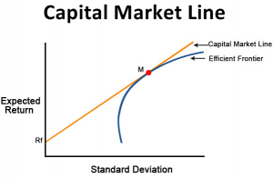

The financial world is multifaceted, abuzz with varied platforms, instruments, and participants. Among these, the capital markets stand out for their pivotal role in economic growth. At the core of capital markets are the primary and secondary markets, which serve as the bedrock of financial exchanges. These markets are essential for facilitating the flow of capital, creating investment opportunities, and ensuring efficient trading processes.

Primary markets are where new securities are issued, forming the foundation for capital allocation. They enable companies to raise funds needed for expansion, innovation, and improvement of operational efficiency. Secondary markets, on the other hand, offer platforms for trading existing securities, ensuring liquidity and price discovery. Stock exchanges like the New York Stock Exchange (NYSE) and NASDAQ typify this segment, providing crucial environments for buying and selling financial instruments.



Understanding how these markets operate is vital for appreciating their impact on the global financial system. They not only allow for the efficient distribution of capital from investors to corporations but also foster dynamic trading environments where supply and demand dictate security pricing. Additionally, the role of algorithmic trading in these markets has become increasingly significant. By using computer programs and algorithms to execute trades, financial markets have achieved heightened efficiency and speed, further optimizing trading strategies and ensuring robust market operations. This article seeks to explore these components in depth, offering insights into the intricate mechanisms of capital markets and the transformative influence of algorithmic trading today.

## Table of Contents

## Understanding the Primary Market

The primary market is a crucial segment of the financial system where new securities, such as stocks and bonds, are issued to the public for the first time. This market serves as the initial platform where companies can raise capital directly from investors to fund various corporate needs, including expansion, research, and operational improvements.

A significant event in the primary market is the Initial Public Offering (IPO). During an IPO, a private company offers its shares to the public for the first time, transitioning to a publicly traded entity. This transition allows the company to access a broader pool of capital, which can be instrumental in fueling growth and achieving strategic objectives. The IPO process involves a detailed evaluation of the company's potential and performance, which is critical for attracting investor interest.

Underwriters, typically investment banks, play a critical role in the primary market. Their responsibilities include purchasing the new issues from the company and facilitating their sale to the public. Underwriters assess the market conditions, set the offering price, and take on the risk of reselling the securities to the public. This ensures that the issuing company receives the necessary capital while mitigating potential risks associated with the offering process.

The activities within the primary market are vital in providing firms with the essential capital required for their development and long-term success. By allowing companies to publicly issue securities, the primary market contributes to more robust corporate structures and enhanced market dynamism.

For investors, the primary market offers a unique opportunity to gain direct access to new securities. Participating in the primary market means that investors can acquire shares at the offering price, which is often set to attract initial interest. This direct access to new securities is a cornerstone for initial capital allocation, allowing investors to align their investment portfolios with their strategic goals from the onset.

Overall, the primary market is an essential element of the financial ecosystem. It not only facilitates the flow of capital from investors to companies but also plays a pivotal role in shaping the economic landscape by enabling growth and innovation across various industries.

## The Role of the Secondary Market

The secondary market is a critical component of the financial ecosystem, providing a platform where existing securities are openly traded among investors. Unlike the primary market, where new capital is generated for issuers, the secondary market facilitates the transfer of ownership of securities that have already been issued. This process inherently promotes [liquidity](/wiki/liquidity-risk-premium), allowing investors to buy and sell their securities with ease. 

Stock exchanges, such as the New York Stock Exchange (NYSE) and NASDAQ, serve as pivotal infrastructures in the secondary market. These exchanges not only offer centralized venues for trading activities but also play a crucial role in price discovery. Through the forces of supply and demand, stock prices fluctuate, reflecting both intrinsic company values and broader economic conditions. The ability of securities to be traded continuously and seamlessly in the secondary market means that they can be more accurately priced, as market participants constantly evaluate and reassess their worth.

In this market environment, liquidity is a prime [factor](/wiki/factor-investing). Investors can liquidate their holdings or acquire additional shares with minimal friction, which is essential for maintaining a vibrant trading ecosystem. For instance, an investor needing to [exit](/wiki/exit-strategy) a position can do so relatively quickly without significantly affecting the security's price, provided the market is liquid enough. This fluidity not only benefits individual investors but also ensures a level of stability within the financial system as a whole.

Additionally, the secondary market contributes to a more dynamic trading environment by accommodating various trading strategies and participants, from individual retail investors to sophisticated institutional players. This diversity encourages a breadth of trading volumes and intensifies market depth, which are critical in mitigating price [volatility](/wiki/volatility-trading-strategies) and enhancing overall market resilience.

In summary, the secondary market is indispensable for the efficient functioning of financial markets. Through enabling liquidity, fostering price discovery, and facilitating the transfer of securities, this market ensures that capital can flow freely and efficiently among participants, thereby supporting the broader economic landscape.

## Key Differences Between Primary and Secondary Markets

The primary and secondary markets serve distinct purposes within the financial ecosystem, each facilitating different aspects of capital flow and investment trading. The primary market is pivotal for the initial issuance of securities. It is the marketplace where companies raise capital directly from investors by issuing new stocks and bonds. This process is vital for companies seeking funds for expansion, research, and operational improvements. Central to primary market activities are Initial Public Offerings (IPOs), where private companies offer their shares to the public for the first time and become publicly traded entities. In preparing for an IPO, underwriters, typically investment banks, are crucial as they purchase new issues and sell them to the public, managing the risk and distributing shares efficiently.

In contrast, the secondary market facilitates the trading of these already issued securities among investors. This market provides a platform where investors can buy and sell shares they already own or seek to acquire new ones. Stock exchanges such as the New York Stock Exchange (NYSE) and NASDAQ epitomize the secondary market, ensuring liquidity and active trading. No new capital is raised in the secondary market transactions; rather, these transactions ensure liquidity by allowing for the continuous transfer of ownership from one investor to another. The secondary market's fluidity is essential for the efficient pricing of securities, influenced by supply and demand dynamics.

When comparing transactions within these markets, primary market transactions involve issuers, underwriters, and initial investors, while secondary market transactions occur exclusively between investors. The pricing also differs between these markets; in the primary market, prices are set during issuance, often with underwriters' assistance. Conversely, in the secondary market, prices fluctuate based on real-time market conditions, reflecting the current sentiment and information available.

Understanding these differences is crucial for market participants as they navigate various investment opportunities. Recognizing the distinct roles and functions of the primary and secondary markets provides a clearer picture of how capital moves efficiently from issuers to investors, enhancing overall market stability and growth.

## Algorithmic Trading: An Introduction

Algorithmic trading involves the utilization of computer algorithms to execute trades by following predetermined criteria, enhancing both the speed and efficiency of trade executions. This technology-driven approach allows for the swift processing of financial data and order execution, effectively minimizing human errors and emotional decision-making, thus facilitating objective trade execution.

Various trading strategies are deployed within [algorithmic trading](/wiki/algorithmic-trading), ranging from trend-following strategies to [arbitrage](/wiki/arbitrage) opportunities. These strategies leverage advanced data analytics and computing power to optimize trade execution. For example, trend-following strategies analyze market data to identify and capitalize on emerging trends, whereas arbitrage strategies exploit price discrepancies between markets or related instruments to achieve profitable outcomes.

High-frequency trading ([HFT](/wiki/high-frequency-trading-strategies)) represents a key application of algorithmic trading. In HFT, algorithms process large volumes of orders at exceptionally high speeds with minimal market disruption. The automated nature of this trading style ensures that large orders can be executed efficiently, thereby contributing to market liquidity and reducing the bid-ask spread.

The consistency and scalability offered by algorithmic trading surpass the capabilities of human traders. Algorithms can operate tirelessly, executing trades based on logical parameters rather than emotions, which enhances consistency. Moreover, the scalability inherent in algorithmic systems allows traders to deploy strategies across multiple markets simultaneously, managing diversified portfolios effectively while optimizing risk and return.

To provide a practical example, consider the implementation of a simple moving average crossover strategy using Python:

```python
import pandas as pd
import numpy as np

def moving_average_crossover(data, short_window=20, long_window=50):
    """
    Implements a simple moving average crossover strategy.

    Parameters:
    - data : DataFrame : financial time series data
    - short_window : int : short-term moving average window
    - long_window : int : long-term moving average window
    """
    data['Short_MA'] = data['Close'].rolling(window=short_window).mean()
    data['Long_MA'] = data['Close'].rolling(window=long_window).mean()

    # Create signals
    data['Signal'] = 0
    data['Signal'][short_window:] = \
        np.where(data['Short_MA'][short_window:] > data['Long_MA'][short_window:], 1, 0)

    # Generate trading orders
    data['Position'] = data['Signal'].diff()

    return data

# Example usage with a hypothetical DataFrame `financial_data`
# financial_data = pd.read_csv('historical_data.csv')
# strategy_data = moving_average_crossover(financial_data)
```

In this coding example, the moving average crossover strategy compares short-term and long-term moving averages to generate buy or sell signals. This example illustrates the use of algorithms in analyzing and executing trading strategies, providing a foundation for more complex algorithms utilized in professional trading environments.

## Benefits and Potential Pitfalls of Algo Trading

Algorithmic trading offers several distinct advantages, primarily due to its enhanced speed and precision in executing trades. At its core, algo trading leverages sophisticated computer algorithms to process and execute orders at speeds impossible for human traders, capturing fleeting market opportunities that might otherwise be missed. This rapid execution is crucial in fast-moving markets, allowing traders to exploit short-term price inefficiencies and arbitrage opportunities.

Another significant benefit of algorithmic trading is its potential to remove emotions from trading decisions. By relying on logical, pre-set criteria, algo trading ensures consistency and adherence to a well-defined strategy, mitigating the impact of impulsive human behavior. This objectivity helps maintain disciplined trading practices, which are particularly important in volatile market conditions.

Moreover, algo trading facilitates cross-market efficiency, offering the capability to execute trades across multiple markets simultaneously. This feature not only enhances operational efficiency but also allows for diversification, improving risk management for traders. By distributing trades across various instruments and markets, algorithmic trading helps in spreading risk and potentially increasing returns.

Despite these advantages, algorithmic trading is not without its challenges. A significant risk is the potential for over-optimization, where algorithms are tailored too closely to historical data, losing their efficacy under current or future market conditions. This phenomenon, often referred to as "curve-fitting," can result in poor real-world performance when market dynamics evolve beyond the parameters used in algorithm development.

Additionally, algorithms can suffer from failures due to coding errors or unforeseen market events. These errors can lead to substantial financial losses, particularly if they occur during high-stakes trading or volatile market conditions. Unanticipated market shifts can also render pre-set strategies ineffective, as algorithms may not be equipped to adapt to new conditions swiftly.

In conclusion, while algorithmic trading provides increased speed, efficiency, and objectivity in trading, it also comes with inherent risks that require careful design and monitoring. Ensuring the robustness and adaptability of algorithms is paramount to mitigating these potential pitfalls, preserving the strategic advantage they offer in modern financial markets.

## The Integration of Algo Trading in Financial Markets

Algorithmic trading profoundly influences both the primary and secondary financial markets by improving liquidity and facilitating efficient price discovery.

**Primary Market Integration**: In the primary market, algorithmic techniques are employed to streamline the allocation of shares during Initial Public Offerings (IPOs). Algorithms contribute to optimizing distribution strategies by analyzing vast datasets to predict demand patterns and allocate shares more precisely. This ensures a more balanced market entry, reducing the likelihood of volatility immediately following an IPO. For instance, machine learning models can evaluate investor behaviors and preferences to inform allocation strategies effectively.

**Secondary Market Integration**: In secondary markets, algorithmic trading is pivotal in executing large orders with minimal price disturbance. This is particularly crucial for institutional investors who need to process substantial volumes without affecting market prices significantly. Advanced trading algorithms, such as those using smart order routing, analyze multiple market venues to identify optimal execution paths. By doing so, they minimize price impact and help maintain overall market stability. Furthermore, algorithms can adjust trading strategies in real-time based on the continuous data flow, increasing execution efficiency.

**High-Frequency Trading (HFT)**: A significant component of algorithmic trading is high-frequency trading, which plays a crucial role in enhancing market liquidity. HFT firms execute vast numbers of transactions within fractions of a second, utilizing powerful algorithms. This not only narrows bid-ask spreads but also stabilizes prices by offering continuous buy and sell quotes. The rapid trading facilitated by HFT contributes to a more liquid market, as there is a constant presence of buyers and sellers, thereby improving price discovery.

**Overall Market Efficiency**: Algorithms refine trading strategies by leveraging statistical models and real-time data processing. For instance, let's consider a simple moving average crossover strategy implemented in Python:

```python
def moving_average_crossover(data, short_window=40, long_window=100):
    signals = pd.DataFrame(index=data.index)
    signals['signal'] = 0.0
    signals['short_mavg'] = data['price'].rolling(window=short_window, min_periods=1, center=False).mean()
    signals['long_mavg'] = data['price'].rolling(window=long_window, min_periods=1, center=False).mean()
    signals['signal'][short_window:] = np.where(signals['short_mavg'][short_window:] > signals['long_mavg'][short_window:], 1.0, 0.0)   
    signals['positions'] = signals['signal'].diff()
    return signals
```

This strategic refinement lends itself to better market efficiencies as algorithms adapt to market conditions swiftly and make data-driven decisions, surpassing human capacities. Consequently, the integration of algorithmic trading in financial markets not only enhances liquidity but also ensures robust and efficient market operations. 

The intricate use of algorithms, therefore, bolsters the overall efficiency of financial markets, providing a level of precision and stability that manual trading could scarcely achieve.

## Conclusion

The primary and secondary markets are essential components of the financial system, playing critical roles in the facilitation of capital flow and the preservation of market liquidity. In the primary market, companies and governments can efficiently raise capital by issuing new securities, which finances expansion, innovation, and operational needs. The secondary market complements this by providing a platform where these securities can be freely traded among investors, ensuring liquidity and dynamic price discovery.

Algorithmic trading has significantly transformed the landscape of these markets. By leveraging advanced computer algorithms and data analytics, this method enhances the speed and precision of trade execution. This transformation contributes to improved market efficiency, as algorithms can [carry](/wiki/carry-trading) out complex strategies quickly and without the influence of human emotion, potentially reducing costs and enhancing liquidity. Furthermore, high-frequency trading, driven by sophisticated algorithms, contributes to narrower bid-ask spreads and increased trading volumes, benefiting both individual and institutional investors.

A comprehensive understanding of the dynamics between primary and secondary markets, alongside the strategic application of algorithmic trading, is vital for effectively navigating the financial landscape. Investors who embrace these elements can achieve optimized investment decisions and can adapt more readily to the increasingly complex and evolving market environment. This strategic integration is not only beneficial for capturing market opportunities but also crucial for mitigating risks and enhancing the overall robustness of investment portfolios.

## References & Further Reading

- **Handbook of Financial Markets: Dynamics and Evolution by Thorsten Hens and Klaus Reiner Schenk-Hoppé**  
  This comprehensive guide offers insights into the dynamic nature of financial markets and their evolution. It explores a wide array of topics, emphasizing the development and behavior of different market structures. This book is essential for anyone seeking to understand foundational and advanced concepts in financial markets.

- **Market Microstructure: A Survey by Madhavan, A. Journal of Financial Markets**  
  This survey article provides a thorough overview of market microstructure, examining how particular trading mechanisms influence the process of discovering prices and affect liquidity. Madhavan's work is particularly useful in grasping how micro-level elements interact with macroeconomic factors in trading environments.

- **Empirical Market Microstructure: The Institutions, Economics, and Econometrics of Securities Trading by Hasbrouck, J.**  
  Hasbrouck investigates into empirical methods employed in studying market microstructure, highlighting both theoretical and practical aspects. The book discusses the econometric techniques and institutional practices that shape securities trading, offering a deep dive into price formation processes.

- **Algorithmic Trading: Winning Strategies and Their Rationale by Ernest P. Chan**  
  Ernest P. Chan's book articulates the strategies behind successful algorithmic trading. By explaining the rationale behind different strategies, this text serves as a practical guide for traders aiming to leverage algorithmic methods for improving trading performance.

- **Does Algorithmic Trading Improve Liquidity? The Review of Financial Studies by Hendershott, T., Jones, C. M., & Menkveld, A. J.**  
  This paper investigates the impact of algorithmic trading on market liquidity, using empirical data to assess whether the rise of automation in trading leads to more liquid markets. The findings underscore the significance of algorithmic trading in enhancing market conditions, making it a pivotal study for understanding contemporary market dynamics.

