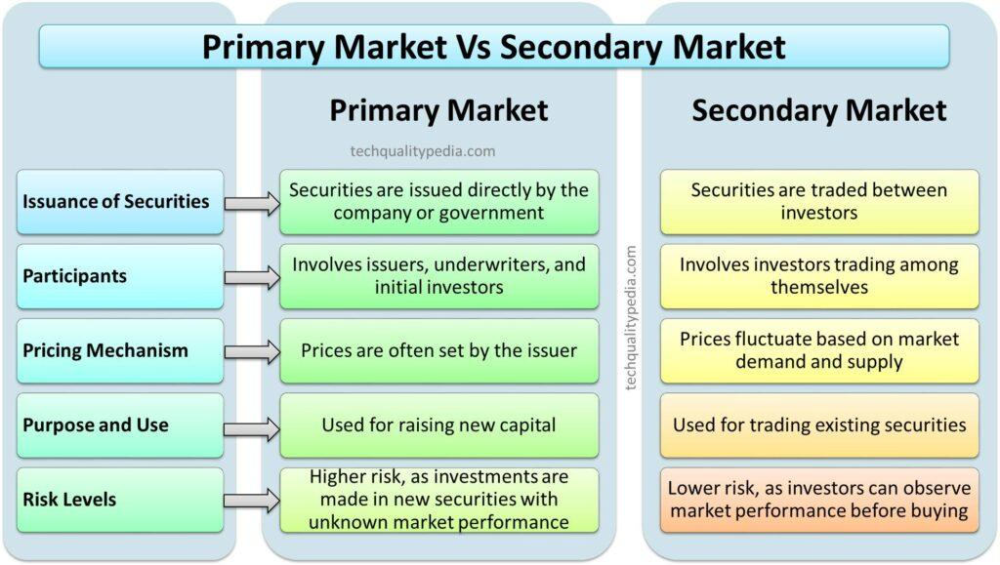

## Table of Contents

## What is a primary market?

A primary market is where new securities are first sold to investors. This is when a company or government wants to raise money, they create and sell stocks or bonds for the first time. Investors buy these directly from the issuer, which could be a company going public through an Initial Public Offering (IPO) or a government issuing new bonds.

In a primary market, the money from the sales goes straight to the issuer. This is different from a secondary market, where investors trade securities among themselves without involving the original issuer. The primary market is important because it helps companies and governments get the funds they need to grow or operate, and it gives investors a chance to buy new securities at the start.

## What is a secondary market?

A secondary market is where people buy and sell securities that have already been issued. Unlike the primary market where new securities are sold, the secondary market is for trading existing ones. When you buy a stock or bond from another investor, you're using the secondary market. This market is important because it lets investors sell their securities if they need money or want to change their investments.

The money from sales in the secondary market goes to the seller, not the original issuer like in the primary market. This means if you sell a stock, you get the money, not the company that issued the stock. The secondary market helps keep the economy moving by making it easy for people to trade securities. It's where most trading happens, like on stock exchanges such as the New York Stock Exchange or NASDAQ.

## How do primary and secondary markets differ?

The primary market is where new securities are sold for the first time. When a company wants to raise money, it might issue new stocks or bonds. Investors buy these directly from the company or government that is issuing them. The money from these sales goes straight to the issuer. This market is important because it helps companies and governments get the funds they need to start or grow their operations. An example of this is when a company goes public through an Initial Public Offering (IPO).

The secondary market is where people buy and sell securities that have already been issued. This is where most trading happens, like on stock exchanges. When you buy a stock or bond from another investor, you're using the secondary market. The money from these sales goes to the seller, not the original issuer. This market is crucial because it lets investors easily trade their securities if they need money or want to change their investments. It keeps the economy moving by allowing securities to be bought and sold freely.

In simple terms, the primary market is for new securities, and the money goes to the issuer. The secondary market is for trading existing securities, and the money goes to the seller. Both markets are important for different reasons, but they work together to help the economy function smoothly.

## What are the main functions of the primary market?

The primary market is where companies and governments first sell their new securities, like stocks or bonds, to investors. This is important because it helps them raise money they need to start up, grow, or keep running their operations. When a company wants to go public, it uses the primary market to do an Initial Public Offering (IPO), which means selling its first shares to the public. The money from these sales goes directly to the company or government that issued the securities, helping them fund their projects or pay for their needs.

Another key function of the primary market is to give investors a chance to buy into new opportunities at the start. When a new stock or bond is issued, investors can buy it directly from the issuer. This can be exciting for investors because they get to be part of a company or project from the beginning. It also helps spread out the ownership of companies, which can lead to a more diverse and stable economy. By providing a way for new securities to enter the market, the primary market plays a crucial role in keeping the financial system healthy and active.

## What are the main functions of the secondary market?

The secondary market is where people buy and sell securities that have already been issued. This is important because it lets investors trade their stocks or bonds with other investors. If someone needs money or wants to change their investments, they can sell their securities on the secondary market. This helps keep the economy moving because it makes it easy for people to trade securities whenever they want.

The money from sales in the secondary market goes to the seller, not the original company or government that issued the securities. This means if you sell a stock, you get the money, not the company that issued the stock. The secondary market is where most trading happens, like on big stock exchanges such as the New York Stock Exchange or NASDAQ. It's crucial for the economy because it helps set prices for securities based on what people are willing to pay, which gives everyone a good idea of what things are worth.

## Can you provide examples of primary market transactions?

A primary market transaction happens when a company or government sells new securities for the first time. For example, when a company wants to go public, it does an Initial Public Offering (IPO). This means the company sells its first shares to the public. The money from these sales goes straight to the company, helping it to grow or start new projects. An example of this was when Facebook went public in 2012. They sold their first shares to investors, raising money to expand their business.

Another example of a primary market transaction is when a government issues new bonds. Governments do this to raise money for things like building roads or schools. When they sell these new bonds, the money goes directly to the government to pay for these projects. For instance, if the U.S. government issues new Treasury bonds, people can buy them directly from the government. The money from these sales helps the government fund its programs and services.

## Can you provide examples of secondary market transactions?

A secondary market transaction happens when someone buys or sells a stock or bond that has already been issued. For example, if you bought shares of Apple stock from another investor, that's a secondary market transaction. You're not buying the stock directly from Apple; instead, you're buying it from someone who already owned it. The money from this sale goes to the person who sold you the stock, not to Apple. This kind of trading happens all the time on stock exchanges like the New York Stock Exchange.

Another example of a secondary market transaction is when someone sells a government bond they bought years ago. Let's say someone bought a U.S. Treasury bond when it was first issued, but now they need money and decide to sell it. They can sell it to another investor on the secondary market. The money from this sale goes to the person selling the bond, not to the U.S. government. This helps people change their investments or get money when they need it, keeping the economy moving.

## Who are the key participants in the primary market?

The key participants in the primary market are the issuers and the investors. The issuers are usually companies or governments that want to raise money. When a company wants to grow or start a new project, it might sell new stocks or bonds. This is called an Initial Public Offering (IPO) if it's the first time the company is selling its stocks to the public. Governments also use the primary market to sell new bonds to pay for things like roads or schools. The money from these sales goes straight to the issuers, helping them fund their plans.

Investors are the other key participants. They buy the new stocks or bonds directly from the issuers. Investors can be everyday people, big investment firms, or even other companies. They're looking for a chance to own a part of a company or to earn interest from bonds. By buying these new securities, investors help the issuers get the money they need. This is important because it lets companies and governments start new projects or keep running their operations.

## Who are the key participants in the secondary market?

The key participants in the secondary market are buyers and sellers. Buyers are people or organizations that want to buy stocks or bonds that have already been issued. They could be individual investors looking to own a piece of a company or big investment firms managing money for others. Sellers are those who already own the securities and want to sell them. They might need money or want to change their investments. When a buyer and a seller agree on a price, they make a trade, and the money goes from the buyer to the seller.

Stock exchanges and brokers are also important in the secondary market. Stock exchanges like the New York Stock Exchange or NASDAQ provide a place where buyers and sellers can meet to trade securities. They help make sure the trading is fair and follows the rules. Brokers are people or companies that help buyers and sellers make trades. They can give advice and handle the paperwork, making it easier for people to buy and sell securities. Together, these participants help the secondary market work smoothly, letting people trade securities whenever they want.

## How do regulations impact primary and secondary markets?

Regulations have a big impact on the primary market. They are rules that companies and governments have to follow when they want to sell new stocks or bonds. These rules make sure that the information given to investors is honest and clear. For example, when a company wants to go public with an IPO, it has to tell investors everything important about its business. This helps investors make smart choices. Regulations also make sure that the money raised is used the right way. Without these rules, companies might not tell the truth, and investors could lose money. So, regulations help keep the primary market fair and safe for everyone.

Regulations also affect the secondary market, where people buy and sell securities that have already been issued. These rules help make sure that trading is fair and that no one cheats. For example, stock exchanges have rules to stop people from knowing secret information that could give them an unfair advantage. Regulations also help set clear prices for securities, so everyone knows what they're worth. Without these rules, the market could be confusing and risky. So, regulations in the secondary market help keep trading honest and make it easier for people to buy and sell securities safely.

## What role do investment banks play in the primary market?

Investment banks are very important in the primary market. They help companies and governments sell new stocks or bonds to investors. When a company wants to go public with an IPO, the investment bank helps them figure out how much to sell the stocks for and who to sell them to. They also make sure the company follows all the rules and gives investors all the information they need. This way, the company can raise money to grow or start new projects.

Investment banks also help with things like writing the documents that explain the new securities and finding the right investors to buy them. They work hard to make sure the new stocks or bonds are sold quickly and at a good price. By doing all this work, investment banks make it easier for companies and governments to get the money they need, and they help investors find new opportunities to put their money into.

## How do technological advancements influence the operations of secondary markets?

Technological advancements have changed how secondary markets work. Computers and the internet have made trading faster and easier. Now, people can buy and sell stocks or bonds from their homes using online trading platforms. These platforms show real-time prices and let people trade whenever they want, even outside of regular trading hours. This has made the market more open to everyone, not just people who can go to a stock exchange in person. Also, technology helps keep trading fair with rules and checks that make sure no one cheats.

Another big change is how technology helps with information. With the internet, people can quickly find out about companies and what's happening in the market. This helps them make better choices about buying and selling. Also, technology like algorithms and [artificial intelligence](/wiki/ai-artificial-intelligence) helps big investors trade smarter and faster. These tools can look at lots of data to find the best times to buy or sell. Overall, technology has made secondary markets more efficient, fair, and easy to use for everyone.

## What are the benefits and potential pitfalls of algo trading?

Algorithmic trading, commonly referred to as algo trading, presents numerous advantages to traders and investors within financial markets. One of the primary benefits is the capability for high-speed executions. Algorithms can process large volumes of data much faster than human capability, allowing trades to be executed in fractions of a second. This speed is critical in markets where prices can change rapidly, and opportunities may exist only momentarily.

Another significant advantage of algo trading is the elimination of human emotion from trading decisions. Emotional biases can adversely affect trading outcomes, leading to errors such as overconfidence or panic selling. By automating trading processes, algorithms can adhere strictly to predefined strategies without emotional interference, potentially leading to more consistent results.

However, despite these benefits, algo trading is not without its risks. One major concern is over-optimization, where algorithms are fine-tuned to perform exceptionally well during back-testing on historical data. This optimization may lead to strategies that are too rigid or specifically tailored to past market conditions, potentially underperforming in live trading environments.

Moreover, algo trading systems are prone to potential system failures and technological glitches. As trades are executed at incredibly high speeds, a minor failure in the algorithm or a network outage can result in significant financial losses before corrective measures can be taken. This underscores the necessity for robust strategies and meticulous risk management to mitigate potential pitfalls.

In formulas, the probability of experiencing a loss ($P_{loss}$) due to system failures in algo trading can be modeled as:

$$
P_{loss} = (1 - R_{failure}) \times E_{impact},
$$

where $R_{failure}$ is the reliability of the system and $E_{impact}$ is the expected impact of a failure. Maintaining high reliability and minimizing impact through strategic planning is essential for mitigating risks associated with algo trading.

Furthermore, algorithms can create a false sense of security, prompting traders to overlook [fundamental analysis](/wiki/fundamental-analysis) and market fundamentals. It's crucial for traders to recognize the importance of incorporating a diverse array of data inputs and strategies rather than relying solely on algorithmic outcomes.

In summary, while [algorithmic trading](/wiki/algorithmic-trading) offers significant enhancements to speed and decision-making accuracy, it requires careful consideration of the potential risks involved. Ensuring robust system designs, comprehensive risk management frameworks, and avoiding over-reliance on historical data can help in leveraging the full advantages of algorithmic trading while minimizing its pitfalls.

## References & Further Reading

[1]: ["Advances in Financial Machine Learning"](https://www.amazon.com/Advances-Financial-Machine-Learning-Marcos/dp/1119482089) by Marcos Lopez de Prado

[2]: ["Quantitative Trading: How to Build Your Own Algorithmic Trading Business"](https://github.com/LucindaYa/quant-resources/blob/master/Quantitative%20Trading%20How%20to%20Build%20Your%20Own%20Algorithmic%20Trading%20Business.pdf) by Ernest P. Chan

[3]: ["Machine Learning for Algorithmic Trading"](https://github.com/stefan-jansen/machine-learning-for-trading) by Stefan Jansen

[4]: ["Algorithmic and High-Frequency Trading"](https://www.amazon.com/Algorithmic-High-Frequency-Trading-Mathematics-Finance/dp/1107091144) by Álvaro Cartea, Sebastian Jaimungal, and José Penalva

[5]: Hasbrouck, J. (2009). ["Trading Costs and Returns for U.S. Equities: Estimating Effective Costs from Daily Data."](https://pages.stern.nyu.edu/~jhasbrou/Research/GibbsCurrent/HasbrouckJF.pdf) Review of Financial Studies, 22(3), 1393-1427.