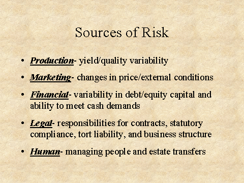

## Table of Contents

## What is market risk?

Market risk is the chance that the value of your investments might go down because of things happening in the overall market. This can include events like economic downturns, political changes, or natural disasters. These events can affect the whole market, not just one company or industry. For example, if the economy is doing badly, stock prices might fall, and this would impact many different investments.

There are different types of market risk, but some common ones are interest rate risk, where changes in interest rates can affect the value of bonds and other investments, and currency risk, where changes in exchange rates can impact investments in foreign markets. Investors can try to manage market risk by diversifying their investments, which means spreading their money across different types of investments. This way, if one investment goes down, others might still do well, helping to balance out the losses.

## What are primary sources of market risk?

Market risk comes from many places, but the main ones are economic changes, interest rate movements, and big events like political changes or natural disasters. When the economy goes up and down, it can make stock prices and other investments change a lot. If the economy is doing badly, people might not spend as much money, and companies might make less profit, which can make their stock prices go down. Interest rates also play a big role. When interest rates go up, it can make borrowing money more expensive, which can slow down the economy and affect investment values.

Another big source of market risk is what's happening in the world around us. Political changes, like a new government coming into power, can shake up markets because they might change laws or policies that affect businesses. Natural disasters, like hurricanes or earthquakes, can also cause market risk because they can damage companies and disrupt the economy. All these things can make the market go up and down, and it's important for investors to understand them to manage their risks better.

## How does interest rate risk affect market risk?

Interest rate risk is a big part of market risk. It happens when the interest rates in the economy go up or down. When interest rates go up, it can make it more expensive for companies to borrow money. This can slow down their growth and make their profits smaller. Because of this, the value of their stocks and bonds might go down. On the other hand, when interest rates go down, borrowing money becomes cheaper, which can help companies grow and make more profit, pushing up the value of their stocks and bonds.

This connection between interest rates and the market can affect all kinds of investments. For example, if you own bonds, when interest rates rise, the value of your bonds might drop because new bonds will be issued with higher interest rates, making your older bonds less attractive. If you're investing in stocks, higher interest rates might make it harder for companies to expand, which can hurt their stock prices. So, changes in interest rates can shake up the whole market, making interest rate risk a key part of market risk that investors need to watch closely.

## What is equity price risk and how does it contribute to market risk?

Equity price risk is the chance that the price of stocks, or equities, might go up or down. This can happen because of many things like how well a company is doing, what's happening in the economy, or even news and rumors. When the price of stocks goes down, people who own those stocks might lose money. This risk is always there when you invest in stocks, and it can make the stock market go up and down a lot.

Equity price risk is a big part of market risk because it affects the whole stock market. If a lot of stocks start to lose value, it can make the whole market go down. This can happen because of bad news about the economy, like a recession, or because of something that affects many companies at once, like a change in interest rates. When the stock market goes down, it can make investors nervous and lead to more selling, which can make the market drop even more. So, equity price risk is a key piece of market risk that investors need to think about when they're deciding where to put their money.

## How does currency exchange rate risk impact market risk?

Currency exchange rate risk is the chance that changes in the value of one country's money compared to another's can affect investments. If you invest in a company that does business in another country, the value of your investment can go up or down because of changes in the exchange rate. For example, if the U.S. dollar gets weaker compared to the Euro, and you own stocks in a European company, those stocks might be worth more in dollars. But if the dollar gets stronger, those stocks might be worth less.

This kind of risk is a big part of market risk because it can shake up the whole market. If a lot of investors have money in foreign markets, big changes in exchange rates can make the value of their investments go up and down a lot. This can make the market more unpredictable and risky. Investors need to think about currency exchange rate risk when they're deciding where to put their money, especially if they're investing in companies that do business in many different countries.

## What role does commodity price risk play in market risk?

Commodity price risk is the chance that the prices of things like oil, gold, or wheat might go up or down. This can affect the whole market because many companies use these commodities to make their products. If the price of oil goes up a lot, companies that need oil to make things might have to pay more, which can cut into their profits. When their profits go down, the value of their stocks might go down too.

This kind of risk is a big part of market risk because it can shake up the whole market. If a lot of companies are affected by changes in commodity prices, it can make the market more unpredictable. For example, if there's a big jump in the price of wheat, food companies might struggle, and their stock prices might drop. This can make investors nervous and lead to more selling, which can make the market go down even more. So, commodity price risk is something investors need to think about when they're deciding where to put their money.

## How can liquidity risk be considered a primary source of market risk?

Liquidity risk is when it's hard to buy or sell something quickly without losing money. This can be a big part of market risk because if lots of people want to sell their investments at the same time, but there aren't enough buyers, the prices can drop a lot. Imagine everyone at a market trying to sell their apples at once, but there are only a few people wanting to buy. The price of apples would go down fast because sellers would have to lower their prices to get someone to buy.

This kind of risk can shake up the whole market. If a big event happens, like a financial crisis, lots of people might want to sell their investments to get cash. But if everyone is trying to sell and no one is buying, the market can get stuck. This can make the value of investments go down a lot, and it can make the market feel very risky. So, liquidity risk is something investors need to think about because it can make the market go up and down a lot.

## What is the impact of geopolitical risk on market risk?

Geopolitical risk is when things happening between countries can shake up the market. This can be things like wars, new laws, or changes in who is in charge of a country. When these things happen, they can make the market go up and down a lot. For example, if two countries start fighting, it can make people worried about the future. They might start selling their investments to get cash, which can make the prices of stocks and other investments go down.

This kind of risk is a big part of market risk because it can affect the whole world. If a big country changes its laws about trading with other countries, it can make it harder for companies to do business. This can hurt their profits and make their stock prices go down. Investors need to keep an eye on what's happening around the world because these events can make the market more unpredictable and risky.

## How do economic indicators influence market risk?

Economic indicators are like signs that tell us how the economy is doing. Things like unemployment rates, inflation, and how much people are spending can all affect the market. If these signs show that the economy is doing well, people might feel more confident and invest more money in the market. This can make stock prices go up. But if the signs show that the economy is doing badly, like if a lot of people are out of work, people might get worried and start selling their investments. This can make the market go down and increase market risk.

These indicators can also make the market more unpredictable. For example, if inflation starts to go up a lot, it can make things more expensive and hurt companies' profits. This can make investors nervous and lead to more selling, which can shake up the market. So, keeping an eye on economic indicators is important for investors because they can give clues about what might happen next in the market. Understanding these signs can help investors make better choices and manage their risks.

## What advanced statistical models are used to assess market risk?

Advanced statistical models help investors understand market risk better. One common model is Value at Risk (VaR). VaR tries to guess the most money an investor could lose in a certain time, like a day or a week, with a certain chance, like 5% or 1%. It looks at how prices have moved in the past and uses math to figure out what might happen next. This can help investors know how much risk they're taking on and plan how to protect their money.

Another model is the GARCH model, which stands for Generalized Autoregressive Conditional Heteroskedasticity. This model helps predict how much the market might move around in the future. It looks at how much prices have been jumping up and down in the past and uses that to guess what might happen next. This can be really useful for investors because it helps them understand if the market might be calm or if it might be wild and unpredictable. Both VaR and GARCH models use a lot of math and data to help investors make smarter choices about their investments.

## How can stress testing and scenario analysis help in understanding market risk?

Stress testing and scenario analysis are important tools that help investors understand market risk by showing what could happen to their investments in really tough times. Stress testing means putting your investments through pretend bad situations, like a big drop in the stock market or a sudden rise in interest rates. This helps you see how much money you could lose if those bad things really happened. It's like practicing for a storm so you know what to do when it comes.

Scenario analysis takes this a step further by looking at different "what if" situations. It helps you think about how your investments would do if certain events happened, like a war breaking out or a new law being passed. By imagining these different futures, you can plan better and make sure your investments can handle whatever comes their way. Both tools help you be ready for the worst and make smarter choices about where to put your money.

## What are the latest trends and technologies in managing market risk?

The latest trends in managing market risk involve using more advanced technology and data. One big trend is using artificial intelligence (AI) and machine learning to predict what might happen in the market. These technologies can look at huge amounts of data from the past and find patterns that humans might miss. This can help investors guess what the market might do next and make better decisions about their investments. Another trend is using real-time data to make quick choices. With the internet and new tools, investors can see what's happening in the market right now and react faster to changes.

New technologies like blockchain and big data are also changing how investors manage market risk. Blockchain can make trading safer and more transparent, which can help lower the risk of fraud and mistakes. Big data lets investors look at a lot more information than before, which can help them understand the market better. These technologies together are making it easier for investors to keep an eye on their risks and make smarter choices. By using these new tools, investors can be more prepared for what might happen in the market and protect their money better.

## What are the principles and techniques of risk management in algo trading?

Effective risk management in algorithmic trading is fundamental to achieving consistent returns and minimizing potential downsides in volatile financial markets. This involves setting explicit investment objectives that align with broader financial goals, thereby providing a clear roadmap for trading activities. Key to this process are various techniques and tools that optimize risk-reward ratios, ensuring traders can endure market fluctuations without incurring substantial losses.

Stop-loss orders are instrumental in controlling risk exposure by automatically liquidating a position when it reaches a predetermined price level. This limits potential losses and removes emotional bias from trading decisions. Here's an example of a simple Python script utilizing stop-loss orders with a hypothetical trading platform API:

```python
# Example pseudocode for executing a stop-loss order
def execute_stop_loss(trade_position, stop_loss_price):
    current_price = get_current_market_price(trade_position.asset)
    if current_price <= stop_loss_price:
        close_trade(trade_position)
```

Dynamic position sizing is another crucial technique that adjusts the amount of capital allocated to a trade based on the level of risk and market volatility. By increasing positions in less volatile conditions and scaling back in uncertain environments, traders can optimize their risk exposure proportionately.

Portfolio diversification remains one of the most effective strategies to mitigate systemic risks, spreading investments across different asset classes to cushion the impact of adverse price movements in a particular market segment.

Hedging strategies further enhance risk management by offsetting potential losses in one position with gains in another. For example, options contracts or other derivative instruments can be used to protect against significant devaluations.

Quantitative risk assessment tools, such as Value at Risk (VaR) models, offer insights into the maximum potential loss over a specific period given normal market conditions. This helps traders quantify risks and tailor their strategies accordingly. Consider the formula for a basic VaR calculation:

$$
\text{VaR} = \text{Portfolio Value} \times \text{Standard Deviation of Returns} \times \text{Z-Score of Confidence Level}
$$

Continuous monitoring and adjustment of trading strategies are vital for accommodating evolving market conditions. Algorithms should be regularly evaluated and optimized to maintain their effectiveness in changing environments. This iterative process involves analyzing [backtesting](/wiki/backtesting) results, assessing the impact of recent financial data, and updating parameter settings.

By integrating these principles and techniques, traders can better mitigate adverse impacts of market volatility, optimize their portfolio performance, and enhance their ability to achieve long-term financial objectives. This structured approach not only builds resilience against unpredictable market dynamics but also capitalizes on opportunities for growth.

## References & Further Reading

[1]: Bergstra, J., Bardenet, R., Bengio, Y., & Kégl, B. (2011). ["Algorithms for Hyper-Parameter Optimization."](https://dl.acm.org/doi/10.5555/2986459.2986743) Advances in Neural Information Processing Systems 24.

[2]: ["Advances in Financial Machine Learning"](https://www.amazon.com/Advances-Financial-Machine-Learning-Marcos/dp/1119482089) by Marcos Lopez de Prado

[3]: ["Evidence-Based Technical Analysis: Applying the Scientific Method and Statistical Inference to Trading Signals"](https://www.amazon.com/Evidence-Based-Technical-Analysis-Scientific-Statistical/dp/0470008741) by David Aronson

[4]: ["Machine Learning for Algorithmic Trading: Master the Fundamentals of Algorithmic Trading with Python"](https://github.com/stefan-jansen/machine-learning-for-trading) by Stefan Jansen

[5]: ["Quantitative Trading: How to Build Your Own Algorithmic Trading Business"](https://www.amazon.com/Quantitative-Trading-Build-Algorithmic-Business/dp/1119800064) by Ernest P. Chan