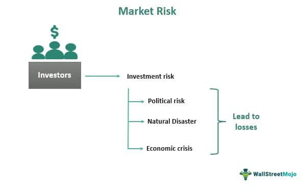

In finance, market risk, financial risk, and economic uncertainties present inevitable challenges that businesses and investors must navigate. With the rise of algorithmic trading, managing these risks efficiently has become more crucial. Algorithmic trading leverages technology to automate trading strategies, offering a systematic approach that can mitigate risk exposure and enhance decision-making.

This article explores the interconnected landscape of market and financial risks, alongside the economic uncertainties influencing markets. It examines how algorithmic trading strategies are adapting to mitigate these challenges. By examining these complexities, traders and investors can better equip themselves to handle the unpredictable nature of financial markets.



Understanding the different types of market risks, such as interest rate risk, equity price risk, commodity risk, and foreign exchange risk, is vital. Additionally, financial risks, including credit risk, liquidity risk, and operational risk, also demand attention. The importance of risk management cannot be overstated, as it provides a framework for preserving capital and minimizing potential losses. This guide will explore how innovative algorithmic trading strategies address these issues, providing tools and techniques for traders to implement in their decision-making processes.

From interest rate changes to unforeseen economic events, this comprehensive guide aims to shed light on the ever-evolving financial environment. Economic uncertainties, including those arising from monetary policy adjustments, geopolitical tensions, and natural disasters, can lead to market volatility and fluctuations in asset prices. Algorithmic trading strategies are increasingly employed to adapt to these uncertainties, offering traders the ability to deploy rapid and calculated responses to market changes.

As the financial landscape continues to evolve, staying informed and adaptable is essential for thriving amidst market risks and economic uncertainties. By combining advanced technological tools with a deep understanding of market dynamics, investors can develop a well-rounded strategy to succeed in today’s complex financial landscape.

## Table of Contents

## Understanding Market Risk and Financial Risk

Market risk encompasses the potential for investors to incur losses due to fluctuations impacting the overall market. Among the primary components of market risk are interest rate risk, equity price risk, commodity risk, and foreign exchange risk. Interest rate risk arises from changes in the level of interest rates, which can affect the value of investments, particularly fixed-income securities. Equity price risk involves the variability in stock prices, influenced by factors such as company performance and investor sentiment. Commodity risk pertains to price changes in essential goods like oil and agricultural products, which can be driven by supply and demand dynamics. Foreign exchange risk, or currency risk, occurs from changes in exchange rates that can affect the value of cross-border investments.

Financial risk refers to the potential for financial loss in an investment or business endeavor. Key contributors include credit risk, [liquidity](/wiki/liquidity-risk-premium) risk, and operational risks. Credit risk is the danger of borrowers defaulting on their obligations, impacting the lender's financial position. Liquidity risk emerges when an entity struggles to meet short-term financial obligations due to an inability to convert assets into cash quickly without significant loss. Operational risk stems from failures in internal processes, systems, or external events that can disrupt business operations.

Both market and financial risks are shaped by broader economic forces and geopolitical events, leading to volatile market conditions. Economic indices and events, such as [interest rate](/wiki/interest-rate-trading-strategies) adjustments by central banks or geopolitical tensions, can markedly impact market stability and investor confidence.

To safeguard against these risks, investors and companies must develop robust strategies to hedge potential losses and preserve capital. Hedging can involve using derivatives like options and futures contracts to protect against adverse price movements. For instance, an international investor might hedge foreign exchange risk by entering into a forward contract that locks in an exchange rate for a future date.

Understanding these risks is crucial for crafting effective financial strategies and ensuring long-term trading success. A profound comprehension allows traders to anticipate market movements and align their risk management techniques accordingly, thus preserving portfolio value despite the unpredictability of financial markets.

## Economic Uncertainties and Their Impact on Markets

Economic uncertainties are complex, reflecting a combination of monetary policy changes, geopolitical tensions, and natural disasters, among other factors. These elements can significantly shape market dynamics, causing [volatility](/wiki/volatility-trading-strategies) and asset price fluctuations. For investors, predicting the unfolding and market impact of these uncertainties poses considerable challenges.

Monetary policy changes, such as interest rate adjustments by central banks, are core drivers of economic uncertainty. When central banks alter interest rates, they affect borrowing costs and consumer spending patterns. For instance, increasing interest rates generally curbs spending and borrowing, potentially leading to slower economic growth. Conversely, lowering rates can spur economic activity but may also induce inflationary pressures. The balance between promoting growth and controlling inflation is delicate and unpredictable, contributing to market volatility.

Geopolitical tensions, including conflicts, trade wars, or political instability, create further layers of uncertainty. Such tensions can disrupt global trade, affect commodity prices, and influence investor sentiment, leading to rapid and sometimes severe market adjustments. Historical cases, such as the oil crises of the 1970s or more recently, the US-China trade tensions, exemplify how geopolitical factors can trigger significant market corrections.

Natural disasters and pandemics, while less predictable, also substantially impact markets. Events such as hurricanes, earthquakes, or global health crises disrupt economic activities, affect supply chains, and alter investor confidence. The COVID-19 pandemic, for example, initiated unprecedented market volatility and required investors to adapt quickly to rapidly changing conditions.

To mitigate these uncertainties, investors employ various strategies. Scenario analysis and stress testing are crucial in preparing for potential market disruptions. By simulating different economic conditions, investors can estimate potential impacts on their portfolios and devise contingency plans. Diversification remains a fundamental risk management technique, spreading investments across different asset classes and geographies to buffer against localized shocks.

In summary, economic uncertainties are multifaceted and significantly influence market dynamics. Investors must remain vigilant and proactive, utilizing a combination of analytical tools and diversified strategies to navigate potential market disruptions effectively.

## The Rise of Algorithmic Trading in Managing Risks

Algorithmic trading employs sophisticated algorithms and systems to enable a more systematic approach to trading, significantly enhancing risk management capabilities. By leveraging large datasets, these algorithms can execute trades at optimal times, minimizing the emotional and behavioral biases often associated with manual trading. This shift to automation facilitates more disciplined trading practices, where decisions are made based on predefined criteria rather than subjective judgment.

One of the primary methods through which [algorithmic trading](/wiki/algorithmic-trading) manages risk is through the careful definition of risk parameters. This involves setting specific constraints and guidelines within which the trading algorithms operate. For instance, stop-loss orders can be programmed to automatically sell an asset when it reaches a certain price threshold, thereby limiting potential losses. Additionally, algorithms can implement hedging strategies—such as taking positions in derivative securities to offset risks in other holdings—to further mitigate exposure to adverse market movements.

Innovative techniques like [machine learning](/wiki/machine-learning) have further enhanced the capability of algorithmic trading systems. These technologies enable algorithms to learn from historical data and adapt to new information, improving their precision and responsiveness in volatile markets. Machine learning models can identify complex patterns and correlations in market data that may not be immediately apparent to human traders, thus providing a distinct advantage in predicting market trends and reacting to shifts timely.

As algorithmic trading gains prevalence, it is crucial for traders to understand the broader implications on market liquidity and volatility. The execution of trades at high speeds can lead to increased liquidity, as transactions are completed faster and more efficiently. However, it can also contribute to heightened market volatility, particularly if erroneous trades are executed or if there is an over-reliance on similar trading strategies among multiple algorithms, leading to cascading effects during periods of market stress.

In summary, algorithmic trading represents a powerful tool for managing market risks, offering a systematic, data-driven approach that reduces the potential for human error and emotional bias. By incorporating advanced risk management strategies, such as setting predefined risk parameters and utilizing machine learning, traders can better navigate the complexities of the financial markets. Nonetheless, understanding the impact of these technologies on market dynamics remains a critical consideration for participants looking to harness the full potential of algorithmic trading.

## Principles and Techniques of Risk Management in Algo Trading

Effective risk management in algorithmic trading is fundamental to achieving consistent returns and minimizing potential downsides in volatile financial markets. This involves setting explicit investment objectives that align with broader financial goals, thereby providing a clear roadmap for trading activities. Key to this process are various techniques and tools that optimize risk-reward ratios, ensuring traders can endure market fluctuations without incurring substantial losses.

Stop-loss orders are instrumental in controlling risk exposure by automatically liquidating a position when it reaches a predetermined price level. This limits potential losses and removes emotional bias from trading decisions. Here's an example of a simple Python script utilizing stop-loss orders with a hypothetical trading platform API:

```python
# Example pseudocode for executing a stop-loss order
def execute_stop_loss(trade_position, stop_loss_price):
    current_price = get_current_market_price(trade_position.asset)
    if current_price <= stop_loss_price:
        close_trade(trade_position)
```

Dynamic position sizing is another crucial technique that adjusts the amount of capital allocated to a trade based on the level of risk and market volatility. By increasing positions in less volatile conditions and scaling back in uncertain environments, traders can optimize their risk exposure proportionately.

Portfolio diversification remains one of the most effective strategies to mitigate systemic risks, spreading investments across different asset classes to cushion the impact of adverse price movements in a particular market segment.

Hedging strategies further enhance risk management by offsetting potential losses in one position with gains in another. For example, options contracts or other derivative instruments can be used to protect against significant devaluations.

Quantitative risk assessment tools, such as Value at Risk (VaR) models, offer insights into the maximum potential loss over a specific period given normal market conditions. This helps traders quantify risks and tailor their strategies accordingly. Consider the formula for a basic VaR calculation:

$$
\text{VaR} = \text{Portfolio Value} \times \text{Standard Deviation of Returns} \times \text{Z-Score of Confidence Level}
$$

Continuous monitoring and adjustment of trading strategies are vital for accommodating evolving market conditions. Algorithms should be regularly evaluated and optimized to maintain their effectiveness in changing environments. This iterative process involves analyzing [backtesting](/wiki/backtesting) results, assessing the impact of recent financial data, and updating parameter settings.

By integrating these principles and techniques, traders can better mitigate adverse impacts of market volatility, optimize their portfolio performance, and enhance their ability to achieve long-term financial objectives. This structured approach not only builds resilience against unpredictable market dynamics but also capitalizes on opportunities for growth.

## Conclusion

In an era characterized by financial volatility and rapid technological advancement, managing market risks has never been more critical for investors and traders. The integration of algorithmic trading into financial markets offers sophisticated tools and strategies that help navigate these inherent challenges, enabling market participants to make more informed decisions. Algorithmic trading systems, by leveraging advanced data analytics and machine learning, facilitate the identification and mitigation of risks in a more efficient manner than traditional methods.

Despite the capabilities offered by technology, effective risk management requires a thorough and comprehensive approach. This involves incorporating modern techniques while maintaining a deep understanding of market dynamics, including the effects of sudden economic changes and geopolitical events. A robust risk management strategy is multifaceted, incorporating elements such as scenario analysis, stress testing, and dynamic hedging strategies. This strategic approach ensures that traders are better prepared to handle unpredictability in market conditions.

As the financial markets continue to evolve, staying informed and adaptable remains essential for thriving amidst market risks and economic uncertainties. Continuous education and staying abreast of technological innovations are vital for investors looking to safeguard their portfolios against unexpected fluctuations. Moreover, the use of algorithmic trading should be complemented by a sound understanding of financial principles and market behavior to achieve sustainable success.

Ultimately, a well-rounded strategy that blends technological innovation with traditional risk management principles is crucial for investors aiming to succeed in today's complex financial landscape. By adopting this holistic approach, market participants can enhance their risk management capabilities, ultimately leading to improved performance and resilience in the face of financial volatility.

## References & Further Reading

[1]: Bergstra, J., Bardenet, R., Bengio, Y., & Kégl, B. (2011). ["Algorithms for Hyper-Parameter Optimization."](https://dl.acm.org/doi/10.5555/2986459.2986743) Advances in Neural Information Processing Systems 24.

[2]: ["Advances in Financial Machine Learning"](https://www.amazon.com/Advances-Financial-Machine-Learning-Marcos/dp/1119482089) by Marcos Lopez de Prado

[3]: ["Evidence-Based Technical Analysis: Applying the Scientific Method and Statistical Inference to Trading Signals"](https://www.amazon.com/Evidence-Based-Technical-Analysis-Scientific-Statistical/dp/0470008741) by David Aronson

[4]: ["Machine Learning for Algorithmic Trading: Master the Fundamentals of Algorithmic Trading with Python"](https://github.com/stefan-jansen/machine-learning-for-trading) by Stefan Jansen

[5]: ["Quantitative Trading: How to Build Your Own Algorithmic Trading Business"](https://www.amazon.com/Quantitative-Trading-Build-Algorithmic-Business/dp/1119800064) by Ernest P. Chan