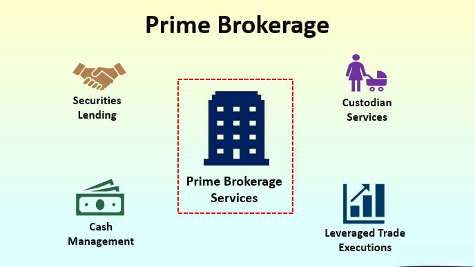

## Table of Contents

## What is prime brokerage?

Prime brokerage is a set of services that big financial firms offer to their best clients, usually big investors like hedge funds. These services help these clients do their investing more easily and effectively. The services can include things like lending money to the clients so they can buy more investments, helping them borrow stocks to sell them and buy them back later at a lower price, and giving them a safe place to keep their investments.

These services are important because they help big investors manage their money better. For example, if a hedge fund wants to borrow money to buy more stocks, the prime broker can lend them that money. Or if they want to sell a stock they don't own yet, hoping to buy it back cheaper later, the prime broker can help them do that. This makes it easier for these big investors to make more money, and in return, the prime broker gets paid for providing these services.

## What are the main services offered by prime brokers?

Prime brokers offer a bunch of services to help big investors like hedge funds. One main service is lending money, which is called margin lending. This lets investors buy more stocks or other investments without using all their own money. Another big service is securities lending, where the prime broker helps investors borrow stocks they don't own. They can then sell these borrowed stocks, hoping to buy them back later at a lower price to make a profit.

Another important service is custody and settlement. This means the prime broker keeps the investors' stocks and other investments safe and handles the buying and selling of them. Prime brokers also provide research and advice to help investors make smart choices. They might give reports on different companies or markets, helping investors decide what to buy or sell. All these services make it easier for big investors to manage their money and try to make more of it.

## Who typically uses prime brokerage services?

Prime brokerage services are mainly used by big investors like hedge funds. These are companies that manage a lot of money for other people, and they often need help to make their investments work better. Hedge funds use prime brokers to borrow money so they can buy more stocks or other things without using all their own money. They also use prime brokers to borrow stocks they don't own, sell them, and hope to buy them back later at a lower price.

Other big investors, like pension funds or large private investors, might also use prime brokerage services. These investors need help managing their big piles of money and want to make the most of it. Prime brokers give them the tools and services they need to do this, like keeping their investments safe, helping them buy and sell things easily, and giving them advice on what to invest in.

## What are the benefits of using a prime broker?

Using a prime broker can really help big investors like hedge funds. One big benefit is that prime brokers lend money, which means investors can buy more stocks or other investments without using all their own cash. This can help them make more money if their investments go up in value. Prime brokers also let investors borrow stocks they don't own, so they can sell these stocks and hope to buy them back later at a lower price. This can be a smart way to make money if the stock price goes down.

Another benefit is that prime brokers keep investments safe and handle buying and selling them. This makes things easier for investors because they don't have to worry about keeping track of their stocks or making sure their trades go through correctly. Prime brokers also give research and advice, which helps investors make better choices about what to buy or sell. All these services make it easier for big investors to manage their money and try to make more of it.

## How does prime brokerage differ from traditional brokerage?

Prime brokerage and traditional brokerage are both services that help people invest, but they work in different ways. Traditional brokers are for regular people who want to buy and sell stocks or other investments. They help with basic things like putting money into your account, buying and selling stocks, and sometimes giving advice on what to invest in. Traditional brokers are good for people who want to invest their own money but need a bit of help.

On the other hand, prime brokerage is for big investors like hedge funds. These investors manage a lot of money and need more advanced services. Prime brokers do things like lending money so these big investors can buy more investments, helping them borrow stocks to sell and buy back later, and keeping their investments safe. Prime brokers also give special research and advice to help these big investors make the best choices. So, while traditional brokers help regular people with simple investing, prime brokers help big investors with more complex and advanced services.

## What are some examples of prime brokerage firms?

Some big prime brokerage firms are Goldman Sachs, Morgan Stanley, and JPMorgan Chase. These firms are known for helping big investors like hedge funds with their money. They lend money to these investors so they can buy more stocks or other things. They also help them borrow stocks to sell and buy back later, hoping to make a profit.

Another example is UBS, which also offers prime brokerage services. UBS helps big investors keep their investments safe and gives them advice on what to buy or sell. Other firms like Bank of America Merrill Lynch and Credit Suisse also provide these services. They all work to make it easier for big investors to manage their money and try to make more of it.

## What are the basic account requirements for opening a prime brokerage account?

Opening a prime brokerage account is not like opening a regular bank account. You need to be a big investor, like a hedge fund, to even think about it. Prime brokers want to work with clients who have a lot of money to invest, usually millions of dollars. They also want to see that you have experience in investing and know what you're doing. This is because prime brokerage services are complex and meant for people who can handle big investments.

To open an account, you'll need to go through a detailed process. The prime broker will check your financial history and make sure you meet their standards. They might ask for documents like your business registration, financial statements, and proof of your investment experience. Once they're happy with everything, they'll set up your account. This account will give you access to services like borrowing money, borrowing stocks, and getting special research and advice to help you invest better.

## How does the account opening process for prime brokerage work?

Opening a prime brokerage account is a big deal and not something you can do if you're just a regular person with a little money to invest. You need to be a big investor, like a hedge fund, with millions of dollars to put into the market. Prime brokers only want to work with clients who have a lot of money and know what they're doing. They check your financial history and make sure you have enough experience in investing. This is because the services they offer are complex and meant for people who can handle big investments.

To get started, you'll need to go through a detailed process. The prime broker will ask for a bunch of documents, like your business registration, financial statements, and proof that you've been investing for a while. They want to make sure you're the kind of client they want to work with. Once they're happy with everything, they'll set up your account. This account will give you access to special services like borrowing money, borrowing stocks, and getting expert advice and research to help you make smart investment choices.

## What are the risks associated with prime brokerage?

Using prime brokerage services can be risky. One big risk is that when you borrow money from a prime broker to buy more investments, you could lose a lot if the investments go down in value. You still have to pay back the money you borrowed, even if your investments don't make money. This can be a big problem if the market goes down a lot. Also, when you borrow stocks to sell and hope to buy them back cheaper later, you're betting that the stock price will go down. If it goes up instead, you'll lose money because you have to buy the stock back at a higher price.

Another risk is that prime brokerage services can be very complicated. If you don't understand them well, you might make bad choices and lose money. Prime brokers give a lot of advice and research, but it's up to you to use it right. If you make a mistake, it can cost you a lot. Also, if the prime broker has problems, like going bankrupt, it could affect your investments. You need to trust that the prime broker is doing a good job and keeping your money safe.

## How do prime brokers manage client assets and securities lending?

Prime brokers help big investors like hedge funds by managing their money and stocks. They keep the investors' stocks and other investments safe in something called custody. This means the prime broker holds onto the stocks and makes sure they are secure. When it's time to buy or sell stocks, the prime broker handles all the paperwork and makes sure everything goes smoothly. This is called settlement. It's a big job because there are a lot of details to keep track of, but the prime broker does it all so the investor can focus on making money.

Prime brokers also help with something called securities lending. This is when the investor wants to borrow stocks they don't own yet. They can sell these borrowed stocks and hope to buy them back later at a lower price. The prime broker finds the stocks to lend and makes sure the investor gets them. This can be risky because if the stock price goes up instead of down, the investor loses money. But the prime broker helps manage this risk by making sure everything is done correctly and safely.

## What advanced services can prime brokers provide to hedge funds and institutional investors?

Prime brokers offer a lot of advanced services to help hedge funds and big investors manage their money better. One important service is called leverage, which means the prime broker lends money to the investor so they can buy more stocks or other investments. This can help the investor make more money if their investments go up in value. Another service is short selling, where the prime broker helps the investor borrow stocks they don't own, sell them, and hope to buy them back later at a lower price. This can be a smart way to make money if the stock price goes down.

Prime brokers also provide something called risk management. They help investors understand and manage the risks of their investments. This can include giving them reports and tools to see how their investments are doing and what might happen in the future. Another advanced service is trade execution, where the prime broker helps the investor buy and sell stocks quickly and at the best prices. They use special technology and connections to make sure the trades happen smoothly. All these services help big investors like hedge funds make the most of their money and try to make more of it.

## How do regulations impact prime brokerage operations and what compliance measures are necessary?

Regulations have a big impact on how prime brokers do their work. They have to follow rules set by governments and financial watchdogs to make sure they are doing things the right way. These rules are there to protect investors and keep the financial markets fair and safe. For example, prime brokers have to follow rules about how much money they can lend to investors and how they handle borrowing and lending stocks. They also have to report a lot of information to regulators to show they are following the rules. If they don't follow these rules, they can get in big trouble, like fines or even losing their license to operate.

To stay in line with these regulations, prime brokers need to have strong compliance measures. This means they have to set up systems and processes to make sure they are always following the rules. They need to keep good records of everything they do, like how much money they lend and what stocks they help investors borrow. They also need to train their employees to understand the rules and make sure they follow them. Sometimes, they hire special people called compliance officers to watch over everything and make sure the prime broker is doing things right. All these measures help prime brokers stay out of trouble and keep their clients' money safe.

## References & Further Reading

[1]: ["Prime Brokers and Outsourcing by Hedge Funds"](https://www.investopedia.com/terms/p/primebrokerage.asp) by Chen, Joseph, and Anjan Thakor. The Review of Financial Studies

[2]: ["Algorithmic and High-frequency Trading"](https://assets.cambridge.org/97811070/91146/frontmatter/9781107091146_frontmatter.pdf) by Álvaro Cartea, Sebastian Jaimungal, and José Penalva

[3]: ["Hedge Funds: An Analytic Perspective"](https://www.jstor.org/stable/j.ctt7rq28) by Andrew W. Lo

[4]: Capponi, Agostino, and John Tsoukalas. ["Modeling the Market Microstructure Impact of Algorithmic Trading."](https://scholar.google.com/citations?user=TO0W3mUAAAAJ) Operations Research

[5]: ["Financial Markets and Trading: An Introduction to Market Microstructure and Trading Strategies"](https://archive.org/details/financialmarkets0000schm) by Anatoly B. Schmidt