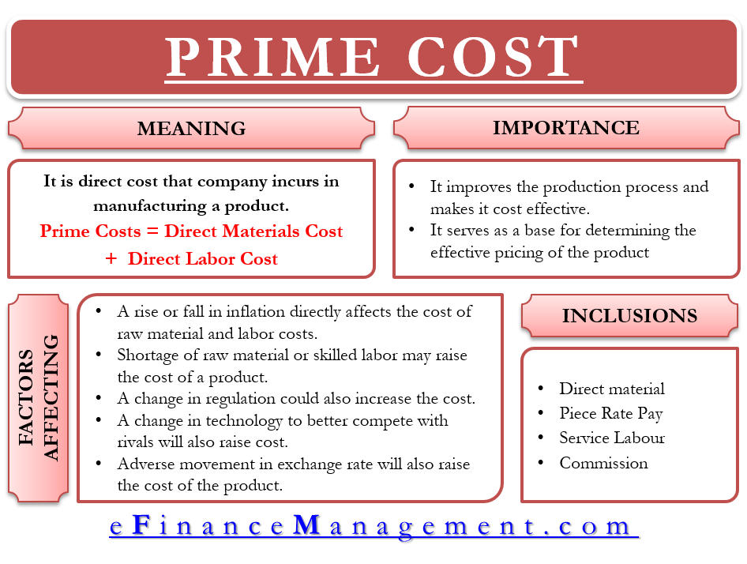

## Table of Contents

## What is prime cost and why is it important in business?

Prime cost is the total cost of direct materials and direct labor that go into making a product. It does not include indirect costs like rent or utilities. In simple terms, it's the money spent on the main things needed to make what you're selling. For example, if you're making a cake, the prime cost would include the cost of flour, eggs, and the time spent by the baker.

Understanding prime cost is important for businesses because it helps them figure out how much it costs to make each product. This information is crucial for setting the right price for their products. If a business knows its prime cost, it can make sure the selling price is high enough to cover these costs and make a profit. It also helps in managing costs better, as the business can look for ways to reduce the cost of materials or labor, which can lead to bigger profits.

## How do you calculate prime cost?

To calculate the prime cost, you add up the cost of direct materials and direct labor. Direct materials are the things you use to make your product, like wood for a table or fabric for a dress. Direct labor is the money you pay people to make the product, like the wages of the carpenter or the seamstress. So, if you spent $50 on wood and $30 on the carpenter's time to make a table, the prime cost for that table would be $80.

Knowing the prime cost is useful because it helps you understand how much it really costs to make each item you sell. This can help you decide how much to charge for your products. If you know it costs $80 to make a table, you can set a price that covers this cost and also gives you some profit. It also helps you find ways to save money, like finding cheaper materials or ways to make things faster, which can make your business more successful.

## What are the components of prime cost?

Prime cost is made up of two main parts: direct materials and direct labor. Direct materials are the things you use to make your product. For example, if you are making a pizza, the direct materials would be the dough, sauce, and cheese. Direct labor is the money you pay people to make the product. Using the pizza example again, direct labor would be the wages you pay the chef who makes the pizza.

Knowing the prime cost helps businesses figure out how much it costs to make each item they sell. If a business knows it costs $10 in materials and $5 in labor to make a pizza, the prime cost for that pizza is $15. This information is important because it helps the business set the right price for the pizza. They can make sure the price is high enough to cover the $15 prime cost and also make some profit.

## Can you provide an example of prime cost calculation for a manufacturing business?

Imagine a small factory that makes wooden chairs. The factory owner needs to calculate the prime cost for one chair. The direct materials for the chair include wood, screws, and varnish. Let's say the wood costs $20, the screws cost $2, and the varnish costs $3. So, the total cost for direct materials is $25. The factory also pays a worker to make the chair. The worker's wage for making one chair is $15. When you add the cost of direct materials ($25) and the cost of direct labor ($15), the prime cost for one chair is $40.

Understanding the prime cost is really important for the factory owner. It helps them know exactly how much it costs to make each chair. If the owner sells the chair for $60, they can see that they are making a profit of $20 per chair after covering the prime cost. This information can help the owner decide if they need to find cheaper materials or if they can pay their workers more. Knowing the prime cost helps the business run smoothly and make good decisions about pricing and costs.

## How does prime cost differ from total cost?

Prime cost and total cost are two different ways to look at the costs of making something. Prime cost is just the cost of the main things you need to make your product. This includes the materials you use and the money you pay the people who make it. For example, if you're making a cake, the prime cost would be the cost of flour, eggs, and the time the baker spends making the cake. It's a simple way to see how much it costs to make each item you sell.

Total cost, on the other hand, includes everything you spend to make and sell your product. This means it includes the prime cost, but also adds other costs like rent for your factory, electricity, and the salary of the person who sells your product. These extra costs are called indirect costs because they are not directly tied to making one specific item. Knowing the total cost is important because it shows you all the money you need to spend to keep your business running and making a profit.

## What is the significance of prime cost in pricing strategies?

Prime cost is really important when you're trying to figure out how to price your products. It tells you the basic cost of making each item, which includes the cost of the materials you use and the money you pay the people who make it. Knowing this helps you set a price that covers these costs and still leaves room for you to make a profit. If you know it costs $10 to make a T-shirt, you can set a price that's higher than $10 to make sure you're not losing money.

Understanding prime cost also helps you make smart decisions about your pricing strategy. For example, if you find that your prime cost is too high, you might look for cheaper materials or ways to make things faster. This can help you lower your costs and maybe even lower your prices to attract more customers. On the other hand, if you see that your prime cost is low, you might decide to keep your prices the same and make more profit per item. Either way, knowing your prime cost gives you the information you need to set the best prices for your business.

## How can businesses use prime cost to improve profitability?

Businesses can use prime cost to improve profitability by first understanding how much it costs to make each product. Prime cost includes the cost of materials and the wages paid to workers. If a business knows its prime cost, it can set prices that cover these costs and still make a profit. For example, if it costs $5 to make a toy, the business can sell it for more than $5 to make money. By knowing the prime cost, a business can make sure it's not selling products for less than it costs to make them, which helps increase profitability.

Another way businesses can use prime cost to boost profits is by finding ways to lower it. If the prime cost is too high, the business might look for cheaper materials or ways to make things faster. For instance, if a bakery finds that the cost of flour is too high, it might switch to a different supplier that offers a better price. Or, if workers are taking too long to make a product, the business might train them to work more efficiently. By reducing the prime cost, the business can either lower its prices to attract more customers or keep the same prices and make more profit per item. Either way, lowering the prime cost helps the business make more money.

## What are common mistakes businesses make when calculating prime cost?

One common mistake businesses make when calculating prime cost is including indirect costs. Prime cost only includes direct materials and direct labor, like the wood and the carpenter's time for making a table. Sometimes, businesses might accidentally add in things like rent or electricity, which are indirect costs. These should be part of the total cost, not the prime cost. Including these extra costs can make the prime cost seem higher than it really is, which can lead to setting prices too high or thinking the business is less profitable than it is.

Another mistake is not keeping track of all the direct materials and labor costs. For example, a business might forget to include the cost of small items like screws or glue when making a product. Or, they might not count the time a worker spends on setting up machines or cleaning up after making something. These costs are part of the prime cost and leaving them out can make it seem lower than it really is. This can lead to setting prices too low, which might not cover all the costs and could result in the business losing money.

## How does prime cost impact financial reporting and analysis?

Prime cost plays a big role in financial reporting and analysis because it helps businesses understand the basic cost of making their products. When a business knows its prime cost, it can see how much money is spent on the main things needed to make each item, like materials and labor. This information is important for financial reports because it helps show how efficient the business is at making its products. If the prime cost is low, it might mean the business is good at keeping costs down, which can be a good sign for investors and managers.

In financial analysis, prime cost is useful for figuring out how to price products and how to make the business more profitable. By knowing the prime cost, a business can set prices that cover these costs and still make a profit. It also helps in comparing the cost of making different products, which can guide decisions about what to make more of or what to stop making. If a business can lower its prime cost, it might be able to sell its products for less and attract more customers, or keep the same prices and make more profit per item. Understanding prime cost helps businesses make smart choices to improve their financial health.

## What are the industry-specific considerations for prime cost?

Different industries have their own special things to think about when calculating prime cost. In manufacturing, like making cars or toys, the cost of materials like steel or plastic and the wages of workers who build the products are really important. But, they also need to think about the cost of machines and tools that help make things. In the food industry, like restaurants or bakeries, the prime cost includes the cost of ingredients like flour or meat and the time chefs spend cooking. They also need to think about how much food they might throw away if it's not used in time.

In the construction industry, the prime cost includes the cost of things like bricks, wood, and the wages of builders. They also need to think about the cost of heavy equipment like cranes. In the fashion industry, the prime cost is the cost of fabric, buttons, and the time spent by workers sewing clothes. They also need to think about how much it costs to make small changes to designs. Each industry has its own special costs to think about, but knowing the prime cost helps all businesses set the right prices and make more money.

## How can technology and software help in tracking and managing prime cost?

Technology and software can make it a lot easier for businesses to keep track of and manage their prime cost. Special computer programs can help businesses keep an eye on how much they spend on materials and labor. For example, a business can use software to see how much they paid for wood or fabric and how much they paid workers to make things. This helps them know their prime cost for each product they make. The software can also keep track of these costs over time, so the business can see if they are going up or down and make changes if they need to.

Using technology also helps businesses find ways to save money and make more profit. Some software can show where a business might be spending too much on materials or labor. For example, it might show that one type of wood is getting too expensive, so the business can look for a cheaper option. Or, it might show that workers are taking too long to make something, so the business can train them to work faster. By using technology to keep track of prime cost, businesses can make smart choices about how to spend their money and make their products more efficiently.

## What advanced strategies can be employed to optimize prime cost in large-scale operations?

In large-scale operations, one advanced strategy to optimize prime cost is through the use of automation and robotics. By using machines to handle repetitive tasks, businesses can reduce the amount of labor needed, which directly lowers the direct labor component of prime cost. Automation also helps in reducing waste and improving the consistency of production, which can lead to savings on materials. For example, in a car manufacturing plant, robots can assemble parts more quickly and accurately than human workers, leading to lower labor costs and less material waste due to errors.

Another strategy involves implementing advanced data analytics and [machine learning](/wiki/machine-learning). These technologies can help businesses predict and manage their material needs more effectively, reducing the cost of direct materials. By analyzing historical data, a business can forecast demand more accurately and order just the right amount of materials, avoiding overstocking and reducing waste. Additionally, machine learning can identify patterns in production processes that might be inefficient, suggesting ways to streamline operations and further reduce both material and labor costs. Together, these strategies help large-scale operations optimize their prime cost, making their business more profitable.

## What is the understanding of Prime Costs in Accounting?

Prime costs are the direct costs associated with the production of goods, primarily consisting of raw materials and direct labor expenses. These costs play a critical role in cost accounting by helping businesses determine the minimum pricing necessary to achieve profitability. The calculation of prime cost is straightforward and can be expressed by the formula:

$$
\text{Prime Cost} = \text{Direct Raw Materials} + \text{Direct Labor}
$$

Direct raw materials are the essential components that are transformed into the final product, while direct labor refers to the wages paid to workers who are directly involved in the production process. Accurately accounting for these costs ensures that a company sets adequate pricing strategies to cover not only these direct expenses but also any indirect costs associated with production.

In manufacturing, understanding prime costs is crucial for pricing products competitively while still maintaining a profitable margin. For instance, if a company manufactures furniture, the prime costs would include the cost of wood, fabric, and other materials, as well as the labor costs of carpenters and seamstresses. This clarity in cost allocation aids in decision-making and strategic planning.

Another important aspect is distinguishing between prime costs and conversion costs. While prime costs focus on the direct costs of producing goods, conversion costs include additional expenses required to convert raw materials into finished products, such as manufacturing overhead and indirect labor. Differentiating these two cost types is essential for accurately measuring production efficiency and identifying areas for cost savings.

In summary, prime costs serve as a fundamental metric for businesses to manage their cost structures and assess their production efficiency. By understanding and leveraging prime cost calculations, companies can effectively optimize their operations and enhance profitability.

## What are some case studies and practical examples?

Efficient cost calculation can lead to substantial improvements in business operations and financial outcomes. In the manufacturing sector, for example, a woodworking business that applies precise prime cost calculations can set competitive prices. By accurately measuring its direct raw materials and labor costs, this company can establish a baseline price that ensures profitability. The formula used is:

$$
\text{Prime Cost} = \text{Direct Raw Materials} + \text{Direct Labor}
$$

An understanding of these costs allows the business to set prices just above the sum of its direct costs, thereby remaining competitive yet profitable in the market. This approach also helps in optimizing inventory purchases and labor management, thus avoiding unnecessary expenditures.

In the financial sector, particularly in [algorithmic trading](/wiki/algorithmic-trading), managing trading costs is pivotal in enhancing profitability. Firms that meticulously calculate and control both explicit and implicit trading costs often experience better financial performance. For instance, suppose an algorithmic trading firm wants to minimize its transaction costs. By employing a Python script to analyze different trading scenarios, the firm can simulate trades and estimate associated costs, including:

- **Spread Costs:** The difference between the bid and the ask price.
- **Commission Fees:** Payments to the broker per transaction.
- **Slippage:** The difference between the expected and actual trade price.

A simplified Python code for simulating trading costs might look like this:

```python
def calculate_trading_costs(executed_trades, bid_ask_spread, commission_rate):
    spread_cost = executed_trades * bid_ask_spread
    commission_cost = executed_trades * commission_rate
    total_cost = spread_cost + commission_cost
    return total_cost

executed_trades = 1000  # example number
bid_ask_spread = 0.05  # example value
commission_rate = 0.01  # example rate

total_cost = calculate_trading_costs(executed_trades, bid_ask_spread, commission_rate)
print(f"Total trading cost: ${total_cost}")
```

By strategically selecting brokers, optimizing the timing of trades, and using cost-effective venues for transaction execution, the firm can efficiently manage its trading costs. Such practices not only contribute to cost savings but also improve the overall return on investment.

Both examples illustrate the significance of accurately calculating and managing direct costs. Whether in manufacturing or financial trading, businesses that prioritize cost efficiency can secure a strong competitive edge and achieve better financial sustainability.

## References & Further Reading

[1]: ["Cost Accounting: A Managerial Emphasis"](https://www.amazon.com/Cost-Accounting-Managerial-Emphasis-13th/dp/0136126634) by Charles T. Horngren, Srikant M. Datar, and Madhav V. Rajan

[2]: ["Algorithmic Trading & DMA: An Introduction to Direct Access Trading Strategies"](https://www.amazon.com/Algorithmic-Trading-DMA-introduction-strategies/dp/0956399207) by Barry Johnson

[3]: Kaplan, R. S., & Atkinson, A. A. (1998). ["Advanced Management Accounting."](https://archive.org/details/advancedmanageme0000kapl_u5x7) Prentice Hall.

[4]: Lo, A. W., Mamaysky, H., & Wang, J. (2000). ["Foundations of Technical Analysis: Computational Algorithms, Statistical Inference, and Empirical Implementation."](https://www.nber.org/papers/w7613) The Journal of Finance, 55(4), 1705-1765.

[5]: Pinedo, M. L. (2016). ["Scheduling: Theory, Algorithms, and Systems."](https://link.springer.com/book/10.1007/978-3-031-05921-6) Springer International Publishing.