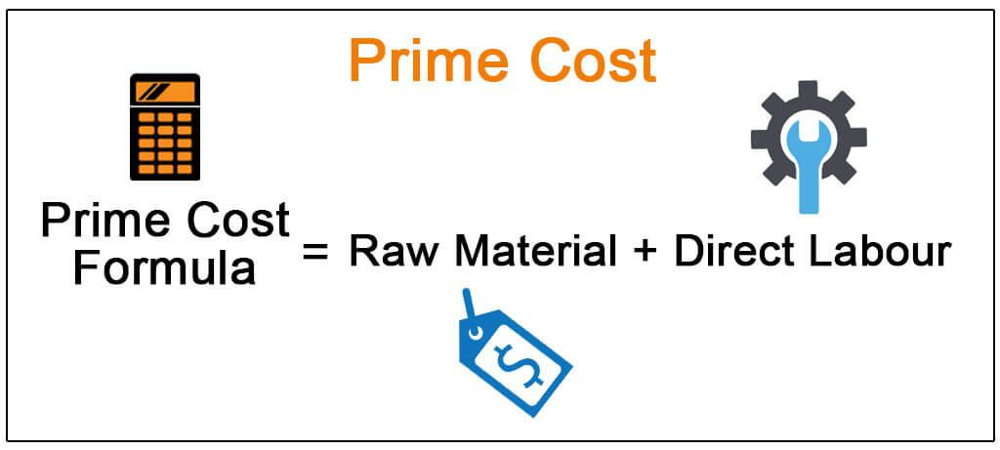

In the ever-evolving world of finance, the intersection of prime cost calculations in accounting and algorithmic trading is gaining prominence. Both of these concepts are essential for optimizing business operations across manufacturing and financial sectors. Understanding and managing the intricacies of direct and indirect costs, prime cost calculations, and the often-overlooked expenses in algorithmic trading are increasingly seen as vital to obtaining a competitive edge in these industries.

Prime costs in accounting reflect the direct expensess associated with production, typically encompassing raw materials and direct labor. These calculations are fundamental for businesses aiming to establish the minimum viable price for their products to ensure profitability and operational efficiency. Meanwhile, algorithmic trading, which utilizes automated and high-speed algorithms for executing trade orders, requires a keen awareness of various trading costs. Effective algorithmic trading strategies must consider both explicit costs, such as commissions, and implicit costs like the bid-ask spread, which can significantly impact overall performance.



Bridging these concepts, the application of prime cost theories in algorithmic trading involves careful allocation and management of financial resources. Just as manufacturing seeks to minimize production costs, algorithmic traders benefit from reducing direct trading expenses to enhance strategy returns. This involves meticulous computation and control of trading costs similar to the way businesses handle production expenses.

A comprehensive understanding of prime costs and algorithmic trading expenses allows for better operational decisions, leading to improved profitability and sustainable growth. Businesses and traders who integrate these principles into their strategies can better navigate the complex financial landscape and maintain a competitive advantage.

## Table of Contents

## Understanding Prime Costs in Accounting

Prime costs are the direct costs associated with the production of goods, primarily consisting of raw materials and direct labor expenses. These costs play a critical role in cost accounting by helping businesses determine the minimum pricing necessary to achieve profitability. The calculation of prime cost is straightforward and can be expressed by the formula:

$$
\text{Prime Cost} = \text{Direct Raw Materials} + \text{Direct Labor}
$$

Direct raw materials are the essential components that are transformed into the final product, while direct labor refers to the wages paid to workers who are directly involved in the production process. Accurately accounting for these costs ensures that a company sets adequate pricing strategies to cover not only these direct expenses but also any indirect costs associated with production.

In manufacturing, understanding prime costs is crucial for pricing products competitively while still maintaining a profitable margin. For instance, if a company manufactures furniture, the prime costs would include the cost of wood, fabric, and other materials, as well as the labor costs of carpenters and seamstresses. This clarity in cost allocation aids in decision-making and strategic planning.

Another important aspect is distinguishing between prime costs and conversion costs. While prime costs focus on the direct costs of producing goods, conversion costs include additional expenses required to convert raw materials into finished products, such as manufacturing overhead and indirect labor. Differentiating these two cost types is essential for accurately measuring production efficiency and identifying areas for cost savings.

In summary, prime costs serve as a fundamental metric for businesses to manage their cost structures and assess their production efficiency. By understanding and leveraging prime cost calculations, companies can effectively optimize their operations and enhance profitability.

## Algorithmic Trading: A Brief Overview

Algorithmic trading is a sophisticated technique whereby algorithms are employed to execute financial market trades at exceptionally high speeds. These algorithms can process a vast amount of data and perform trades much faster than a human trader. In recent decades, [algorithmic trading](/wiki/algorithmic-trading) has modernized trading practices by enhancing decision-making processes and markedly reducing the need for human intervention. This automation allows traders to capitalize on market opportunities with precision and consistency.

The effectiveness of algorithmic trading is contingent upon the comprehensive understanding and management of trading costs. These costs, if not properly accounted for, can accumulate rapidly and erode potential profits. There are two main types of costs involved in algorithmic trading: explicit costs and implicit costs.

Explicit costs include commissions and fees charged by brokers for executing trades. These costs are straightforward and can be directly observed. For instance, a trader might incur a fixed fee per transaction or a variable fee based on the [volume](/wiki/volume-trading-strategy) of the trade. Managing these costs requires careful selection of brokers and trading platforms, often comparing different pricing structures to identify the most cost-effective options.

Implicit costs, on the other hand, are not as easily quantifiable and include aspects such as the bid-ask spread and market impact. The bid-ask spread represents the difference between the price a buyer is willing to pay (bid) and the price a seller is willing to accept (ask). Larger spreads can significantly increase trading expenses, especially for high-frequency trades. Market impact refers to the change in the asset's price caused by the trade itself, particularly in less liquid markets where large orders can shift market prices unfavorably.

To effectively manage these costs, algorithmic traders often employ advanced strategies and technologies. These might include statistical models to predict market movements and optimize trade execution. It is also common to use programming languages such as Python to develop scripts that automate trade simulations and evaluate the impact of trading costs. Here is a simple example of how Python can be used to calculate the cumulative effect of trading costs:

```python
def calculate_trading_costs(trades, commission_rate, avg_bid_ask_spread):
    total_commission = 0
    total_bid_ask_cost = 0
    for trade in trades:
        # Commission cost per trade
        total_commission += trade['volume'] * commission_rate
        # Bid-ask spread cost per trade
        total_bid_ask_cost += trade['volume'] * avg_bid_ask_spread
    return total_commission, total_bid_ask_cost

trades = [{'volume': 1000}, {'volume': 500}, {'volume': 1500}]
commission_rate = 0.002  # 0.2% per trade
avg_bid_ask_spread = 0.001  # spread represented as 0.1%

commission, bid_ask_cost = calculate_trading_costs(trades, commission_rate, avg_bid_ask_spread)

print(f"Total Commission: {commission}, Total Bid-Ask Spread Cost: {bid_ask_cost}")
```

In conclusion, algorithmic trading stands at the forefront of modern finance, offering heightened efficiency and operational accuracy. However, to harness its full potential, traders must meticulously account for both explicit and implicit trading costs when formulating their strategies. This careful consideration and management of costs directly contribute to optimizing profitability and maintaining a competitive edge in the financial markets.

## Prime Costs and Their Role in Algorithmic Trading

Understanding prime cost concepts, traditionally employed in manufacturing, is increasingly relevant in algorithmic trading. In manufacturing, prime costs focus on the direct costs of production, such as raw materials and direct labor. Similarly, in algorithmic trading, traders need to manage direct trading costs effectively, including transaction fees and spread costs, to enhance profitability.

Just as manufacturers strive to minimize production costs to increase product margins, traders aim to reduce transactional expenses to boost returns on investment. Transaction fees, including brokerage and exchange fees, are the most explicit costs traders encounter. Spread costs, representing the difference between the bid and ask prices, are also crucial components of trading expenses. These costs impact the overall profitability of trading strategies and require careful monitoring and management.

A parallel can be drawn between cost management practices in manufacturing and trading. Manufacturers employ budgeting and accounting techniques to control costs, while algorithmic traders use sophisticated tools and strategies to manage financial outlays. For example, using historical data, traders can backtest strategies to estimate potential costs and returns. This process often involves writing scripts in Python to simulate past trades and assess the impact of different cost scenarios on strategy performance.

Additionally, minimizing direct costs in trading may involve strategic choices, such as selecting brokers with competitive fee structures, optimizing the timing of trades to take advantage of lower spreads, and choosing the most efficient execution venues. These choices are similar to manufacturers optimizing their production processes to reduce material and labor costs.

By adopting a disciplined approach to cost management, akin to that in manufacturing, algorithmic traders can secure a competitive advantage in the financial markets. Understanding and controlling prime costs in trading paves the way for more effective resource allocation, enabling traders to refine their strategies, enhance profitability, and sustain growth.

## Calculating and Managing Trading Costs

Algorithmic traders must possess a deep understanding of trading costs to enhance their strategies and optimize profitability. Trading costs mainly comprise spread costs, commission fees, and slippage, which can collectively impact the net return of trading activities. Effective management and calculation of these costs are crucial.

**Spread Costs** refer to the difference between the buying price (ask price) and the selling price (bid price) of an asset. It represents a variable cost inherent to every trade and is influenced by market liquidity. For instance, in highly liquid markets like forex, spreads tend to be narrower, while less liquid markets may exhibit wider spreads.

**Commission Fees** are charges levied by brokers for executing trades on behalf of traders. These costs vary depending on the broker, the type of assets being traded, and the volume of transactions. Traders need to factor in these fees when computing the total cost of their trades.

**Slippage** is the difference between the expected price of a trade and the actual price at which the trade is executed. This often occurs in fast-moving markets where there is a rapid change in price levels. Managing slippage involves strategic timing and execution to ensure that trades are carried out at optimal prices.

To calculate and manage these costs effectively, traders can use Python scripts to simulate trades and evaluate cost impacts. Python, with libraries such as Pandas and NumPy, allows for detailed analysis through historical data simulations and real-time price tracking. A simple Python script to compute trading costs might involve the following steps:

```python
import pandas as pd

# Example data: replace with real-time or historical data
data = pd.DataFrame({
    'Ask': [1.305, 1.306, 1.307],
    'Bid': [1.304, 1.305, 1.306],
    'Trade': [1.3055, 1.3065, 1.3075]
})

# Calculate spread cost
data['Spread'] = data['Ask'] - data['Bid']

# Assume a fixed commission per trade
commission_per_trade = 0.0002
data['Commission'] = commission_per_trade

# Calculate slippage
data['Slippage'] = data['Trade'] - data['Ask']

# Total cost per trade
data['Total_Cost'] = data['Spread'] + data['Commission'] + data['Slippage']

print(data[['Spread', 'Commission', 'Slippage', 'Total_Cost']])
```

Minimizing trading costs requires several strategic actions:

1. **Broker Selection**: Opting for brokers who offer competitive commission rates and narrow spreads is fundamental.

2. **Optimal Timing**: Timing trades to coincide with periods of higher liquidity can help reduce spread costs and slippage. For instance, trading during the overlap of European and US market hours typically yields lower spreads.

3. **Choice of Execution Venues**: Selecting the right execution venues, such as exchanges with high liquidity, can minimize transaction costs.

By integrating cost accounting principles in trading strategies, traders can enhance their return on investment by thoroughly assessing and mitigating the impacts of trading costs. This approach fosters improved decision-making and operational efficiency in algorithmic trading.

## Case Studies and Practical Examples

Efficient cost calculation can lead to substantial improvements in business operations and financial outcomes. In the manufacturing sector, for example, a woodworking business that applies precise prime cost calculations can set competitive prices. By accurately measuring its direct raw materials and labor costs, this company can establish a baseline price that ensures profitability. The formula used is:

$$
\text{Prime Cost} = \text{Direct Raw Materials} + \text{Direct Labor}
$$

An understanding of these costs allows the business to set prices just above the sum of its direct costs, thereby remaining competitive yet profitable in the market. This approach also helps in optimizing inventory purchases and labor management, thus avoiding unnecessary expenditures.

In the financial sector, particularly in algorithmic trading, managing trading costs is pivotal in enhancing profitability. Firms that meticulously calculate and control both explicit and implicit trading costs often experience better financial performance. For instance, suppose an algorithmic trading firm wants to minimize its transaction costs. By employing a Python script to analyze different trading scenarios, the firm can simulate trades and estimate associated costs, including:

- **Spread Costs:** The difference between the bid and the ask price.
- **Commission Fees:** Payments to the broker per transaction.
- **Slippage:** The difference between the expected and actual trade price.

A simplified Python code for simulating trading costs might look like this:

```python
def calculate_trading_costs(executed_trades, bid_ask_spread, commission_rate):
    spread_cost = executed_trades * bid_ask_spread
    commission_cost = executed_trades * commission_rate
    total_cost = spread_cost + commission_cost
    return total_cost

executed_trades = 1000  # example number
bid_ask_spread = 0.05  # example value
commission_rate = 0.01  # example rate

total_cost = calculate_trading_costs(executed_trades, bid_ask_spread, commission_rate)
print(f"Total trading cost: ${total_cost}")
```

By strategically selecting brokers, optimizing the timing of trades, and using cost-effective venues for transaction execution, the firm can efficiently manage its trading costs. Such practices not only contribute to cost savings but also improve the overall return on investment.

Both examples illustrate the significance of accurately calculating and managing direct costs. Whether in manufacturing or financial trading, businesses that prioritize cost efficiency can secure a strong competitive edge and achieve better financial sustainability.

## Conclusion

Understanding both accounting prime costs and algorithmic trading costs is imperative for success in today's multifaceted market environments. These concepts, although originating from different sectors, share a common thread in their ability to influence operational efficiency and profitability. In accounting, accurately determining prime costs—composed of direct raw materials and direct labor—enables businesses to set viable pricing strategies that ensure profitability while maintaining competitive advantage. The formula, Prime Cost = Direct Raw Materials + Direct Labor, is central to this process, offering a clear means of delineating essential production expenses from overheads.

Similarly, in the financial domain, the awareness of trading costs in algorithmic trading is equally crucial. These expenses, encompassing both explicit costs like commissions and implicit costs such as the bid-ask spread, require meticulous calculation and management to prevent erosion of trading margins. Algorithmic traders can significantly improve their return on investment by adopting a methodical approach to cost management, akin to cost accounting principles used in manufacturing.

To thrive, businesses and traders must integrate these cost concepts into their core operations. For businesses, this means ensuring that pricing strategies reflect the actual cost of production, allowing for sustainable growth and competitiveness. For traders, aligning accounting principles with trading strategies means identifying, calculating, and minimizing costs effectively to enhance trading profitability. 

Aligning accounting practices with trading strategies results in a more comprehensive cost management approach, enabling firms to not only balance costs but also optimize profitability across sectors. This holistic understanding facilitates informed decision-making, promoting long-term sustainability and growth.

## References & Further Reading

[1]: ["Cost Accounting: A Managerial Emphasis"](https://www.amazon.com/Cost-Accounting-Managerial-Emphasis-13th/dp/0136126634) by Charles T. Horngren, Srikant M. Datar, and Madhav V. Rajan

[2]: ["Algorithmic Trading & DMA: An Introduction to Direct Access Trading Strategies"](https://www.amazon.com/Algorithmic-Trading-DMA-introduction-strategies/dp/0956399207) by Barry Johnson

[3]: Kaplan, R. S., & Atkinson, A. A. (1998). ["Advanced Management Accounting."](https://archive.org/details/advancedmanageme0000kapl_u5x7) Prentice Hall.

[4]: Lo, A. W., Mamaysky, H., & Wang, J. (2000). ["Foundations of Technical Analysis: Computational Algorithms, Statistical Inference, and Empirical Implementation."](https://www.nber.org/papers/w7613) The Journal of Finance, 55(4), 1705-1765.

[5]: Pinedo, M. L. (2016). ["Scheduling: Theory, Algorithms, and Systems."](https://link.springer.com/book/10.1007/978-3-031-05921-6) Springer International Publishing.