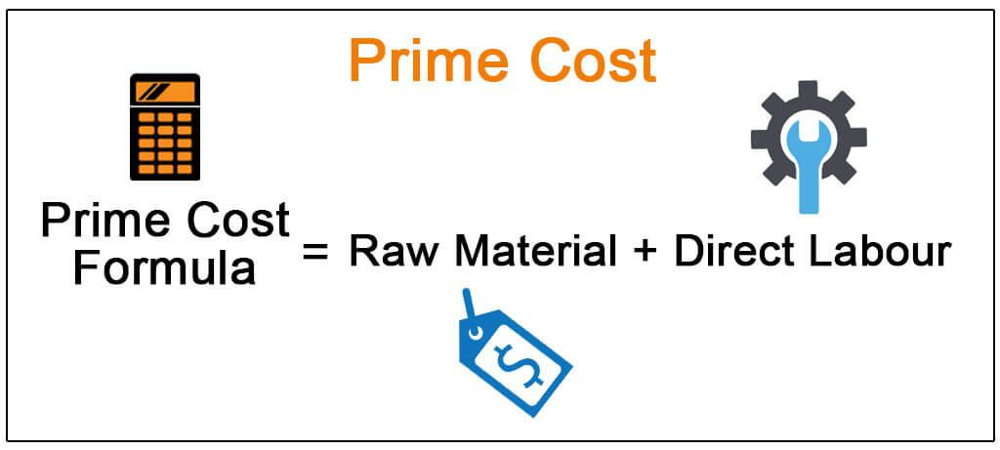

Understanding costs is vital for optimizing operations and enhancing profitability in both finance and manufacturing sectors. This article focuses on the concept of prime costs, crucial in cost accounting and their significant role in algorithmic trading. Prime costs typically include expenditures directly linked to the production processes, primarily raw materials and direct labor. Businesses rely on accurate calculations of these costs to ensure that products are priced competitively, covering both direct and indirect expenses.

In manufacturing, the formula to determine prime cost is straightforward: 



$$
\text{Prime Cost} = \text{Direct Raw Materials} + \text{Direct Labor}
$$

This calculation helps businesses establish the minimum selling price needed for profitability. Meanwhile, in financial trading, similar cost management principles apply. Algorithmic trading, which uses automated systems to execute trades at high speeds, heavily depends on effective cost calculation and management. Here, costs include explicit expenses, such as commissions, and implicit ones, like the bid-ask spread, impacting overall trading returns.

By exploring how these costs are calculated and managed, businesses can develop strategies that give them a competitive advantage. Linking cost management practices from manufacturing to strategies used in financial trading brings forth a comprehensive approach to boost profitability. With integrated cost management techniques, businesses and traders can achieve operational efficiency and sustained growth.

## Table of Contents

## Understanding Prime Costs in Accounting

Prime costs in accounting are the essential direct costs incurred during the production process, primarily comprising the expenses for raw materials and direct labor. Understanding these costs is crucial for businesses as they serve as the foundation for setting a minimum selling price that ensures profitability. 

Accurate calculation of prime costs enables companies to establish competitive pricing strategies that not only cover direct expenses but also contribute to covering indirect costs, such as rent, utilities, and administrative expenses. The basic formula to determine prime cost is given by:

$$
\text{Prime Cost} = \text{Direct Raw Materials} + \text{Direct Labor}
$$

This straightforward calculation highlights the expenses directly attributed to the manufacturing of products, facilitating a clear understanding of cost drivers in the production cycle. By accurately computing the prime cost, businesses can ascertain the baseline selling price needed to avoid losses, guiding pricing strategies that ensure covering all costs while achieving desired profit margins.

A critical aspect of financial analysis is distinguishing prime costs from conversion costs. Conversion costs include additional production-related expenses such as manufacturing overhead, which encompasses indirect labor, depreciation of machinery, and factory utilities. While prime costs focus solely on direct expenses, conversion costs provide a more comprehensive view by accounting for all aspects of production necessary to transform raw materials into finished goods.

Understanding the distinction between prime and conversion costs is vital for cost analysis and management, as it enables businesses to dissect and scrutinize where efficiencies can be implemented to reduce unnecessary expenses. This differentiation aids in optimizing operations, ultimately contributing to the financial robustness and pricing competitiveness of a company.

By using prime costs as a foundational element of cost accounting, organizations can develop informed cost management strategies that align with their broader financial objectives, enhancing their ability to maintain profitability in a competitive market landscape.

## Algorithmic Trading: A Brief Overview

Algorithmic trading employs sophisticated automated systems to execute transactions at exceptionally high speeds. These systems rely primarily on advanced data analysis and cutting-edge technology to make informed trading decisions. Automated trading algorithms are designed to analyze market data in real-time, identify trading opportunities, and execute trades with precision and speed that far exceed human capabilities.

In [algorithmic trading](/wiki/algorithmic-trading), traders must give careful consideration to various costs associated with their activities. These costs can be categorized into explicit costs and implicit costs. Explicit costs comprise elements such as commission fees that brokers charge for executing trades. Meanwhile, implicit costs include the bid-ask spread, which refers to the difference between the highest price a buyer is willing to pay and the lowest price a seller is willing to accept. These implicit costs can subtly erode the profitability of trades if not managed appropriately.

Effective cost management is critical in algorithmic trading to ensure optimal profitability. This management often involves selecting brokers that offer advantageous fee structures and developing trade execution strategies that minimize costs. For example, choosing brokers with low commission rates or those that offer rebates can substantially reduce explicit trading costs. Furthermore, optimizing trade execution, such as timing trades to occur when market [liquidity](/wiki/liquidity-risk-premium) is high, can help minimize the bid-ask spread, thus reducing implicit costs.

Technology plays a pivotal role in managing these costs. Algorithmic traders often utilize sophisticated software tools and platforms to simulate various trading scenarios and analyze the potential cost implications. Data-driven strategies are essential for optimizing trade execution. By leveraging historical data and predictive analytics, traders can refine their algorithms to minimize costs and maximize returns. 

In summary, algorithmic trading is not merely about executing trades rapidly; it is about executing them efficiently. Managing both explicit and implicit costs is essential for retaining profitability. As such, the selection of brokers and the development of effective trade execution strategies are integral components of successful algorithmic trading operations.

## Prime Costs and Their Role in Algorithmic Trading

The concept of prime costs, traditionally associated with manufacturing, has found relevance in the domain of algorithmic trading, where managing direct trading expenses is essential. Similar to how manufacturers focus on reducing production costs to maximize profitability, traders aim to minimize transaction costs and improve returns.

In algorithmic trading, transaction costs can significantly impact net earnings, necessitating a focus on managing these expenses efficiently. Trading fees, known as commission fees, and spreads, the difference between the bid and ask prices, are direct costs analogous to prime costs in manufacturing. Reducing these costs enhances the profitability of trading strategies.

To manage these costs effectively, traders employ advanced tools and data analysis. Algorithms are developed to optimize trade execution by simulating trading scenarios, which predict the impact of various cost components on overall profitability. For instance, by analyzing historical data, traders can optimize order execution times, reducing the bid-ask spread costs. Python is a preferred language in such simulations due to its robust libraries for data analysis and algorithmic development.

Consider a Python example that simulates trade execution and calculates potential costs:

```python
import pandas as pd

# Example: Simulating trade execution and calculating spread costs
data = pd.DataFrame({'price': [100, 101, 102, 103], 'bid': [99.5, 100.5, 101.5, 102.5], 'ask': [100.5, 101.5, 102.5, 103.5]})
data['spread'] = data['ask'] - data['bid']

# Calculating cost per trade based on spread
data['trade_cost'] = data['spread'] * 100  # Assuming 100 shares per trade

total_spread_cost = data['trade_cost'].sum()
print(f"Total Spread Cost: ${total_spread_cost}")
```

This script calculates the spread cost for each trade, demonstrating how data analysis helps in quantifying and managing trading expenses. By simulating and analyzing various scenarios, algorithmic traders can devise strategies to minimize such costs, much like optimizing prime costs in manufacturing.

In conclusion, applying the concept of prime costs to algorithmic trading involves a comprehensive understanding of trading expenses and the adoption of strategies that emphasize cost reduction. Ultimately, whether in manufacturing or trading, the goal is to streamline processes and maximize profitability.

## Calculating and Managing Trading Costs

Trading costs significantly impact the overall profitability of algorithmic trading strategies. Understanding these costs is essential for optimizing trade execution and enhancing returns. The primary components of trading costs include spread costs, commission fees, and slippage.

**Spread Costs:** The spread is the difference between the bid and ask prices of a security. It represents a cost to traders, as they typically buy at the higher ask price and sell at the lower bid price. Minimizing spread costs is crucial, particularly in high-frequency trading where numerous transactions are executed rapidly. One effective strategy is to execute trades during periods of high market liquidity, where tighter spreads prevail.

**Commission Fees:** These fees are charged by brokers for executing trades and can vary significantly between providers. Selecting a broker with a favorable fee structure is vital for cost management. Traders should evaluate various brokers based on commission rates, additional fees, and the quality of service offered to ensure optimal cost efficiency.

**Slippage:** Slippage occurs when there is a difference between the expected price of a trade and the actual price at which it is executed. It is more likely in volatile markets and during the execution of large orders. Slippage can be reduced by using advanced order types such as limit orders, which set a specific price threshold for trade execution.

To effectively manage these trading costs, many algorithmic traders utilize Python scripts and data analytics tools. These technologies enable precise calculations and facilitate informed decision-making when developing trading strategies. For instance, Python libraries such as `pandas` and `numpy` can be used to analyze historical price data, evaluate the impact of different fee structures, and simulate various trading scenarios to identify cost-saving opportunities.

Here's a simple example of how Python can be used to calculate and visualize spread costs over a range of trades:

```python
import pandas as pd
import matplotlib.pyplot as plt

# Sample data representing bid and ask prices over multiple trades
data = {
    'Trade': [1, 2, 3, 4, 5],
    'Bid Price': [100, 102, 101.5, 103, 104],
    'Ask Price': [100.5, 102.5, 102, 103.5, 105]
}

df = pd.DataFrame(data)

# Calculate spread cost for each trade
df['Spread Cost'] = df['Ask Price'] - df['Bid Price']

# Visualize spread costs
plt.figure(figsize=(10, 6))
plt.bar(df['Trade'], df['Spread Cost'], color='blue')
plt.xlabel('Trade Number')
plt.ylabel('Spread Cost')
plt.title('Spread Cost per Trade')
plt.show()
```

This code snippet creates a bar plot of spread costs across several trades, helping traders identify patterns and adjust their strategies accordingly. Overall, by strategically selecting brokers, timing trades, and leveraging technology, traders can effectively manage trading costs and improve the profitability of their trading exercises.

## Case Studies and Practical Examples

Manufacturing and financial trading sectors both emphasize the accurate calculation and management of costs to maintain competitiveness and profitability. In manufacturing, prime costs—comprising direct raw materials and direct labor—are crucial for determining the minimum selling prices needed to achieve profitability. For instance, in the automotive industry, companies meticulously calculate the costs of metal, plastic, electronic components, and the labor required for assembly. By understanding these direct expenses, manufacturers can set competitive prices that cover both direct and indirect expenses, such as overhead and administrative costs. This ensures they maintain a competitive edge without sacrificing profitability.

In financial trading, algorithmic trading firms focus on minimizing direct trading expenses to enhance operational profitability. These firms employ advanced simulations to predict and control trading costs, which are vital for optimizing trade execution strategies. Key elements of trading costs, such as spread costs, commission fees, and slippage, are analyzed using sophisticated data analytics tools. By simulating market conditions and executing trades in a controlled environment, these firms can better anticipate the impact of different trading scenarios on their cost structures. This approach allows them to refine their strategies to achieve favorable outcomes.

For example, algorithmic trading scripts written in Python can automate the process of calculating transaction costs by retrieving market data and executing trades based on predefined criteria. Here is a simplified example of a Python script that estimates trading costs:

```python
import yfinance as yf  # For more datasets, visit: https://paperswithbacktest.com/datasets

# Define the stock and period for analysis
stock = 'AAPL'
period = '1mo'

# Fetch historical data
data = yf.download(stock, period=period)

# Calculate the average bid-ask spread as a percentage of price
average_spread = (data['High'] - data['Low']).mean() / data['Close'].mean()

# Define commission and slippage
commission_per_trade = 0.0010  # Example value
slippage_per_trade = 0.0005    # Example value

# Calculate estimated total trading cost per trade
estimated_cost = average_spread + commission_per_trade + slippage_per_trade

print(f"Estimated trading cost per trade: {estimated_cost:.4%}")
```

This simulation not only helps trading firms to gauge the effectiveness of their strategies under different market conditions but also assists in identifying the most cost-effective execution methods. By focusing on precision and efficiency in cost management, businesses in both manufacturing and financial trading can adapt their practices to bolster profitability and maintain a solid market position.

## Conclusion

The intersection of cost accounting and algorithmic trading highlights the critical role of precise cost management in achieving profitability and enhancing operational efficiency. By integrating principles from both manufacturing and trading sectors, businesses can gain valuable insights into developing cost-effective strategies. For instance, in cost accounting, understanding the components of prime costs allows for effective pricing strategies that ensure competitiveness without sacrificing margins. Similarly, in algorithmic trading, a firm grasp of trading costs—such as spreads, commissions, and slippage—empowers traders to optimize execution strategies and improve net returns on trades.

The convergence of these areas underscores the potential for adopting comprehensive cost management approaches that encompass both direct and indirect expenses. By prioritizing cost accuracy and efficiency, companies and traders can build a foundation for sustainable growth and secure a competitive advantage in their respective industries.

Adopting integrated approaches not only aids in precise cost calculation but also enhances the ability to forecast expenses and revenues more effectively. As businesses and traders refine their cost management techniques, they position themselves better to respond to market changes swiftly and strategically. This approach ensures that they remain agile and competitive, ultimately contributing to long-term success and market leadership.

## References & Further Reading

1. **Books**:
   - Horngren, C. T., Datar, S. M., & Rajan, M. V. (2014). *Cost Accounting: A Managerial Emphasis*. Pearson. This book provides an in-depth look at cost accounting principles, including a detailed explanation of prime costs, their calculation, and their application in managerial decision-making.

2. **Online Courses**:
   - Coursera offers a course titled "Algorithmic Trading and Quantitative Analysis using Python and R" which covers the basics of algorithmic trading, including strategies for managing trading costs.

3. **Research Papers**:
   - Treleaven, P., Galas, M., & Lalchand, V. (2013). Algorithmic Trading. *Communications of the ACM*, 56(11), 76-85. This paper discusses the architecture and functioning of algorithmic trading systems, with emphasis on cost management strategies.
   - Levin, J. S. (1995). Costing systems in manufacturing and service industries. *Management Accounting Research*, 6(1), 27-41. This research highlights various costing systems used across different sectors and their impact on strategic profitability.

4. **Web Articles and Blogs**:
   - Investopedia's article on "Algorithmic Trading" provides an accessible overview of algorithmic trading, including cost implications and management techniques for different trading strategies.
   - CFA Institute's blog often posts articles related to cost management in trading, offering insights from industry professionals.

5. **Educational Websites**:
   - MIT OpenCourseWare offers free online materials related to financial and cost accounting, with resources explaining the nuances of cost calculations in various industries.

6. **Industry Reports**:
   - Deloitte’s annual report on "Global Trading Costs" analyzes trends and offers guidance on optimizing trading costs in high-frequency trading environments.

7. **Python Libraries for Trading Cost Management**:
   - The `backtrader` Python library is an open-source tool for backtesting trading strategies, considering costs like spreads and fees.
   - `zipline` is another open-source Python library useful for algorithmic trading simulations which includes modules for cost management.

These resources provide a starting point for those interested in expanding their understanding of cost accounting and algorithmic trading, covering both theoretical foundations and practical applications.

