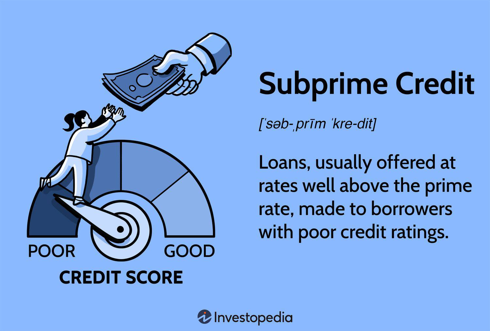

In the world of finance, understanding key concepts such as credit rating, prime credit, financial terms, and algorithmic (algo) trading is crucial. Each of these components plays a vital role in shaping the financial landscape. From determining the creditworthiness of borrowers to enabling efficient financial transactions through automated trading, these concepts are integral to modern financial systems. Credit ratings, for instance, provide insights into the likelihood of a borrower defaulting on their obligations, influencing interest rates and investment decisions. Similarly, prime credit signifies a level of creditworthiness that affords consumers access to better financial products, impacting both individual financial health and broader economic stability.

Algorithmic trading represents a significant advancement in financial markets, leveraging technology to execute trades with speed and precision. This approach not only enhances market efficiency but also introduces complex strategies that are otherwise unattainable through manual trading. As these concepts interact, they form a comprehensive ecosystem that affects both individual consumers and broader financial markets. Understanding these elements is essential for navigating the complexities of finance, offering insights that empower strategic decision-making and foster economic growth.

This article aims to explore these concepts, emphasizing their interconnections and significance in the financial sector. We will provide insights into how they affect both individual consumers and the broader financial markets. By grasping these fundamental aspects, financial professionals and consumers alike can enhance their financial literacy, paving the way for more informed and effective financial management.

## Table of Contents

## Understanding Credit Ratings

A credit rating assesses the credit risk associated with a borrower and evaluates their ability to repay a loan. These ratings are a cornerstone in financial markets, significantly impacting lending decisions, interest rates, and overall market perceptions. Various credit rating agencies, notably Standard & Poor's (S&P), Moody's, and Fitch Ratings, provide these evaluations. Each agency uses its own methodology to assess creditworthiness, assigning ratings that can range from excellent to poor.

The primary purpose of a credit rating is to offer lenders and investors a streamlined tool for assessing the risk of a borrower defaulting on their financial obligations. Higher credit ratings generally indicate a lower risk of default, providing borrowers access to better financial terms, such as reduced interest rates. Conversely, a lower credit rating suggests a higher risk, resulting in higher borrowing costs or denied access to credit.

Credit ratings have a pronounced influence beyond corporations and governments, extending to individual consumers. A person's credit score—a variant of credit rating focused on individual creditworthiness—can determine one's ability to obtain loans, mortgages, or even secure employment in some sectors. The criteria for consumer credit ratings encompass payment history, debt levels, credit history length, types of credit used, and recent credit inquiries.

The methodologies used by agencies involve quantitative analyses and qualitative assessments. Financial ratios, economic forecasts, management evaluation, and industry conditions play vital roles in these assessments. For example, S&P uses a scale ranging from AAA (indicating highest quality) to D (indicating default), while Moody's uses a slightly different scale, from Aaa to C.

Understanding credit ratings is crucial for financial decision-making, as these ratings encapsulate the perceived risks associated with loan issuance or investment in securities. For investors, credit ratings serve as a guide for identifying corporate or sovereign bonds with preferable risk-return profiles. For public stakeholders, these ratings can influence tax policies, interest rates, and even global financial policy adjustments.

In summary, credit ratings act as a barometer in financial markets, shaping the dynamics of borrowing, lending, and investing across different sectors. They serve as a critical tool for gauging economic health and stability, influencing financial strategies and policies globally.

## Prime Credit and Its Implications

Prime credit refers to a classification of consumers who are considered creditworthy, but are ranked slightly below the super-prime category, which consists of individuals with the highest credit scores. A prime credit rating typically represents those with FICO scores ranging from approximately 670 to 739, reflecting responsible credit behavior, albeit with some room for improvement compared to the super-prime bracket. This classification is crucial in financial markets because it influences the types of credit products available to consumers and the terms associated with them.

Consumers with prime credit scores benefit from access to more attractive financial products and lower interest rates than those available to individuals with subprime credit scores. Financial institutions, such as banks and credit card companies, view prime credit consumers as less risky compared to their subprime counterparts. As a result, these institutions are often willing to offer better terms, such as lower annual percentage rates (APRs) on loans and credit cards, higher credit limits, and more favorable repayment terms.

The reason a prime credit rating offers such advantages lies in the lower perceived risk to lenders. Financial institutions use credit scores to estimate the likelihood of a borrower defaulting on a loan or failing to meet their credit obligations. A prime credit score indicates a moderate level of risk, reassuring lenders that the consumer is likely to repay borrowed funds. This confidence translates into more favorable borrowing terms for prime consumers.

It's crucial for consumers to understand their prime credit status, as this knowledge empowers them to make informed financial decisions. Awareness of one's credit standing allows consumers to assess the suitability of loan and credit card offers, negotiate better terms, and manage their credit use to maintain or improve their credit rating. Ultimately, understanding prime credit can lead to cost savings and enhanced financial security, as individuals can leverage their creditworthiness to access better financial opportunities.

## Key Financial Terms

Comprehending financial terminology is essential for navigating personal and corporate finance. In this section, we explore key financial terms that play an integral role in both individual and institutional decision-making.

### Interest Rates
Interest rates are the cost of borrowing money or the return on investment for saving. They are typically expressed as a percentage of the principal sum. Central banks, such as the Federal Reserve in the United States, set benchmark interest rates, influencing broader economic conditions. For example, lower interest rates reduce the cost of borrowing, encouraging investment and spending. Conversely, higher interest rates may deter borrowing but offer better returns to savers.

### Credit Scores
A credit score is a numerical expression representing an individual's creditworthiness, based on an analysis of their credit files. Lenders use credit scores to evaluate the potential risk posed by lending to consumers, helping them determine terms for credit products, such as interest rates and loan amounts. Commonly, credit scores range from 300 to 850, with higher scores indicating lower credit risk and increased access to favorable loan conditions.

### Financial Instruments
Financial instruments are contracts that create financial assets for one party and financial liabilities or equity instruments for another. They include a wide range of products such as stocks, bonds, and derivatives. Stocks represent ownership in a company while bonds are a form of debt where the issuer owes the holders a debt and is obliged to pay interest. Derivatives derive their value from underlying assets or benchmarks, and they are used primarily for hedging risks or speculation.

Understanding these core financial terms enhances the ability to engage effectively in various financial activities. For individuals, this means making informed choices about loans and investments, while for businesses, it translates to strategic planning and improved financial management. By equipping oneself with this knowledge, engaging with the financial world becomes less daunting and more advantageous.

## Exploring Algo Trading

Algorithmic trading employs automated and pre-programmed trading strategies to conduct financial transactions. This approach harnesses advanced technology, data analysis, and mathematical models to execute trades with minimal latency and increased precision. By automating the trading process, [algorithmic trading](/wiki/algorithmic-trading) enhances decision-making and identifies opportunities across financial markets.

At the heart of algorithmic trading are complex algorithms that evaluate a multitude of market variables. These algorithms, often developed using programming languages like Python, analyze market data at high speed, enabling quick and informed trading decisions. For instance, an algorithm might be designed to execute a trade when a stock’s moving average crosses a specific threshold, or to exploit [arbitrage](/wiki/arbitrage) opportunities between different markets.

Algorithmic trading encompasses various strategies, such as high-frequency trading ([HFT](/wiki/high-frequency-trading-strategies)), [statistical arbitrage](/wiki/statistical-arbitrage), and market-making. High-frequency trading exploits speed advantages to capitalize on minute price discrepancies, processing thousands of trades per second. Statistical arbitrage involves intricate statistical models to predict price trends, while market-making strategies provide [liquidity](/wiki/liquidity-risk-premium) to markets by simultaneously quoting bid and ask prices.

Technological advancement has been a critical driver of algorithmic trading. The availability of real-time data feeds, enhanced computing power, and sophisticated data analytics tools have collectively transformed trading practices. For example, using libraries like NumPy and pandas in Python allows traders to perform rapid calculations on vast datasets, facilitating a more comprehensive market analysis.

Furthermore, mathematical models underpinning algorithmic trading strategies often rely on techniques from quantitative finance, such as stochastic calculus and [machine learning](/wiki/machine-learning). Machine learning models can detect patterns that might be imperceptible to human traders, helping to anticipate market movements. As a result, these models can provide competitive advantages in predicting asset price movements and optimizing trading decisions.

Overall, understanding algorithmic trading is crucial for modern traders and financial professionals. It requires a multidisciplinary approach, fusing knowledge of finance, mathematics, and programming. The sophistication and efficiency brought forth by algorithmic trading continue to reshape the landscape of financial markets, emphasizing the need for robust risk management and compliance practices to mitigate potential pitfalls.

## Interconnection of Financial Concepts

Credit ratings and prime credit statuses are pivotal in influencing algorithmic trading decisions. Algorithmic trading, which involves the use of pre-programmed computer strategies to execute trades, uses various financial factors and data inputs, such as creditworthiness, to make efficient trading decisions. Credit ratings, assigned by agencies like Standard & Poor's, Moody's, and Fitch, provide a comprehensive assessment of an entity's credit risk, which directly informs the algorithms regarding the reliability and risk levels associated with particular trading strategies.

The relationship between creditworthiness and trading strategies is significant in understanding overall market behavior and financial stability. For instance, higher credit ratings typically indicate lower default risk, which may prompt algorithms to prioritize trades involving entities with favorable ratings. Conversely, entities with lower credit ratings may be subject to higher interest rates or discounted valuations, impacting trading decisions. 

Furthermore, ratings play a critical role in shaping perceptions of financial stability and market liquidity. Algorithmic strategies often adjust to these perceptions by incorporating signals from credit rating changes into their decision-making processes. This dynamic interplay helps maintain balanced trading environments and ensures that market behaviors reflect the underlying credit health of the participants.

In recent times, credit rating agencies have also assumed roles as performance validation bodies in the context of algorithmic trading. They assess the credibility and performance of traded securities, lending greater transparency and reliability to automated trading systems. As a result, the confluence of credit ratings and algo trading has fostered environments where financial operations are both efficient and informed by comprehensive risk evaluations.

This intricate interplay between credit ratings, prime credit statuses, and algorithmic trading highlights the necessity for an in-depth understanding of each component. Mastery of these financial concepts enables market participants to navigate the complex financial ecosystems effectively and to make strategically informed decisions that enhance trading efficacy and market integrity. Understanding how credit evaluations impact trading can help investors and financial professionals anticipate market trends and adjust their strategies accordingly.

## Conclusion

In summary, credit ratings, prime credit, financial terms, and algorithmic trading are foundational elements of the financial ecosystem. Credit ratings help determine the borrowing capacity of both individuals and institutions, influencing interest rates and lending patterns. Prime credit reflects a section of consumers who maintain solid repayment histories, granting them access to attractive financial products and terms. Comprehensive knowledge of financial terms enables both everyday consumers and multinational corporations to make informed decisions regarding investments, loans, and risk management. Meanwhile, algorithmic trading has transformed modern trading practices, enabling transactions to be executed with unprecedented speed and efficiency.

Each component contributes significantly to the broader goals of economic growth, market efficiency, and risk management by optimizing financial decision-making processes and aligning market activities with established economic principles. For individual investors and financial professionals alike, possessing a thorough understanding of these concepts is invaluable. It not only enhances one's ability to make informed and strategic financial decisions but also supports effective financial planning and management. As the financial landscape continues to evolve, staying informed and proficient in these areas is imperative for navigating the complexities of contemporary markets and capitalizing on emerging opportunities.

## References & Further Reading

[1]: ["Global Credit Ratings Guide"](https://www.spglobal.com/ratings/en/about/understanding-credit-ratings) by Investopedia

[2]: ["Understanding Credit Ratings"](https://www.spglobal.com/ratings/en/about/understanding-credit-ratings) by S&P Global Ratings

[3]: ["Algorithmic and High-Frequency Trading"](https://www.amazon.com/Algorithmic-High-Frequency-Trading-Mathematics-Finance/dp/1107091144) by Marcos López de Prado

[4]: ["The Basel Committee on Banking Supervision"](https://www.bis.org/bcbs/about/overview.htm) by Bank for International Settlements

[5]: ["Algorithmic Trading and DMA: An Introduction to Direct Access Trading Strategies"](https://www.amazon.com/Algorithmic-Trading-DMA-introduction-strategies/dp/0956399207) by Barry Johnson