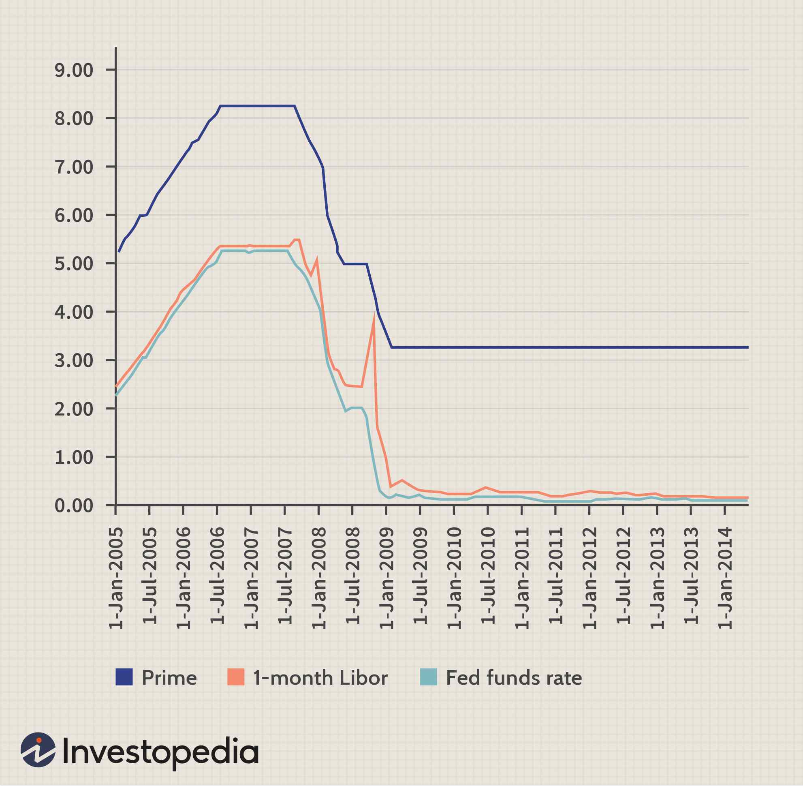

The financial world is constantly evolving, driven by technological advancements and shifting economic landscapes, compelling investors to adopt diverse and adaptive strategies to stay competitive. This article focuses on financial strategies that encompass prime rate funds, investment income, and algorithmic (algo) trading, each offering unique benefits and challenges.

Understanding these core financial elements is crucial for investors aiming to optimize their portfolios and achieve robust returns. By integrating prime rate funds into an investment strategy, investors can generate income by tapping into the potential of floating-rate, secured corporate loans. These funds typically align with the prime rate, making them an attractive option for those seeking steady income and portfolio diversification.



Investment income, derived from a variety of sources such as dividends, interest, and capital gains, is another pivotal aspect. By strategically allocating assets across different classes, including stocks, bonds, and funds, investors can stabilize and potentially increase their investment income. Prime rate funds play a significant role here, helping to bolster the income generated from a carefully curated portfolio.

In contrast, algorithmic trading harnesses the power of technology through pre-programmed strategies to automate transactions. Used across markets such as stocks, forex, and cryptocurrencies, algorithmic trading offers a competitive edge by executing trades swiftly and capturing market opportunities that may escape human traders. Institutional traders often leverage this approach due to its efficiency and capability to capitalize on high-frequency trading scenarios.

Each section of this article provides strategic insights into integrating these financial elements into an investment portfolio. By combining traditional financial instruments with modern technological strategies, investors can effectively manage risks and optimize returns in an ever-changing financial environment.

## Table of Contents

## Understanding Prime Rate Funds

Prime rate funds are a specific type of closed-end mutual funds aimed at providing returns that closely follow the prime rate. These funds are particularly attractive because they tend to offer higher yields compared to instruments like the federal funds rate or certain certificates of deposit (CDs). The primary reason for these elevated yields is their investment approach: prime rate funds primarily invest in floating-rate, secured corporate loans. These loans are typically associated with senior debt, which is a class of obligations that stand above other types of bonds in the hierarchy of repayment. This seniority offers a level of protection to investors, as senior debt is usually paid back before other types of debt in the event of a bankruptcy.

Prime rate funds are structured to appeal to investors who are seeking steady streams of income while also looking to diversify their investment portfolios. The floating-rate nature of the loans within these funds ensures that the yields are closely tied to [interest rate](/wiki/interest-rate-trading-strategies) movements, which can be advantageous for investors during periods of rising rates. This characteristic makes prime rate funds an effective tool for those aiming to hedge against interest rate risk.

In summary, prime rate funds serve as a robust option for investors aiming to achieve both income stability and diversification. By allocating resources to senior secured loans, these funds offer a relatively safer investment avenue while capitalizing on the potential for attractive yields aligned with the prime rate trajectory.

## Pros and Cons of Prime Rate Funds

Prime rate funds offer several advantages and drawbacks that investors must evaluate before incorporating them into their financial strategies. One of the primary benefits of prime rate funds is their capacity to generate returns during periods of rising interest rates. These funds usually invest in floating-rate loans, which adjust in response to changes in benchmark interest rates, such as the prime rate. Consequently, when interest rates increase, the income generated by these funds may rise, potentially offering higher yields than fixed-rate investments.

The diversified nature of prime rate funds can also play a critical role in mitigating bankruptcy risk. By investing in a broad array of corporate loans, the impact of any single borrower's default is limited, thus reducing overall portfolio risk. This diversification can make prime rate funds an appealing option for investors seeking a steady income while minimizing potential losses from individual corporate failures.

Despite these advantages, investors should be mindful of several drawbacks associated with prime rate funds. One potential issue is illiquidity; the underlying loans in these funds are often not easily sold on secondary markets, which can lead to challenges if rapid redemptions are required. Additionally, prime rate funds often have higher expense ratios compared to other fixed-income investments, which can erode net returns.

Another aspect to consider is the limited redemption opportunities. As closed-end mutual funds, prime rate funds trade on exchanges at prices that may not fully reflect their net asset value (NAV). This misalignment can result in premiums or discounts on trades, affecting the actual value received by investors. For example, purchasing a fund at a premium increases the cost, while selling at a discount reduces the proceeds.

Investors must thoroughly comprehend these risks to effectively integrate prime rate funds into their investment strategies. A well-considered approach involves balancing the yield potential and risk profile of these funds with personal financial goals and market conditions. By doing so, investors can more effectively leverage the benefits of prime rate funds while managing potential downsides.

## Generating Investment Income

Investment income refers to the profits derived from different sources within an investment portfolio, including dividends, interest, and capital gains. These sources form the backbone of many investors' strategies, with the aim of generating a stable and potentially growing income stream over time. A diversified approach across various asset classes, such as stocks, bonds, and funds, proves beneficial in stabilizing and enhancing investment income. Diversification reduces the overall risk and can lead to more consistent returns by not relying on a single asset class.

Prime rate funds play a substantial role in generating investment income by providing interest from secured loans. These funds involve investments in floating-rate loans, typically from corporate borrowers, which are secured against assets. The floating-rate nature allows these funds to adjust more favorably in shifting interest rate environments, potentially leading to attractive returns compared to other fixed-income securities.

Consistent income streams can be achieved by carefully selecting high-yield investments. These might include dividend-paying stocks or high-yield bonds, which offer regular payouts to investors. The selection of such investments requires assessing factors such as the reliability of the payout, the financial health of the issuing corporation, and the overall economic conditions.

Dividend investing stands out as a strategy capable of enhancing overall investment income potential. This strategy focuses on companies with a strong history of paying, and ideally increasing, dividends over time. These companies are often more stable, with established business models and reliable cash flows. An investor focusing on dividend growth investing might look for stocks in sectors such as utilities, consumer staples, or telecommunications, known for their consistent dividend policies.

To quantitatively assess investment income, one approach is to calculate the yield of the investment portfolio. Yield is determined by the formula:
$$
\text{Yield} = \frac{\text{Annual Income from Investment}}{\text{Market Value of Investment}} \times 100\%
$$

An investor may use Python to model and forecast investment income, allowing for the analysis of scenarios and optimization of the portfolio for specific income targets. Below is an example of how one might use Python to estimate future investment income from dividends:

```python
# Sample Python code to estimate future dividends
import numpy as np

def estimate_dividends(current_dividend, annual_growth_rate, years):
    dividends = [current_dividend * ((1 + annual_growth_rate) ** year) for year in range(years)]
    return np.sum(dividends)

# Assuming a current dividend of $3 per share, growth rate of 5%, over 10 years
estimated_income = estimate_dividends(3, 0.05, 10)
print(f"Estimated Dividend Income Over 10 Years: ${estimated_income:.2f}")
```

Prudent selection and management of investment assets can significantly impact the effectiveness of investment income strategies, leading to a more robust financial future for investors.

 to Algorithmic Trading

Algorithmic trading, commonly referred to as algo trading, is a method of executing orders using automated and pre-programmed trading instructions. These instructions are based on a variety of considerations including timing, price, and [volume](/wiki/volume-trading-strategy). The primary advantage of [algorithmic trading](/wiki/algorithmic-trading) is its ability to process complex calculations at speeds significantly faster than human traders, thereby capitalizing on even the smallest market inefficiencies that might only exist for milliseconds. 

This technology-driven approach is extensively applied across various financial markets such as stocks, [forex](/wiki/forex-system), and cryptocurrencies. In the stock market, algos are often used to place trades without manual intervention, thus making the execution process faster and more efficient. In forex trading, algorithmic systems can evaluate multiple indicators and currency pairs concurrently, enabling high-frequency trading strategies. Similarly, in the increasingly popular [cryptocurrency](/wiki/cryptocurrency) markets, algo trading helps navigate the highly volatile and round-the-clock trading environment.

Institutional traders frequently leverage algorithmic trading due to its ability to conduct a large number of transactions rapidly, while maintaining consistent results. This proficiency is particularly useful in high-frequency trading ([HFT](/wiki/high-frequency-trading-strategies)), which relies on executing a high volume of orders at extremely fast speeds. One of the key aspects behind successful algorithmic trading is the robust system architecture that supports it, often requiring sophisticated infrastructure capable of handling large data sets and executing complex algorithms. 

A solid understanding of market dynamics is crucial for developing effective algorithms. Market dynamics encompass the behavior of prices, the [liquidity](/wiki/liquidity-risk-premium) of financial instruments, and investor psychology, among other factors. Traders utilizing algorithmic systems must comprehensively analyze patterns such as mean reversion, [momentum](/wiki/momentum), and statistical [arbitrage](/wiki/arbitrage). 

Furthermore, the success of algo trading lies not only in executing trades at optimal prices but also in the algorithm's ability to adapt to changing market conditions. Algorithms must be regularly backtested and updated in response to new trends or shifts in market behavior, ensuring they remain relevant and effective. Python and C++ are popular programming languages frequently used to develop these sophisticated algorithms due to their extensive libraries and computational efficiency.

In conclusion, algorithmic trading is a transformative advancement in the financial markets arena, offering precise, speedy, and efficient trading solutions. However, success in this domain demands a careful balance between technology, analytics, and an underlying comprehension of market fundamentals.

## Benefits and Challenges of Algorithmic Trading

Algorithmic trading, commonly referred to as algo trading, is characterized by the use of computer algorithms to automate trading decisions. This method significantly reduces the influence of human emotions such as fear and greed, fostering disciplined trading practices that adhere strictly to predefined rules and strategies. By eliminating emotional biases, algo trading promotes consistency and rigor in trade execution.

One of the notable advantages of algorithmic trading is its ability to enhance liquidity and improve the efficiency of trade execution in financial markets. Automated systems can implement high-frequency trading operations, executing transactions at speeds and volumes that human traders cannot match. This increased activity contributes to tighter bid-ask spreads and reduced market impact costs, facilitating a more liquid trading environment.

Despite its benefits, algorithmic trading presents several challenges. The implementation of algo trading requires substantial technological infrastructure and specialized expertise. Traders need to design sophisticated algorithms capable of handling complex data inputs and executing strategies effectively. This aspect underscores the need for significant investment in both hardware and software to maintain competitive edge and reliability.

Additionally, proper [backtesting](/wiki/backtesting) and risk management are paramount to ensuring the effectiveness of algorithmic strategies. Backtesting involves evaluating a trading strategy using historical data to confirm its potential profitability and efficiency under various market conditions. The process aids in identifying and mitigating potential flaws before deploying an algorithm in live markets. Risk management frameworks must be robust enough to adapt to the rapid decision-making processes inherent in algo trading, safeguarding against unforeseen losses.

Furthermore, the dynamic nature of financial markets demands continuous updates and refinements to trading algorithms. Market conditions can change rapidly due to economic news, regulatory shifts, or geopolitical events, necessitating algorithms that are both adaptive and responsive. Traders must regularly recalibrate their strategies to align with evolving market dynamics, making ongoing algorithm optimization an essential component of successful algo trading operations.

In summary, algorithmic trading offers substantial benefits like emotional discipline and enhanced market liquidity, but also poses challenges involving technological demands, risk management, and the need for constant algorithmic adaptation. These factors make it a powerful yet complex tool within modern trading strategies.

## Integrating Strategies for Optimal Returns

Combining prime rate funds, investment income strategies, and algorithmic trading can significantly enhance portfolio performance by offering varied pathways to generate returns. Prime rate funds, known for providing stable income through their investment in floating-rate secured corporate loans, align well with an income-focused strategy. These funds are typically less sensitive to interest rate fluctuations, offering insulation against [volatility](/wiki/volatility-trading-strategies) and potentially delivering consistent yields.

Algorithmic trading presents another dimension by automating transactions, enabling the exploitation of market inefficiencies and optimizing trade execution speed. The integration of algorithmic strategies with traditional financial instruments, such as prime rate funds, creates a synergistic effect. Automated systems can swiftly adapt to market changes, providing an active portfolio management style that can complement the passive income generation from prime rate funds.

To effectively integrate these strategies, investors must evaluate their risk tolerance and financial objectives. For instance, an investor with a low risk tolerance may prioritize the stability offered by prime rate funds while cautiously deploying algorithmic trading to maintain overall portfolio stability. Conversely, a more risk-tolerant investor might leverage aggressive algorithmic strategies to seek higher returns, using prime rate funds as a defensive ballast.

Continued learning and adaptation are crucial in this dynamic financial environment. As financial markets evolve, strategies must be re-evaluated and adjusted to align with current conditions. This might involve incorporating [machine learning](/wiki/machine-learning) techniques to fine-tune algorithmic models or reassessing the allocation to prime rate funds in response to macroeconomic shifts.

Ultimately, the integration of diverse financial strategies fosters a robust portfolio that balances income generation with potential capital appreciation, catering to various investor preferences and risk appetites. This balanced approach not only diversifies risk but also positions the investor to capitalize on a broad spectrum of market opportunities.

## Conclusion

Financial markets offer a multitude of opportunities for investors who are prepared to adapt and embrace a variety of strategies. The comprehension of prime rate funds, investment income mechanisms, and algorithmic trading technologies can lead to significant enhancements in investor outcomes. These financial strategies collectively provide a balanced blend of stability and innovation, catering to the diverse needs of different types of investors.

Prime rate funds present an option for those seeking stable income with a level of protection through secured corporate loans. Investment income strategies further allow for the diversification and increment of returns through dividends, interest, and capital gains. Algorithmic trading introduces a technology-driven approach that capitalizes on speed, efficiency, and exploitation of market patterns which are often beyond human reach. 

Before incorporating these financial strategies into an investment portfolio, it is imperative for investors to conduct comprehensive research and seek expert financial advice. This due diligence ensures alignment with individual risk tolerance and financial objectives.

The financial market landscape is dynamic, necessitating continual learning and flexibility from investors to guarantee sustained financial growth and success. By staying informed and adaptable, investors can effectively integrate these strategies to enhance their portfolio's performance and resilience.

## References & Further Reading

[1]: ["Advances in Financial Machine Learning"](https://www.amazon.com/Advances-Financial-Machine-Learning-Marcos/dp/1119482089) by Marcos Lopez de Prado

[2]: ["Quantitative Trading: How to Build Your Own Algorithmic Trading Business"](https://www.amazon.com/Quantitative-Trading-Build-Algorithmic-Business/dp/1119800064) by Ernest P. Chan

[3]: ["Machine Learning for Algorithmic Trading"](https://github.com/stefan-jansen/machine-learning-for-trading) by Stefan Jansen

[4]: ["Evidence-Based Technical Analysis: Applying the Scientific Method and Statistical Inference to Trading Signals"](https://www.amazon.com/Evidence-Based-Technical-Analysis-Scientific-Statistical/dp/0470008741) by David Aronson

[5]: Bergstra, J., Bardenet, R., Bengio, Y., & Kégl, B. (2011). ["Algorithms for Hyper-Parameter Optimization"](https://dl.acm.org/doi/10.5555/2986459.2986743). Advances in Neural Information Processing Systems.