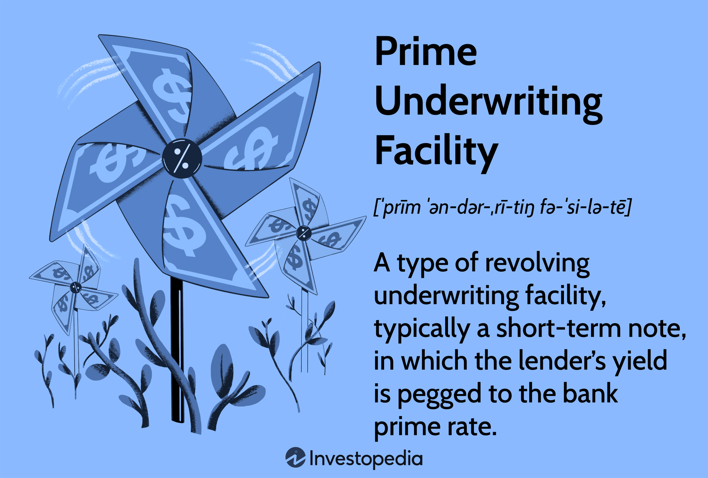

## Table of Contents

## What is a Prime Underwriting Facility?

A Prime Underwriting Facility is a type of agreement between a company and a bank or financial institution. It helps the company to get money quickly when it needs to. The company can borrow money up to a certain limit, and the bank promises to provide that money when asked. This is useful for companies that need cash fast for things like buying new equipment or expanding their business.

This facility is called "prime" because it often has favorable terms, like lower interest rates, compared to other types of loans. It's like having a special deal with the bank. Companies usually have to meet certain conditions to get and keep this facility, like maintaining good financial health. This makes it a reliable source of funds for the company when they need it most.

## How does a Prime Underwriting Facility differ from other underwriting facilities?

A Prime Underwriting Facility is different from other underwriting facilities mainly because of its favorable terms. It usually comes with lower interest rates and better conditions than regular underwriting facilities. This makes it a more attractive option for companies that can meet the stricter requirements to get it. Think of it like getting a VIP pass at a bank; you get better treatment and deals because you're a valued customer.

Other underwriting facilities might not offer these prime benefits. They could have higher interest rates or more stringent repayment terms. These facilities are more common and available to a broader range of companies, but they don't come with the same level of perks. So, while a Prime Underwriting Facility is harder to get, it's worth it for companies that qualify because it provides easier and cheaper access to funds when they need them.

## What are the key components of a Prime Underwriting Facility?

A Prime Underwriting Facility has a few main parts that make it work. The first part is the borrowing limit, which is the maximum amount of money a company can borrow from the bank. This limit is set based on how financially healthy the company is. The second part is the [interest rate](/wiki/interest-rate-trading-strategies), which is usually lower than other loans because it's a prime facility. This makes it cheaper for the company to borrow money. The third part is the agreement terms, which include how long the facility lasts and any conditions the company must meet to keep using it.

Another important part is the promise from the bank to provide the money when the company asks for it. This is called a commitment, and it's what makes the facility reliable. The company can count on getting the money quickly when they need it, which is really helpful for things like buying new equipment or expanding the business. The last part is the fees the company might have to pay to set up and keep the facility. These fees are usually small compared to the benefits of having quick access to money at a good rate.

## Who typically uses a Prime Underwriting Facility?

Companies that are in good financial shape usually use a Prime Underwriting Facility. These companies have strong finances and a good track record, so banks trust them more. They can get this special kind of loan because they meet the high standards set by the bank. It's like getting a gold star from the bank, which means they can borrow money more easily and at a lower cost.

These facilities are often used by big businesses that need a lot of money quickly for things like buying new equipment or expanding their operations. Because the terms are so good, it's a smart choice for companies that can qualify. It helps them grow and stay competitive without worrying too much about the cost of borrowing.

## What are the benefits of using a Prime Underwriting Facility for businesses?

Using a Prime Underwriting Facility can really help businesses. It gives them quick access to money when they need it. This is great for things like buying new machines or expanding their business. Since the interest rates are lower than other loans, it's cheaper for the company to borrow money. This means they can grow without spending too much on loan costs.

Another big benefit is that it's reliable. The bank promises to give the company the money when they ask for it. This makes planning easier because the company knows they can count on getting the funds they need. It's like having a safety net that helps the business stay strong and take advantage of new opportunities without worrying about money.

## What are the risks associated with a Prime Underwriting Facility?

Using a Prime Underwriting Facility can have some risks. One big risk is that the company has to keep up good financial health to keep using the facility. If the company starts to struggle financially, the bank might take away the facility or change the terms to be less favorable. This could make it harder for the company to borrow money when they need it, which could hurt their plans to grow or invest.

Another risk is that the company might become too dependent on the facility. If they get used to borrowing money easily, they might not be as careful with their spending. This could lead to taking on too much debt, which can be dangerous if the business hits a rough patch. It's important for the company to use the facility wisely and not rely on it too much.

## How is the eligibility for a Prime Underwriting Facility determined?

The eligibility for a Prime Underwriting Facility is decided by looking at how well a company is doing financially. Banks check things like the company's profits, how much debt they have, and if they have a good history of paying back loans on time. They also look at the company's plans for the future to see if they seem smart and likely to succeed. If a company looks strong and reliable, the bank feels more comfortable giving them a Prime Underwriting Facility.

Meeting the bank's standards is important because it shows the company can handle the responsibility of borrowing money at a lower interest rate. The bank wants to make sure the company won't have trouble paying back the loan. So, they set high standards to make sure only the best companies get this special deal. If a company can show they are in good financial shape and have a solid plan, they have a good chance of getting approved for a Prime Underwriting Facility.

## What documentation is required to apply for a Prime Underwriting Facility?

When a company wants to apply for a Prime Underwriting Facility, they need to gather some important documents. These include financial statements like balance sheets, income statements, and cash flow statements. These documents show the bank how much money the company makes, how much they owe, and how they manage their cash. The company also needs to provide a business plan that explains what they want to do with the money they borrow. This helps the bank understand the company's goals and if they have a good chance of succeeding.

In addition to financial documents and a business plan, the company might need to submit credit reports and references from other banks or business partners. These show the company's history of paying back loans and working with others. The bank might also ask for legal documents like the company's registration papers and any contracts they have with other businesses. All these documents help the bank decide if the company is a good fit for a Prime Underwriting Facility.

## How does the underwriting process work for a Prime Underwriting Facility?

The underwriting process for a Prime Underwriting Facility starts when a company applies to a bank. The company sends in all their financial documents, like balance sheets and income statements, along with a business plan. The bank looks at these documents to see if the company is in good financial shape. They check things like how much profit the company makes, how much debt they have, and if they pay back loans on time. The bank also reads the business plan to understand what the company wants to do with the borrowed money and if their plans make sense.

Once the bank has all the information, they do a deep analysis. They use this analysis to decide if the company meets their high standards for a Prime Underwriting Facility. If everything looks good, the bank might offer the company the facility with a borrowing limit and interest rate. But if the company doesn't meet the bank's standards, they might get turned down or offered a different kind of loan with less favorable terms. The whole process can take some time because the bank wants to make sure they are making a safe and smart decision.

## What are the current market trends affecting Prime Underwriting Facilities?

The current market trends affecting Prime Underwriting Facilities are influenced by economic conditions and interest rates. When the economy is doing well, banks are more likely to offer these facilities because they feel more confident about companies' ability to pay back loans. But if the economy is struggling, banks might be more cautious and stricter about who gets a Prime Underwriting Facility. Interest rates also play a big role. When rates are low, more companies want to borrow money because it's cheaper, which can make banks more selective about who gets the best deals.

Another trend is the increased use of technology in the underwriting process. Banks are using more data and computer programs to quickly analyze a company's financial health. This can make the process faster and more accurate, but it also means companies need to be ready with good digital records. Also, there's a growing focus on sustainability. Some banks are now looking at how environmentally friendly a company is when deciding on a Prime Underwriting Facility. Companies that are good for the environment might have a better chance of getting approved.

## How do regulatory changes impact the operation of Prime Underwriting Facilities?

Regulatory changes can have a big impact on how Prime Underwriting Facilities work. When rules change, banks might have to be more careful about who they give these facilities to. For example, if new rules make banks hold more money in reserve, they might lend less or only to companies that are very financially strong. This could mean fewer companies get approved for a Prime Underwriting Facility. Also, if the rules make it harder for banks to charge certain fees or interest rates, the terms of the facility might change, which could make it less attractive for both the bank and the company.

Another way regulatory changes affect Prime Underwriting Facilities is by changing how banks do their underwriting. New rules might require banks to collect more information about a company or to use different methods to check if a company is a good risk. This could make the process take longer and be more complicated. Companies might need to provide more documents or meet stricter standards to get approved. Overall, regulatory changes can make it harder for companies to get a Prime Underwriting Facility, but they also help make sure that the facilities are used safely and responsibly.

## What advanced strategies can be employed to optimize the use of a Prime Underwriting Facility?

One advanced strategy to optimize the use of a Prime Underwriting Facility is to carefully plan when and how to use the borrowed money. Companies should think about their cash flow and make sure they use the facility for projects that will bring in more money quickly. This way, they can pay back the loan faster and save on interest costs. It's also smart to keep some of the borrowing limit unused as a safety net for unexpected needs. By using the facility wisely, companies can grow their business without taking on too much debt.

Another strategy is to keep a close eye on the company's financial health and meet all the bank's requirements. This means regularly checking financial statements and making sure the company stays profitable and has a good credit score. If the company can show the bank that it's doing well, it might be able to negotiate better terms or a higher borrowing limit. Staying in good shape financially also helps the company keep the Prime Underwriting Facility, which is important for long-term growth and stability.

## References & Further Reading

[1]: Bergstra, J., Bardenet, R., Bengio, Y., & Kégl, B. (2011). ["Algorithms for Hyper-Parameter Optimization."](https://dl.acm.org/doi/10.5555/2986459.2986743) Advances in Neural Information Processing Systems 24.

[2]: ["Advances in Financial Machine Learning"](https://www.amazon.com/Advances-Financial-Machine-Learning-Marcos/dp/1119482089) by Marcos Lopez de Prado

[3]: ["Evidence-Based Technical Analysis: Applying the Scientific Method and Statistical Inference to Trading Signals"](https://www.amazon.com/Evidence-Based-Technical-Analysis-Scientific-Statistical/dp/0470008741) by David Aronson

[4]: ["Machine Learning for Algorithmic Trading"](https://github.com/stefan-jansen/machine-learning-for-trading) by Stefan Jansen

[5]: ["Quantitative Trading: How to Build Your Own Algorithmic Trading Business"](https://www.amazon.com/Quantitative-Trading-Build-Algorithmic-Business/dp/1119800064) by Ernest P. Chan