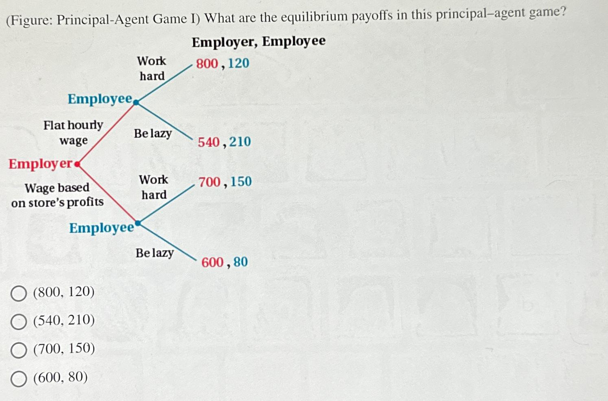

The principal-agent problem is a foundational concept in economics and finance that addresses the conflicts emerging when a principal delegates tasks to an agent. This issue becomes prominent when the agent's interests diverge from the principal's goals. In the context of financial markets, particularly in algorithmic trading, the principal-agent dynamic is highly pertinent. Here, traders function as agents who deploy sophisticated algorithms to manage the investments of their clients, the principals. These algorithms aim to maximize returns by executing trades based on predetermined criteria, yet they introduce a layer of complexity that can amplify the principal-agent problem.

Algorithmic trading revolutionizes traditional trading methods by utilizing complex mathematical models and automated trading systems to process large volumes of data swiftly. Such systems reduce human biases in trading decisions, rendering processes more efficient. However, the separation between the agent's control and principal's oversight can lead to conflicts, especially when agents leverage proprietary algorithms that lack transparency to the principals. These advanced algorithms, while reducing some traditional human errors, also manifest new challenges related to technological complexity and regulatory oversight. As a result, understanding and resolving these conflicts are crucial for ensuring that agents act in alignment with the principals' interests, thus enhancing governance and accountability.

This article investigates the implications of the principal-agent problem within algorithmic trading and its counterparts in public administration. It discusses strategic approaches aimed at aligning the interests of agents and principals, thereby addressing core issues in both financial markets and administration.

## Table of Contents

## Understanding the Principal-Agent Problem in Finance

The principal-agent problem in finance occurs when financial agents, such as traders or portfolio managers, are assigned the task of managing investments on behalf of investors but pursue strategies that do not entirely align with the investors' goals. This misalignment can be driven by the agents' pursuit of self-interest, such as maximizing their own compensation or minimizing risk exposure, rather than focusing on the optimal returns for the investors. The principal-agent problem can lead to inefficiencies in investment decisions, potential financial losses, and erosion of trust between the principal (investor) and the agent.

Algorithmic trading exacerbates these concerns by introducing complex algorithms that automate trading decisions, thereby removing certain human biases from the equation. However, this shift to automated systems raises new challenges related to technological complexity. Advanced algorithms can be difficult for principals to understand and monitor, leading to a lack of transparency. These systems may make investment decisions that are not immediately intuitive or consistent with the principal's risk preferences or financial goals.

Furthermore, regulatory scrutiny becomes an issue with algorithmic trading. Regulators are tasked with ensuring that financial markets operate fairly and efficiently, and the opaque nature of some algorithmic strategies can complicate this oversight. Firms must navigate a complex regulatory landscape designed to curb potential abuses such as market manipulation or insider trading, which can be more challenging with the rapid execution speeds and sophisticated strategies employed in algorithmic trading.

To counteract these challenges, establishing transparent systems and appropriate incentive structures is crucial. Transparency ensures that both principals and regulators can sufficiently oversee trading activities to safeguard the alignment of interests. One practical approach is the implementation of regular, comprehensive reporting where [agents](/wiki/agents) disclose their trading strategies and performance metrics in a manner that principals can easily interpret. This transparency empowers investors to make informed decisions and hold agents accountable.

Appropriate incentive structures are also vital for aligning agent actions with principal objectives. Performance-based compensation schemes can be designed to reward agents who meet pre-defined performance benchmarks that align with the investment goals of the principal. For instance, bonuses or commission structures can be linked to metrics such as risk-adjusted returns or long-term investment performance rather than short-term gains. These structures can deter agents from pursuing high-risk or unsuitable strategies that could compromise the investor's portfolio in favor of personal gain.

In summary, addressing the principal-agent problem in finance, particularly within the context of [algorithmic trading](/wiki/algorithmic-trading), involves balancing the efficiency and speed offered by advanced technology with the need for transparency, regulatory compliance, and properly aligned incentives. This balance is essential for safeguarding the interests of investors and maintaining the integrity of financial markets.

## Algorithmic Trading: Opportunities and Challenges

Algorithmic trading employs sophisticated mathematical models and advanced algorithms to automate the trading process, providing a systematic and efficient method for managing investments. These systems reduce reliance on human intuition and the potential for emotional decision-making errors. By implementing algorithmic strategies, traders can execute high-frequency trades with speed and precision, evaluating vast datasets instantaneously to capture favorable market conditions.

Despite these advantages, algorithmic trading presents significant challenges. One of the primary concerns is the complexity inherent in developing, maintaining, and overseeing these algorithms. As the algorithms grow more sophisticated, ensuring that they operate as intended requires rigorous testing and ongoing monitoring. The complexity [factor](/wiki/factor-investing) raises the likelihood of unintended consequences, such as algorithmic malfunctions that could lead to market disruptions.

Additionally, algorithmic trading increases the difficulty of aligning the interests of agents, responsible for creating and implementing algorithms, with those of their principals. This misalignment is exacerbated by the opacity often associated with sophisticated algorithms, making it challenging to discern the rationale behind trading decisions and complicating the assessment of agent performance.

An essential continuous process is the development and adaptation of algorithms to respond to ever-changing market conditions and regulatory environments. Financial markets are dynamic, with patterns and conditions that can shift rapidly due to geopolitical events, economic data releases, and changes in market sentiment. Therefore, algorithms must be agile, incorporating [machine learning](/wiki/machine-learning) and adaptive techniques to remain effective.

Moreover, the regulatory landscape surrounding algorithmic trading is continually evolving. Regulatory bodies are increasingly focusing on ensuring that algorithmic processes do not threaten market integrity or cause systemic risks. Compliance with these regulations entails not only developing algorithms that conform to current standards but also being prepared to adjust strategies and systems to align with new regulatory mandates.

Implementing systems that provide transparency in algorithmic operations is crucial to address potential conflicts. This transparency can be achieved through "explainable AI," which focuses on making algorithmic decision processes understandable to human overseers and ensuring they adhere to ethical and regulatory standards. This approach minimizes agency costs by allowing principals to better monitor and evaluate agent activities, ensuring that trading strategies align with their objectives.

In conclusion, while algorithmic trading offers numerous opportunities for enhancing efficiency and accuracy in trade execution, it also necessitates a robust framework of oversight, transparency, and regulation. Addressing these challenges is pivotal for harnessing the full potential of algorithmic trading while safeguarding the interests of all stakeholders involved.

## Solutions and Mitigating Strategies in Algo Trading

Strategies aimed at mitigating principal-agent conflicts in algorithmic trading focus on addressing transparency, accountability, and alignment of interests. One effective measure is the implementation of advanced monitoring systems that ensure robust oversight over algorithmic trading activities. These systems are designed to track the real-time performance of algorithms, providing crucial insights into their decision-making processes. By offering a transparent view of actions taken by algorithms, these monitoring solutions help principals verify that the agents' operations align with the broader investment goals.

Aligning agent interests with those of the principals is another critical strategy. This can be achieved through structured incentive systems, such as performance-based compensation models. These models are explicitly tailored to gauge the outcomes produced by algorithmic decisions, thus driving agents to act in ways that promote the principal's objectives. By linking compensation directly to performance metrics, agents are encouraged to optimize algorithms that deliver desirable results for investors.

Explainable AI (XAI) represents a significant advancement in ensuring algorithmic transparency and compliance with regulatory and ethical standards. XAI systems are designed to make algorithmic decisions understandable to human operators, which is vital for validating that these decisions adhere to defined investment strategies and regulatory requirements. The development and integration of XAI in trading algorithms enable stakeholders to scrutinize and interpret algorithmic actions, thus reinforcing trust and accountability in financial decision-making.

The continuous advancement and deployment of such technologies and incentive structures play a pivotal role in curbing principal-agent conflicts in algorithmic trading. By focusing on these strategic areas, financial markets can enhance their governance frameworks and ensure that algorithmic trading aligns with the overarching interests of principals.

## Lessons from Public Administration

Government structures have frequently encountered the principal-agent problem, wherein elected officials and bureaucrats act as agents whose decisions must align with the interests of the public, the principals. This alignment is crucial for ensuring that public resources are used efficiently and that government actions reflect the voters' intentions. However, the principal-agent problem in public administration often arises due to issues such as misaligned incentives and information asymmetries. These challenges can lead to inefficiencies and reduced service quality. 

For example, elected officials might prioritize policies that enhance their re-election prospects rather than focusing on the long-term public good. Similarly, bureaucrats might pursue departmental goals or personal career advancements, which may not always align with the public's interest. These misalignments between public objectives and agent actions can result in inefficient resource allocation, delays in service delivery, and ultimately, a loss of public trust.

To address these issues, several policies have been implemented focusing on transparency, public accountability, and performance-based incentives. Transparency measures, such as Freedom of Information Acts, enable citizens to scrutinize government actions more effectively, reducing the possibility of agency problems by making information asymmetries less pronounced. Public accountability is bolstered through mechanisms like audits, evaluations, and oversight committees, which hold government agents accountable for their actions and decisions.

Performance-based incentive systems in public administration, though more complex than in financial markets, seek to align bureaucratic objectives with public interests. These systems reward agents for outcomes that reflect efficient and effective service delivery. For instance, some systems tie compensation or career advancement to measurable performance metrics that are directly related to public service objectives.

In conclusion, addressing principal-agent problems in public administration involves tackling misaligned incentives and improving information flow between the government and its constituents. Policies that enhance transparency, enforce accountability, and introduce carefully structured incentive regimes are pivotal for aligning bureaucratic actions with the public interest. These efforts contribute to more efficient government operations and a more trustworthy public sector.

## Conclusion

Addressing principal-agent problems is essential to maintaining accountability, efficiency, and trust within algorithmic trading and public administration. These sectors are particularly susceptible to issues arising from misaligned incentives and information asymmetries. 

In algorithmic trading, leveraging technologies such as blockchain is critical for enhancing transparency. Blockchain's immutable ledger system provides a trustworthy and verifiable account of all transactions and actions undertaken by agents, thus enabling principals to monitor performance and compliance without extensive intermediaries. This transparent framework supports the evaluation of agents' decisions and ensures that actions align with the principals’ goals.

For both algorithmic trading and public administration, aligning incentives is another strategic approach. By designing performance-based compensation systems, agent behavior can be directly correlated with the outcomes desired by principals. This alignment of interests reduces the likelihood of opportunistic behavior by agents and encourages decision-making that supports overarching goals. In financial markets, this might involve bonuses tied to long-term investment performance rather than short-term gains.

Continuous innovation is indispensable in mitigating principal-agent issues. As markets and administrative environments evolve, so too must the technologies and strategies employed to manage them. New regulatory policies and technological advances, such as the development of 'explainable AI', offer fresh opportunities to create more transparent, accountable systems. Explainable AI is particularly important, as it enables stakeholders to understand and scrutinize the decision-making processes of complex algorithms, ensuring that they operate within established ethical and regulatory standards.

Ultimately, addressing the challenges of principal-agent conflicts requires a combination of innovative technological solutions and strategic policy adaptations. By continuously evolving these approaches, sectors can enhance their governance frameworks and build systems that are more resilient, efficient, and aligned with the goals of their stakeholders.

## References & Further Reading

Explore foundational texts on agency theory by Michael Jensen and William Meckling, who introduced the principal-agent problem and framed it within economic theory. Their seminal work, "Theory of the Firm: Managerial Behavior, Agency Costs, and Ownership Structure," published in 1976, laid the groundwork for understanding conflicts arising from differing interests between principals and agents. This text is essential for anyone studying these dynamics within both corporate governance and financial markets.

Successful case studies of principal-agent problem mitigation can be found across various sectors. In finance, the Royal Bank of Canada's implementation of rigorous performance-based compensation models effectively aligned trader incentives with organizational goals, minimizing conflicts. In public administration, New Zealand's public sector reforms in the 1980s provided an illustrative example. These reforms included establishing clear objectives and accountability measures for public servants, significantly improving efficiency and service delivery.

Continual advancements in algorithmic trading necessitate staying updated with the latest developments. The integration of machine learning and AI into trading algorithms demands a deep understanding of emerging technologies and their regulatory landscapes. Noteworthy is the European Union's Markets in Financial Instruments Directive II (MiFID II), which illustrates the regulatory push for transparency in algorithmic trading activities. The directive mandates comprehensive reporting and increased accountability which helps to address some of the principal-agent concerns.

For further reading, consider examining the mathematical foundations of algorithmic trading systems. Texts such as "Algorithmic Trading: Winning Strategies and Their Rationale" by Ernie Chan provide insights into the strategies and technologies employed in modern trading. Keeping abreast of these resources will support a nuanced understanding of how technologies can both exacerbate and mitigate principal-agent conflicts.

