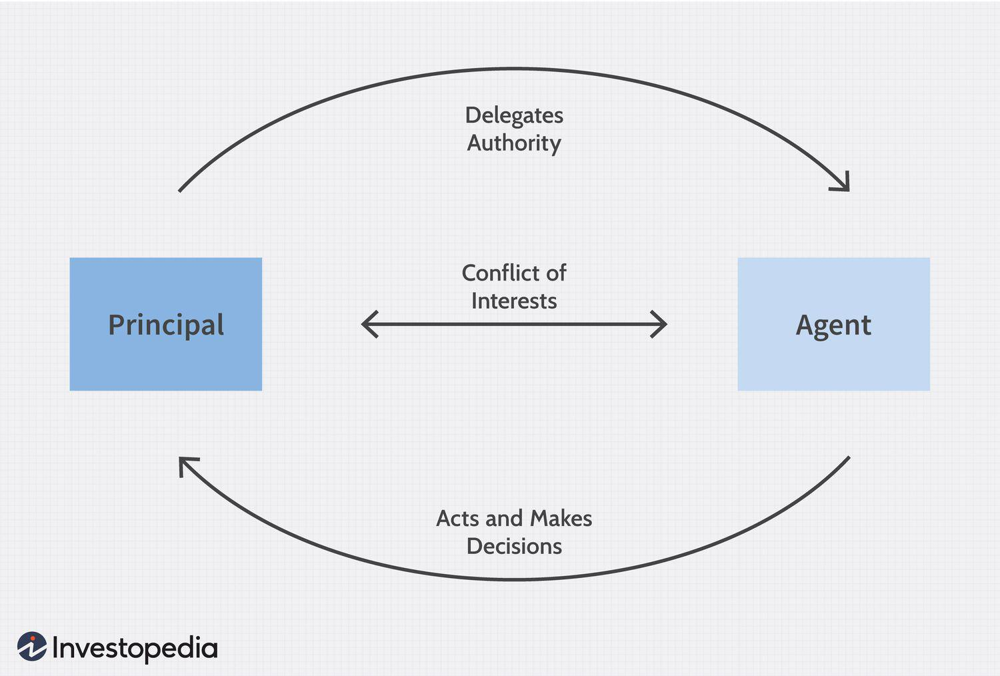

The principal-agent problem is a pivotal concept in economics and finance, encapsulating the conflicts that emerge when one party, the principal, delegates tasks to another party, the agent. This becomes particularly relevant in areas where the agents are expected to act on behalf of the principals, but might have different goals, insufficient information, or misaligned incentives. Within the context of government and public administration, elected officials and bureaucrats act as agents for the public—who are the principals. The challenge here arises when these officials prioritize personal or political objectives over public interests, thereby impacting policy-making processes and outcomes.

In financial markets, a similar dynamic is observed where traders, acting as agents for investors, might pursue strategies that do not align completely with the investors' goals, particularly in the context of algorithmic trading. Here, advanced algorithms take over decision-making processes, aiming to eliminate human biases and inefficiencies but also introducing new challenges related to regulation and technological complexity.

Such conflicts are often exacerbated by asymmetries in information. Principals typically lack complete information about the agent's actions or the environment in which they operate, making it difficult to ensure that actions are taken in their best interest. This necessitates the design of incentives and systems to better align these interests and improve cooperation.

Addressing these problems is crucial for enhancing governance and trading practices. Effective solutions require improving transparency, implementing robust monitoring systems, and creating policies that adjust incentives. Both public administration and financial sectors can benefit from cross-sector lessons, such as leveraging technology to promote greater accountability. Understanding how these interactions play out in different contexts provides the groundwork for developing innovative strategies to mitigate the negative impacts of principal-agent conflicts, ultimately leading to more transparent and accountable systems in both governance and financial markets.

## Table of Contents

## Understanding the Principal-Agent Problem in Government

The principal-agent problem in government occurs when there is a misalignment between the interests of those in power (agents) and the public they serve (principals). This misalignment often manifests when elected officials act on personal or party agendas rather than prioritizing the public good. The competition for re-election and the pursuit of personal gains can drive these officials to engage in actions that do not necessarily benefit their constituents, creating a conflict of interest. Such conflicts are particularly pronounced in democratic systems where the need to gather support from various interest groups can overpower considerations for the broader public welfare.

Furthermore, unelected officials or bureaucrats can also exhibit behaviors that do not align with public interest. These individuals may focus on budget maximization or securing their job positions, leading to inefficiencies in public service delivery. Bureaucratic motivations for expanding departmental budgets often stem from the notion of 'empire building,' where expanding the size and budget of an agency enhances the power and status of the bureaucrats within it. This drive for expansion can result in increased public expenditure without corresponding increases in public service value.

Lobbying represents a significant complicating [factor](/wiki/factor-investing) in the principal-agent problem within government structures. Interest groups exert influence on policymakers to achieve favorable legislation or regulatory outcomes. This lobbying can lead to regulatory capture, where regulations serve the interests of specific groups rather than the public. Consequently, regulations may become more reflective of the interests of businesses or other organized entities rather than those of citizens. This issue highlights the danger of asymmetrical information, where a small group possesses more information and influence compared to the general public.

The core issues of information asymmetry and misaligned incentives are ingrained in public sector governance. Elected officials and bureaucrats typically have more information about the operations and policies of government than the average citizen. This information disparity allows them to act in ways that may not be immediately visible or understandable to the public, complicating accountability. Measures for improving transparency, enhancing public oversight, and ensuring that incentives for public officials align better with those of the populace are essential for addressing the principal-agent problem in government.

## Implications of the Principal-Agent Problem in Public Administration

The principal-agent problem significantly impacts public administration by creating inefficiencies and fostering mistrust, ultimately affecting policy effectiveness and public welfare. When government officials prioritize agency expansion instead of public service, programs can become unnecessarily complex and costly. This complexity often stems from officials focusing on increasing their departmental budgets or authority rather than optimizing resource allocation to meet public needs efficiently.

One of the core issues contributing to ineffective governance is the lack of robust accountability mechanisms and the inherent complexity in monitoring the actions of civil servants. Without transparent and enforceable methods to hold public officials accountable, it becomes challenging to ensure that their actions align with the public interest. This gap often leads to decisions that favor political gain or bureaucratic convenience over effective policy implementation.

To address these challenges, reforms are required to increase transparency and accountability in public administration. Implementing performance-based incentives for public officials can help align their interests more closely with those of the citizens they serve. For instance, tying bonuses or career advancements to measurable outcomes that benefit the public can encourage officials to focus on delivering tangible improvements rather than merely expanding their influence or budget.

Regular audits and evaluations of government programs and departments can also serve as critical tools in mitigating the principal-agent problem. By systematically reviewing the performance and efficiency of public sector activities, auditors can identify discrepancies between intended policy goals and actual outcomes. This process provides a feedback loop that can guide necessary adjustments and improvements, thus promoting accountability.

Overall, addressing the principal-agent problem in public administration requires strategic interventions that realign incentives and enhance transparency. By doing so, governments can work towards delivering policies and services that genuinely reflect and serve the public's best interests, ensuring more efficient and effective governance.

## Algorithmic Trading: A Parallel in the Financial World

Algorithmic trading utilizes complex mathematical models and computational algorithms to execute orders in financial markets. This approach can reduce human decision-making biases and inefficiencies, offering a structured way to manage investments. However, the principal-agent problem remains a concern in this context, as misalignments might occur between the interests of traders ([agents](/wiki/agents)) utilizing these algorithms and their clients (principals).

In the financial industry, agents may pursue strategies that serve their purposes over their clients’, influencing compensation structures or reputation. Automated trading systems attempt to address this by enforcing rules designed to minimize conflicts. Nonetheless, these systems are not without their own challenges. The complexity of algorithms and an ever-evolving technological landscape mean that even well-designed algorithms require continuous oversight and updates to remain effective and compliant with market regulations.

Transparency is one of the key advantages of [algorithmic trading](/wiki/algorithmic-trading) systems, potentially reducing agency costs associated with monitoring agents. Predefined trading strategies offer a clear, traceable path of action, which can be audited to ensure alignment with clients' interests. However, this transparency must be coupled with robust safeguards to prevent misuse or unethical practices, such as insider trading or market manipulation.

These parallels between public administration and algorithmic trading provide insights into addressing the principal-agent problem. Both fields can benefit from employing technological solutions and policy innovations to better align incentives and enhance accountability. By understanding these frameworks, organizations can develop more efficient and secure systems that minimize principal-agent conflicts.

## Solutions and Mitigating Strategies

Addressing the principal-agent problem requires a multifaceted approach that focuses on restructuring incentives, bolstering transparency, and enhancing monitoring systems. These strategies are vital in mitigating the conflicts and inefficiencies inherent in principal-agent dynamics.

In government settings, robust regulation and oversight are foundational to ensuring that public officials conduct themselves in a manner that aligns with public interests. One of the primary strategies involves implementing performance-linked incentives that directly connect the achievements of public servants with the outcomes they produce for the community. This approach ensures that officials are motivated not just by personal gains but by the success of their efforts in serving the public.

Additionally, enforcing stringent disclosure norms is crucial to minimize information asymmetry. By making it mandatory for officials to disclose their interests, the potential for conflicts is reduced, providing a clearer picture of decision-making processes to stakeholders and the general public. Public accountability measures such as mandatory reporting and transparency in governmental operations further discourage any deviation from serving the public good.

In the financial sector, algorithmic trading systems can play a critical role in mitigating principal-agent problems. These systems, grounded in predefined rules and algorithms, strive to align the interests of traders and their clients. However, the complexity and speed of these systems necessitate robust safeguards to avert misuse and unintentional bias. Technologies like blockchain present opportunities to enhance transparency and traceability in transactions, allowing for an immutable audit trail that reduces the potential for agency-related conflicts.

Continuous innovation in information technology is paramount for effectively addressing these challenges. By pushing forward with policy-making that reflects current technological capabilities, both government and finance sectors can better align the interests of principals and agents. This dynamic environment encourages the adaptation of new solutions, such as [artificial intelligence](/wiki/ai-artificial-intelligence)-driven oversight tools, which can provide real-time analysis and feedback, thereby improving decision-making and reducing risks of misalignment.

Through these strategies, significant progress can be made in aligning the incentives of agents with those of their principals, thereby enhancing efficiency and trust. By committing to ongoing innovation and oversight, both public administrations and financial markets can work towards resolving the intricate challenges posed by principal-agent dynamics.

## Conclusion

The intersection of the principal-agent problem in public administration and algorithmic trading underscores the critical need to align incentives and address information asymmetry comprehensively. In both fields, the potential for misaligned objectives and hidden actions poses significant challenges to efficiency and trust. Public administration and financial markets can benefit from each other by integrating advanced technologies and adopting policy reforms that enhance transparency and accountability. 

In public administration, implementing technologies such as blockchain could improve the transparency of government transactions, reducing opportunities for corruption and enhancing public trust. In parallel, algorithmic trading could adopt regulatory frameworks seen in public governance to ensure that the actions of trading algorithms are transparent and comprehensible to clients and regulators. These technological solutions can provide mechanisms to track accountability and ensure that agent actions align with the interests of principals.

Addressing these principal-agent dynamics is crucial for developing efficient governance and financial systems that prioritize the public interest. Performance-linked incentives, stringent disclosure norms, and robust monitoring mechanisms could further reduce conflicts and align interests. Furthermore, integrating innovation from information technology can provide novel tools to address evolving principal-agent challenges.

Ultimately, future research and discussions should center on cross-disciplinary lessons and the development of innovative solutions to bridge the principal-agent gap. By focusing on these synergies, we can pave the way towards more trustworthy and efficient systems, enhancing the overall welfare of society and economic markets.

## References & Further Reading

[1]: Arrow, K. J. (1985). "The Economics of Agency," in John Pratt and Richard Zeckhauser (eds.), Principals and Agents: The Structure of Business. Harvard Business School Press.

[2]: Eisenhardt, K. M. (1989). "Agency Theory: An Assessment and Review," Academy of Management Review, 14(1), pp. 57-74.

[3]: Jensen, M. C., & Meckling, W. H. (1976). "Theory of the Firm: Managerial Behavior, Agency Costs and Ownership Structure," Journal of Financial Economics, 3(4), pp. 305-360.

[4]: Ross, S. A. (1973). "The Economic Theory of Agency: The Principal's Problem," American Economic Review, 63(2), pp. 134-139.

[5]: Shapiro, S. P. (2005). "Agency Theory," Annual Review of Sociology, 31, pp. 263-284.

[6]: ["Regulatory Capture: A Review"](https://www.jstor.org/stable/23606888) by Ernesto Dal Bó

[7]: ["Algorithmic Trading and the Role of Regulation"](https://blog.counselstack.com/algorithmic-trading-regulations-compliance-risk-controls/) by Andrew G. Haldane

[8]: Burkart, M., Gromb, D., & Panunzi, F. (1997). "Large Shareholders, Monitoring, and the Value of the Firm," Quarterly Journal of Economics, 112(3), pp. 693-728.

[9]: ["Principal-Agent Problems: The Literature"](https://www.perlego.com/knowledge/study-guides/what-is-the-principal-agent-problem/) by Bengt Holmström and John Roberts