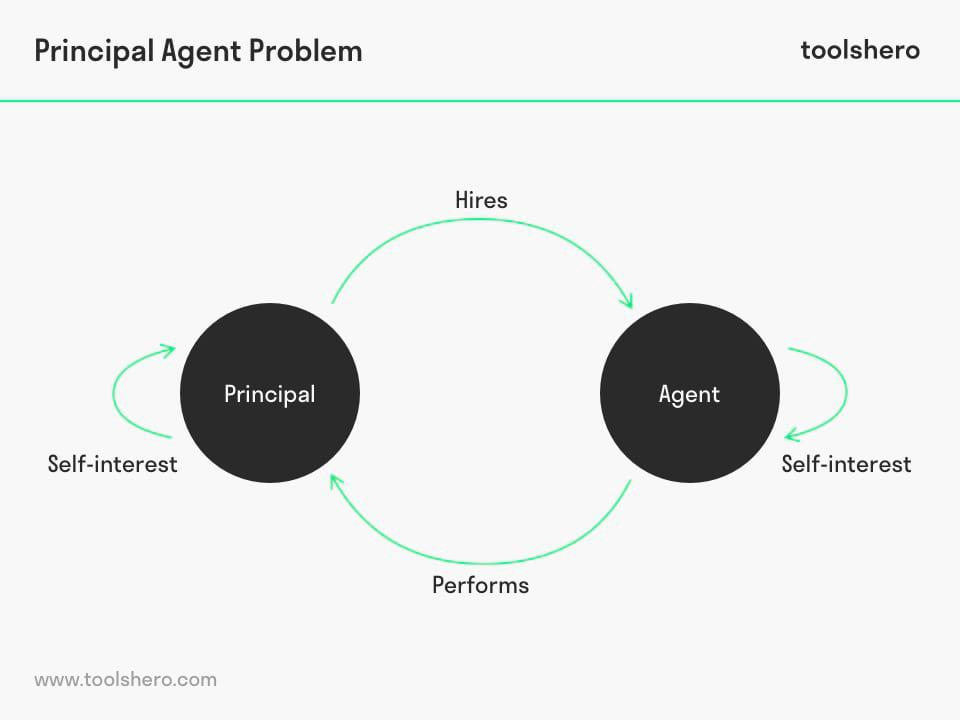

The principal-agent problem is a foundational concept in the fields of economics and finance, centered around the conflicts that arise when a principal delegates tasks to an agent. The principal, who holds the authority and ownership, seeks representation by an agent, who executes decisions on the principal's behalf. However, this dynamic inherently risks the agent prioritizing their own objectives over the principal's best interests due to differing goals or a lack of sufficient motivation. This misalignment can lead to inefficiencies and potential losses for the principal.

In the context of algorithmic trading, these challenges are markedly pronounced. Algorithmic trading involves the use of sophisticated computer algorithms to execute complex financial strategies automatically, typically on behalf of investors. Here, investors assume the principal role, while fund managers and the algorithms themselves function as agents. A primary concern is that agents might adopt trading strategies that are more beneficial to their short-term gains, potentially undermining the principal's long-term investment goals.

This article aims to analyze the manifestation of the principal-agent problem within algorithmic trading, delving into its wide-ranging implications and exploring strategies to mitigate resulting conflicts of interest. Furthermore, understanding the principal-agent problem extends beyond financial markets, drawing significant parallels with government operations. Within governmental frameworks, elected officials and bureaucrats operate as agents representing the public interest—the principal. Similar issues of information asymmetry and incentive misalignment can affect policy outcomes and governance efficiency.

By examining both algorithmic trading and governmental contexts, this analysis seeks to furnish a comprehensive understanding of the principal-agent problem, highlighting the importance of aligning incentives and enhancing transparency to mitigate these inherent conflicts. This dual examination not only aims to shed light on sector-specific dynamics but also to foster cross-disciplinary insights that can lead to innovative solutions promoting efficiency and trust.

## Table of Contents

## Understanding the Principal-Agent Problem in Algorithmic Trading

Algorithmic trading utilizes sophisticated algorithms to automate the process of executing trades, presenting a prominent arena for principal-agent conflicts. The principal, usually an investor, delegates the task of trade execution to agents, which may include fund managers or the algorithms themselves. These agents are expected to carry out trades that adhere to the investment objectives of the principal. However, a divergence often occurs when agents craft strategies that emphasize their immediate benefits, potentially at the expense of the principal's long-term interests.

This misalignment is exacerbated by information asymmetry, a fundamental issue where agents have access to more information than the principals. For instance, fund managers or algorithm developers might leverage their proprietary knowledge of market dynamics and trading algorithms to pursue high-frequency trading strategies or exploit short-term market inefficiencies. These actions can yield high returns for the agents but might also expose the principal to heightened risk levels that are not aligned with their long-term goals.

The issue of moral hazard further complicates this relationship. Agents are often insulated from the full consequences of their trading decisions, which might encourage riskier strategies. They may not bear the downside of their actions, leading to decisions that might not align with the risk appetite or financial objectives of the principal. The opaque nature of algorithmic strategies compounds the problem, as it can be challenging for principals to fully grasp the intricacies and potential risks of the trading algorithms deployed by their [agents](/wiki/agents).

Addressing these conflicts necessitates mechanisms that enhance transparency and accountability. By ensuring that principals have better insight into the decision-making processes and align incentives with desired outcomes, the negative impacts of information asymmetry and moral hazard can be mitigated.

## Implications of the Principal-Agent Problem in Algorithmic Trading

The principal-agent problem in [algorithmic trading](/wiki/algorithmic-trading) presents several critical implications, primarily affecting market stability and investor risk. One major consequence is increased market [volatility](/wiki/volatility-trading-strategies). Agents, who design and implement trading algorithms, may prioritize strategies that favor short-term gains through high-frequency trading or excessive leverage. These strategies can lead to dramatic price fluctuations, thereby increasing market volatility and posing risks not only to individual investors but also to the broader financial system.

Furthermore, the inherent complexity of trading algorithms exacerbates transparency issues. Principals, such as investors or clients, often struggle to fully comprehend the trading strategies employed by their agents. This lack of transparency can result in principals being unaware of the true risk and potential consequences associated with the algorithms, potentially leading to misinformed decision-making and financial losses.

Oversight is another significant challenge. Rapid technological advances in algorithmic trading demand constant updates and comprehensive audits to ensure that algorithms are functioning as intended and adhering to regulatory standards. This requires significant resources and expertise. Without effective oversight, there is a risk that agents may introduce new strategies that prioritize their own interests over the principal's, leading to ethical concerns and potential financial harm.

In summary, the principal-agent problem in algorithmic trading creates substantial challenges, including heightened market volatility, transparency issues, and oversight difficulties. Addressing these challenges necessitates a proactive approach by stakeholders to ensure alignment of incentives and promote transparency and accountability in the development and implementation of trading algorithms.

## Parallels with Principal-Agent Problem in Government

Similar principal-agent issues exist within government, where elected officials and bureaucrats act as agents for the public, serving as the principals. This problem arises when these officials employ actions based on personal or political agendas rather than focusing on the public interest. This divergence between the agent's actions and the principal's welfare is fundamentally similar to the issues observed in algorithmic trading, largely driven by information asymmetry and misaligned incentives.

In government, information asymmetry occurs because bureaucrats and officials often possess more knowledge about the intricate workings and specificities of policies than the general public. This disproportionate distribution of information can lead to decisions that prioritize the interests of the agent over the populace, resulting in decisions that reflect personal biases or secondary gains, rather than objective, welfare-maximizing strategies.

Misaligned incentives further compound the issue, as the motivations of government officials may not always align with public needs. Power dynamics, career ambitions, and electoral objectives frequently steer actions that may not coincide with public welfare. Thus, similar to algorithmic trading, where agents might exploit asymmetrical information and misaligned incentives for self-gain, government agents might act primarily to satisfy personal objectives or to maintain political capital.

Cross-sector lessons valuable for both fields include fostering transparency and enhancing accountability. Transparency in algorithmic processes and government decision-making can help align the incentives of agents with those of principals. Public access to information ensures that agents cannot easily exploit information gaps for personal benefit. Implementing stringent regulatory measures to mandate disclosures and regular audits can counteract attempts to diverge from principal interests both in trading and governance.

Addressing these dynamics through robust systems of checks and balances, transparency legislation, and performance-based incentives can help mitigate the principal-agent problems in both algorithmic trading and government. By ensuring that agents remain accountable and aligned with the interests of their principals, this approach can enhance governance and market efficiency, leading to optimized outcomes for society as a whole.

## Solutions and Mitigating Strategies

Aligning incentives through performance-linked compensation is an effective method to address principal-agent conflicts in both algorithmic trading and governmental contexts. By linking agents' financial outcomes to the performance of the investments they oversee or the policy outcomes they implement, principals can ensure that agents' interests are better aligned with their own. This strategy minimizes moral hazard by making agents more accountable for their actions and encouraging them to pursue strategies that yield long-term benefits rather than short-term personal gains.

Regulations that mandate transparency and detailed disclosures of trading algorithms and their risks play a crucial role in improving accountability. These regulatory measures compel agents to provide clear and comprehensible documentation about the functioning, objectives, and potential risks associated with their trading strategies. This transparency allows principals to make informed decisions and exercise oversight more effectively, thereby reducing the chances of conflicts arising from information asymmetries.

Regular audits and continuous monitoring systems are instrumental in tracking performance and ensuring compliance with established standards. By subjecting agents' activities to systematic scrutiny, principals can detect and address deviations from agreed-upon objectives or unethical behavior in a timely manner. Audits, conducted by independent parties, can serve as an essential check on the agents' adherence to their responsibilities, further reducing risks associated with agency problems.

Innovative technological solutions like [artificial intelligence](/wiki/ai-artificial-intelligence) (AI) and blockchain offer new pathways for enhancing transparency and accountability. AI can be employed to develop predictive models and analytical tools that continuously assess the performance and strategy alignment of agents. Additionally, blockchain technology can facilitate secure and immutable records of transactions, enabling transparent and tamper-proof documentation of trading activities and decisions. These advancements offer promising avenues for mitigating issues like moral hazard and adverse selection by fostering a more transparent and accountable environment.

Overall, addressing the principal-agent problem requires a multifaceted approach that combines incentive alignment, regulatory oversight, regular auditing, and technological innovation. By implementing these strategies, stakeholders in both algorithmic trading and government can effectively bridge the principal-agent gap, promoting trust and efficiency across both sectors.

## Conclusion

The principal-agent problem presents considerable challenges in both algorithmic trading and public governance, affecting market stability and policy effectiveness. This issue arises when the interests of the agent, who is tasked with acting on behalf of the principal, do not align with those of the principal, leading to potential conflicts and inefficiencies.

In algorithmic trading, agents, including fund managers and algorithms, may pursue strategies that maximize their benefits at the expense of investors' long-term interests. This misalignment can result in increased market volatility and unforeseen risks due to the preferential use of high-turnover or leveraged strategies. Similarly, in public governance, elected officials or bureaucrats may act based on personal or political agendas rather than prioritizing the public good, leading to ineffective policy outcomes and diminished trust in governmental institutions.

Addressing these challenges necessitates a multi-faceted approach centered on leveraging technology, realigning incentives, and establishing robust regulatory frameworks. Technological advancements, such as artificial intelligence and blockchain, offer opportunities to enhance transparency and accountability, reducing instances of moral hazard and adverse selection. Performance-linked compensation can be an effective strategy for aligning incentives, ensuring that agents' actions better reflect principals' interests.

Moreover, regulatory measures mandating transparency, comprehensive disclosures, and regular audits are essential to maintaining compliance and ethical behavior in both domains. By fostering cross-disciplinary insights, regulatory bodies and stakeholders can bridge the principal-agent gap, promoting efficiency and trust across financial markets and governance structures.

In conclusion, a concerted effort involving technological, behavioral, and regulatory interventions is required to mitigate the principal-agent problem. Such an approach not only enhances trust and stability in economic and governmental systems but also lays the foundation for sustainable growth and improved policy outcomes.

## References & Further Reading

Arrow, K. J. (1985). 'The Economics of Agency,' in John Pratt and Richard Zeckhauser (eds.), Principals and Agents: The Structure of Business. Harvard Business School Press. Arrow's work offers an insightful analysis of agency theory by examining the economic relationships between principals and agents, elaborating on the risks and incentives that shape their interactions. 

Eisenhardt, K. M. (1989). 'Agency Theory: An Assessment and Review,' Academy of Management Review, 14(1), pp. 57-74. This paper provides a comprehensive assessment of agency theory, reviewing its key contributions and identifying areas for future research. Eisenhardt discusses various mechanisms to align agent interests with those of the principal and considers contexts where agency theory is most applicable.

Jensen, M. C., & Meckling, W. H. (1976). 'Theory of the Firm: Managerial Behavior, Agency Costs and Ownership Structure,' Journal of Financial Economics, 3(4), pp. 305-360. Jensen and Meckling introduce a foundational model of agency costs, framing them within the context of ownership and control in firms. Their analysis explains how conflicts of interest between managers (agents) and shareholders (principals) influence corporate governance and financial structures.

Ross, S. A. (1973). 'The Economic Theory of Agency: The Principal's Problem,' American Economic Review, 63(2), pp. 134-139. Ross's early work on agency theory highlights the core problem of aligning incentives between principals and agents, presenting a theoretical framework that addresses issues of moral hazard and information asymmetry.

These references collectively provide a robust foundation for understanding the principal-agent problem, beneficial for exploring its nuances in contexts like algorithmic trading and governance.

