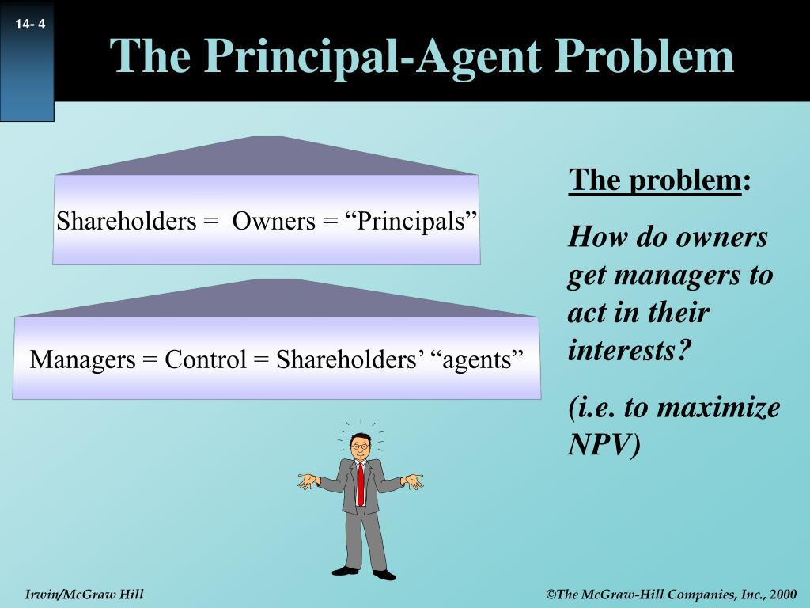

Algorithmic trading, often referred to as 'Algo Trading', utilizes computer algorithms to automate trading decisions in financial markets. These algorithms are designed to analyze vast amounts of data and execute trades based on specific criteria without the need for human intervention. By removing emotions and human errors from the trading process, algo trading aims to increase efficiency and accuracy in financial transactions.

However, this technological advancement introduces the principal-agent problem, a fundamental issue that arises when the interests of a principal, such as an investor, may not align with those of their agent, such as a fund manager or in this context, the trading algorithm itself. In traditional scenarios, a fund manager might make decisions that benefit their interests rather than those of the investor they represent. Similarly, in algorithmic trading, the autonomy of trading algorithms can complicate the alignment of interests between the principal and the automated agent. Algorithms may be programmed with biases or objectives that do not fully coincide with those of the investor, potentially resulting in undesirable outcomes.



Understanding these issues is crucial for investors and developers who design and deploy trading algorithms. It is essential to ensure that these algorithms operate transparently and are regularly audited to align with the principal's overarching goals, minimizing the risk of misaligned incentives. As the use of algorithmic trading continues to grow, addressing the principal-agent problem becomes increasingly important to maintain the integrity and effectiveness of financial markets.

## Table of Contents

## Understanding Principal-Agent Problems

The principal-agent problem is a well-documented issue in economics and organizational theory, arising when a designated agent is empowered to make decisions on behalf of a principal. This arrangement often leads to an inherent conflict of interest, primarily because the agent's personal incentives may not be perfectly aligned with the principal's objectives. The fundamental challenge is that the principal typically lacks perfect information about the agent's actions or intentions, making it difficult to ensure that the agent acts in the principal's best interest.

The misalignment between the principal's and the agent's goals can result in inefficiencies and potential financial losses. The agent might prioritize actions or strategies that maximize their utility rather than the principal's welfare. This could manifest in various ways, such as exerting minimal effort, misreporting information, or engaging in overly risky ventures. In the context of trading, for instance, traders or fund managers often act as agents for investors who are the principals. Here, fund managers may be incentivized to pursue high-risk investments to gain higher returns, from which they might benefit directly through bonuses or reputation enhancement. However, these actions could contradict the risk tolerance or long-term strategy preferred by the investors.

The principal-agent problem is quantitatively analyzed in various models. For example, under certain assumptions, the agent's decision-making can be described by utility functions. Let $U_A$ and $U_P$ represent the utility functions of the agent and principal, respectively. The agent's objective could then be modeled as maximizing:

$$
U_A = f(\text{effort}, \text{reward}) - \text{cost of effort}
$$

Conversely, the principal aims to maximize:

$$
U_P = g(\text{outcome})
$$

where $f$ and $g$ are functions signifying the interdependence between efforts, rewards, and outcomes. The principal-agent problem arises when these utility functions are not aligned, often necessitating mechanisms such as performance-based contracts, monitoring, and various incentive schemes to mitigate the disparities.

In trading, this problem is particularly acute due to the complexity and opacity of financial markets. Therefore, robust regulatory frameworks and strong corporate governance practices are employed to align the interests of [agents](/wiki/agents) with those of principals. These measures aim to reduce information asymmetries, manage incentives appropriately, and ensure that the agents' actions correspond to the principals' expectations and risk profiles.

## Principal-Agent Problems in Trading

In traditional trading, the principal-agent problem often arises when fund managers, acting as agents for investors (principals), make decisions that may not fully align with the investors' best interests. This issue is primarily driven by the misalignment of incentives; fund managers might be incentivized to pursue strategies that yield high returns, as they often benefit from performance-based compensation. However, they may not bear the same level of downside risk that the investors do. This situation can lead to fund managers taking excessive risks, such as leveraging portfolios heavily or investing in volatile assets, to maximize short-term gains.

The misalignment of incentives between principals and agents can lead to suboptimal decision-making. For example, fund managers might opt for high-return investments that [carry](/wiki/carry-trading) a significant risk of large losses, potentially endangering the principal's capital. This behavior illustrates a fundamental aspect of the principal-agent problem, where the agent's actions are governed by self-interest rather than the principal's welfare.

Various strategies have been implemented to mitigate the risks associated with the principal-agent problem in trading. Regulations play a significant role by imposing strict requirements on disclosure and trading practices, thereby enhancing transparency and accountability. Regulatory bodies may require fund managers to report performance and risk metrics regularly, reducing the likelihood of excessive risk-taking. Additionally, monitoring mechanisms like third-party audits and compliance checks are integral in ensuring that fund managers adhere to rules that align their actions with the objectives of the investors.

Despite these measures, completely eliminating the principal-agent problem remains a challenge. There will always be an element of trust involved when a principal delegates trading decisions to an agent. To further mitigate these risks, it is essential to design compensation and incentive structures that align more closely with the long-term interests of both the fund managers and the investors, discouraging purely profit-driven behavior disconnected from the principals' goals.

## Impact of Algo Trading on the Principal-Agent Problem

Algorithmic trading introduces new dimensions to the principal-agent problem due to its reliance on automated systems executing trading decisions based on predefined algorithms. These computer-driven processes can operate at speeds and complexities beyond human capabilities, but they require stringent oversight to ensure alignment with the principal's interests.

Firstly, while algorithms can mitigate certain human biases such as emotional decision-making, they are not immune to issues. The absence of emotional bias does not equate to the absence of error or misalignment. Algorithms are designed by humans, and any biases or errors embedded within the code can lead to decisions that deviate from the principal's objectives. For instance, an algorithm programmed to maximize short-term profits might inadvertently increase risk exposure, potentially undermining the investor's long-term financial goals.

Additionally, technical challenges are inherent in algo trading. Algorithms need to be monitored not only for performance relative to market conditions but also for adherence to the principal's strategic objectives. Real-time data feeds, unpredictable market fluctuations, and the possibility of erroneous or manipulated data inputs all necessitate robust monitoring frameworks. This surveillance is crucial to promptly identify misalignments between the algorithm's actions and the principal's interests.

A significant concern is the potential for algorithms to prioritize short-term gains over long-term objectives. Financial markets can be prone to [volatility](/wiki/volatility-trading-strategies) and short-term anomalies, and algorithms that react to immediate changes without considering the overarching investment strategy risk making suboptimal decisions. Ensuring that algorithms are capable of balancing these short-term fluctuations with long-term goals is critical for maintaining financial stability and aligning with the principal's intentions.

To illustrate this, consider a hypothetical Python function designed to evaluate the alignment of an algorithm's decisions with a principal's long-term goals:

```python
def evaluate_alignment(algo_decisions, long_term_goals):
    short_term_gains = sum([decision['profit'] for decision in algo_decisions if decision['term'] == 'short'])
    long_term_gains = sum([decision['profit'] for decision in algo_decisions if decision['term'] == 'long'])

    if long_term_gains >= long_term_goals:
        return "Aligned with principal's goals"
    else:
        if short_term_gains > long_term_gains:
            return "Potential misalignment: Short-term gains prioritize"
        else:
            return "Check algorithm parameters for better alignment"

# Example usage
algo_decisions = [{'profit': 1000, 'term': 'short'}, {'profit': 1500, 'term': 'long'}]
long_term_goals = 1200

print(evaluate_alignment(algo_decisions, long_term_goals))
```

In this example, if the long-term gains meet or exceed the specified goals, the algorithm is aligned with the principal's intentions. However, if short-term gains outweigh long-term benefits, adjustments may be necessary to realign the algorithm with desired outcomes.

Therefore, while [algorithmic trading](/wiki/algorithmic-trading) provides numerous advantages, its implications for the principal-agent problem necessitate ongoing vigilance, transparency, and adaptive strategy to protect the interests of the principal in both short and long-term scenarios.

## Mitigating the Principal-Agent Problem in Algo Trading

To address the principal-agent problem in algorithmic trading, it is essential to enhance transparency and alignment between the interests of investors and the automated mechanisms executing trades. This can be achieved through several key strategies.

First, the transparency of trading algorithms is fundamental. Algorithms should be designed with clear, comprehensible rules that are aligned with the investment objectives of the client. By ensuring the algorithmic logic is open and understandable, both developers and investors can ensure that trading activities are consistent with the principal's goals, thus reducing the potential for agency conflicts.

Monitoring through regular audits is also crucial. Conducting periodic reviews of algorithmic performance can help identify any discrepancies or anomalies that could indicate the algorithm is deviating from its intended purpose. Through robust audit processes, any misalignment with the principal's objectives can be quickly detected and corrected, maintaining the integrity and trust in algorithmic systems.

In addition, aligning incentive structures with the principal's long-term objectives is vital. Incentives for agents, including developers and managers overseeing the algorithms, should be structured to promote behaviors that support sustainable, long-term gains rather than risky, short-term strategies. By aligning financial rewards and performance metrics with the goals of the principal, agencies ensure that strategies employed by agents do not undermine the investment horizon or risk tolerance intended by the principal.

Incorporating these practices, such as transparency, regular audits, and aligned incentives, can significantly mitigate the principal-agent problem within algorithmic trading systems, thus fostering an environment where both the principals and agents can achieve their financial objectives in a more harmonious and efficacious manner.

## Conclusion

The principal-agent problem presents distinct challenges within algorithmic trading, emphasizing the need for enhanced transparency and oversight mechanisms. Ensuring that the objectives of agents align with those of principals is critical to maintaining equitable and efficient market practices. The automated nature of trading algorithms requires meticulous monitoring to verify that they adhere to the long-term goals of investors, rather than focusing on short-term gains that could lead to undue risk exposure.

Efficient market operation hinges upon aligning the incentives of various stakeholders, a task that is particularly challenging with algorithmic traders who may programmatically exploit market inefficiencies. Regular audits and a robust regulatory framework are essential to ensure algorithms function in accord with investor expectations, minimizing potential conflicts of interest intrinsic to the principal-agent dynamic.

Technological advancements offer promising avenues to address these challenges. The integration of [machine learning](/wiki/machine-learning) and [artificial intelligence](/wiki/ai-artificial-intelligence) can enhance the adaptability and sophistication of trading algorithms, allowing for real-time adjustments that align with principal objectives. Additionally, innovations in blockchain technology represent potential solutions for achieving greater transparency in trading practices, fostering trust between principals and their agents.

Moreover, evolving regulatory frameworks are crucial to setting boundaries and establishing accountability within algorithmic trading practices. Such frameworks should aim to provide clear guidelines that define acceptable risk levels and mandate disclosures that promote informed decision-making by investors.

In conclusion, navigating the principal-agent problem in algorithmic trading demands concerted efforts to harmonize the interests of investors and their automated agents, supported by technological innovation and informed regulatory oversight. These endeavors will be pivotal in refining the decision-making process, optimizing trading operations, and safeguarding the integrity of financial markets.

## References & Further Reading

[1]: Jensen, M. C., & Meckling, W. H. (1976). ["Theory of the firm: Managerial behavior, agency costs and ownership structure."](https://www.sciencedirect.com/science/article/pii/0304405X7690026X) Journal of Financial Economics, 3(4), 305-360.

[2]: Grossman, S. J., & Hart, O. D. (1983). ["An Analysis of the Principal-Agent Problem."](https://www.jstor.org/stable/1912246) Econometrica, 51(1), 7-45.

[3]: Chung, H., & Chuwonganant, C. (2012). ["Regulation NMS and market quality."](https://onlinelibrary.wiley.com/doi/pdf/10.1111/j.1755-053X.2012.01184.x) Financial Management, 41(2), 285-317.

[4]: Kim, R., & Wallis, N. C. (2019). ["Algorithmic Trading: Balancing Regulation and Innovation."](https://pmc.ncbi.nlm.nih.gov/articles/PMC8231820/) Journal of International Trade and Technology, 17(1), 43-64.

[5]: Lopez de Prado, M. (2018). ["Advances in Financial Machine Learning."](https://www.amazon.com/Advances-Financial-Machine-Learning-Marcos/dp/1119482089) Wiley.

[6]: O'Hara, M. (2015). ["High-frequency trading and its impact on markets."](https://www.tandfonline.com/doi/abs/10.2469/faj.v70.n3.6) Annual Review of Financial Economics, 7, 133-155.

[7]: Jansen, S. (2020). ["Machine Learning for Algorithmic Trading."](https://github.com/stefan-jansen/machine-learning-for-trading) Packt Publishing.