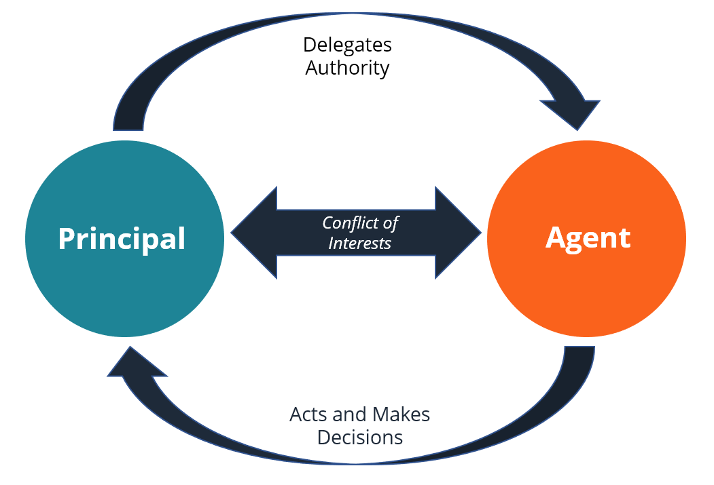

The principal-agent problem is a fundamental concept in economics and finance, capturing the potential conflicts that arise when a principal delegates work to an agent. This phenomenon is particularly relevant in algorithmic trading, where traders, acting as agents, execute trades on behalf of investors, the principals. The inherent conflict of interest in this dynamic arises when the goals of the traders differ from those of the investors. As a result, there is a risk that the traders' actions may not align perfectly with the investors' objectives.

Algorithmic trading leverages advanced computational systems to make real-time trading decisions, significantly reducing the potential for human error and emotional biases. However, despite these technological advantages, algorithmic trading presents unique challenges relating to transparency and accountability. The opacity of complex trading algorithms can exacerbate information asymmetry between principals and agents, making it difficult for principals to ensure that agents act in their best interests.

This article examines the manifestation of the principal-agent problem within the context of algorithmic trading and outlines strategies to mitigate its negative effects. By exploring the intricacies of this issue, stakeholders in financial markets can develop more effective systems and protocols that harmonize the objectives of agents with those of principals. Such alignment is crucial for enhancing market efficiency and building trust among participants. Through a thorough understanding of these challenges, stakeholders can implement measures that improve the overall functioning of financial markets.

## Table of Contents

## Understanding the Principal-Agent Problem in Algorithmic Trading

In algorithmic trading, the principal-agent problem primarily arises due to discrepancies between the interests of investors (the principals) and traders or the algorithms (the agents) that act on their behalf. This misalignment can be intensified as algorithmic systems often increase information asymmetry, whereby principals may lack sufficient insight into the strategies and decisions executed by their agents. 

Information asymmetry is a core element of the principal-agent problem. In algorithmic trading, this occurs when the trading algorithms, created and managed by the agents, operate with high efficiency but opaque decision-making processes, leaving investors unaware of specific strategies and operations. This lack of transparency can lead to a misalignment of expectations and outcomes.

Two critical concerns within this framework are moral hazard and adverse selection. Moral hazard arises when agents engage in trading strategies that [carry](/wiki/carry-trading) a higher risk than the principals are aware of or willing to accept, potentially leading to outcomes that do not align with the long-term interests of investors. Adverse selection, on the other hand, involves the possibility of agents choosing potentially profitable, yet risk-heavy, trades that might not suit the investment goals of the principals. 

The complexity inherent in [algorithmic trading](/wiki/algorithmic-trading) systems necessitates robust oversight to align actions with investor interests effectively. Effective oversight mechanisms need to ensure that the algorithms operate within pre-defined risk parameters and comply with investor guidelines. This can involve detailed evaluations of the algorithm's decision-making processes and their performance metrics. Establishing clear communication channels and transparent reporting systems can further ameliorate the principal-agent problem by providing principals with better visibility over the activities and decisions of their [agents](/wiki/agents). 

Given these challenges, it is vital to explore different oversight tools and mechanisms to ensure that the actions executed by trading algorithms dovetail with the goals and risk appetites of investors. Enhancements in oversight can help mitigate the inherent principal-agent conflicts in algorithmic trading and foster a more trustworthy and efficient financial market.

## Implications of Algorithmic Trading in Financial Markets

Algorithmic trading has become a pivotal component of modern financial markets, affecting market stability both positively and negatively. One notable incident illustrating its potential for disruption is the 'Flash Crash' of May 6, 2010, during which the U.S. stock market saw a dramatic drop followed by a swift recovery within minutes. This event highlighted the vulnerability of financial systems to rapid, automated trading and the cascading effects it can have. The speed and scale at which algorithmic trading operates can exacerbate market [volatility](/wiki/volatility-trading-strategies), leading to significant market disruptions if not properly managed.

Despite these risks, algorithmic trading systems also provide substantial benefits, such as increased trading speed and the minimization of certain human errors. The precision and efficiency of algorithms enable them to execute and manage trades far more quickly than human traders, leveraging microsecond advantages in executing orders that can lead to better pricing and enhanced [liquidity](/wiki/liquidity-risk-premium) in markets.

However, the complexity of these systems presents challenges for regulatory oversight. Regulators struggle to keep pace with the rapid evolution of trading algorithms, often finding it difficult to delineate clear guidelines that ensure market integrity without stifling technological innovation. Effective regulation requires a profound understanding of both the technological and financial nuances of algorithmic strategies to prevent misuse and ensure transparency.

Transparency in algorithmic trading is critical for reducing agency costs and ensuring compliance with established risk parameters set by principals. This transparency helps in building trust between investors and traders by ensuring that decisions made by automated systems align with the investors’ objectives.

High-frequency trading ([HFT](/wiki/high-frequency-trading-strategies)), a subset of algorithmic trading, further complicates market dynamics, as it involves executing a high [volume](/wiki/volume-trading-strategy) of transactions in extremely short timeframes. While HFT can enhance market liquidity and improve the efficiency of price discovery, it can also lead to market destabilization and unfair trading advantages. The ultra-fast pace of HFT can disadvantage slower market participants, potentially leading to manipulative strategies that undermine fair market practices.

In conclusion, while algorithmic trading can enhance market efficiency and execution speed, it poses distinct challenges that require vigilant oversight, robust risk management, and strategic regulatory frameworks to ensure market stability and integrity.

## Mitigating Principal-Agent Conflicts in Algorithmic Trading

Effective mitigation of principal-agent conflicts in algorithmic trading involves a multifaceted approach that integrates performance incentives, monitoring systems, innovative technologies, and adaptive regulatory frameworks.

Establishing clear performance-based incentives is paramount in aligning the interests of traders, who act as agents, with their clients, the principals. By designing compensation structures that reward traders for achieving specific goals that reflect the clients' risk preferences and investment objectives, misalignment in strategies can be minimized. For instance, aligning bonuses with long-term performance rather than short-term gains can encourage traders to act in the best interests of the investors.

Monitoring and audit systems play a crucial role in ensuring algorithmic performance aligns with the intended strategies and regulatory standards. Robust systems capable of real-time tracking of trading activities help in promptly identifying and addressing any disparities or unethical practices. This is vital to maintaining compliance with both internal guidelines and external regulations. These systems can be developed using advanced data analytics to discern patterns indicative of diverging from set objectives.

Blockchain technology offers a promising solution for enhancing transparency and accountability. Its decentralized nature allows for the creation of a verifiable ledger where every transaction executed by an algorithm is recorded immutably. This ledger can provide both clients and regulators with access to transaction histories, thereby reducing information asymmetry and potential conflicts. For example, by using smart contracts on a blockchain, certain conditions can automatically trigger audits or reports, providing an additional layer of oversight.

Regulatory frameworks must continually evolve to address the unique challenges presented by algorithmic trading. Regulators need to develop comprehensive rules that account for the speed and complexity of algorithmic systems while ensuring that market integrity is not compromised. This includes setting guidelines for the ethical deployment of algorithms and establishing accountability standards for agents. Effective regulation balances innovation with protection, fostering an environment where both market growth and investor interests are safeguarded.

In conclusion, mitigating the principal-agent problem in algorithmic trading requires an integrated strategy that combines incentive alignment, rigorous monitoring, technological innovation, and responsive regulation. By adopting these practices, financial markets can enhance trust and efficiency, ensuring that algorithmic trading contributes positively to market dynamics.

## Conclusion

The principal-agent problem in algorithmic trading underscores the critical need for well-aligned incentives, transparency, and robust monitoring systems. This persistent issue arises from the inherent conflict of interests between principals, typically investors, and agents, such as traders or algorithms. To address this problem, it is vital to align the incentives of agents with the long-term goals of principals. Performance-based incentives, designed to reward agents for achieving outcomes that benefit investors, can be instrumental in minimizing conflicts.

Algorithmic trading is renowned for its ability to enhance efficiency and execution speed, leveraging advanced computational methods to capitalize on market opportunities quickly. However, this sophistication introduces unique challenges, such as the potential for moral hazard, adverse selection, and information asymmetry. These challenges necessitate careful management to ensure that algorithmic systems operate in ways that truly reflect the interests of their investors.

Incorporating cross-disciplinary insights from governance can provide financial markets with effective strategies for managing principal-agent issues. Governance principles, such as accountability, transparency, and ethical standards, can be applied to ensure that trading systems are guided by practices that align with investor interests. For example, employing blockchain technology could offer a transparent and immutable ledger of trades, reducing the likelihood of unethical practices.

There is a continuing need for research to develop innovative solutions aimed at bridging the principal-agent gap. Such research could focus on emerging technologies, new regulatory frameworks, and heightened oversight mechanisms. These efforts are essential for fostering a trading environment that is both trustworthy and efficient, ultimately contributing to the integrity and stability of financial markets. By continually exploring and implementing forward-thinking strategies, stakeholders can ensure that algorithmic trading remains a powerful and advantageous tool for investors.

## References & Further Reading

Arrow, K. J. The Economics of Agency examines the relationship between principals and agents, focusing on the economic dynamics and challenges that arise. Arrow's work provides a foundational understanding of how agency problems can occur and offers insights into addressing these issues from a theoretical perspective.

Eisenhardt, K. M.'s Agency Theory: An Assessment and Review offers a comprehensive overview of agency theory, evaluating its strengths and weaknesses. Eisenhardt discusses how the theory applies in various contexts, making it a valuable resource for understanding the dynamics of principal-agent relationships, particularly in complex environments like financial markets.

Jensen, M. C., & Meckling, W. H.'s Theory of the Firm: Managerial Behavior, Agency Costs and Ownership Structure explores the relationship between managerial decisions and the costs associated with agency problems. This seminal work analyzes how ownership structures impact agency costs, providing a framework for assessing the economic implications of these relationships.

Ross, S. A. The Economic Theory of Agency: The Principal's Problem addresses the core issues of agency theory, focusing on how principals can design contracts to motivate agents to act in the principal's best interest. Ross's work is essential for understanding the economic strategies needed to align the objectives of different parties in a contractual relationship.

Various online resources on algorithmic trading and regulatory frameworks offer supplementary information on current practices, technological advancements, and evolving regulations in algorithmic trading. These resources are crucial for keeping abreast of the latest developments in the industry and understanding how the principal-agent problem is managed in contemporary financial markets.

