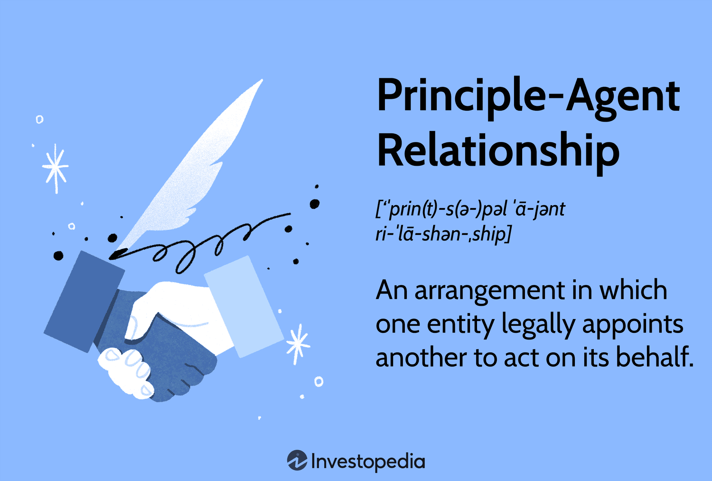

Understanding the complexity of principal-agent relationships is crucial in finance and economics, especially in the context of modern organizational structures. These relationships are the backbone of many economic interactions, where one party (the principal) delegates work to another party (the agent), who performs that work. However, this delegation often introduces challenges, primarily due to conflicts of interest and information asymmetries. These issues, embedded in agency theory, critically shape financial operations and necessitate strategic responses to align the interests of both parties.

The intersection of principal-agent relationship management, agency theory, and algorithmic trading highlights a dynamic area of study within the financial landscape. As traditional markets transform with technological advancements, understanding this nexus is vital. Algorithmic trading, in particular, has reshaped the decision-making process, introducing automation and artificial intelligence into the mix. These technologies offer the potential for increased efficiency but also pose significant challenges to maintaining the alignment of objectives between principals and agents.

Managing the inherent challenges of principal-agent relationships is essential for enhancing the efficiency and alignment between involved parties. This process involves implementing robust governance structures, well-crafted contracts, performance incentives, and monitoring mechanisms. However, modern financial environments require adapting these traditional solutions to contexts driven by advanced technologies. Automated trading systems, powered by AI and machine learning, complicate these dynamics as they carry knowledge risks and decision-making opacities that conventional methodologies struggle to address.

Moreover, the ongoing progression in artificial intelligence and machine learning dramatically impacts the dynamics of these relationships, particularly in automated trading systems. AI's role extends beyond traditional decision-making, influencing contract management, compliance, and market behavior. This ever-evolving technological landscape necessitates a continuous reassessment of how traditional theories and practices are adapted to meet the emerging demands of financial technologies.

This article aims to provide a comprehensive overview of how traditional theories adapt to evolving financial technologies and their implications for contract management. By exploring the intersection of agency theory, principal-agent dynamics, and modern financial technologies, the article emphasizes the necessity for innovation and strategic alignment to navigate the challenges posed by these complex relationships, ensuring efficiency, accountability, and optimal outcomes in financial management.

## Table of Contents

## Understanding the Principal-Agent Relationship

A principal-agent relationship is defined by the interaction where one party, the principal, grants authority to another party, the agent, to make decisions and perform tasks on their behalf. This delegation of authority is fundamental in various domains including finance and economics. In these relationships, agents are legally obligated to act in the best interests of the principal, ensuring there are no conflicts of interest that could compromise the objectives and goals set by the principal.

These relationships are prevalent in finance, where they facilitate efficient management and transaction execution. Common examples include the relationship between investors and fund managers, where fund managers make investment decisions to maximize investor returns, or between shareholders and corporate executives, where executives are tasked with running a company in a manner that enhances shareholder value. 

To govern these interactions, contractual agreements and agency laws provide essential frameworks that outline the responsibilities and expectations of each party. Contracts typically include clauses that specify the scope of the agent's authority, performance metrics, and processes for reporting and accountability. These legal instruments are crucial in ensuring the successful completion of tasks and the efficient operation of organizations.

The significance of principal-agent relationships extends beyond mere delegation, as they play a crucial role in facilitating complex transactions and economic management in modern economies. They enable specialization and more efficient resource allocation by allowing experts ([agents](/wiki/agents)) to make informed decisions on behalf of those who may not possess the same level of expertise or information (principals). Consequently, understanding the nuances of these relationships is essential to managing and navigating the intricacies of today's financial systems.

## Agency Theory and the Principal-Agent Problem

Agency theory is a theoretical construct that scrutinizes the complications arising from the divergence of interests between principals and agents. At the core of this framework lies the principal-agent problem, fundamentally concerned with the challenges of ensuring that agents act in the best interest of principals. This problem often manifests itself through misaligned incentives and information asymmetry. Information asymmetry occurs when the agent possesses more information than the principal, potentially leading the agent to act in their own interest rather than that of the principal. 

The principal-agent problem is particularly significant in contexts like corporate governance and financial management, where shareholders (principals) rely on executives (agents) to manage company affairs. The potential for agents to pursue personal goals at the expense of shareholder interests introduces inefficiencies and necessitates mechanisms to align these interests.

Economists Michael Jensen and William Meckling have contributed significantly to agency theory by analyzing the cost implications associated with these arrangements. They introduced the concept of agency costs, which are expenses incurred to ensure agents act in the principal’s best interest. These can be broken down into monitoring costs borne by the principal, bonding costs borne by the agent, and residual loss, which is the cost associated with any divergence between the agent's decisions and the best interests of the principal.

A typical solution to the principal-agent problem involves the implementation of performance-based incentives. By linking the agent's compensation to their performance, principals can align the agent's financial interests with their own. For instance, offering stock options to executives encourages them to focus on increasing shareholder value. Strict contracts can also play a crucial role, carefully delineating expectations and obligations to reduce room for self-interested behavior.

Improved governance frameworks are another pivotal component in addressing principal-agent issues. Robust governance systems ensure transparency, accountability, and the alignment of interests through measures such as independent board members, rigorous audit processes, and comprehensive reporting systems.

Understanding these dynamics is not just theoretically appealing but provides actionable insights into organizational behavior and the management structures required to uphold accountability and efficiency. By continually refining these mechanisms in response to evolving business and economic landscapes, organizations can better navigate the complexities associated with principal-agent relationships.

## The Role of Algorithmic Trading in Principal-Agent Dynamics

Algorithmic trading utilizes sophisticated automated systems to execute trading decisions, profoundly impacting principal-agent relationships by introducing new layers of complexity and challenges. These systems are primarily driven by [machine learning](/wiki/machine-learning) algorithms which can develop intricate trading strategies that may exceed a typical agent's comprehension. This lack of understanding creates a significant risk known as knowledge risk, where the agent is unable to fully grasp or manage the decisions made by the algorithms.

Traditional methods to align principal and agent interests, such as performance-based incentives and contractual agreements, have limited effectiveness when applied to [algorithmic trading](/wiki/algorithmic-trading) systems. These mechanisms are designed with human decision-making processes in mind and may not address the unique dynamics of automated systems. For instance, performance incentives often rely on clear measurement of agent contribution, which becomes ambiguous when algorithms dictate trading outcomes.

One of the substantial challenges posed by algorithmic trading is the opacity of AI-driven decision-making processes. The "black box" nature of many AI models means that their internal workings and rationale for decisions are not readily interpretable by humans. This lack of transparency necessitates the development of new governance models and regulatory frameworks to ensure these systems are managed effectively. Regulators and financial institutions are increasingly advocating for solutions like 'explainable AI' to guarantee compliance and maintain trust among stakeholders.

Balancing technological innovations with established agency solutions is critical in effectively navigating algorithmic trading environments. As technology continues to advance, traditional principal-agent strategies must evolve to complement these innovations. One approach is enhancing regulatory oversight to ensure that AI and machine learning applications in trading adhere to principles of accountability and transparency. Additionally, developing dynamic contracts that incorporate algorithmic performance metrics could offer a more aligned incentivization model.

Overall, the integration of algorithmic trading systems into financial markets demands a nuanced approach to principal-agent dynamics. By adapting existing frameworks to accommodate technological advancements, the industry can better manage the complexities introduced by automated trading and sustain alignment between principals and agents.

## Strategies to Mitigate Principal-Agent Problems

To address principal-agent problems and align the interests of principals and agents, organizations implement a variety of strategic approaches. These strategies are crucial for ensuring that agents act in the best interests of the principals and for maintaining efficiency and trust within financial systems.

One common approach is performance-based compensation, which ties the agents' rewards to their performance and the achievement of specific objectives. This method aims to mitigate the risk of agents prioritizing their interests over those of the principals. By aligning incentives, agents are motivated to work efficiently and effectively towards the principal's goals. Performance metrics can include financial targets, customer satisfaction levels, or other quantifiable outcomes. This alignment reduces the incidence of moral hazard and adverse selection associated with principal-agent relationships.

Enhanced monitoring is another effective strategy used to oversee the actions and decisions of agents. Through regular audits, performance reviews, and detailed reporting requirements, principals can closely track activities and ensure compliance with set standards and objectives. This approach not only deters opportunistic behavior but also facilitates early detection of potential issues before they escalate.

The establishment of comprehensive legal contracts is essential in defining the roles, responsibilities, and expectations of both parties. Such contracts often include clauses related to reporting requirements, performance standards, and conflict resolution mechanisms. Clear legal guidelines help provide a structured framework within which agents operate, reducing ambiguity and potential disagreements.

Regulatory frameworks are vital in enforcing fiduciary duties and minimizing conflicts of interest. Policymakers and regulatory bodies set standards that govern principal-agent interactions, ensuring that agents adhere to ethical and professional norms. Regulations often mandate transparency in reporting and decision-making processes, giving principals the information necessary to make informed decisions and hold agents accountable.

The rapid advancements in AI and machine learning are transforming financial markets and necessitate the adaptation of these strategies. AI systems introduce complexities that traditional methods might not address adequately. As such, organizations must evolve their strategies to manage AI-driven decision-making. This involves developing new models of transparency and accountability, such as "explainable AI," which provides insights into the reasoning behind AI decisions, fostering trust among stakeholders.

Organizations must continuously evaluate and adapt their strategies to match the growing complexity of financial markets. This dynamic environment requires ongoing assessment of existing strategies to ensure they remain effective. Adaptation might involve revising compensation structures, enhancing monitoring technologies, or updating legal frameworks to incorporate new digital tools and platforms.

In conclusion, aligning the interests of principals and agents in finance necessitates a multifaceted approach that combines performance incentives, rigorous oversight, structured contracts, and robust regulatory support. As technological advancements reshape the financial landscape, constant evaluation and adaptation of these strategies are crucial to maintain sustainability and trust in financial relationships.

## Implications of AI and Machine Learning

The incorporation of [artificial intelligence](/wiki/ai-artificial-intelligence) (AI) and machine learning into finance is fundamentally altering principal-agent relationships. This transformation is largely driven by the automation of decision-making processes in financial operations, which poses significant challenges to traditional fiduciary duties and oversight mechanisms.

Automated systems, particularly those based on machine learning, introduce complexities in transparency and accountability. The decision-making processes of these AI systems can often be opaque, a phenomenon commonly referred to as the "black box" problem. This opacity can hinder the ability of principals to effectively monitor agents, as the rationale behind algorithmic decisions is not always easily interpretable. As such, the traditional methods of oversight may be inadequate, necessitating the development of new governance models designed to ensure that AI-driven processes are transparent and ethical.

One prominent use of AI in finance is robo-advisors. These systems automate investment advice and portfolio management by using algorithms to analyze data and make financial decisions. While robo-advisors offer efficiency and cost reductions, they introduce ethical considerations regarding accuracy, bias, and accountability. Consequently, financial institutions must adopt stringent transparency measures to inform users about how their data is processed and decisions are made, ensuring that these automated systems do not inadvertently disadvantage clients.

The regulatory landscape is adapting to these challenges by pushing for the deployment of "explainable AI." This concept emphasizes the need for AI systems to provide clear, understandable explanations for their actions and decisions. Explainable AI aims to enhance compliance with legal and ethical standards and fosters trust among stakeholders by ensuring that AI systems can be audited and questioned effectively.

Financial institutions face the imperative to adapt to these technological changes to maintain stakeholder trust and regulatory compliance. This involves not only implementing advanced technologies but also addressing the associated risks with robust oversight and governance structures. Institutions must invest in research and development focused on explainability and ethical AI practices, ensuring that AI applications align with fiduciary responsibilities and stakeholder expectations.

In summary, the rise of AI and machine learning in finance necessitates a reevaluation of principal-agent relationships, with a focus on enhancing transparency, accountability, and trust. Through regulatory initiatives and innovative approaches to AI governance, the financial industry can harness the benefits of automation while safeguarding against potential pitfalls associated with algorithmic decision-making.

## The Future of Principal-Agent Relationships in Finance

As technological advancements continue to reshape the financial landscape, principal-agent relationships face new challenges and opportunities for transformation. The rise of blockchain technology and decentralized finance (DeFi) has introduced innovative mechanisms to address traditional issues inherent in these relationships. Smart contracts, a key feature of blockchain, offer the potential to reduce reliance on intermediaries by automatically executing contract terms when predefined conditions are met. This automation can enhance transparency and reduce agency costs associated with monitoring and enforcement in principal-agent interactions.

Furthermore, the evolving perception of shareholder-agent dynamics is prompting a reevaluation of compensation structures. By emphasizing long-term performance and integrating social and environmental goals, organizations can better align the interests of executives with those of shareholders and other stakeholders. This shift reflects a growing recognition of the importance of sustainable business practices in maintaining corporate value and reputation.

The integration of advanced technologies necessitates continuous dialogue and innovation to ensure effective alignment across complex financial systems. The financial industry must adapt existing frameworks to accommodate new tools and processes. For example, implementing explainable AI frameworks can enhance transparency in decision-making within automated trading systems, addressing potential conflicts presented by opaque algorithms.

Adaptation to these changes presents opportunities to streamline management practices, improve efficiency, and strengthen trust in financial markets. Continuous evaluation and revision of strategies will be crucial as organizations navigate the evolving dynamics of principal-agent relationships in this increasingly technological and interconnected environment. The ultimate goal is to maintain a balance between leveraging technological advancements and upholding the foundational principles of trust and accountability in financial exchanges.

## References & Further Reading

[1]: Jensen, M. C., & Meckling, W. H. (1976). ["Theory of the firm: Managerial behavior, agency costs and ownership structure."](https://www.sciencedirect.com/science/article/pii/0304405X7690026X) Journal of Financial Economics, 3(4), 305-360.

[2]: Lopez de Prado, M. (2018). ["Advances in Financial Machine Learning."](https://www.amazon.com/Advances-Financial-Machine-Learning-Marcos/dp/1119482089) Wiley.

[3]: Chan, E. (2008). ["Quantitative Trading: How to Build Your Own Algorithmic Trading Business."](https://github.com/ftvision/quant_trading_echan_book) Wiley.

[4]: Aronson, D. (2006). ["Evidence-Based Technical Analysis: Applying the Scientific Method and Statistical Inference to Trading Signals."](https://www.amazon.com/Evidence-Based-Technical-Analysis-Scientific-Statistical/dp/0470008741) Wiley.

[5]: Jansen, S. (2020). ["Machine Learning for Algorithmic Trading."](https://github.com/stefan-jansen/machine-learning-for-trading) Packt Publishing.

[6]: Bolton, P., & Dewatripont, M. (2005). ["Contract Theory."](https://mitpress.mit.edu/9780262025768/contract-theory/) MIT Press.

[7]: Reinganum, M. R., & Stulz, R. M. (1987). ["Managerial Compensation and Incentives for Investment in Risky Projects."](https://www.sciencedirect.com/science/article/pii/0304405X9090011N) Journal of Financial Economics, 20, 361-385.