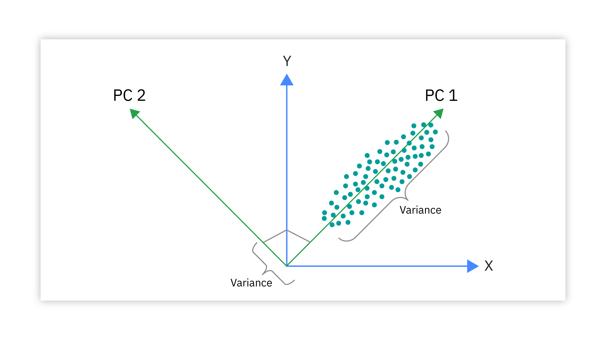

In the fast-evolving world of algorithmic trading, leveraging the power of data analytics is crucial for gaining a competitive edge. As financial markets become increasingly complex, traders and quantitative analysts seek tools to distill vast amounts of data into actionable insights. Principal Component Analysis (PCA) serves as a powerful technique that simplifies high-dimensional data, making it easier to interpret and act upon. By reducing the dimensionality of datasets, PCA helps identify the underlying factors that influence asset price movements, thereby providing clearer signals among the noise.

This article explores the application of PCA in algorithmic trading, providing insights into its benefits, limitations, and implementation strategies. PCA has emerged as an essential tool for traders looking to enhance their strategies by reducing complexity while retaining the most significant information within their datasets. The method involves transforming the original dataset into a series of uncorrelated variables known as principal components, which capture the directions of maximum variance in the data. These principal components act as proxies for the most critical features in a dataset, thus facilitating more focused analysis and decision-making.



Risk management, portfolio diversification, and strategy development are areas where PCA demonstrates significant utility. By isolating key drivers of returns, PCA aids in optimizing portfolios and improving risk profiles. Traders utilize PCA to refine market data analysis, minimize overfitting, and ensure computational efficiency. Despite its substantial advantages, PCA also requires careful consideration regarding its limitations, such as potential information loss and sensitivity to data assumptions.

Ultimately, PCA enhances an algorithmic trader's ability to develop strategies that are not only robust but also grounded in insightful data analysis. As trading theories and practices continue to advance, PCA remains a critical element in the toolkit of quantitative traders, assisting in navigating the complex market landscape.

## Table of Contents

## What is Principal Component Analysis?

Principal Component Analysis (PCA) is a widely-utilized statistical technique that focuses on reducing the dimensionality of data while preserving its essential characteristics. The primary intent of PCA is to simplify complex datasets by transforming them into fewer dimensions, known as principal components, without significant loss of information.

At the heart of PCA is the transformation of the original dataset into a new coordinate system. In this new system, the axes represent uncorrelated variables—principal components—that embody the variance present in the data. Mathematically, PCA can be seen as an orthogonal linear transformation, which reorients the data based on the eigenvectors of its covariance matrix. Each principal component accounts for a specific proportion of the total variance, with the first component capturing the highest variance, followed by subsequent components in decreasing order of variance. This sequential arrangement enables the retention of the dataset's most informative aspects while reducing noise and redundancy.

The covariance matrix is central to PCA as it defines the relationship between variables and their respective variances. By calculating the eigenvectors and eigenvalues of the covariance matrix, PCA determines the principal components. The eigenvectors denote the direction of the components, while the eigenvalues represent the magnitude of variance captured by each component. Therefore, PCA effectively identifies the directions (principal components) along which the data varies the most, facilitating more efficient data representation.

The principal components derived through PCA allow for a condensed yet comprehensive reflection of the data, emphasizing inherent patterns that might be obscured in a high-dimensional setting. It is crucial to note, however, that PCA assumes linear correlations among variables and may not adequately capture more complex, nonlinear relationships.

In practical implementation, PCA is often executed through algorithms built into statistical software, such as Python's scikit-learn library. A typical implementation involves standardizing the data, calculating the covariance matrix, deriving eigenvectors and eigenvalues, and projecting the data onto the new principal component axes. This approach simplifies data interpretation and enables the identification of dominant trends and patterns that drive the dataset's variability, making PCA particularly invaluable in fields requiring high-dimensional data analysis.

## Eigen Vectors and Covariance Matrix

Eigenvectors and eigenvalues are critical components of Principal Component Analysis (PCA), serving as foundational elements that define the directions and magnitudes of variance within a dataset. In PCA, eigenvectors determine the orientation of the data's principal components, while eigenvalues quantify the amount of variance captured by each principal component. These concepts are key to transforming high-dimensional data into a reduced form that preserves essential patterns.

The mathematical journey begins with the covariance matrix, an essential tool for understanding the principal components. For a dataset with variables $X_1, X_2, ..., X_n$, the covariance matrix $C$ is constructed to reflect the covariance between pairs of variables. This matrix plays a pivotal role in PCA as it encapsulates the underlying structure of the data:

$$
C = \frac{1}{n-1} \sum_{i=1}^{n}(X_i - \mu)(X_i - \mu)^T
$$

Where $n$ is the number of observations, $X_i$ is a data point, and $\mu$ is the mean of the dataset. The covariance matrix standardizes the data, allowing for the consistent identification of the directions of maximum variability, which PCA leverages to determine principal components.

Eigenvectors and eigenvalues are derived from the covariance matrix using the characteristic equation:

$$
Cv = \lambda v
$$

Here, $C$ is the covariance matrix, $v$ represents the eigenvectors, and $\lambda$ corresponds to the eigenvalues. The eigenvectors indicate the directions along which the data varies the most, while the eigenvalues inform the extent of variance along these directions. In PCA, the principal components are ordered by descending eigenvalue magnitude, with the first principal component capturing the highest variance.

Implementing PCA involves selecting a subset of principal components with the largest eigenvalues, reducing the dataset's dimensionality while preserving as much variability as possible. This dimensionality reduction leads to simplified models that are computationally efficient and less prone to overfitting.

Understanding and applying these mathematical concepts is integral when utilizing PCA in trading applications. Traders can better interpret market movements by isolating key factors, thereby enhancing strategy development, optimizing portfolios, and managing risk. The effective use of eigenvectors, eigenvalues, and covariance matrices positions PCA as a powerful technique within [algorithmic trading](/wiki/algorithmic-trading) models.

## When to use Principal Component Analysis?

Principal Component Analysis (PCA) is an essential tool for simplifying the analysis of large datasets by reducing their dimensionality. This reduction is especially valuable in algorithmic trading, where vast amounts of market data make it challenging to extract meaningful insights. PCA identifies and retains the most impactful variables by transforming the dataset into a set of uncorrelated principal components. This transformation reduces data noise and highlights underlying patterns that might otherwise be obscured.

In trading, one of PCA's primary uses is to isolate factors that significantly influence asset prices, thereby aiding in the development of models that predict price movements more accurately. By focusing on these primary drivers, traders can enhance their strategy's effectiveness without getting overwhelmed by less informative data. This focus on critical components allows for improved computational efficiency, minimizing the risk of overfitting models with excessive noise or irrelevant variables.

PCA is also advantageous when there is a need to maintain both computational efficiency and interpretability of the data. Blending large datasets from different sources can introduce redundancy and multicollinearity, complicating the analysis process. PCA addresses these issues by creating a refined dataset with principal components that encapsulate the data's variance in fewer dimensions. This condensation facilitates faster computations and more straightforward model interpretations while preserving essential information.

Furthermore, PCA is particularly useful in situations where the trading strategy needs to be adjusted promptly based on real-time data analysis. The reduction in dimensionality can expedite the processing of market signals, allowing traders to react swiftly to changing market conditions without sacrificing the depth or reliability of their analysis.

In summary, employing PCA is most effective when managing extensive datasets to streamline data analysis, minimize noise, and pinpoint the most significant variables. This results in more efficient and interpretable models that enhance strategy development and execution in algorithmic trading.

## Principal Component Analysis in Algorithmic Trading

Principal Component Analysis (PCA) plays a critical role in algorithmic trading by providing a systematic approach to distilling the essential drivers of asset price movements. By examining the underlying structure of market data, PCA can differentiate between genuine signals and noise, allowing traders to focus on the variables that most significantly influence asset returns.

An essential application of PCA in trading is the optimization of portfolios. By reducing the dimensionality of financial datasets, traders can identify the key factors or principal components that contribute most to portfolio variance. This isolation of critical drivers enhances risk management by allowing traders to hedge against specific risks and develop strategies that maximize return potential. For example, if a portfolio's variance is predominantly influenced by three principal components, traders can tailor their strategies to mitigate risk related to those components specifically.

PCA also facilitates the analysis of vast quantities of market data. Algorithmic traders often deal with complex datasets that encompass numerous assets and time periods. By applying PCA, these datasets become more manageable, highlighting the most impactful components that drive market changes. This streamlined analysis not only aids in developing more robust trading strategies but also enhances computational efficiency. Given that algorithmic trading relies heavily on timely decision-making, reducing the dimensionality of datasets ensures that computations remain feasible and fast.

The ability of PCA to reveal hidden correlations and patterns within data is invaluable for strategy development. By discerning linear combinations of the original variables that account for maximum variance, traders can uncover latent structures that may not be apparent through traditional analysis methods. For instance, PCA can expose relationships between assets that are not covered by conventional risk models, such as the Capital Asset Pricing Model (CAPM). These insights can lead to the development of innovative trading strategies that capitalize on previously unrecognized asset dynamics.

In Python, implementing PCA is accessible through libraries such as scikit-learn. Below is a simplified example of how PCA might be applied to financial time-series data:

```python
from sklearn.decomposition import PCA
import pandas as pd

# Assume df is a pandas DataFrame containing asset returns
pca = PCA(n_components=3)  # Select the number of principal components
principal_components = pca.fit_transform(df)

# Create a DataFrame for the principal components
principal_df = pd.DataFrame(data=principal_components, columns=['PC1', 'PC2', 'PC3'])

# Explained variance ratios
explained_variance = pca.explained_variance_ratio_
```

This code snippet demonstrates how PCA can be leveraged to identify the top three principal components within a dataset of asset returns. By analyzing these components, traders can gain insights into the primary drivers of market behavior and adjust their strategies accordingly.

In summary, PCA in algorithmic trading aids in the identification of key factors driving asset movements, facilitates portfolio optimization, and assists in forming data-driven trading strategies. Through dimensionality reduction, it offers a refined view of market dynamics, ultimately supporting strategic decision-making and effective risk management.

## Advantages of Using PCA in Trading

Principal Component Analysis (PCA) offers several advantages in trading, particularly in simplifying complex datasets, which enhances the interpretability and focus of financial data analysis. By reducing the dimensionality of data, PCA identifies patterns that may not be apparent in the raw structure, thereby allowing traders to focus on the most significant components influencing asset price movements.

The primary benefit of PCA lies in its ability to filter out noise inherent in financial datasets. Markets generate vast amounts of data, including price, [volume](/wiki/volume-trading-strategy), and a multitude of derivative indicators. PCA effectively isolates the primary sources of variation in this data, which provides traders with a clearer view of the underlying factors driving market behavior. This noise reduction capability ensures that algorithmic trading models are based on cleaner and more interpretable data, which is crucial for making sound trading decisions.

Moreover, PCA improves the performance of algorithmic trading models through dimensionality reduction. By transforming the data into a lower-dimensional form, PCA helps prevent overfitting – a common issue where models perform well on historical data but fail to generalize to unseen data. This ability to enhance generalization ensures that predictive models remain robust across different market conditions. When a model is less likely to overfit, it increases the reliability of its forecasts and strategies, which is vital for maintaining consistent trading performance.

To illustrate the application of PCA, consider the following Python code snippet that demonstrates how PCA can be used to reduce the dimensionality of a dataset:

```python
from sklearn.decomposition import PCA
import pandas as pd

# Sample DataFrame with historical price data
data = pd.DataFrame({
    'Price1': [120, 125, 130, 128, 132],
    'Price2': [115, 118, 121, 119, 125],
    'Price3': [122, 126, 129, 127, 131]
})

# Apply PCA
pca = PCA(n_components=2)
principal_components = pca.fit_transform(data)

# Resulting principal components
print(principal_components)
```

In this example, PCA reduces a three-dimensional dataset into two principal components, capturing most of the variance in the data. By retaining only the most significant components, the analysis becomes more efficient and concentrated on the key influencers, potentially leading to enhanced trading strategies.

In summary, PCA’s ability to manage large datasets by emphasizing significant data structures makes it an indispensable tool in algorithmic trading. It not only enhances model performance by reducing data complexity but also safeguards against the pitfalls of overfitting, ensuring that strategies remain effective in evolving markets.

## Limitations & Considerations of PCA

Principal Component Analysis (PCA) is a widely used technique in data science and [machine learning](/wiki/machine-learning) for reducing the dimensionality of datasets. However, it comes with certain limitations and considerations that need to be acknowledged when applied, particularly in algorithmic trading.

One significant limitation of PCA is the potential for information loss. As PCA works by reducing the number of variables to a smaller set of principal components which explain the maximum variance, it inherently discards components that contribute less to this variance. While this reduction makes datasets more manageable, it also means that potentially valuable information can be omitted. For example, subtle but meaningful nuances in market data might be overlooked when focusing solely on the largest principal components.

Another challenge is the interpretability of principal components. Each principal component is a linear combination of the original variables, making them abstract and often difficult to physically interpret. This abstraction can be problematic when trying to infer the underlying factors driving asset prices, as these components may not have a clear economic meaning.

Furthermore, PCA assumes linearity in the data. The method identifies directions of maximum variance in a linear fashion, which may not capture nonlinear relationships inherent in complex market conditions. In financial markets, relationships between variables can be nonlinear, meaning PCA might oversimplify and overlook critical aspects of the data.

Additionally, PCA is sensitive to outliers. The presence of outliers can significantly skew the results, as these data points can disproportionately affect the variance and, consequently, the principal components derived from the dataset. It is crucial to preprocess data adequately, perhaps by scaling or normalizing it, before applying PCA to mitigate the influence of outliers.

In conclusion, despite these limitations, PCA remains a potent analytical tool when carefully implemented. Understanding its restrictions and taking necessary precautions allows algorithmic traders to harness its benefits while minimizing potential drawbacks, making insightful, data-driven decisions in the trading landscape.

## Conclusion

Principal Component Analysis (PCA) offers significant advantages in simplifying complex datasets, making it an invaluable tool for enhancing trading strategies through dimensionality reduction. By transforming high-dimensional data into principal components, PCA helps traders focus on the most pertinent information, facilitating the development of effective strategies in algorithmic trading.

The application of PCA in trading provides robust mechanisms for risk management and strategy development. By identifying underlying factors that influence asset prices, PCA allows traders to isolate key drivers of returns, which can enhance portfolio optimization. This focus on relevant data also aids in reducing noise, leading to clearer market insights and potentially more profitable decisions.

Moreover, PCA enhances computational efficiency by reducing the number of variables that need to be processed, which is crucial when dealing with large datasets. This reduction not only aids in improving the performance of algorithmic models by limiting overfitting but also makes the analysis more interpretable and focused.

However, it's important to acknowledge the limitations of PCA. The technique can result in the loss of some information because components with lower variance are discarded. Additionally, the abstract nature of principal components might pose challenges in terms of interpretability. PCA's assumption of linearity might not always hold under complex market conditions, and its sensitivity to outliers can affect the robustness of the analysis.

Despite these challenges, with careful implementation and consideration of its limitations, PCA remains a critical resource for quantitative traders. Its ability to streamline data and provide actionable insights makes it a powerful ally in navigating the complexities of financial markets. By effectively managing risk and focusing on data-driven strategies, traders equipped with PCA can enhance their decision-making processes and improve trading outcomes.

## References & Further Reading

[1]: Jolliffe, I. T., & Cadima, J. (2016). ["Principal component analysis: a review and recent developments."](https://royalsocietypublishing.org/doi/10.1098/rsta.2015.0202) Philosophical Transactions of the Royal Society A: Mathematical, Physical and Engineering Sciences, 374(2065).

[2]: Lopez de Prado, M. (2018). ["Advances in Financial Machine Learning."](https://www.amazon.com/Advances-Financial-Machine-Learning-Marcos/dp/1119482089) Wiley.

[3]: Pearson, K. (1901). ["On Lines and Planes of Closest Fit to Systems of Points in Space."](https://www.semanticscholar.org/paper/LIII.-On-lines-and-planes-of-closest-fit-to-systems-F.R.S./cac33f91e59f0a137b46176d74cee55c7010c3f8) Philosophical Magazine, Series 6.

[4]: Shlens, J. (2014). ["A Tutorial on Principal Component Analysis."](https://arxiv.org/abs/1404.1100) arXiv preprint arXiv:1404.1100.

[5]: Chan, E. (2008). ["Quantitative Trading: How to Build Your Own Algorithmic Trading Business."](https://rickorford.com/quantitative-trading/) Wiley.