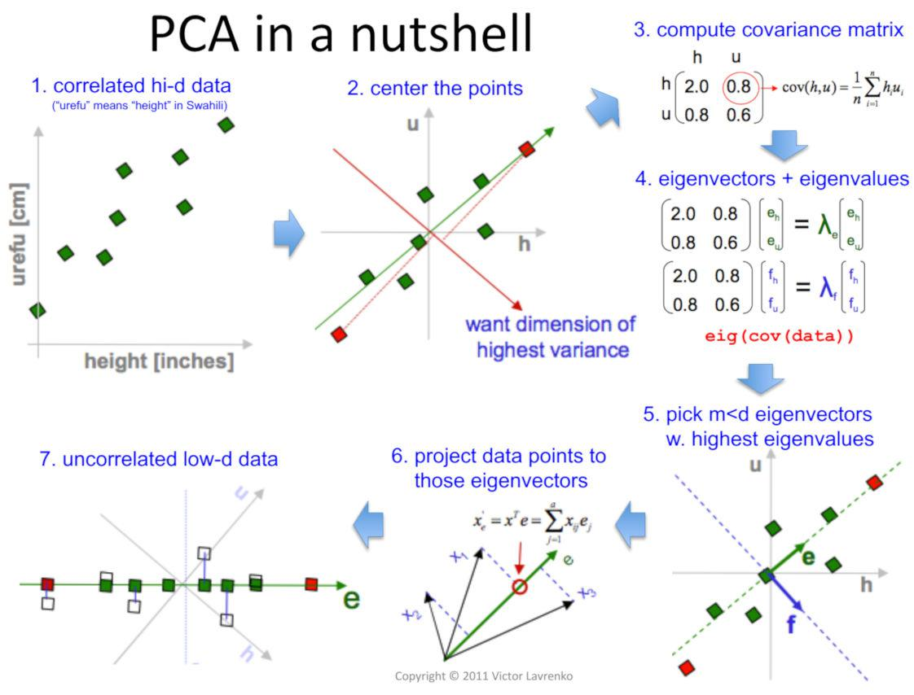

In the fast-evolving world of algorithmic trading, leveraging the power of data analytics is crucial for gaining a competitive edge. The ability to process and interpret large volumes of financial data rapidly can define the success or failure of trading strategies. Among the various techniques available, Principal Component Analysis (PCA) stands out as a powerful method for simplifying high-dimensional data. By reducing the complexity of data while preserving essential patterns, PCA facilitates an improved understanding and subsequent action upon these datasets.

PCA is a statistical technique that reduces the dimensionality of data, making it easier to handle and interpret without losing significant information. This capability is particularly beneficial in the context of trading, where high-dimensional inputs such as price movements, trading volumes, and economic indicators can overwhelm computational models. By transforming the data into principal components, PCA allows traders to focus on the most influential factors affecting asset prices.



This article explores the application of PCA in algorithmic trading, providing insights into its benefits, limitations, and implementation strategies. By examining how PCA can identify and isolate essential data characteristics, algorithmic traders can refine their strategies for enhanced performance. This analytical technique not only aids in optimizing trading algorithms through dimensionality reduction but also enhances model robustness and generalization across varying market conditions.

The practical utility of PCA in algorithmic trading underscores its importance. Despite challenges, such as potential information loss and sensitivity to outliers, PCA's contributions to filtering noise from datasets and preventing overfitting are indispensable. Through thoughtful implementation, PCA becomes a formidable tool, equipping quantitative traders to navigate the complexities of modern financial markets more effectively.

## Table of Contents

## What is Principal Component Analysis?

Principal Component Analysis (PCA) is a widely-utilized statistical technique that focuses on reducing the dimensionality of data while preserving its essential characteristics. By transforming high-dimensional datasets into a smaller set of variables known as principal components, PCA facilitates data interpretation and analysis without significant loss of information. The goal is to capture the maximum variance present in the original data with as few components as possible.

To achieve this, PCA employs an orthogonal linear transformation. This mathematical process reorients the data along a new set of axes, defined by the eigenvectors of the data’s covariance matrix. Each eigenvector corresponds to a principal component, and the associated eigenvalues indicate the amount of variance captured by each of these components.

Mathematically, given a dataset $X$ with zero mean, PCA involves computing the covariance matrix $\Sigma = \frac{1}{n-1}XX^T$. By calculating the eigenvalues and eigenvectors of $\Sigma$, PCA identifies the directions, or vectors, in which the data varies the most. The principal components are then the projections of the data onto these vectors. Formally, if $\mathbf{v}$ is an eigenvector of $\Sigma$ with eigenvalue $\lambda$, the transformation to the principal component $Z$ is:

$$
Z = X \mathbf{v}
$$

This transformation ensures that the principal components are uncorrelated and ordered by the magnitude of their corresponding eigenvalues. Consequently, the first principal component accounts for the largest variance, followed by the second, and so on.

The implementation of PCA requires centering the dataset by subtracting the mean of each variable, ensuring that the analysis focuses on the variability rather than absolute values. The final step involves selecting a subset of principal components that captures a sufficient amount of total variance, thus achieving the desired dimensionality reduction while maintaining the integrity of the original data.

## Eigen Vectors and Covariance Matrix

Eigenvectors and eigenvalues are critical components of Principal Component Analysis (PCA). They serve as foundational elements that define the directions and magnitudes of variance within a dataset. In PCA, the goal is to identify these principal directions in which the data exhibits the most variance. This process revolves around the eigenvectors and eigenvalues of the covariance matrix associated with the data.

The covariance matrix is pivotal in PCA as it encapsulates the underlying structure of the data, summarizing how the various dimensions of the data are interrelated. Mathematically, for a dataset represented by matrix $X$, with each row representing an observation and each column a variable, the covariance matrix $\Sigma$ is computed as:

$$
\Sigma = \frac{1}{n-1} (X^T \cdot X)
$$

where $n$ is the number of observations. The role of this matrix is to provide a basis for determining the principal components.

Once the covariance matrix is computed, PCA involves solving the eigenvector and eigenvalue problem for $\Sigma$. Formally, this requires finding solutions to the equation:

$$
\Sigma \cdot v = \lambda \cdot v
$$

where $v$ represents the eigenvectors and $\lambda$ represents the eigenvalues. Each eigenvector points in a direction in which the variance of the data is maximized, and the corresponding eigenvalue indicates the magnitude of this variance.

Implementing PCA typically involves selecting a subset of principal components with the largest eigenvalues, as these represent the directions with the most significant variance and thus the major features of the data. This selection process aids in dimensionality reduction, as it simplifies the dataset while preserving as much variance as possible. By focusing on these primary eigenvectors and eigenvalues, PCA enables the extraction of essential features, allowing for more efficient data analysis and interpretation.

In Python, one can use libraries such as NumPy or SciPy to compute the eigenvectors and eigenvalues. Here is a basic Python example illustrating this computation:

```python
import numpy as np

# Given data matrix X
X = np.array([[1, 2], [3, 4], [5, 6]])

# Standardizing data (optional but often recommended)
X_meaned = X - np.mean(X, axis=0)

# Calculating the covariance matrix of the mean-centered data
cov_matrix = np.cov(X_meaned, rowvar=False)

# Calculating eigenvectors and eigenvalues of the covariance matrix
eigenvalues, eigenvectors = np.linalg.eigh(cov_matrix)

# Sorting the eigenvectors by decreasing eigenvalues
sorted_index = np.argsort(eigenvalues)[::-1]
eigenvalues = eigenvalues[sorted_index]
eigenvectors = eigenvectors[:, sorted_index]

print("Eigenvectors: \n", eigenvectors)
print("Eigenvalues: \n", eigenvalues)
```

By computing and analyzing these eigenvectors and eigenvalues, PCA effectively reduces dimensionality, simplifying data analysis while retaining critical information.

## When to Use Principal Component Analysis?

Principal Component Analysis (PCA) is an invaluable tool for the simplification of large datasets, achieved through a process known as dimensionality reduction. This method transforms complex data into more manageable forms, maintaining essential features while discarding less significant variations. In the context of [algorithmic trading](/wiki/algorithmic-trading), this capability is particularly beneficial due to the extensive datasets involved.

One primary advantage of PCA within trading environments is its ability to isolate factors that have a significant impact on asset prices. By reducing the data's dimensionality, PCA highlights the most influential components, thereby enhancing the accuracy of predictive models. This isolation of impactful factors is critical for traders seeking to develop models that can more accurately forecast market trends and asset price movements. For instance, identifying key economic indicators or market signals among numerous variables can improve a trading strategy's robustness.

Moreover, PCA proves advantageous when computational efficiency and data interpretability are crucial, even for large datasets. Trading algorithms often need to process substantial volumes of information rapidly, and PCA aids in achieving this by reducing the number of variables that require computation. This reduction not only accelerates computation times but also simplifies the resulting data models, making them easier for analysts to understand and act upon.

In practice, PCA is implemented by computing the covariance matrix of the dataset, followed by the extraction of eigenvectors and eigenvalues. Given a dataset represented by $\mathbf{X}$, the steps involve:

1. Subtract the mean from each variable to standardize the data.

   \[\mathbf{X}_{\text{centered}} = \mathbf{X} - \text{mean}(\mathbf{X})\]

2. Compute the covariance matrix $\mathbf{C}$.

   \[\mathbf{C} = \frac{1}{n-1} \mathbf{X}_{\text{centered}}^T \mathbf{X}_{\text{centered}}\]

3. Determine the eigenvectors and eigenvalues of $\mathbf{C}$.

4. Select the top $k$ eigenvectors corresponding to the largest eigenvalues to form the principal components.

This approach reduces the complexities involved in data analysis, making PCA a fundamental technique for traders who require both efficiency and precision in their algorithmic models.

## Principal Component Analysis in Algorithmic Trading

Principal Component Analysis (PCA) holds significant value in algorithmic trading by offering a structured methodology for identifying the fundamental factors influencing asset price fluctuations. By reducing the dimensionality of financial datasets, PCA streamlines the process of portfolio optimization. In practice, traders often face extensive and complex datasets where distinguishing pertinent variables affecting asset prices is challenging. Through PCA, these datasets can be transformed to a smaller set of uncorrelated variables—principal components—that encapsulate the maximum variance present in the data.

For instance, PCA can be employed to enhance the predictive power of trading models by isolating the most influential elements of a dataset. This application is pivotal in formulating models that not only predict price movements accurately but also adapt to varied market conditions. By focusing on principal components with significant eigenvalues, traders can identify latent structures within the data, leading to the development of innovative trading strategies.

Mathematically, PCA involves solving the eigenvalue problem for the covariance matrix of the data:

$$
Cov(X) = PDP^T
$$

where $P$ is the matrix of eigenvectors and $D$ is the diagonal matrix of eigenvalues. These eigenvectors serve as the principal components, and selecting those with the largest eigenvalues enables a reduction in dimensionality.

Moreover, PCA facilitates the discovery of linear combinations of original variables that represent the data's essential features. These combinations can be crucial for uncovering relationships not immediately apparent, providing traders with deeper insights into market dynamics. This reduction in data complexity not only enhances model efficiency but also mitigates the risks of overfitting, which is a common challenge in developing robust trading models.

In algorithmic trading, PCA is also instrumental in noise reduction, filtering out insignificant variations and focusing on core trends. This refinement aids in improving the signal-to-noise ratio, thereby enhancing the quality of trading decisions. Ultimately, PCA empowers traders to sift through complex data, extract meaningful patterns, and devise strategies that can capitalize on these findings, fostering a more informed and effective trading process.

## Advantages of Using PCA in Trading

Principal Component Analysis (PCA) offers notable advantages in the field of algorithmic trading, primarily by refining data analysis processes. One of the key benefits of PCA is its capacity to reduce noise within financial datasets. Financial markets are characterized by high [volatility](/wiki/volatility-trading-strategies) and complex interactions between numerous factors, often resulting in datasets replete with extraneous information, or "noise." PCA addresses this challenge by concentrating on the most meaningful components derived from the dataset. By isolating significant directions of variance, traders can direct their attention to components that genuinely impact asset prices and trading strategies.

Another significant advantage of PCA is its utility in reducing the dimensionality of data, which plays a critical role in enhancing the performance of trading models. Dimensionality reduction with PCA aids in preventing overfitting, a common issue where a model performs exceedingly well on training data but fails to generalize to unseen data. PCA achieves this by transforming the original data into a set of orthogonal variables—principal components—thereby simplifying models and helping ensure their robustness. This transformation reduces the risk of overfitting by maintaining only the most relevant features, effectively abstracting away redundant information that doesn't contribute to market movements.

Additionally, PCA is instrumental in improving model generalization across varying market conditions. By transforming data to a lower-dimensional form, PCA emphasizes the primary factors influencing market trends, leading to models that adapt more fluidly to changes in the environment. As a result, trading strategies developed using PCA are often more versatile and resilient, proving successful under diverse market scenarios.

In summary, the implementation of PCA in trading significantly streamlines data analysis by filtering noise, mitigating overfitting risks, and enhancing the adaptability of trading models. This makes PCA an invaluable tool for traders striving to harness data-driven insights efficiently.

## Limitations & Considerations of PCA

Principal Component Analysis (PCA) is a powerful tool in data analysis and algorithmic trading, but it is not without limitations. A primary concern is the potential loss of information. When reducing dimensionality, PCA may discard some variance from the data, which could lead to a loss of important information. This is especially critical in trading applications where even small variations can be significant.

Additionally, the interpretability of principal components often poses challenges. PCA transforms the original variables into new, uncorrelated variables known as principal components, which can make it difficult to understand what each component represents in the context of the original data. This can complicate decision-making processes for traders who need to explain and justify their strategies.

PCA assumes linear correlations among variables, which means it may not capture complex, nonlinear relationships that could be present in financial data. This assumption can be a limitation when the underlying data structure is not adequately represented by linear relationships, potentially omitting crucial patterns that are inherent in nonlinear data structures.

Another significant limitation is PCA's sensitivity to outliers. Outliers can disproportionately influence the variance and the resulting principal components because PCA seeks directions of maximum variance. This can distort the results and lead to misleading interpretations. Preprocessing steps like outlier removal or robust PCA techniques may be necessary to mitigate this issue.

In summary, while PCA is a valuable technique for dimensionality reduction and data simplification in algorithmic trading, its limitations require careful consideration. Understanding these pitfalls enables better implementation and more informed interpretations of PCA outputs in various trading contexts.

## Conclusion

Principal Component Analysis (PCA) offers significant advantages in simplifying complex datasets, making it invaluable for enhancing trading strategies through dimensionality reduction. By transforming high-dimensional data into a lower-dimensional space composed of principal components, PCA enables traders to focus on the most relevant features of their datasets, facilitating more informed decision-making processes. This reduction of complexity aids traders in identifying essential patterns and trends, ultimately leading to the development of more robust algorithms.

Despite its limitations, such as potential information loss and sensitivity to outliers, PCA remains a critical resource for quantitative traders when implemented with care and an awareness of its constraints. It is essential for traders to consider these limitations during their analysis, ensuring the selected principal components genuinely represent the underlying structure of the data and do not overlook significant nonlinear relationships.

The ability of PCA to streamline data and provide actionable insights makes it a powerful ally in navigating the complexities of financial markets. Traders can harness PCA to filter out noise, focus on significant datasets, and enhance model generalization across different market conditions. By leveraging PCA, quantitative traders can improve their predictive models' accuracy and reliability, ultimately gaining a competitive edge in the fast-paced environment of algorithmic trading.

## References & Further Reading

Jolliffe, I. T., & Cadima, J. (2016) provide an expansive review of Principal Component Analysis (PCA), highlighting both traditional applications and recent developments. Their work emphasizes improvements in computational methods and the adaptation of PCA to handle large, complex datasets.

Lopez de Prado, M. (2018) offers insights into the application of [machine learning](/wiki/machine-learning) in finance, with a focus on algorithmic trading. In this context, PCA is employed as a tool for feature extraction, enhancing predictive modeling by reducing data complexity while maintaining significant informational value.

Pearson, K. (1901) introduced the concept of PCA through his seminal work on fitting lines and planes to point systems in space. His contributions laid the groundwork for the mathematical formulation of PCA, allowing for the simplification of data structures through linear transformations.

Shlens, J. (2014) provides a tutorial that serves as an accessible introduction to PCA. This guide expounds on the mathematical foundations and practical implementations of PCA, making it a valuable resource for beginners and practitioners seeking to understand the technique's application in data simplification.

