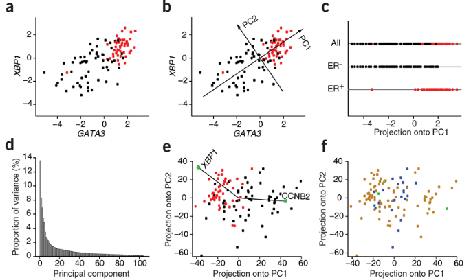

## Table of Contents

## What is Principal Component Analysis (PCA)?

Principal Component Analysis, or PCA, is a way to simplify complex data. Imagine you have a lot of information about something, like different features of fruits. PCA helps you find the most important features, called principal components, that explain most of the variation in your data. By focusing on these components, you can understand your data better without getting lost in too many details.

Think of PCA like trying to summarize a long book. Instead of reading every page, you look for the main ideas that capture the essence of the story. In the same way, PCA reduces the number of variables in your dataset while keeping the important information. This makes it easier to analyze and visualize the data, helping you see patterns and relationships that might be hard to spot otherwise.

## Why is PCA used in data analysis?

PCA is used in data analysis because it helps simplify complex data. When you have a lot of information, it can be hard to see what's important. PCA finds the main features, or principal components, that show the biggest differences in your data. By focusing on these, you can understand your data better without getting overwhelmed by too many details. It's like summarizing a long book by focusing on the main ideas, making it easier to grasp the overall story.

Another reason PCA is useful is that it can help with visualization. When you have many variables, it's tough to plot them all on a graph. PCA reduces the number of variables to just a few key ones, which you can then plot easily. This makes it simpler to see patterns and relationships in your data that might be hard to notice otherwise. For example, if you're studying different types of flowers, PCA can help you see how they group together based on their main characteristics, making your analysis clearer and more insightful.

## How does PCA reduce the dimensionality of data?

PCA reduces the dimensionality of data by finding the most important features, called principal components, that capture the biggest differences in the data. Imagine you have a lot of information, like different measurements of fruits. Instead of looking at all the measurements, PCA helps you focus on just a few key ones that explain most of what's going on. By doing this, you can simplify your data from many dimensions to just a few, making it easier to understand and work with.

For example, if you have data on the weight, height, and color of different fruits, PCA might find that weight and height are the most important features that show how the fruits differ from each other. It then creates new variables, the principal components, that are combinations of these original features. By using these new variables, you can represent your data in fewer dimensions, like a 2D graph instead of a 3D one, without losing much of the important information. This makes it simpler to analyze and visualize your data, helping you see patterns and relationships more clearly.

## What are the steps involved in performing PCA?

Performing PCA involves a few key steps. First, you start with your data, which might have many variables or features. You need to make sure your data is ready by standardizing it. This means adjusting the values so that all the variables are on the same scale, which is important for PCA to work correctly. After that, you calculate the covariance matrix of your data. The covariance matrix shows how different variables relate to each other. From this matrix, you find the eigenvalues and eigenvectors, which are important for figuring out the principal components.

Next, you sort the eigenvalues in descending order. The eigenvalues tell you how much of the data's variation each principal component captures. The eigenvectors corresponding to the largest eigenvalues are the directions of the new axes, or principal components, that you'll use to represent your data. You then choose how many principal components to keep based on how much of the total variation you want to explain. Usually, you pick enough components to explain a high percentage of the variation, like 95%. Finally, you transform your original data into this new space defined by the principal components. This transformation reduces the number of dimensions while keeping the most important information, making your data easier to analyze and visualize.

## How do you interpret the principal components in PCA?

Interpreting the principal components in PCA means understanding what each new variable, or principal component, represents. Each principal component is a combination of the original variables, and it shows the direction in which the data varies the most. The first principal component captures the largest amount of variation in the data. It's like finding the main storyline in a book. If you're looking at data about fruits, the first principal component might be a mix of weight and size, showing that these are the most important features that explain how the fruits differ from each other.

The second principal component captures the next largest amount of variation, but it's also different from the first one. It's like finding the second most important storyline in the book. This component helps to explain more of the data's variation that the first component didn't cover. For example, if the first component was about weight and size, the second might focus on color and texture. By looking at these components, you can see how different features of your data relate to each other and how they contribute to the overall picture.

## What is the significance of eigenvalues and eigenvectors in PCA?

Eigenvalues and eigenvectors are very important in PCA because they help us understand and simplify the data. Imagine you have a lot of information, like different features of fruits. Eigenvectors are like directions in this data space that show the main ways the fruits differ from each other. The eigenvectors that PCA finds are called principal components. The first principal component is the direction where the data varies the most, like how weight and size might be the biggest differences between fruits. The second principal component shows the next biggest difference, maybe color and texture.

Eigenvalues tell us how important each eigenvector, or principal component, is. They show how much of the data's total variation each principal component explains. A big eigenvalue means that the corresponding principal component captures a lot of the differences in the data. For example, if the eigenvalue for the first principal component is much larger than the others, it means that weight and size explain most of how the fruits differ. By looking at the eigenvalues, we can decide how many principal components to keep to explain enough of the data's variation, like 95%. This helps us simplify the data without losing much important information.

## How can PCA be applied in machine learning?

PCA can be really helpful in machine learning, especially when you have a lot of data with many features. Imagine you're trying to teach a computer to recognize different types of fruits. Each fruit has lots of characteristics like weight, size, and color. With so many features, it can be hard for the computer to learn what's important. PCA helps by finding the most important features, called principal components, that explain the biggest differences between the fruits. By focusing on these, the computer can learn more easily and quickly, without getting overwhelmed by too many details.

Another way PCA is used in machine learning is to make data easier to work with. When you have a lot of features, it can be tough to visualize and understand the data. PCA reduces the number of features to just a few key ones, which you can then plot on a graph. This makes it simpler to see patterns and relationships in your data that might be hard to spot otherwise. For example, if you're trying to group similar fruits together, PCA can help you see how they cluster based on their main characteristics, making your machine learning models clearer and more accurate.

## What are the limitations and challenges of using PCA?

Using PCA can be tricky because it doesn't always keep all the important details of your data. When you reduce the number of features to make things simpler, you might lose some information that's actually important for understanding your data fully. For example, if you're studying different types of fruits, PCA might focus on weight and size but miss out on color, which could be crucial for telling some fruits apart. Also, PCA assumes that the most important features are the ones that vary the most, but that's not always true. Sometimes, features that don't change much can still be really important.

Another challenge with PCA is that it can be hard to explain what the new features, or principal components, actually mean. Since each principal component is a mix of the original features, it can be tough to understand what they represent in simple terms. This can make it difficult to explain your results to others, especially if they're not familiar with PCA. Plus, PCA works best with data that follows a straight line pattern. If your data has more complex shapes, like curves or clusters, PCA might not capture those patterns well, which can lead to less accurate results.

## How does PCA differ from other dimensionality reduction techniques?

PCA is different from other dimensionality reduction techniques because it focuses on finding the directions in the data where the variation is the largest. This means PCA tries to keep the most important information by looking at how the data spreads out. Other techniques, like t-SNE or UMAP, might focus more on keeping the distances between points in the data, which can be useful for showing how things cluster together. PCA is good at simplifying data in a way that's easy to understand and visualize, but it might not be the best choice if you care more about how things are grouped.

Another way PCA differs is that it's a linear method, which means it works best when the data follows straight lines. Techniques like t-SNE and UMAP are non-linear, so they can handle more complex patterns in the data, like curves or clusters. This makes them better at capturing the structure of data that doesn't follow a simple straight-line pattern. But because PCA is simpler and easier to understand, it's often used when you want to quickly reduce the number of features without worrying too much about keeping every tiny detail of the data's structure.

## Can you explain the mathematical foundation of PCA?

PCA starts with a bunch of data that has lots of features. The first step is to make sure all the features are on the same scale, which is called standardizing the data. After that, you calculate something called the covariance matrix. This matrix shows how the different features relate to each other. From this matrix, you find the eigenvalues and eigenvectors. Eigenvectors are like directions in the data space that show the main ways the data varies. The eigenvalues tell you how important each eigenvector is, or how much of the data's variation it captures.

Next, you sort the eigenvalues from biggest to smallest. The eigenvector with the biggest eigenvalue is the first principal component, which captures the most variation in the data. The second principal component, with the next biggest eigenvalue, captures the next most variation, and so on. You choose how many principal components to keep based on how much of the total variation you want to explain. Usually, you pick enough to explain a high percentage, like 95%. Then, you transform your original data into this new space defined by the principal components. This transformation reduces the number of dimensions while keeping the most important information, making your data easier to analyze and visualize.

## How do you choose the number of principal components to retain?

Choosing the number of principal components to keep is about finding a balance. You want to keep enough components to explain most of the differences in your data, but not so many that it becomes too complicated. A common way to decide is to look at how much of the total variation each component explains. You add up the percentages of variation explained by each component until you reach a high enough total, like 95%. This means you're keeping the most important information without getting lost in too many details.

Another way to choose is by looking at a graph called a scree plot. This graph shows the eigenvalues of the components, which tell you how important each one is. You look for a point where the eigenvalues start to drop off sharply, called the "elbow." This elbow point suggests a good number of components to keep because adding more after this point doesn't add much new information. By using these methods, you can simplify your data while still keeping the key details that matter.

## What are some advanced applications of PCA in various fields?

PCA is used in many cool ways in different fields. In finance, PCA helps people understand how different stocks move together. By finding the main patterns in stock prices, it can help investors see which stocks are similar and how they might change in the future. This can make it easier to pick the best investments. In medicine, doctors use PCA to look at lots of data from patients, like their blood tests and symptoms. By finding the most important features, they can see patterns that might help diagnose diseases or plan treatments better.

In the world of images and videos, PCA is a big help too. For example, in facial recognition, PCA can take all the different parts of a face and find the main features that make each face unique. This makes it easier for computers to tell people apart. In climate science, researchers use PCA to study big sets of weather data. By finding the main patterns in things like temperature and rainfall, they can understand how the climate is changing and predict what might happen next.

## What is Principal Component Analysis?

Principal Component Analysis (PCA) is a widely-utilized statistical technique that focuses on reducing the dimensionality of data while preserving its essential characteristics. By transforming high-dimensional datasets into a smaller set of variables known as principal components, PCA facilitates data interpretation and analysis without significant loss of information. The goal is to capture the maximum variance present in the original data with as few components as possible.

To achieve this, PCA employs an orthogonal linear transformation. This mathematical process reorients the data along a new set of axes, defined by the eigenvectors of the data’s covariance matrix. Each eigenvector corresponds to a principal component, and the associated eigenvalues indicate the amount of variance captured by each of these components.

Mathematically, given a dataset $X$ with zero mean, PCA involves computing the covariance matrix $\Sigma = \frac{1}{n-1}XX^T$. By calculating the eigenvalues and eigenvectors of $\Sigma$, PCA identifies the directions, or vectors, in which the data varies the most. The principal components are then the projections of the data onto these vectors. Formally, if $\mathbf{v}$ is an eigenvector of $\Sigma$ with eigenvalue $\lambda$, the transformation to the principal component $Z$ is:

$$
Z = X \mathbf{v}
$$

This transformation ensures that the principal components are uncorrelated and ordered by the magnitude of their corresponding eigenvalues. Consequently, the first principal component accounts for the largest variance, followed by the second, and so on.

The implementation of PCA requires centering the dataset by subtracting the mean of each variable, ensuring that the analysis focuses on the variability rather than absolute values. The final step involves selecting a subset of principal components that captures a sufficient amount of total variance, thus achieving the desired dimensionality reduction while maintaining the integrity of the original data.

## What are Eigen Vectors and the Covariance Matrix?

Eigenvectors and eigenvalues are critical components of Principal Component Analysis (PCA). They serve as foundational elements that define the directions and magnitudes of variance within a dataset. In PCA, the goal is to identify these principal directions in which the data exhibits the most variance. This process revolves around the eigenvectors and eigenvalues of the covariance matrix associated with the data.

The covariance matrix is pivotal in PCA as it encapsulates the underlying structure of the data, summarizing how the various dimensions of the data are interrelated. Mathematically, for a dataset represented by matrix $X$, with each row representing an observation and each column a variable, the covariance matrix $\Sigma$ is computed as:

$$
\Sigma = \frac{1}{n-1} (X^T \cdot X)
$$

where $n$ is the number of observations. The role of this matrix is to provide a basis for determining the principal components.

Once the covariance matrix is computed, PCA involves solving the eigenvector and eigenvalue problem for $\Sigma$. Formally, this requires finding solutions to the equation:

$$
\Sigma \cdot v = \lambda \cdot v
$$

where $v$ represents the eigenvectors and $\lambda$ represents the eigenvalues. Each eigenvector points in a direction in which the variance of the data is maximized, and the corresponding eigenvalue indicates the magnitude of this variance.

Implementing PCA typically involves selecting a subset of principal components with the largest eigenvalues, as these represent the directions with the most significant variance and thus the major features of the data. This selection process aids in dimensionality reduction, as it simplifies the dataset while preserving as much variance as possible. By focusing on these primary eigenvectors and eigenvalues, PCA enables the extraction of essential features, allowing for more efficient data analysis and interpretation.

In Python, one can use libraries such as NumPy or SciPy to compute the eigenvectors and eigenvalues. Here is a basic Python example illustrating this computation:

```python
import numpy as np

# Given data matrix X
X = np.array([[1, 2], [3, 4], [5, 6]])

# Standardizing data (optional but often recommended)
X_meaned = X - np.mean(X, axis=0)

# Calculating the covariance matrix of the mean-centered data
cov_matrix = np.cov(X_meaned, rowvar=False)

# Calculating eigenvectors and eigenvalues of the covariance matrix
eigenvalues, eigenvectors = np.linalg.eigh(cov_matrix)

# Sorting the eigenvectors by decreasing eigenvalues
sorted_index = np.argsort(eigenvalues)[::-1]
eigenvalues = eigenvalues[sorted_index]
eigenvectors = eigenvectors[:, sorted_index]

print("Eigenvectors: \n", eigenvectors)
print("Eigenvalues: \n", eigenvalues)
```

By computing and analyzing these eigenvectors and eigenvalues, PCA effectively reduces dimensionality, simplifying data analysis while retaining critical information.

## What is the role of Principal Component Analysis in Algorithmic Trading?

Principal Component Analysis (PCA) holds significant value in [algorithmic trading](/wiki/algorithmic-trading) by offering a structured methodology for identifying the fundamental factors influencing asset price fluctuations. By reducing the dimensionality of financial datasets, PCA streamlines the process of portfolio optimization. In practice, traders often face extensive and complex datasets where distinguishing pertinent variables affecting asset prices is challenging. Through PCA, these datasets can be transformed to a smaller set of uncorrelated variables—principal components—that encapsulate the maximum variance present in the data.

For instance, PCA can be employed to enhance the predictive power of trading models by isolating the most influential elements of a dataset. This application is pivotal in formulating models that not only predict price movements accurately but also adapt to varied market conditions. By focusing on principal components with significant eigenvalues, traders can identify latent structures within the data, leading to the development of innovative trading strategies.

Mathematically, PCA involves solving the eigenvalue problem for the covariance matrix of the data:

$$
Cov(X) = PDP^T
$$

where $P$ is the matrix of eigenvectors and $D$ is the diagonal matrix of eigenvalues. These eigenvectors serve as the principal components, and selecting those with the largest eigenvalues enables a reduction in dimensionality.

Moreover, PCA facilitates the discovery of linear combinations of original variables that represent the data's essential features. These combinations can be crucial for uncovering relationships not immediately apparent, providing traders with deeper insights into market dynamics. This reduction in data complexity not only enhances model efficiency but also mitigates the risks of overfitting, which is a common challenge in developing robust trading models.

In algorithmic trading, PCA is also instrumental in noise reduction, filtering out insignificant variations and focusing on core trends. This refinement aids in improving the signal-to-noise ratio, thereby enhancing the quality of trading decisions. Ultimately, PCA empowers traders to sift through complex data, extract meaningful patterns, and devise strategies that can capitalize on these findings, fostering a more informed and effective trading process.

## References & Further Reading

Jolliffe, I. T., & Cadima, J. (2016) provide an expansive review of Principal Component Analysis (PCA), highlighting both traditional applications and recent developments. Their work emphasizes improvements in computational methods and the adaptation of PCA to handle large, complex datasets.

Lopez de Prado, M. (2018) offers insights into the application of [machine learning](/wiki/machine-learning) in finance, with a focus on algorithmic trading. In this context, PCA is employed as a tool for feature extraction, enhancing predictive modeling by reducing data complexity while maintaining significant informational value.

Pearson, K. (1901) introduced the concept of PCA through his seminal work on fitting lines and planes to point systems in space. His contributions laid the groundwork for the mathematical formulation of PCA, allowing for the simplification of data structures through linear transformations.

Shlens, J. (2014) provides a tutorial that serves as an accessible introduction to PCA. This guide expounds on the mathematical foundations and practical implementations of PCA, making it a valuable resource for beginners and practitioners seeking to understand the technique's application in data simplification.

