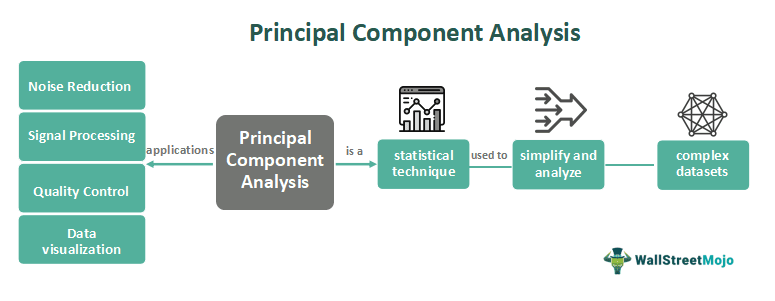

## Table of Contents

## What is Principal Component Analysis (PCA)?

Principal Component Analysis, often called PCA, is a way to simplify complex data. Imagine you have a lot of information, like measurements of different things. PCA helps you find the most important patterns in this data, so you can understand it better. It does this by creating new variables, called principal components, which are combinations of the original data. These components show the main ways the data changes, making it easier to see what's really going on.

The first principal component shows the biggest change in the data. The second one shows the next biggest change, and so on. By using just a few of these components, you can still keep most of the important information but with less complexity. This is really useful in many areas, like science, finance, and even in understanding how people behave. PCA helps you focus on what matters most in your data, without getting lost in all the details.

## Why is PCA used in data analysis?

PCA is used in data analysis because it helps make sense of big and complicated sets of information. Imagine you're trying to understand a lot of data, like different measurements or observations. PCA takes all these pieces of information and finds the most important patterns in them. It does this by creating new variables, called principal components, which are simpler ways to look at the data. These components show the main ways the data changes, so you can focus on what's really important without getting overwhelmed by all the details.

Another reason PCA is useful is that it can reduce the number of variables you need to look at. Often, data comes with many variables, which can be hard to manage and analyze. By using PCA, you can keep most of the useful information but with fewer variables. This makes it easier to see trends and relationships in the data. For example, if you're studying how different factors affect a certain outcome, PCA can help you figure out which factors matter the most, making your analysis clearer and more efficient.

## How does PCA reduce the dimensionality of data?

PCA reduces the dimensionality of data by finding the most important patterns in it. Imagine you have a lot of different measurements or observations, and you want to simplify them without losing too much information. PCA does this by creating new variables called principal components. These components are combinations of the original data that show the biggest changes or patterns. By using just a few of these principal components, you can represent the data in a simpler way, with fewer dimensions.

The first principal component captures the largest amount of variation in the data. The second one captures the next largest, and so on. This means you can often keep most of what's important in the data by using just the first few principal components. For example, if you start with 100 variables, you might find that the first 10 principal components explain most of the variation. By using these 10 components instead of the original 100 variables, you reduce the dimensionality from 100 to 10, making the data easier to understand and analyze.

## What are the main steps involved in performing PCA?

To perform PCA, you start by getting your data ready. You need to make sure all your measurements or observations are in a format that can be used for analysis. This often means making sure the data is in numbers and that it's all on the same scale, so one type of measurement doesn't overpower the others. Once your data is ready, you calculate something called the covariance matrix. This matrix shows how different parts of your data move together. From the covariance matrix, you find the eigenvalues and eigenvectors. Eigenvalues tell you how much variation each principal component captures, and eigenvectors show the direction of these components.

Next, you sort the eigenvalues from biggest to smallest. The eigenvector with the biggest eigenvalue becomes your first principal component, the one with the next biggest eigenvalue becomes your second principal component, and so on. You then choose how many principal components to keep, usually based on how much of the total variation in the data you want to capture. For example, you might decide to keep enough components to explain 95% of the variation. Finally, you transform your original data into the new space defined by these principal components. This means you multiply your data by the eigenvectors you chose, which gives you a new, simpler version of your data with fewer dimensions.

## How do you calculate the principal components in PCA?

To calculate the principal components in PCA, you start by getting your data ready. Make sure all your measurements or observations are in numbers and on the same scale. Then, you find something called the covariance matrix. This matrix shows how different parts of your data move together. From this matrix, you calculate the eigenvalues and eigenvectors. Eigenvalues tell you how much variation each principal component captures, and eigenvectors show the direction of these components.

Next, you sort the eigenvalues from biggest to smallest. The eigenvector with the biggest eigenvalue becomes your first principal component, the one with the next biggest eigenvalue becomes your second principal component, and so on. You then decide how many principal components to keep, usually based on how much of the total variation in the data you want to capture. For example, you might choose to keep enough components to explain 95% of the variation.

Finally, you transform your original data into the new space defined by these principal components. You do this by multiplying your data by the eigenvectors you chose. This gives you a new, simpler version of your data with fewer dimensions. These new dimensions are the principal components, which show the main patterns in your data.

## What is the significance of eigenvalues and eigenvectors in PCA?

In PCA, eigenvalues and eigenvectors are super important because they help us find the main patterns in our data. Think of eigenvalues as numbers that tell us how much each pattern, or principal component, matters. The bigger the eigenvalue, the more important that pattern is. Eigenvectors, on the other hand, show us the direction of these patterns. They are like arrows pointing the way the data changes the most. By looking at both eigenvalues and eigenvectors, we can figure out which patterns are the biggest and most important in our data.

When we do PCA, we first find the eigenvalues and eigenvectors from something called the covariance matrix. This matrix shows how different parts of our data move together. We then sort the eigenvalues from biggest to smallest. The eigenvector with the biggest eigenvalue becomes our first principal component, the one with the next biggest eigenvalue becomes our second principal component, and so on. By choosing the eigenvectors with the largest eigenvalues, we keep the most important patterns in our data and simplify it without losing too much information.

## How can you determine the number of principal components to retain?

To decide how many principal components to keep, you look at something called the cumulative explained variance. This is a way to see how much of the total information in your data is captured by the principal components. You add up the eigenvalues of the components, starting with the biggest one, until you reach a certain percentage, like 95% or 99%. This percentage is what you decide you need to keep, and it helps you figure out how many components to use. For example, if the first three components together explain 95% of the data's variation, you might choose to keep just those three.

Another way to decide is by using a scree plot. A scree plot is a graph that shows the eigenvalues of all the principal components, from the biggest to the smallest. You look for a point on the graph where the eigenvalues start to level off or become much smaller. This point is called the "elbow," and it suggests that the components after this point don't add much new information. So, you might choose to keep only the components before the elbow. Both methods help you simplify your data by focusing on the most important patterns without losing too much of what's important.

## What are some common applications of PCA in different fields?

PCA is used in many areas because it helps make complex data easier to understand. In the world of finance, people use PCA to look at lots of different numbers about stocks and markets. By using PCA, they can find the main patterns that affect how prices move. This helps them make better guesses about what might happen next. In science, like biology or chemistry, researchers use PCA to study things like genes or chemicals. They can see which parts of their data are most important and find connections that might be hard to see otherwise.

In the field of psychology, PCA helps scientists understand how people think and behave. They might use it to look at survey answers or test results to find the main ways people are different from each other. This can help them create simpler ways to measure things like personality or intelligence. In computer science, especially in image and face recognition, PCA is used to make computers better at recognizing patterns. By simplifying the data, computers can focus on the most important parts of an image, making their job easier and more accurate.

## How does PCA handle multicollinearity in datasets?

PCA helps deal with multicollinearity, which is when different pieces of data are closely related to each other. Imagine you're looking at data about houses, like the number of bedrooms and the size of the house. These two things are often related because bigger houses usually have more bedrooms. When data is like this, it can make it hard to see what's really important. PCA fixes this by turning these related pieces of data into new variables called principal components. These components are made so that they aren't related to each other, which makes the data easier to understand.

By using PCA, you can see the main patterns in your data without the problem of multicollinearity getting in the way. The first principal component captures the biggest pattern, and each new component captures a smaller one that's not related to the others. This way, you can focus on what's really important in your data, without being confused by all the connections between different pieces of information. So, PCA not only simplifies your data but also makes it clearer by removing the effects of multicollinearity.

## What are the limitations and potential pitfalls of using PCA?

PCA is a powerful tool, but it has some limitations. One big problem is that PCA doesn't care about the meaning of your data. It just looks for the biggest patterns, which might not always be the most important for what you're trying to find out. This can lead to missing out on important details that might be hidden in smaller patterns. Also, PCA works best with data that is spread out evenly. If your data has a lot of outliers or isn't normal, PCA might not work as well and could give you results that aren't very useful.

Another issue with PCA is that it can be hard to explain what the principal components actually mean. Because they are combinations of your original data, it can be tricky to put them into words or understand what they represent in the real world. This can make it hard to share your findings with others or use the results in practical ways. Plus, if you're not careful about how you choose the number of components to keep, you might lose important information or keep too much, making your analysis more complicated than it needs to be.

## How does PCA relate to other dimensionality reduction techniques like t-SNE or LDA?

PCA, t-SNE, and LDA are all ways to make complex data easier to understand by reducing the number of dimensions. PCA does this by finding the biggest patterns in the data and turning them into new variables called principal components. It's great for understanding how the data changes and for simplifying it without losing too much information. But PCA looks at the whole data set and doesn't care about the labels or groups within the data. This makes it good for exploring data but not as good for tasks like separating different groups.

On the other hand, t-SNE and LDA are more focused on keeping the relationships between data points, especially if those points belong to different groups. t-SNE is really good at showing how similar or different data points are to each other, making it perfect for visualizing high-dimensional data in a way that keeps the important relationships. It's often used in things like image recognition to see how similar pictures are. LDA, or Linear Discriminant Analysis, is all about finding the best way to separate different groups in your data. It's used a lot in areas like face recognition or medical diagnosis where you want to tell different classes apart. So while PCA simplifies data, t-SNE and LDA are better at keeping group differences clear.

## Can you explain how to implement PCA using a programming language like Python or R?

In Python, you can use a library called scikit-learn to do PCA. First, you need to get your data ready. Make sure it's in a format that Python can work with, like a pandas DataFrame or a NumPy array. Then, you can use the PCA class from scikit-learn. You start by importing the PCA class and creating an instance of it. You can decide how many principal components you want to keep by setting the 'n_components' parameter. After that, you fit the PCA model to your data using the 'fit' method, and then you can transform your data into the new space with the 'transform' method. This gives you a new set of data with fewer dimensions that still captures the main patterns in your original data.

In R, you can use the built-in 'prcomp' function to do PCA. First, you need to make sure your data is in a data frame. Then, you can use 'prcomp' to calculate the principal components. You pass your data to the function and can set the 'scale.' parameter to TRUE if you want to scale your data. The 'prcomp' function will give you a list that includes the principal components, the standard deviations, and the rotation matrix. You can then use the 'summary' function to see how much of the variation each component explains. To get the new data in the PCA space, you can use the '$x' part of the result from 'prcomp'. This way, you can simplify your data and focus on the most important patterns.

## Question: Can PCA be used effectively for stock selection?

Principal Component Analysis (PCA) can significantly enhance stock selection by clustering stocks according to their movement patterns, thereby aiding traders in identifying a focused subset of stocks. This process involves reducing the complexity of the dataset, enabling traders to concentrate on significant data attributes that drive these patterns. By doing so, traders can optimize performance by removing stocks that provide redundant information, ultimately leading to more effective and streamlined trading strategies.

PCA operates by transforming the original correlated variables into a smaller set of uncorrelated variables, known as principal components. These components capture the directions of maximum variance in the dataset, allowing for a more straightforward interpretation of the data. In practical terms, the first principal component will account for the greatest variance, and each subsequent component accounts for the highest variance possible under the constraint that it is orthogonal to the preceding components. Mathematically, if $\mathbf{X}$ is the data matrix, PCA seeks to determine the matrix $\mathbf{W}$ such that:

$$
\mathbf{Z} = \mathbf{XW}
$$

where $\mathbf{Z}$ represents the transformed data in the space of principal components.

Python, with its powerful libraries such as sklearn, provides robust tools for implementing PCA. Sklearn's PCA module simplifies the dimensionality reduction process. Here’s an illustration of how PCA can be used for stock data:

```python
from sklearn.decomposition import PCA
import pandas as pd
import numpy as np

# Load your dataset as a pandas DataFrame
# Assume 'data' is a DataFrame containing stock prices with rows as timestamps and columns as different stocks

# Standardizing the data
data_standardized = (data - data.mean()) / data.std()

# Initializing PCA
pca = PCA(n_components=5)  # Choosing number of components according to the explained variance

# Fitting PCA
principal_components = pca.fit_transform(data_standardized)

# Explained variance ratio can help in deciding the number of components
print(pca.explained_variance_ratio_)

# Converting to DataFrame for visualization or further processing
pc_df = pd.DataFrame(data=principal_components, index=data.index)
```

In this scenario, PCA effectively reduces the number of dimensions, clustering stock data into principal components that reflect common movement patterns. Traders can then focus attention and resources on these patterns, leading to potentially improved predictive accuracy and reduced overfitting in trading models.

While PCA is a powerful tool for dimensionality reduction and pattern identification, the trader must carefully consider the selection of components and maintain awareness of the potential trade-offs, such as the loss of some data information and interpretability of the principal components. However, when utilized appropriately, PCA serves as a beneficial tool in refining stock selection and fostering data-driven trading decisions.

## References & Further Reading

[1]: Jolliffe, I. T., & Cadima, J. (2016). ["Principal component analysis: a review and recent developments."](https://royalsocietypublishing.org/doi/10.1098/rsta.2015.0202) *Philosophical Transactions of the Royal Society A: Mathematical, Physical and Engineering Sciences*.

[2]: Marcos López de Prado. ["Advances in Financial Machine Learning"](https://www.amazon.com/Advances-Financial-Machine-Learning-Marcos/dp/1119482089). Wiley, 2018.

[3]: Shlens, J. (2014). ["A Tutorial on Principal Component Analysis."](https://arxiv.org/abs/1404.1100) *arXiv preprint arXiv:1404.1100*.

[4]: Fan, J., & Yao, Q. (2017). ["The Elements of Financial Econometrics."](https://assets.cambridge.org/97811071/91174/frontmatter/9781107191174_frontmatter.pdf) Routledge.

[5]: Hyndman, R. J., & Athanasopoulos, G. (2018). ["Forecasting: principles and practice."](https://otexts.com/fpp2/) OTexts.

[6]: Alexander, C. (2001). ["Market Models: A Guide to Financial Data Analysis."](https://www.casact.org/sites/default/files/old/marketmodels.pdf) Wiley.

[7]: J.P. Morgan & Reuters Ltd. (1996). ["RiskMetrics—Technical Document."](https://www.msci.com/documents/10199/5915b101-4206-4ba0-aee2-3449d5c7e95a) 4th Edition.

[8]: Esch, L., & Urga, G. (2004). ["Financial optimization and risk management for pension liability valuation."](https://www.researchgate.net/publication/334158531_Foundations_of_ESG_Investing_How_ESG_Affects_Equity_Valuation_Risk_and_Performance) *Insurance: Mathematics and Economics*.