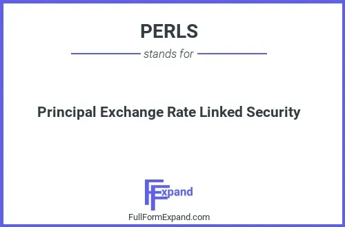

## Table of Contents

## What is a Principal Exchange Rate Linked Security (PERLS)?

A Principal Exchange Rate Linked Security, or PERLS, is a type of investment product that combines features of both stocks and bonds. It is designed to provide investors with a way to earn income while also offering the potential for capital growth. The value of PERLS is linked to the exchange rate between two currencies, which means that the returns can be affected by changes in currency values. This makes PERLS a good choice for investors who want to diversify their portfolio and take advantage of movements in the foreign exchange market.

PERLS typically pay a fixed dividend or interest payment to investors, similar to a bond. However, unlike traditional bonds, the principal amount invested in PERLS can be converted into shares of the issuing company at a predetermined price. This conversion feature adds an element of equity-like risk and reward to the investment. Because of their unique structure, PERLS can be more complex than other investment products, and they may not be suitable for all investors. It's important for anyone considering PERLS to understand the risks involved and to consult with a financial advisor.

## How does a PERLS work?

A Principal Exchange Rate Linked Security, or PERLS, is a special kind of investment that mixes features of both stocks and bonds. It works by linking its value to the exchange rate between two different currencies. This means that if the value of one currency goes up compared to the other, the value of the PERLS can change too. Investors in PERLS get regular payments, kind of like the interest you get from a bond. These payments are usually fixed, so you know how much you'll get and when.

But PERLS are different from regular bonds because they also have a feature that lets you convert your investment into shares of the company that issued the PERLS. This happens at a set price that's decided when you buy the PERLS. If the company's stock price goes up a lot, converting your PERLS into shares could be a good deal. But if the stock price stays the same or goes down, you might not want to convert, and you'll just keep getting the regular payments. Because of this, PERLS can be a bit tricky and might not be right for everyone, so it's good to talk to a financial advisor before investing.

## What are the benefits of investing in PERLS?

Investing in PERLS can give you a steady income because they pay you a fixed amount regularly, just like a bond. This can be good if you want money coming in at certain times. Also, PERLS can help you spread out your investments. Since their value depends on the exchange rate between two currencies, you can take advantage of changes in the foreign exchange market. This means you might make more money if one currency gets stronger compared to the other.

Another benefit is that PERLS give you the chance to turn your investment into shares of the company that issued them. If the company's stock price goes up a lot, you could convert your PERLS and possibly make more money. This mix of getting regular payments and the chance to own part of the company can be attractive if you want both income and the possibility of growth in your investments.

## What are the risks associated with PERLS?

Investing in PERLS can be risky because their value goes up and down with changes in currency exchange rates. If the currency you're betting on gets weaker compared to the other currency, the value of your PERLS could go down. This means you might lose money, especially if you need to sell your PERLS when the exchange rate is not in your favor.

Another risk comes from the option to convert your PERLS into company shares. If the company's stock price doesn't go up as much as you hoped, converting might not be a good idea. You could end up with shares that are worth less than what you paid for the PERLS. Plus, if the company runs into trouble, the value of both the PERLS and the shares could drop, making your investment less valuable.

Because PERLS are complex, they might be hard to understand and not right for everyone. If you don't fully understand how they work, you might make choices that don't help your investment grow. It's a good idea to talk to a financial advisor to see if PERLS fit with your investment goals and how much risk you're okay with taking.

## How is the principal amount determined in a PERLS?

The principal amount in a PERLS is the money you invest at the start. It's the amount you put in when you buy the PERLS, and it's what the regular payments are based on. This principal can change because the value of the PERLS is linked to the exchange rate between two currencies. If one currency gets stronger compared to the other, the principal amount in your PERLS might go up. But if the currency gets weaker, the principal amount could go down.

You also have the option to convert the principal amount into shares of the company that issued the PERLS. This conversion happens at a set price that's decided when you buy the PERLS. If the company's stock price goes up a lot, converting your PERLS into shares could increase the value of your investment. But if the stock price doesn't go up as much as you hoped, you might decide to keep the PERLS and just get the regular payments instead. So, the principal amount can be affected by both currency changes and the decision to convert into shares.

## What currencies are typically involved in PERLS?

PERLS usually involve major world currencies like the US dollar, the Euro, the British pound, and the Japanese yen. These are popular because they are widely traded and their exchange rates can change a lot, which can affect the value of the PERLS.

Sometimes, other currencies like the Australian dollar, the Canadian dollar, or the Swiss franc might also be used in PERLS. The choice of currencies depends on what the company issuing the PERLS thinks will be good for investors and what they expect will happen in the foreign exchange market.

## How do exchange rates affect the returns of PERLS?

Exchange rates are super important for PERLS because they decide how much money you might make or lose. If the currency you're betting on gets stronger compared to the other currency, the value of your PERLS goes up. This means you could get more money when you sell your PERLS or if you convert them into shares. But if the currency you're betting on gets weaker, the value of your PERLS goes down, and you might lose money if you need to sell them at that time.

This connection to exchange rates makes PERLS kind of like a roller coaster. The regular payments you get from PERLS stay the same, but the value of your whole investment can change a lot depending on what's happening with the currencies. If you think one currency will do better than another, PERLS can be a good way to try and make more money, but you need to be ready for the ups and downs that come with it.

## Can you explain the maturity and redemption process of PERLS?

PERLS have a set time when they end, called the maturity date. When this date comes, you have a few choices. You can get your money back, which is called redemption. The amount you get back depends on the exchange rate between the two currencies the PERLS are linked to. If the currency you're betting on got stronger, you might get more money back than you put in. But if it got weaker, you might get less.

Before the maturity date, you might also have the chance to convert your PERLS into shares of the company that issued them. This is another way to get your money out, but it depends on the stock price of the company. If the stock price went up a lot, converting could be a good choice. But if it didn't go up much, you might decide to wait until the maturity date and take the redemption value instead. It's important to know what's happening with the exchange rates and the company's stock price to make the best choice for your investment.

## What are the tax implications of investing in PERLS?

When you invest in PERLS, you need to think about taxes. The regular payments you get from PERLS are usually treated like interest from a bond. This means you have to pay tax on these payments as income. The tax rate depends on your income and where you live. If you convert your PERLS into shares, any profit you make from selling those shares later could be taxed as capital gains. The rules for capital gains tax can be different depending on how long you held the shares and your country's tax laws.

If you hold onto your PERLS until they mature and then get your money back, any profit or loss you make because of changes in the exchange rate might also be taxed. This could be treated as a foreign exchange gain or loss, and the tax treatment can vary. It's a good idea to talk to a tax advisor to understand how investing in PERLS will affect your taxes. They can help you figure out the best way to handle your investment to keep your tax bill as low as possible.

## How do PERLS compare to other foreign exchange investment products?

PERLS are different from other foreign exchange investment products because they mix features of both stocks and bonds. While other products like currency ETFs or [forex](/wiki/forex-system) trading focus mainly on changes in currency values, PERLS also give you regular payments like a bond and the chance to convert into company shares. This makes PERLS a bit more complex but also potentially more rewarding if the exchange rate and the company's stock price move in your favor.

Compared to simpler foreign exchange products, PERLS can be riskier because they depend on both currency movements and the performance of the issuing company. For example, with a currency [ETF](/wiki/etf-trading-strategies), you're betting only on the exchange rate between two currencies. But with PERLS, you also need to think about what's happening with the company's stock. This means you might make more money if everything goes well, but you could also lose more if things don't go as planned. It's important to understand these differences and maybe talk to a financial advisor to see if PERLS are right for you.

## What historical performance data is available for PERLS?

Historical performance data for PERLS can be a bit hard to find because they are not as common as other investments like stocks or bonds. But you can usually look at the past returns of specific PERLS issues if the company that issued them shares this information. This data will show how the value of the PERLS changed over time because of changes in the exchange rate between the two currencies they are linked to. You might also see how the regular payments added up and if anyone chose to convert their PERLS into shares and what happened after that.

When looking at this data, it's important to remember that past performance doesn't tell you what will happen in the future. The exchange rates and the company's stock price can change a lot, so what worked well before might not work the same way again. Still, looking at historical data can give you an idea of how risky PERLS can be and help you decide if they might be a good fit for your investment goals.

## What advanced strategies can be used to optimize returns from PERLS?

One way to get the most out of your PERLS is to keep a close eye on the exchange rates between the two currencies they are linked to. If you think one currency will get stronger compared to the other, you might want to hold onto your PERLS longer. This could mean more money when you sell them or convert them into shares. You can also use tools like currency forecasts and economic reports to help you guess what might happen with the exchange rates. By doing this, you can try to buy or sell your PERLS at the best times to make the most money.

Another strategy is to think about when to convert your PERLS into shares. If the company's stock price is going up a lot, it might be a good time to convert. But if the stock price isn't doing well, you might want to wait and just keep getting the regular payments. You can also look at the company's financial health and news about the company to help you decide. By mixing these strategies, you can try to make the most of both the currency changes and the company's stock performance.

## References & Further Reading

[1]: ["Quantitative Trading: How to Build Your Own Algorithmic Trading Business"](https://www.amazon.com/Quantitative-Trading-Build-Algorithmic-Business/dp/1119800064) by Ernest P. Chan

[2]: ["Advances in Financial Machine Learning"](https://www.amazon.com/Advances-Financial-Machine-Learning-Marcos/dp/1119482089) by Marcos Lopez de Prado

[3]: ["Machine Learning for Algorithmic Trading"](https://github.com/stefan-jansen/machine-learning-for-trading) by Stefan Jansen

[4]: Bergstra, J., Bardenet, R., Bengio, Y., & Kégl, B. (2011). ["Algorithms for Hyper-Parameter Optimization."](https://dl.acm.org/doi/10.5555/2986459.2986743) Advances in Neural Information Processing Systems 24.

[5]: ["Evidence-Based Technical Analysis: Applying the Scientific Method and Statistical Inference to Trading Signals"](https://www.amazon.com/Evidence-Based-Technical-Analysis-Scientific-Statistical/dp/0470008741) by David Aronson