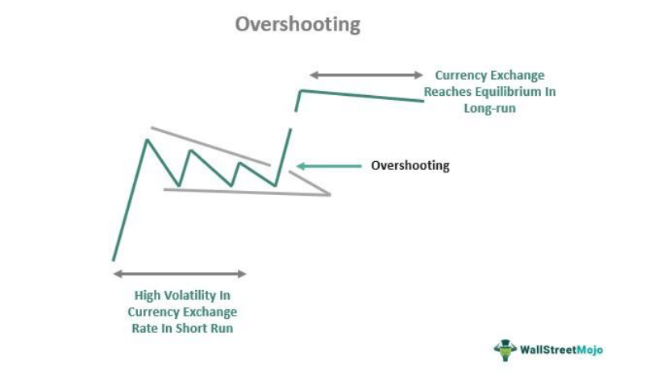

The world of finance is vast and diverse, offering a range of profitable opportunities for savvy investors. In this complex ecosystem, Principal Exchange Rate Linked securities (PERLs) and algorithmic (algo) trading stand out as significant financial instruments. PERLs offer a unique investment opportunity as they pay interest based on currency exchange rate movements, aligning their yield with fluctuations in foreign currency values relative to the U.S. dollar. This characteristic allows investors to hedge against or speculate on exchange rate changes, providing both potential opportunities and risks.

Algorithmic trading, on the other hand, uses advanced algorithms to automate and optimize trading decisions, making it an increasingly popular approach in the context of PERLs. By harnessing the speed and precision of algorithms, investors can respond swiftly to foreign exchange market dynamics, potentially enhancing the profitability and efficiency of their investment strategies.



This article aims to provide insights into the functioning of PERLs, their interaction with exchange rates, and the role of algorithmic trading in refining investment strategies. Understanding these components is crucial for investors who wish to leverage the advantages of these financial instruments while effectively managing the associated risks. In a market where currency trends and technology-driven trading continue to evolve, being well-informed can lead to more strategic decision-making and profitable outcomes.

## Table of Contents

## Understanding PERL: Principal Exchange Rate Linked Securities

Principal Exchange Rate Linked Securities (PERLs) are investment instruments that derive their value from foreign exchange rate movements. They offer a unique way to earn returns by tying both the interest payments (coupons) and the repayment of the principal amount to fluctuations in currency exchange rates, making them effectively dual currency bonds.

The principal repayment of a PERL is determined at the maturity date by comparing the value of a specified foreign currency against the U.S. dollar. For example, if the value of the chosen currency appreciates against the U.S. dollar over the investment period, the repayment in U.S. dollars could increase, potentially enhancing the investor's return. Conversely, if the foreign currency depreciates, the repayment amount could decrease.

### Functionality of PERLs as Dual Currency Bonds

A PERL functions by linking periodic coupon payments and the principal amount to the exchange rate between a chosen foreign currency and the U.S. dollar. The coupon payments can fluctuate based on the exchange rate determined at specific intervals, while the principal repayment varies depending on the exchange rate at maturity. This nature allows investors to gain exposure to the currency market and can be especially advantageous for those proficient in forecasting currency movements.

### Participants in the PERLs Market: Corporations and Speculators

Both corporations and speculators actively participate in the PERLs market, albeit with different motivations:

1. **Corporations**: Companies with international exposure or revenue streams in multiple currencies may use PERLs as a hedging tool. By investing in PERLs, they can protect against adverse currency movements that might affect their operational profits. For instance, a multinational corporation expecting receivables in a foreign currency could invest in PERLs tied to that currency to offset potential losses due to currency depreciation.

2. **Speculators**: These market participants are primarily interested in the potential gains from currency fluctuations. They buy PERLs with the expectation that the foreign currency will move favorably, thus enhancing their returns when the investment matures. Speculators may rely on technical analysis, economic indicators, and political events to predict currency movements and position their PERLs investments accordingly.

PERLs represent a nuanced blend of fixed-income securities and foreign exchange exposure, making them a compelling choice for both hedging strategies and speculative opportunities. The effectiveness of investing in PERLs hinges on understanding the underlying exchange rate dynamics and accurately forecasting currency trends.

## Exchange Rate Dynamics and PERLs

Exchange rates significantly influence the yield of Principal Exchange Rate Linked securities (PERLs), as these instruments inherently depend on currency valuations. PERLs are designed such that both the interest payments and the principal amount at maturity are affected by fluctuations in exchange rates.

When the U.S. dollar appreciates relative to the specified foreign currency, the value of the currency used to determine the repayment decreases. This results in a lower payout for investors holding PERLs in their portfolio since the principal and interest payments are worth less in U.S. dollar terms. Conversely, if the U.S. dollar depreciates against the foreign currency, the value of payments in U.S. dollar terms increases, potentially enhancing the yield for the investor.

To provide an analytical perspective, consider a PERL that links its repayments to the exchange rate of the Euro (EUR) against the U.S. dollar (USD). If, at the time of repayment, the USD/EUR exchange rate shifts from 1.10 to 1.20, it indicates a depreciation of the dollar against the euro. Consequently, the investor receives more in dollar terms, effectively increasing their return.

Reverse PERLs introduce an opposite relationship wherein their yields decrease when the foreign currency strengthens against the U.S. dollar, and increase when the foreign currency weakens against the U.S. dollar. This type of security can be used strategically to hedge against currency depreciation or to bet on the [volatility](/wiki/volatility-trading-strategies) of the U.S. dollar.

In real-world scenarios, suppose a U.S. investor has purchased a PERL linked to the Japanese Yen (JPY) at a time when the dollar is strong. If over the period the dollar weakens (say from a rate of 1 USD = 110 JPY to 1 USD = 105 JPY), the return on their investment would increase when converted back to dollars. However, if the market trends reverse and the dollar appreciates, the investor's earnings could significantly decrease, showcasing the high volatility inherent in these instruments.

Overall, exchange rate movements are a cornerstone in the pricing and yield determination of PERLs. Investors must remain vigilant, monitoring currency trends and employing various financial tools to mitigate risks associated with currency fluctuations. These dynamics necessitate a comprehensive understanding of foreign exchange markets to optimize returns on PERL investments effectively.

## The Role of Algorithmic Trading in PERL Investments

Algorithmic trading, often referred to as algo trading, has become an essential component in the trading of financial instruments like Principal Exchange Rate Linked securities (PERLs). The integration of sophisticated algorithms allows investors to execute trades with greater precision and speed, accommodating the volatile and dynamic nature of foreign exchange markets critical to PERLs.

Algorithms employed in PERL investments are adept at tracking and interpreting foreign exchange movements. They are programmed to execute trades when specific conditions are met, often far faster than a human trader could. This capability provides a significant edge, as foreign exchange rates can be highly volatile, and opportunities need to be acted upon instantly. By constantly monitoring market data and applying pre-established rules, these algorithms optimize investment decisions, ensuring that traders can enter and [exit](/wiki/exit-strategy) positions at the most opportune moments.

The deployment of algorithmic strategies in PERL investments encompasses various techniques, such as [backtesting](/wiki/backtesting) and high-frequency trading ([HFT](/wiki/high-frequency-trading-strategies)). Backtesting is crucial, allowing traders to evaluate the performance of a trading strategy using historical data. This process helps in fine-tuning strategies by testing multiple scenarios before committing real capital. High-frequency trading, on the other hand, involves executing a large number of orders at extremely high speeds. In the context of PERLs, HFT can capture minor price differences that may arise due to currency fluctuations, thus enhancing profitability.

Several algorithm types are employed in currency-based investments, including trend-following algorithms, [arbitrage](/wiki/arbitrage) strategies, and [machine learning](/wiki/machine-learning) models. Trend-following algorithms are used to identify and capitalize on [momentum](/wiki/momentum) in exchange rate movements. Arbitrage strategies exploit price discrepancies between different markets or instruments, providing risk-free profit opportunities. Machine learning models, with their capacity to learn from data and improve over time, are increasingly used for predicting future currency movements and adjusting trading strategies accordingly.

Python is a popular programming language for implementing such algorithms due to its extensive libraries and frameworks supporting data analysis, machine learning, and financial modeling. Here’s a simple example of how a moving average crossover strategy, a type of trend-following algorithm, might be implemented for trading PERLs based on currency movements:

```python
import pandas as pd
import numpy as np

# Load historical exchange rate data
data = pd.read_csv('exchange_rates.csv')

# Calculate short-term and long-term moving averages
data['Short_MA'] = data['Exchange_Rate'].rolling(window=20).mean()
data['Long_MA'] = data['Exchange_Rate'].rolling(window=50).mean()

# Generate trading signals
data['Signal'] = 0
data['Signal'][20:] = np.where(data['Short_MA'][20:] > data['Long_MA'][20:], 1, -1)

# Identify trading positions
data['Position'] = data['Signal'].shift(1)

print(data[['Exchange_Rate', 'Short_MA', 'Long_MA', 'Signal', 'Position']].tail())
```

This script calculates short-term and long-term moving averages of exchange rates and generates trading signals when the short-term average crosses the long-term average, indicative of a trend change. By automating such strategies, traders can efficiently manage their PERL investments, potentially increasing profitability and minimizing the risks associated with human error.

In conclusion, [algorithmic trading](/wiki/algorithmic-trading) provides substantial advantages in managing PERL investments. It allows investors to automate complex calculations and respond swiftly to foreign exchange fluctuations, aligning with predefined strategies. The blend of high-frequency execution, backtesting, and predictive algorithms can significantly enhance profitability in the currency-linked domain of PERLs.

## Benefits and Risks of Investing in PERLs

Principal Exchange Rate Linked Securities (PERLs) offer investors the benefit of currency diversification, which can strengthen a portfolio against domestic market volatility. By investing in PERLs, investors can gain exposure to foreign currencies, which may act as a buffer when the domestic market experiences downturns. This diversification is particularly valuable in stabilizing investment returns over time, especially in unpredictable economic conditions.

Despite their advantages, PERLs come with inherent risks, primarily currency risk and [interest rate](/wiki/interest-rate-trading-strategies) risk. Currency risk arises from fluctuations in foreign exchange rates, which can affect both the interest and principal payments of PERLs. If the U.S. dollar appreciates against the foreign currency linked to a PERL, the amount received upon maturity may be less valuable, affecting returns. Conversely, a depreciating U.S. dollar may enhance the investment's value. Interest rate risk is another critical [factor](/wiki/factor-investing), influenced by changes in prevailing market interest rates. As rates increase, the present value of future PERL payments may decrease, potentially reducing their attractiveness compared to other fixed-income securities.

To manage these risks effectively, investors need to understand the broader market conditions that influence currency and interest rate movements. This involves analyzing economic indicators, geopolitical events, and central bank policies, which can all have significant impacts on exchange rates. Investors should also consider hedging strategies to mitigate potential adverse effects. For instance, currency options and forwards can provide a way to lock in exchange rates, protecting against unfavorable currency movements.

Best practices for risk management in PERL investments include diversifying the currencies within the investment portfolio to reduce dependence on a single currency's performance. Regularly reviewing the portfolio and adjusting the balance between different foreign currencies can help maintain an optimal risk-reward ratio. Additionally, employing a disciplined, systematic approach to investment decision-making, potentially enhanced by algorithmic trading tools, can ensure that investors respond proactively to changing market dynamics.

By adopting these strategies, investors can achieve informed and strategic decision-making, maximizing the potential benefits of PERLs while effectively managing the accompanying risks.

## Strategies for Successful PERL and Algo Trading

Investors looking to maximize their returns from Principal Exchange Rate Linked Securities (PERLs) can benefit significantly by integrating algorithmic trading strategies. Algorithmic trading offers efficiency and precision, enabling investors to capitalize on exchange rate movements and market trends more effectively. Here are some strategies and tips for leveraging algorithmic trading in the context of PERL investments:

### Tailoring PERL Investment Strategies with Algorithmic Trading

1. **Exchange Rate Forecasting Models**:
   To enhance PERL returns, investors can employ sophisticated forecasting models that predict changes in exchange rates. Algorithms can analyze historical data, economic indicators, and market sentiment to generate forecasts. For instance, a basic model might involve using ARIMA (AutoRegressive Integrated Moving Average) techniques, which are popular for time series forecasting.

   ```python
   import pandas as pd
   from statsmodels.tsa.arima.model import ARIMA

   # Example data loading
   exchange_rate_data = pd.read_csv('exchange_rate_data.csv', parse_dates=['Date'], index_col='Date')

   # Fit ARIMA model
   model = ARIMA(exchange_rate_data, order=(5, 1, 0))  # ARIMA(p,d,q)
   model_fit = model.fit()

   # Forecasting
   forecast = model_fit.forecast(steps=10)
   ```

2. **Market Trend Analysis**:
   Exploiting market trends involves identifying patterns such as moving averages or MACD (Moving Average Convergence Divergence) to time PERL transactions. Automated systems can be designed to execute trades based on these signals, enhancing the decision-making process.

   ```python
   # Example of calculating moving average
   short_rolling = exchange_rate_data.rolling(window=20).mean()
   long_rolling = exchange_rate_data.rolling(window=50).mean()
   ```

### Tips for Beginners on Starting with Algo Trading

1. **Understanding Basics**:
   Beginners should start by grasping the fundamental concepts of algorithmic trading and PERLs. Online courses, [books](/wiki/algo-trading-books), and webinars can provide an initial learning platform.

2. **Starting Small**:
   Initiate trading with small amounts of capital to understand the dynamics of algorithmic trading without substantial financial risk. This approach allows for experimentation with various strategies.

3. **Simulated Trading Platforms**:
   Utilize simulated trading environments to practice algorithmic trading strategies. These platforms offer risk-free opportunities to backtest strategies and understand market mechanics better.

### Resources and Tools for Algo Trading and Forex Analytics

1. **Automated Trading Platforms**:
   Tools like MetaTrader, NinjaTrader, and QuantConnect offer robust platforms for developing and executing trading algorithms. MetaTrader, for instance, provides a wealth of resources for [forex](/wiki/forex-system) trading and strategy backtesting.

2. **Data Analytics Software**:
   Utilizing software such as Matlab, R, or Python with libraries like Pandas, NumPy, and SciPy can enhance data analysis capabilities. These tools aid in processing market data and building predictive models.

3. **API Services for Real-Time Data**:
   Access to real-time exchange rate data APIs (e.g., from Alpha Vantage or OANDA) is essential for implementing real-time trading strategies. APIs provide up-to-date market information, which is crucial for timely decision-making.

By integrating algorithmic trading strategies with PERL investments, investors can systematically manage risks and exploit market opportunities. The combination offers a pathway to potential growth while navigating the complexities of foreign exchange dynamics. Continuous learning and adaptation are essential to refining these strategies and achieving sustained investment success.

## Conclusion

The integration of Principal Exchange Rate Linked securities (PERLs) with algorithmic trading represents a compelling investment strategy in today's intricate financial landscape. PERLs, with their unique structure of linking interest and principal payments to foreign exchange rates, offer investors a dual benefit of exposure to currency markets and potential returns not typically found in standard fixed-income instruments. The adoption of algorithmic trading further enhances these advantages by providing automation, precision, and the ability to efficiently manage and respond to the dynamic fluctuations inherent in currency markets.

Algorithmic trading systems can analyze vast datasets and swiftly execute trades, thereby capitalizing on minor discrepancies in exchange rates that might impact PERL yields. The marriage of these technologies allows investors to harness real-time data and implement sophisticated trading strategies, ultimately leading to optimized investment outcomes.

While the complexity of global currency markets presents both opportunities and challenges, robust risk management practices remain crucial. Investors must continuously educate themselves and adapt to evolving market conditions to mitigate risks associated with currency volatility and interest rate fluctuations. Such diligence ensures informed decision-making and sustainable investment success.

Balancing risks and rewards is vital when navigating the foreign exchange and financial securities landscape. While PERLs and algorithmic trading offer growth potential, they also require a thorough understanding of market mechanics and the use of advanced tools and strategies to safeguard against potential losses. By maintaining a strategic approach and leveraging the full capabilities of technology, investors can position themselves advantageously to benefit from these advanced financial instruments.

## References & Further Reading

[1]: ["Quantitative Trading: How to Build Your Own Algorithmic Trading Business"](https://www.amazon.com/Quantitative-Trading-Build-Algorithmic-Business/dp/1119800064) by Ernest P. Chan

[2]: ["Advances in Financial Machine Learning"](https://www.amazon.com/Advances-Financial-Machine-Learning-Marcos/dp/1119482089) by Marcos Lopez de Prado

[3]: ["Machine Learning for Algorithmic Trading"](https://github.com/stefan-jansen/machine-learning-for-trading) by Stefan Jansen

[4]: Bergstra, J., Bardenet, R., Bengio, Y., & Kégl, B. (2011). ["Algorithms for Hyper-Parameter Optimization."](https://dl.acm.org/doi/10.5555/2986459.2986743) Advances in Neural Information Processing Systems 24.

[5]: ["Evidence-Based Technical Analysis: Applying the Scientific Method and Statistical Inference to Trading Signals"](https://www.amazon.com/Evidence-Based-Technical-Analysis-Scientific-Statistical/dp/0470008741) by David Aronson