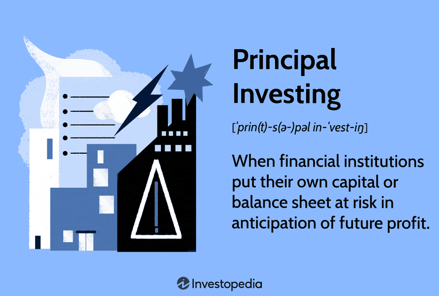

## Table of Contents

## What is principal investing?

Principal investing is when a company or an investor uses their own money to buy things like stocks, real estate, or businesses. Instead of just giving money to others to invest, they directly put their money into these assets hoping to make a profit. This kind of investing can be riskier because the investor's money is directly on the line, but it can also lead to bigger rewards if the investments do well.

For example, a big company might use its own money to buy a smaller company that it thinks will grow a lot. If the smaller company does well, the big company can make a lot of money. But if the smaller company doesn't do well, the big company could lose the money it invested. This is different from other types of investing where a company might just give money to a fund manager and let them decide where to invest it.

## How does principal investing differ from other types of investing?

Principal investing is when an investor uses their own money to directly buy assets like stocks, real estate, or businesses. This is different from other types of investing where an investor might give their money to a fund manager or a financial institution to invest on their behalf. In principal investing, the investor has full control over what they buy and how they manage their investments, which can be both a big advantage and a big responsibility.

Other types of investing, like mutual funds or ETFs, involve pooling money from many investors and having a professional manage that money. The investor in these cases doesn't decide which specific stocks or assets to buy; instead, they rely on the expertise of the fund manager. This can be less risky because the investment is spread out over many different assets, but it also means the investor has less control and might not get as high returns as they could with principal investing.

In summary, principal investing is more hands-on and potentially more rewarding, but it also comes with higher risks because the investor's money is directly at stake. Other types of investing offer more diversification and professional management, which can be safer but might not lead to the same level of personal control or potential profit.

## What are the main types of principal investments?

Principal investments can be grouped into a few main types. The first type is direct equity investments, where an investor buys shares in a company directly. This could mean buying stocks in a public company on the stock market or investing in a private company that's not listed on any exchange. The goal here is to own a part of the company and benefit from its growth and profits.

Another type of principal investment is real estate. This involves buying properties like houses, apartments, or commercial buildings. Investors might rent these properties out to earn regular income, or they might buy them to sell later at a higher price. Real estate can be a good way to make money, but it also requires a lot of work to manage the properties.

The third type is venture capital and private equity. These are investments in new or growing businesses. Venture capital usually goes into very young companies with big potential, while private equity often involves buying a bigger stake in more established companies. Both aim to help these businesses grow and then sell the investment for a profit.

## Who typically engages in principal investing?

Principal investing is often done by big companies and rich people. These companies might use their own money to buy other businesses or invest in new projects. They do this because they think it will help them grow and make more money in the future. Rich people, or high-net-worth individuals, also do principal investing. They might buy stocks, real estate, or start new businesses with their own money. They like having control over their investments and the chance to make big profits.

Sometimes, smaller investors also get into principal investing. They might not have as much money to spend, but they can still buy stocks or small pieces of real estate. They do this because they want to be in charge of their own money and try to make it grow. But it's riskier for them because they don't have as much money to lose. So, principal investing is mostly for those who have a lot of money and can handle the risks that come with it.

## What are the risks associated with principal investing?

Principal investing can be risky because you're using your own money to buy things like stocks, real estate, or businesses. If these investments don't do well, you could lose a lot of money. For example, if you buy a company and it fails, you won't get your money back. It's different from other types of investing where your money is spread out over many things, which can make it safer. With principal investing, all your money might be tied up in one thing, so if it goes bad, you're in trouble.

Another risk is that you need to know a lot about what you're investing in. If you don't understand the business or the market, you might make bad choices. It's like trying to fix a car without knowing how engines work. You could end up making things worse. Plus, principal investing can tie up your money for a long time. You might not be able to sell your investment quickly if you need cash, which can be a problem if something unexpected happens and you need money fast.

## How can one start with principal investing?

To start with principal investing, you first need to have some money saved up. This could be money you've earned from your job or money you've saved over time. Once you have some money, you need to decide what you want to invest in. You could buy stocks in a company you believe in, buy a piece of real estate, or even start your own business. It's important to do a lot of research before you invest. You need to understand the business or the property you're buying so you can make a smart choice.

After you've done your research, you can start making your investments. If you're buying stocks, you can open an account with a brokerage firm and buy shares of the company you like. If you're buying real estate, you'll need to find a property, maybe get a loan, and then buy it. Starting a business might mean writing a business plan and finding investors or using your own money. Remember, principal investing can be risky, so it's a good idea to start small and learn as you go. That way, you can get better at it without losing too much money if things don't go as planned.

## What are the key strategies used in principal investing?

One key strategy in principal investing is doing a lot of research before you invest. This means learning everything you can about the company or property you want to buy. You need to understand how the business makes money, who its customers are, and what could go wrong. For real estate, you need to know about the neighborhood, how much similar properties cost, and if there's a good chance to make money by renting it out or selling it later. The more you know, the better choices you can make.

Another strategy is to spread your money around, or diversify. Instead of putting all your money into one thing, you can invest in a few different companies or properties. This way, if one investment doesn't do well, you won't lose everything. It's like not putting all your eggs in one basket. Diversifying can help you manage risk and maybe make more money over time.

A third strategy is to have a long-term plan. Principal investing often means you won't see big profits right away. You need to be patient and ready to hold onto your investments for a long time. This could mean keeping stocks for years or holding onto a piece of real estate until the right time to sell comes along. Having a long-term plan helps you stay calm even if the market goes up and down, and it can lead to bigger rewards in the end.

## How do regulatory environments affect principal investing?

Regulatory environments can have a big impact on principal investing. Different countries and regions have their own rules about what you can and can't do with your money. For example, some places might have strict rules about buying and selling stocks or real estate. These rules are there to protect people and make sure the market is fair, but they can also make it harder for investors to do what they want. If the rules change, it might affect how much money you can make or what kind of investments you can make. So, it's important for investors to keep up with these rules and understand how they might change their plans.

Also, regulatory environments can affect the risk of principal investing. In some places, the government might step in to help if an investment goes bad, like with certain types of loans or investments. But in other places, if you lose money, you're on your own. This means that the rules can change how risky an investment feels. Investors need to think about these rules when deciding where to put their money. Knowing the regulatory environment can help you pick the right places to invest and understand the risks you're taking.

## What role does due diligence play in principal investing?

Due diligence is really important in principal investing. It means doing a lot of homework before you put your money into something. You need to check everything about the company or property you want to buy. This includes looking at their money records, understanding their business plan, and figuring out if they have any big problems. By doing this, you can see if the investment is a good idea or if it's too risky. It's like checking a car before you buy it to make sure it's not going to break down.

If you skip due diligence, you might end up losing a lot of money. Imagine buying a house without checking if it has any hidden problems like a leaky roof or bad wiring. You could end up spending more money to fix it than you planned. The same goes for investing in a business without knowing if it's doing well or if it's in trouble. Doing your homework helps you make smarter choices and avoid big mistakes. So, due diligence is a key part of principal investing that can help you protect your money and find good opportunities.

## How do principal investors manage and exit their investments?

Principal investors manage their investments by keeping a close eye on them. They might sit on the board of a company they've invested in, helping to make big decisions. For real estate, they might handle things like fixing up the property or finding tenants. They always try to make their investments grow by making smart choices. Sometimes, they might need to put in more money or change their plans if something isn't working out. It's all about staying involved and making sure the investment is doing well.

When it's time to [exit](/wiki/exit-strategy) an investment, principal investors have a few options. They might sell their shares in a company to someone else, or they might take the company public by selling shares on the stock market. For real estate, they could sell the property to another buyer or even to a real estate investment trust. The goal is to sell at the right time to make a good profit. Exiting an investment can be tricky because you need to find the right buyer and get a good price. But if done right, it can be the part where the investor finally sees a big return on their money.

## What are some successful case studies of principal investing?

One successful case of principal investing is when Warren Buffett's company, Berkshire Hathaway, bought See's Candies in 1972. Buffett paid $25 million for the company, which was a lot of money back then. But See's Candies was a good business with a strong brand and loyal customers. Over the years, the company made a lot of money for Berkshire Hathaway. By 2007, See's had earned over $1.6 billion in profits. This shows how principal investing can work well if you pick a good company and hold onto it for a long time.

Another example is when Blackstone, a big investment firm, bought Hilton Hotels in 2007. They paid $26 billion, which was a huge amount. At first, things were tough because of the financial crisis that happened soon after. But Blackstone stuck with Hilton and helped it grow. They made a lot of changes to make the hotels better and more profitable. In 2013, Blackstone took Hilton public, selling shares on the stock market. By 2018, they had made over $14 billion in profit from their investment. This shows that even when things get hard, principal investing can still pay off if you're patient and make smart choices.

## What advanced techniques can be used to optimize returns in principal investing?

One advanced technique to optimize returns in principal investing is to use leverage. This means borrowing money to invest more than you could with just your own money. If you're smart about it, using leverage can make your profits bigger. For example, if you buy a property with a loan and the property goes up in value, you can make more money than if you had only used your own money. But it's risky because if the investment goes down, you could lose more money than you started with. So, it's important to be careful and understand the risks when using leverage.

Another technique is to use data analytics and technology to make better investment choices. This means using computers and special software to look at a lot of information quickly. You can find patterns and trends that might be hard to see otherwise. For example, you might use data to figure out which neighborhoods are likely to grow in value or which companies are doing well. By using this information, you can pick investments that are more likely to make money. But it's not just about the technology; you still need to understand the businesses and markets you're investing in to make the best use of the data.

## References & Further Reading

[1]: Bergstra, J., Bardenet, R., Bengio, Y., & Kégl, B. (2011). ["Algorithms for Hyper-Parameter Optimization."](https://dl.acm.org/doi/10.5555/2986459.2986743) Advances in Neural Information Processing Systems 24.

[2]: ["Advances in Financial Machine Learning"](https://www.amazon.com/Advances-Financial-Machine-Learning-Marcos/dp/1119482089) by Marcos Lopez de Prado.

[3]: ["Evidence-Based Technical Analysis: Applying the Scientific Method and Statistical Inference to Trading Signals"](https://www.amazon.com/Evidence-Based-Technical-Analysis-Scientific-Statistical/dp/0470008741) by David Aronson.

[4]: ["Machine Learning for Algorithmic Trading"](https://github.com/stefan-jansen/machine-learning-for-trading) by Stefan Jansen.

[5]: ["Quantitative Trading: How to Build Your Own Algorithmic Trading Business"](https://www.amazon.com/Quantitative-Trading-Build-Algorithmic-Business/dp/1119800064) by Ernest P. Chan.

[6]: Asness, C. S., Liew, J. M., & Krail, R. J. (2001). ["Do Hedge Funds Hedge?"](https://www.aqr.com/-/media/AQR/Documents/Journal-Articles/JPM-Do-Hedge-Funds-Hedge.pdf?sc_lang=en) The Review of Financial Studies, 14(1), 411-441.

[7]: Pástor, Ľ., Stambaugh, R. F., & Taylor, L. A. (2020). ["Fund tradeoffs."](https://www.sciencedirect.com/science/article/pii/S0304405X20303512) National Bureau of Economic Research.

[8]: Silber, W. L. (1984). ["Marketmaker Behavior in an Auction Market: An Analysis of Scalpers in Futures Markets."](https://onlinelibrary.wiley.com/doi/10.1111/j.1540-6261.1984.tb03886.x) The Journal of Finance, 39(4), 937-953.