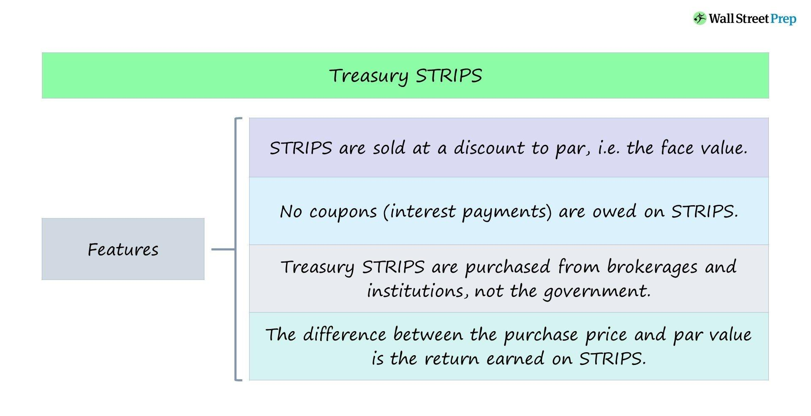

In the world of finance, having a comprehensive understanding of the various instruments available is crucial for investors aiming to make informed decisions. Among these complex instruments is the Principal-Only (PO) strip, a specific type of fixed-income security that originates from mortgage-backed securities (MBS). PO strips represent a unique investment opportunity as they allow investors to receive only the principal repayments from a pool of underlying mortgages, as opposed to also receiving interest payments. 

This article aims to provide an in-depth exploration of PO strips, highlighting their peculiar characteristics and roles in the investment landscape. We will examine how these securities are increasingly being utilized within the realm of algorithmic trading, a field that uses computer algorithms to optimize trading decisions and enhance returns. As technology continues to advance, algorithmic trading has begun to reshape the way financial products like PO strips are used and analyzed, offering new strategies and benefits to investors.



Understanding the mechanics and benefits of PO strips is essential for appreciating their role in the financial markets today. These instruments not only offer diversification opportunities but also provide protection against certain risks, such as contraction risk. As we explore the intricacies of PO strips, we will also consider how the algorithmic trading landscape is influencing their utilization and effectiveness in contemporary finance. This foundational overview sets the stage for a deeper investigation into the relevance and potential of PO strips within the dynamic environment of modern financial markets.

## Table of Contents

## What are Principal-Only (PO) Strips?

Principal-Only (PO) strips are a distinct type of fixed-income security derived from mortgage-backed securities (MBS) through a process known as "stripping." In this process, the cash flows from a pool of mortgages are divided into two separate components: principal-only (PO) strips and interest-only (IO) strips. This separation allows investors to target particular aspects of the mortgage repayment stream, tailoring investment strategies according to their preferences and risk tolerance.

PO strips are designed such that the investor receives only the principal repayments from the underlying securities. These cash flows are predictable, provided there are no defaults, making them particularly appealing to investors seeking a stable income source. The value of a PO strip is intrinsically linked to the principal component of the underlying loans, with its returns derived solely from the scheduled and early repayments of principal.

The creation of PO strips is typically associated with mortgage-backed securities (MBS) due to the significant loan amounts involved and the regularity of repayments typical in these instruments. When banks and financial institutions securitize a mortgage pool, they have the option to split the cash flows into IO and PO strips. PO strips specifically focus on the principal component, while IO strips pertain to the interest component. This division facilitates targeted investment and risk management strategies.

PO strips offer protection against contraction risk, which occurs when borrowers pay off their mortgages faster than expected, usually in response to declining interest rates. Since PO strips benefit from early repayment, they can provide a hedge in such scenarios. When borrowers refinance or otherwise early pay their mortgages, PO strip investors receive their principal faster, which can augment returns.

The mechanics of PO strips involve calculating the present value of expected future principal repayments, discounted at a rate reflective of prevailing interest rates and perceived risks. This calculation assesses the value of cash flows PO investors are entitled to receive. The equation for determining the present value $PV$ of expected cash flows $CF_t$ in a PO strip is:

$$

PV = \sum_{t=1}^{n} \frac{CF_t}{(1 + r)^t} 
$$

Where:
- $CF_t$ is the expected cash flow at time $t$,
- $r$ is the discount rate,
- $n$ is the total number of periods until maturity.

Advantages of PO strips as an investment vehicle include the potential for regular cash flow and insulation from [interest rate](/wiki/interest-rate-trading-strategies) [volatility](/wiki/volatility-trading-strategies), assuming early repayments occur as anticipated. However, understanding the prepayment speeds, which can be influenced by factors such as changes in interest rates and borrowers' refinancing behavior, is crucial in valuing and managing investments in PO strips effectively.

## How PO Strips Work

Principal-Only (PO) strips are derived from mortgage-backed securities (MBS) by separating the principal and interest components into distinct securities. This separation process results in the creation of PO strips, which distribute cash flows solely from the principal repayments of the underlying loans. In contrast, Interest-Only (IO) strips cater exclusively to interest payments.

The core principle of PO strips lies in their sensitivity to prepayment speeds and interest rate fluctuations. Investors holding PO strips benefit from accelerated prepayments. For example, in a declining interest rate environment, borrowers are incentivized to refinance their mortgages, leading to quicker repayment of the loan's principal. This effectively enhances the cash flow stream to PO strip holders as they receive a return of principal sooner than anticipated.

To illustrate how PO strips generate cash flows, consider a scenario where a mortgage-backed security is initially structured. As homebuyers make their monthly mortgage payments, the principal and interest portions are split. The principal portion funnels into PO strips. Assume a 30-year mortgage with an outstanding principal balance of $100,000 and a fixed interest rate of 4%. If the borrower prepays the entire principal due to favorable refinancing options, the PO strip holder would promptly receive the $100,000, realizing a quicker return on investment.

Investors may use various tools to predict and model prepayment speeds. One common model is the Public Securities Association (PSA) prepayment model, which provides a benchmark for estimating how quickly loans within a mortgage pool will be paid off.

```python
def calculate_cash_flows(principal_balance, interest_rate, prepayment_speed):
    # Example calculation of cash flows for PO strips
    cash_flows = []
    remaining_principal = principal_balance
    for month in range(360):  # for a 30-year mortgage
        prepayment_amount = remaining_principal * prepayment_speed / 100
        remaining_principal -= prepayment_amount
        cash_flows.append(prepayment_amount)
        if remaining_principal <= 0:
            break
    return cash_flows

# Example usage
principal_balance = 100000  # $100,000 principal
interest_rate = 0.04  # 4% interest rate
prepayment_speed = 2.0  # 2% monthly prepayment speed
cash_flows = calculate_cash_flows(principal_balance, interest_rate, prepayment_speed)
print(cash_flows)
```

This code snippet demonstrates how the prepayment speed influences cash flows for a PO strip investor. With specific assumptions, such as principal balance, interest rate, and prepayment speed, investors can dynamically assess their expected cash flows and adjust their strategies accordingly.

In summary, PO strips are a targeted investment vehicle that enables investors to speculate on future interest rate changes and loan prepayment patterns. By isolating the principal component, PO strips present an opportunity for investors to manage interest rate risk while capturing earlier returns in a declining interest rate environment.

## PO Strips vs. Interest-Only Strips

Understanding the contrast between Principal-Only (PO) and Interest-Only (IO) strips is crucial for investors specializing in mortgage-backed securities (MBS). These financial instruments are the result of stripping MBS into two separate cash flow components: one for the principal payments and another for the interest payments. This separation allows investors to target specific risks and opportunities based on interest rate expectations and prepayment behaviors.

IO strips generate income from the interest component of the underlying mortgage loans. Their value is inherently tied to the stability or upward movement of interest rates. In an environment where interest rates are stable or rising, the likelihood of mortgage prepayments decreases, leading to prolonged interest payments. Consequently, IO strip holders benefit from a steady cash flow for a more extended period. This makes IO strips particularly appealing to investors who anticipate little change or an increase in interest rates, thus maximizing the returns from continuous interest payments.

On the other hand, PO strips benefit when interest rates decline. A drop in interest rates often leads to borrowers refinancing their mortgages at lower rates, resulting in higher prepayment rates. This scenario allows PO strip holders to recoup their principal investment faster. The swifter return of capital tends to enhance the attractiveness of PO strips when the interest rate environment is forecasted to decrease. For example, a decline in interest rates might encourage a surge in prepayments, which increases the cash flow received by the holders of PO strips earlier than expected.

The inverse relationship between IO and PO strips concerning interest rate fluctuations is a critical concept. As interest rates rise, the potential for long-term interest inflow makes IO strips more valuable, whereas PO strips may yield lower returns due to slower principal repayments. Conversely, when interest rates fall, IO strips stand to lose value as prepayments accelerate, while PO strips gain from the expedited return of principal.

Investors often employ a combination of both PO and IO strips to construct a diversified portfolio that can better withstand interest rate volatility. This strategic mix allows investors to hedge their exposure by taking advantage of the compensating characteristics of PO and IO strips. By understanding and leveraging the inverse relationship between these two types of strips, investors can create robust investment strategies that optimize their returns under varying interest rate scenarios.

## Algorithmic Trading and PO Strips

With advancements in technology, [algorithmic trading](/wiki/algorithmic-trading) has become a significant player in the financial markets, transforming how trading strategies are executed and optimized. In the context of Principal-Only (PO) strips, algorithmic trading presents unique opportunities.

Algorithmic trading employs complex algorithms to automate and optimize the decision-making process of buying or selling securities, aiming to execute trades at the most advantageous prices. For PO strips, this involves analyzing vast amounts of data to predict price movements and interest rate fluctuations that affect the valuation and yields of these securities.

### Algorithmic Strategies for PO Strips

Several algorithmic trading strategies can be adapted to trade PO strips effectively. Trend-following algorithms, for instance, can be employed to capture [momentum](/wiki/momentum) in PO strip prices, analyzing historical data to detect patterns and trends. These algorithms might use moving averages or linear regression to predict future price directions.

Another approach is mean-reversion strategies, which are based on the assumption that PO strip prices will revert to their historical average over time. These strategies involve identifying overbought or oversold conditions and executing trades to capitalize on these anomalies.

High-frequency trading ([HFT](/wiki/high-frequency-trading-strategies)) strategies could also be applied to PO strips, leveraging small price discrepancies that exist for very short periods. Although HFT requires significant computational power and low-latency systems, the integration with PO strips can yield profits by exploiting both minute price differentials and rapid changes in prepayment rates.

### Data Science and Machine Learning

The incorporation of data science and [machine learning](/wiki/machine-learning) significantly enhances the capability of algorithms trading PO strips. Machine learning models, such as neural networks or decision trees, can be trained on historical market data to forecast interest rate changes and prepayment speeds, which are crucial for PO strip valuations. Techniques such as [reinforcement learning](/wiki/reinforcement-learning) can further refine trading strategies by allowing models to iteratively learn from trading outcomes and improve decision-making processes.

Innovative data analytics tools help traders process and visualize large datasets, uncovering hidden patterns that human traders might overlook. This ensures that algorithms are not only reacting to market changes but also predicting and adapting to them proactively.

In conclusion, algorithmic trading, powered by advanced data science and machine learning techniques, offers significant potential to optimize trading strategies for Principal-Only strips. By automating decision-making and enhancing predictive accuracy, these technologies can efficiently manage the complexities and exploit the opportunities within the PO strip market.

## Advantages and Risks of Investing in PO Strips

Principal-Only (PO) strips present several advantages that make them appealing to investors. One primary benefit is their protection against contraction risk, which refers to the risk of a bond's life shortening due to increased prepayments. PO strips benefit in environments where interest rates fall, as this typically accelerates the prepayment rates of underlying mortgages. Consequently, investors receive their principal back quicker, enhancing the return on investment for PO strip holders. This characteristic makes PO strips an attractive option for those predicting a decline in interest rates.

However, like all financial instruments, PO strips also come with inherent risks. One key risk is interest rate risk. Should interest rates rise, prepayments would likely slow down, extending the investment duration and potentially reducing the present value of the future principal cash flows. The unpredictability of prepayment behavior further contributes to this risk. As different factors such as economic conditions and homeowner refinancing activity influence prepayment rates, predicting exact cash flows can be challenging.

To navigate the volatility and risks associated with PO strips, investors should carefully assess their risk tolerance and investment horizon. Those with lower risk tolerance or a shorter investment horizon might experience heightened anxiety over the potential variability in returns. 

Several strategies can be employed to mitigate the risks associated with PO strip investments. Diversification is a fundamental approach, potentially combining PO strips with other fixed-income securities to hedge against interest rate fluctuations. Investors can also use interest rate derivatives to manage exposure to rate movements. Additionally, incorporating quantitative models that analyze historical prepayment data can enhance prediction accuracy, thereby aiding in more informed investment decisions.

Understanding these dynamics enables investors to position PO strips advantageously within their portfolios, aligning with anticipated interest rate trends and adjusting for potential market shifts.

## Conclusion

As financial markets evolve, Principal-Only (PO) strips represent both a promising opportunity and a complex challenge for investors. These instruments allow for strategic customization of investment portfolios by aligning them with specific interest rate forecasts and anticipated prepayment behaviors. PO strips are especially attractive to investors who can accurately predict these dynamics, as they can optimize their returns through careful planning and execution.

Algorithmic trading serves as a powerful tool in this landscape, enhancing the capability to manage and deploy PO strips effectively. By leveraging algorithms, investors can automate the decision-making process, taking advantage of rapid market fluctuations and optimizing trade timings. This technological advancement allows for more precise exploitation of market movements, providing a competitive edge in the trading of PO strips.

For those focused on fixed-income securities, PO strips offer a compelling addition to their investment portfolios. When utilized judiciously, they provide diversified exposure to interest rate movements and prepayment risk. However, the key to unlocking their potential lies in a thorough understanding of their dynamics and the ability to merge them seamlessly into sophisticated trading strategies.

Ultimately, comprehending the intricacies of PO strips, combined with the use of advanced trading algorithms, can result in substantial financial gains. Successful investors will be those who can marry analytical acumen with technological tools to capitalize on the opportunities presented by this unique segment of the financial market.

## References & Further Reading

[1]: ["Mortgage-Backed Securities: Products, Structuring, and Analytical Techniques"](https://www.amazon.com/Mortgage-Backed-Securities-Structuring-Analytical-Techniques/dp/1118004698) by Frank J. Fabozzi

[2]: ["Fixed Income Analysis"](https://en.wikipedia.org/wiki/Fixed_income_analysis) by Barbara S. Petitt and Jerald E. Pinto, CFA Institute

[3]: ["Advances in Financial Machine Learning"](https://www.amazon.com/Advances-Financial-Machine-Learning-Marcos/dp/1119482089) by Marcos Lopez de Prado

[4]: ["Quantitative Trading: How to Build Your Own Algorithmic Trading Business"](https://www.amazon.com/Quantitative-Trading-Build-Algorithmic-Business/dp/1119800064) by Ernest P. Chan

[5]: ["Machine Learning for Algorithmic Trading"](https://github.com/stefan-jansen/machine-learning-for-trading) by Stefan Jansen

[6]: ["The Handbook of Mortgage-Backed Securities"](https://academic.oup.com/book/7943) by Frank J. Fabozzi

[7]: ["Fixed-Income Securities: Valuation, Risk Management, and Portfolio Strategies"](https://www.amazon.com/Fixed-Income-Securities-Valuation-Management-Strategies/dp/0470852771) by Lionel Martellini, Philippe Priaulet, and Stéphane Priaulet