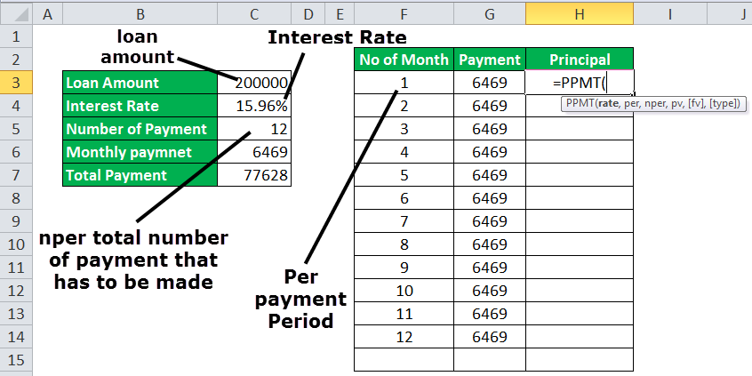

In the rapidly evolving world of financial markets, algorithmic trading, commonly referred to as 'algo trading,' has established itself as a significant force, revolutionizing how trades are conducted. This modern approach encompasses the use of sophisticated algorithms to execute trades at high speed and volume, optimizing market positions and leveraging available information more efficiently than traditional trading methods.

A critical component in this environment is the Principal Orders Operational Mechanism (POOM), which directly influences trade execution. POOM refers to the structured approach through which trading entities execute trades on their own accounts rather than on behalf of clients. This mechanism is paramount in determining how trades are placed and executed within the market framework.



Understanding POOM is essential for gaining insights into market efficiency and predicting trading outcomes. It affects various facets of algo trading, from liquidity provisioning to risk management, impacting the broader market dynamics. By analyzing POOM, traders and financial analysts can better comprehend how algorithmic strategies operate, ultimately shaping trading results and market stability. This article investigates the fundamental aspects of POOM and discusses its impact on various facets of algo trading, offering a comprehensive overview for market participants.

## Table of Contents

## Understanding Principal Orders in Algo Trading

Principal orders in algorithmic trading are trades executed by a trading entity for its own account, rather than on behalf of a client. These orders are critical components that significantly impact liquidity and market dynamics. Understanding the structure and significance of principal orders within trading algorithms offers insights into market strategies and operational efficiencies.

The structure of principal orders is inherently aligned with the objectives of trading firms, primarily focusing on risk management and profit maximization. Unlike agency trading, where a broker executes trades on behalf of a client and earns a commission, principal trading allows firms to own the asset. This ownership carries both the potential for greater financial return and the risk of holding the position against market movements.

From a structural standpoint, principal orders might be set up to take advantage of market inefficiencies or to capitalize on anticipated price movements. Algorithms can identify these opportunities using various strategies that optimize execution based on real-time data analysis and historical patterns. This can include statistical arbitrage, where algorithms analyze pricing inefficiencies between related securities, or trend following, where the direction of market prices is assessed for making decisions.

The distinction between principal and agency trading is significant in algorithmic strategies. Agency trading prioritizes customer satisfaction and best execution practices as per client needs, protecting the client's interests. Conversely, principal trading strategies may be more aggressive, aiming for profitability through proprietary strategies, often holding longer-term positions than agency trades, which are typically fulfilled immediately or within a short period.

In terms of risk management, principal orders allow trading firms to hedge against various market risks. Algorithms can dynamically adjust positions to mitigate risk exposure, thus playing a pivotal role in preserving capital and optimizing returns. Moreover, these orders enable trading firms to participate directly in market-making activities, thus enhancing [liquidity](/wiki/liquidity-risk-premium).

Algorithmic principal orders also offer opportunities for profit maximization by allowing firms to participate in rapid buy-sell sequences across different markets and currencies, adjusting positions swiftly as market conditions change. The ability to rapidly move in and out of positions permits firms to take advantage of short-term pricing inefficiencies that may not be accessible through agency trading.

The implementation of principal orders through algorithmic strategies represents a crucial evolution in trading technology. As firms continue to refine their algorithms, taking advantage of state-of-the-art technologies, the effective deployment of principal orders will be increasingly determinative of competitive advantage and market success.

## Operational Mechanisms of Principal Orders

Principal orders represent trades executed by financial entities for their own account and can exert significant influence within [algorithmic trading](/wiki/algorithmic-trading) systems. The operational mechanisms behind these orders are crucial, as they direct how trades are initiated, modified, and finalized in various market environments.

Mechanisms governing principal orders in algorithms affect order behavior based on differing market conditions. Market environments are traversed using strategies that incorporate both historical data analysis and real-time market signals. For instance, if a market exhibits low [volatility](/wiki/volatility-trading-strategies), an algorithm might implement a more aggressive order placement strategy to exploit smaller price movements. Alternatively, in volatile markets, the same algorithm may adopt conservative strategies to minimize risk and potential loss.

The relationship between principal orders and market microstructure is fundamental to understanding their operational mechanisms. Market microstructure deals with the way trading occurs on a granular level and includes factors such as bid-ask spreads, liquidity, and order flow. Principal orders, due to their [volume](/wiki/volume-trading-strategy) and frequency, can influence these components by altering liquidity and pricing dynamics. For instance, large principal orders can affect the supply-demand balance, effectively moving prices and impacting market efficiency.

Technological advancements play a critical role in improving the operational efficiency of principal orders. Innovations such as [machine learning](/wiki/machine-learning) and [artificial intelligence](/wiki/ai-artificial-intelligence) have allowed for the development of more sophisticated algorithms capable of better pattern recognition and predictive analytics. As a result, these algorithms can execute principal orders with increased precision and speed. Furthermore, high-frequency trading ([HFT](/wiki/high-frequency-trading-strategies)) platforms have benefited from reduced latencies and enhanced computational power, enabling them to process significant datasets almost instantaneously. These advancements allow trading firms to implement principal orders faster and more reliably, capturing fleeting market opportunities.

Despite these enhancements, there are notable challenges and constraints associated with the operational mechanisms of principal orders. One primary concern is the risk of market impact—large trades can inadvertently alter prices unfavorably if not executed with discretion. Algorithms must be designed to mitigate such impacts, often requiring complex strategies to break down orders into smaller, less conspicuous segments. Furthermore, regulatory requirements impose constraints on how principal orders can be managed, maintaining market integrity but also adding layers of compliance and operational overhead.

Moreover, the increasing complexity of financial markets means that algorithms must continuously evolve to adapt to new trading environments and instruments. The need for substantial computational resources and advanced data analytics capabilities may also present barriers for smaller trading firms looking to employ sophisticated principal order strategies.

In conclusion, the operational mechanisms behind principal orders are instrumental in shaping market outcomes in algorithmic trading systems. By leveraging technological advancements and navigating the complexities of market microstructure, financial entities can optimize their trading strategies, though not without facing significant challenges related to execution and compliance.

## Impact Analysis of Principal Orders on Algo Trading

In algorithmic trading, principal orders have a significant impact on both market dynamics and trading strategies. These orders directly and indirectly affect liquidity and volatility, influencing the behavior of markets where they are executed. Principal orders provide liquidity, as they are initiated by trading firms primarily for their own accounts rather than for clients. Their execution influences the supply and demand dynamics, hence impacting market liquidity. An abundance of principal orders often leads to increased liquidity, allowing for smoother transactions and reduced bid-ask spreads. Conversely, a scarcity can result in reduced market liquidity, leading to wider spreads and increased transaction costs.

Volatility is also influenced by principal orders, as the volume and frequency of these orders can amplify price swings in less liquid markets. In highly liquid markets, principal orders can help stabilize prices by providing a consistent flow of buying or selling. However, in markets with thin volumes, large principal orders can cause sudden price fluctuations, exacerbating volatility levels.

Price discovery and market efficiency are crucial aspects touched by principal orders through their strategic implementations. Principal orders aid in price discovery by reflecting the intentions of well-resourced and informed market participants. When executed effectively, they contribute to a more accurate reflection of the asset’s intrinsic value, thereby enhancing market efficiency.

Several notable cases in the history of algo trading highlight the substantial impact of principal orders. For instance, the "Flash Crash" of May 6, 2010, underscored the vulnerabilities of high-frequency trading environments, where principal order strategies exacerbated market movements and led to extreme volatility within minutes [1]. Another instance is the 2013 incident with the trading firm Knight Capital Group, which involved a malfunction in their trading code that led principal orders to flood the market, resulting in a significant unintended trading volume [2].

Empirical analyses further underscore the effects of principal orders on market behavior. Statistical models illustrate that principal orders can enhance efficiency in liquid markets but may introduce risks in smaller, less liquid ones. Studies utilizing real-time trading data (e.g., using Python's statistical libraries like pandas and statsmodels) demonstrate the correlation between principal order volume and market volatility.

```python
import pandas as pd
import statsmodels.api as sm

# Simulated example data
data = pd.DataFrame({
    'principal_order_volume': [1000, 2000, 1500, 3000, 1200],
    'market_liquidity': [50, 70, 65, 80, 60],
    'market_volatility': [0.1, 0.15, 0.12, 0.20, 0.11]
})

# Statistical analysis
X = data[['principal_order_volume', 'market_liquidity']]
y = data['market_volatility']
X = sm.add_constant(X)
model = sm.OLS(y, X).fit()
print(model.summary())
```

Such models help quantify the influence of principal orders and provide actionable insights for adapting trading strategies to optimize market interactions.

In summation, principal orders are a cornerstone of algorithmic trading, dictating market behavior through their influence on liquidity, volatility, and price discovery. The execution strategy of these orders can either stabilize or destabilize markets, highlighting the need for careful consideration and management of their effects.

References:
1. U.S. Commodity Futures Trading Commission & U.S. Securities and Exchange Commission Report on the "Flash Crash" of May 6, 2010.
2. Knight Capital Group Incident Report, 2013.

## Technological Innovations in Principal Order Management

Emerging technologies are significantly transforming the management of principal orders in algorithmic trading. One of the most impactful advancements is the integration of machine learning (ML) and artificial intelligence (AI) in optimizing principal order strategies. These technologies allow for adaptive decision-making processes, where algorithms can learn from historical market data to predict future price movements more accurately. By employing techniques such as supervised learning and [reinforcement learning](/wiki/reinforcement-learning), trading systems can adjust their strategies in real-time to maximize profits and minimize risks.

For example, reinforcement learning models can optimize order execution by dynamically adjusting the [order book](/wiki/order-book-trading-strategies) depth and exploit changes in market conditions. This adaptability is crucial in principal order management, where timing and execution precision can significantly impact trading outcomes.

Blockchain and other distributed ledger technologies (DLTs) are also playing a crucial role in promoting transparency and efficiency in principal order management. By decentralizing the order management system, blockchain ensures that all modifications to orders are permanently recorded, reducing the risks of fraud and errors. Furthermore, the real-time settlement capabilities of blockchain can enhance liquidity management by reducing settlement times and associated risks.

Real-time data analytics is another critical technological innovation that empowers better decision-making in principal order execution. With access to a vast amount of market data, analytics platforms can provide insights into market trends, volatility, and order flow dynamics. These insights enable trading algorithms to execute principal orders more effectively, ensuring optimal market impact and cost efficiency. Real-time analytics aid in monitoring and adjusting execution strategies as market conditions evolve, allowing for more responsive and precise order handling.

Predictive modeling and simulation frameworks also enhance the management of principal orders by enabling traders to forecast potential market scenarios. These models leverage statistical techniques and historical data to simulate various trading strategies and their outcomes under different market conditions. By utilizing predictive analytics, trading firms can develop robust principal order strategies that account for market uncertainties and mitigate risks. The following Python code snippet demonstrates a simple predictive model using a time-series forecasting technique:

```python
import pandas as pd
from statsmodels.tsa.arima_model import ARIMA

# Load historical order data
data = pd.read_csv('historical_order_data.csv')
prices = data['price']

# Fit ARIMA model
model = ARIMA(prices, order=(5,1,0))
model_fit = model.fit(disp=0)

# Forecast future prices
forecast, stderr, conf_int = model_fit.forecast(steps=10)

print(f"Forecasted Prices: {forecast}")
```

This script employs an ARIMA model to predict future price movements, a technique often used in algo trading to inform strategic decisions regarding principal orders.

As advancements in technology continue to evolve, the management of principal orders in algorithmic trading is expected to become even more sophisticated, integrating further innovations to enhance efficiency and effectiveness.

## Future Trends in Principal Orders and Algo Trading

Anticipated changes in the regulatory landscape regarding principal orders are expected to substantially influence the algorithmic trading environment. Regulators worldwide, recognizing the rapid technological advancements and the potential systemic risks associated with algo trading, are increasingly focused on enhancing oversight and transparency. This involves the integration of more stringent reporting requirements and the development of automated surveillance systems to monitor trading activities more effectively. The U.S. Securities and Exchange Commission (SEC), for instance, has been proactive in proposing regulations aimed at curbing the risks of high-frequency trading (HFT) which often leverages principal orders. Similarly, the European Markets in Financial Instruments Directive II (MiFID II) has set new standards for transparency and risk management in trading practices, influencing the deployment and operation of principal orders.

Potential innovations in the next decade promise to further transform algo trading. The adoption of machine learning and artificial intelligence (AI) is projected to optimize principal order strategies by improving pattern recognition and predictive capabilities in real-time trading environments. This could lead to the development of more sophisticated algorithms capable of dynamically adjusting to market conditions with minimal human intervention. Blockchain technology is also being explored for its potential to enhance the transparency and security of trading operations, providing a decentralized ledger that could streamline the execution and settlement processes associated with principal orders.

Ethical considerations related to principal order management are becoming increasingly significant as the technology evolves. The use of AI and algorithmic trading raises questions about market fairness, access to trading technology, and the potential for exacerbating market disparities. Financial institutions are starting to adopt frameworks for ethical AI usage and to ensure that automated trading systems maintain fair practices and comply with regulatory standards. Transparency, accountability, and the equitable distribution of technological benefits are critical elements being emphasized in ongoing discussions.

Principal orders are poised to significantly shape the competitive dynamics of financial markets. As financial firms enhance their algorithmic capabilities, there is a risk of market concentration where a few technologically advanced firms dominate market activities. However, this could also spur innovation as smaller firms seek agile and niche strategies to compete. The advancement of principal orders should ideally lead to more efficient markets by reducing transaction costs and increasing liquidity, although this balance will heavily depend on the regulatory frameworks and ethical standards in place.

Concluding thoughts on the evolving role of principal orders in future trading environments underline their continued importance in maintaining market efficiency and liquidity. The integration of cutting-edge technologies, coupled with evolving regulatory and ethical considerations, will redefine the landscape of algorithmic trading. It is essential for market participants to stay informed about these developments in order to navigate the competitive financial markets successfully and responsibly. As innovation continues to accelerate, staying abreast of emerging trends and compliance requirements will be crucial for sustaining strategic advantages in the trading arena.

## Conclusion

Principal orders play a complex and influential role in the operation and success of algorithmic trading strategies. They are fundamental not only in ensuring liquidity but also in shaping market dynamics and facilitating effective risk management. These orders allow trading entities to execute strategic positions, balancing their risk exposure while attempting to capitalize on market opportunities.

In the context of liquidity, principal orders contribute directly by allowing firms to buy or sell large quantities of financial instruments. This involvement enhances market depth and can mitigate the impact of large transactions on asset prices. Moreover, through strategic placement of principal orders, firms can maneuver market spreads, influencing the bid-ask spread and the rapidity of order execution, all of which are vital for maintaining an efficient market environment.

As technology continues to advance, principal order management is being redefined. Cutting-edge technologies such as machine learning, artificial intelligence, and real-time analytics are optimized to handle the complexities associated with these orders. These technologies enable trading algorithms to dynamically adjust strategies in response to shifting market conditions, thus improving the precision and efficiency of trade execution.

Regulatory changes also play a pivotal role in shaping the landscape of principal orders. Financial regulations, aimed at ensuring market fairness and transparency, often dictate the conditions under which principal orders can be executed. Entities must remain vigilant to adapt their strategies to comply with evolving regulations, which may impact how effectively they can leverage principal orders for competitive advantage.

A thorough understanding of principal orders is essential for market participants. By grasping how these orders affect market behavior, traders and strategists can develop more robust and adaptive trading strategies. As algorithmic trading becomes increasingly predominant, staying informed about the mechanisms impacting trading—such as the Principal Orders Operational Mechanism (POOM)—is crucial for lasting success in the financial markets.

Thus, as participants anticipate future trends and technological enhancements, maintaining a comprehensive understanding of principal orders and their implications is key. This knowledge equips traders and firms with the ability to aptly navigate complex market environments, ensuring both compliance and profitability in the evolving arena of algorithmic trading.

## References & Further Reading

[1]: U.S. Commodity Futures Trading Commission & U.S. Securities and Exchange Commission Report on the ["Flash Crash" of May 6, 2010](https://www.sec.gov/news/studies/2010/marketevents-report.pdf).

[2]: Knight Capital Group Incident Report, 2013. [Case Study](https://www.henricodolfing.com/2019/06/project-failure-case-study-knight-capital.html).

[3]: Bergstra, J., Bardenet, R., Bengio, Y., & Kégl, B. (2011). ["Algorithms for Hyper-Parameter Optimization."](https://proceedings.neurips.cc/paper/2011/file/86e8f7ab32cfd12577bc2619bc635690-Paper.pdf) Advances in Neural Information Processing Systems 24.

[4]: ["Advances in Financial Machine Learning"](https://www.amazon.com/Advances-Financial-Machine-Learning-Marcos/dp/1119482089) by Marcos Lopez de Prado.

[5]: ["Evidence-Based Technical Analysis: Applying the Scientific Method and Statistical Inference to Trading Signals"](https://www.amazon.com/Evidence-Based-Technical-Analysis-Scientific-Statistical/dp/0470008741) by David Aronson.

[6]: ["Machine Learning for Algorithmic Trading"](https://github.com/stefan-jansen/machine-learning-for-trading) by Stefan Jansen.

[7]: ["Quantitative Trading: How to Build Your Own Algorithmic Trading Business"](https://www.amazon.com/Quantitative-Trading-Build-Algorithmic-Business/dp/1119800064) by Ernest P. Chan.