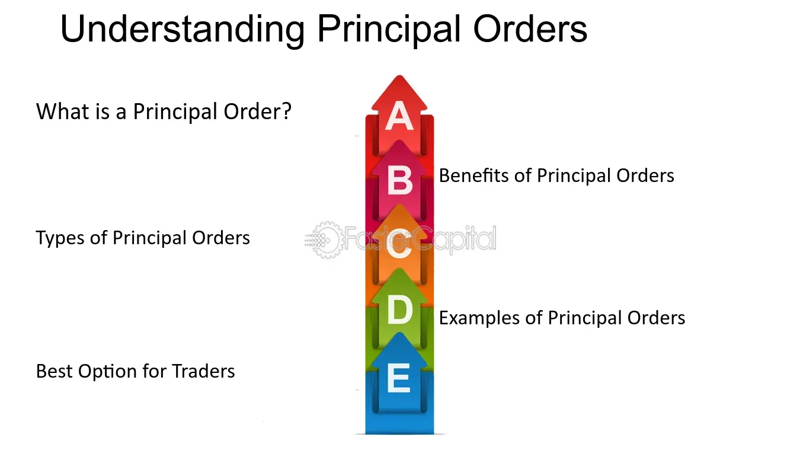

## Table of Contents

## What are principal orders?

Principal orders are a type of financial order where a broker acts on behalf of a client to buy or sell securities directly from their own inventory. This means the broker uses their own funds and securities to complete the transaction, rather than finding another buyer or seller in the market. This can be beneficial for clients because it can speed up the process and sometimes offer better pricing, as the broker might be able to provide a more competitive price from their own stock.

However, there are also potential downsides to principal orders. Since the broker is using their own inventory, there might be a conflict of interest. The broker could be motivated to sell securities from their inventory at a higher price to make a profit, which might not always be in the best interest of the client. It's important for clients to be aware of this and to understand the terms and conditions of the principal order before agreeing to it.

## How do principal orders differ from agency orders?

Principal orders and agency orders are two different ways that brokers can handle buying and selling securities for their clients. In a principal order, the broker uses their own inventory of securities to complete the transaction. This means they are buying from or selling to the client directly from their own stock. This can be faster and sometimes cheaper for the client because the broker might offer a better price from their own inventory.

On the other hand, an agency order is when the broker acts as a middleman between the client and the market. The broker finds another buyer or seller in the market to complete the transaction, without using their own inventory. This can be more transparent because the broker is not directly involved in the transaction, but it might take longer and could result in different pricing depending on market conditions.

Both types of orders have their advantages and potential drawbacks. With principal orders, there's a risk of conflict of interest because the broker might be motivated to sell their own securities at a higher price. With agency orders, the client might get a better market price, but they could also face delays or less favorable prices depending on market [liquidity](/wiki/liquidity-risk-premium). It's important for clients to understand these differences and choose the type of order that best fits their needs.

## What is the basic process of executing a principal order?

When a client wants to buy or sell a security using a principal order, they tell their broker what they want to do. The broker then checks their own inventory to see if they have the security the client wants to buy or if they can take the security the client wants to sell. If the broker has what the client needs, they agree on a price and complete the transaction right away. This can be faster than waiting for another buyer or seller in the market.

The broker makes money from the difference between the price they pay for the security and the price they sell it to the client. This is called the "spread." Because the broker is using their own inventory, they can sometimes offer a better price to the client. But, the client should be careful because the broker might want to sell their own securities at a higher price to make more money, which might not be the best deal for the client.

## What are the common types of principal orders?

There are two main types of principal orders: riskless principal orders and pure principal orders. A riskless principal order happens when a broker buys a security from the market at the same time they sell it to their client. The broker doesn't keep the security in their inventory for long, so they don't take much risk. This type of order is common because it helps the broker make money without holding onto the security for a long time.

A pure principal order is different. In this case, the broker already has the security in their inventory before the client wants to buy it. The broker sells the security directly from their own stock to the client. This can be faster for the client, but the broker might try to sell it at a higher price to make more money. Both types of principal orders can be useful, but it's important for clients to understand how they work and what the risks are.

## What are the advantages of using principal orders for traders?

Principal orders can be good for traders because they can make trading faster. When a trader wants to buy or sell a security, the broker can use their own inventory to complete the trade right away. This means the trader doesn't have to wait for another buyer or seller in the market, which can save time and help the trader act quickly on their decisions.

Another advantage is that principal orders can sometimes offer better prices. Since the broker is using their own stock, they might be able to give the trader a better deal than what's available in the market. This can help the trader save money on their trades. However, traders should be careful because the broker might try to sell their own securities at a higher price to make more money, so it's important to understand the terms of the order before agreeing to it.

## What are the potential risks associated with principal orders?

One big risk with principal orders is that the broker might not have the trader's best interest in mind. Since the broker is using their own inventory, they might try to sell their securities at a higher price to make more money. This can mean the trader ends up paying more than they would if they bought the security from the market. It's important for traders to be aware of this and to check the prices carefully before agreeing to a principal order.

Another risk is that the broker might not have enough of the security in their inventory to complete the trade. If the trader wants to buy a lot of a certain security, the broker might not have enough to sell. This can cause delays or even stop the trade from happening. Traders should ask their broker about their inventory before placing a principal order to avoid these problems.

## How do principal orders impact market liquidity?

Principal orders can help make the market more liquid. When a broker uses their own inventory to complete a trade, it can make it easier and faster for traders to buy or sell securities. This can encourage more trading because people know they can get their trades done quickly. More trading can lead to more liquidity in the market, which means there are more buyers and sellers, and it's easier to trade without big changes in price.

However, principal orders can also have the opposite effect on liquidity. If brokers keep too many securities in their own inventory instead of trading them in the open market, it can reduce the number of securities available for trading. This can make the market less liquid because there are fewer securities to buy and sell. So, while principal orders can help with liquidity in some ways, they can also hurt it if brokers hold onto too many securities.

## What regulatory considerations should be taken into account with principal orders?

When brokers use principal orders, they have to follow certain rules set by regulators to make sure they treat their clients fairly. One important rule is that brokers have to tell their clients clearly that they are using a principal order. This means the broker must let the client know they are buying or selling from their own inventory, not from the open market. This helps the client understand any possible conflicts of interest, like the broker trying to make more money by selling their own securities at a higher price.

Regulators also make sure brokers don't take advantage of their clients with principal orders. They check that the prices brokers offer are fair and not too different from what's available in the market. This is important to protect clients from paying too much or getting too little for their trades. By keeping an eye on these things, regulators help make sure that principal orders are used in a way that is honest and good for everyone involved.

## How do principal orders affect the price discovery process in financial markets?

Principal orders can make it harder for the market to figure out the right price for securities. When brokers use their own inventory to buy and sell, they might set prices that are different from what's happening in the open market. This can confuse other traders about what the true value of a security is. If lots of trades are happening through principal orders, it can hide the real supply and demand, making it tough for the market to find the best price.

On the other hand, principal orders can also help with price discovery in some ways. If brokers are quick to buy and sell using their own stock, it can keep the market moving and help more trades happen. This can give more information about what people are willing to pay, which can help the market figure out the right price over time. So, while principal orders can sometimes make price discovery more difficult, they can also contribute to it by keeping the market active and providing more data on prices.

## What advanced strategies can be employed using principal orders?

Traders can use principal orders to do something called "inventory management." This means they can buy securities when they think the price is low and keep them in their inventory. Later, when the price goes up, they can sell these securities to their clients using principal orders. This can help traders make more money because they can sell at a higher price than they bought. But, they have to be careful because if the price goes down instead, they might lose money.

Another strategy is called "[market making](/wiki/market-making)." Traders can use principal orders to act like a middleman in the market. They can buy securities from one client and then sell them to another client using their own inventory. This can help keep the market moving smoothly because they are always ready to buy and sell. It can also help them make money from the difference between the buying and selling prices. But, they need to watch the market closely to make sure they are not stuck with securities they can't sell.

## How do principal orders interact with high-frequency trading algorithms?

Principal orders can be used by high-frequency trading algorithms to make quick trades. These algorithms are designed to buy and sell securities very fast, often in just a few seconds. When a high-frequency trader uses a principal order, they can buy a security from their own inventory and sell it to another trader right away. This can help them make money from small changes in price. But, they have to be very careful because the market can change quickly, and they might lose money if they are not fast enough.

High-frequency trading algorithms can also use principal orders to help keep the market moving smoothly. They can act like a middleman, always ready to buy and sell securities. This can make the market more liquid because there are always traders ready to make a trade. But, if too many high-frequency traders use principal orders, it can make it hard for the market to find the right price. This is because the prices they set might be different from what's happening in the open market, which can confuse other traders.

## What are the future trends and potential developments in the use of principal orders?

In the future, we might see more technology being used with principal orders. As computers get better and faster, they can help brokers manage their inventory and make trades more quickly. This could mean that principal orders become even more common in high-frequency trading, where speed is very important. Also, new rules might be made to make sure that brokers are fair when they use principal orders. This could help make the market safer and more honest for everyone.

Another trend could be the use of [artificial intelligence](/wiki/ai-artificial-intelligence) (AI) to make better decisions about when to use principal orders. AI can look at a lot of data very quickly and find the best times to buy and sell securities. This could help brokers make more money and give better prices to their clients. But, as AI and technology become more important, it will be important to keep watching to make sure that the market stays fair and that no one is taking advantage of others.

## References & Further Reading

[1]: U.S. Commodity Futures Trading Commission & U.S. Securities and Exchange Commission Report on the ["Flash Crash" of May 6, 2010](https://www.sec.gov/news/studies/2010/marketevents-report.pdf).

[2]: Knight Capital Group Incident Report, 2013. [Case Study](https://www.henricodolfing.com/2019/06/project-failure-case-study-knight-capital.html).

[3]: Bergstra, J., Bardenet, R., Bengio, Y., & Kégl, B. (2011). ["Algorithms for Hyper-Parameter Optimization."](https://proceedings.neurips.cc/paper/2011/file/86e8f7ab32cfd12577bc2619bc635690-Paper.pdf) Advances in Neural Information Processing Systems 24.

[4]: ["Advances in Financial Machine Learning"](https://www.amazon.com/Advances-Financial-Machine-Learning-Marcos/dp/1119482089) by Marcos Lopez de Prado.

[5]: ["Evidence-Based Technical Analysis: Applying the Scientific Method and Statistical Inference to Trading Signals"](https://www.amazon.com/Evidence-Based-Technical-Analysis-Scientific-Statistical/dp/0470008741) by David Aronson.

[6]: ["Machine Learning for Algorithmic Trading"](https://github.com/stefan-jansen/machine-learning-for-trading) by Stefan Jansen.

[7]: ["Quantitative Trading: How to Build Your Own Algorithmic Trading Business"](https://www.amazon.com/Quantitative-Trading-Build-Algorithmic-Business/dp/1119800064) by Ernest P. Chan.