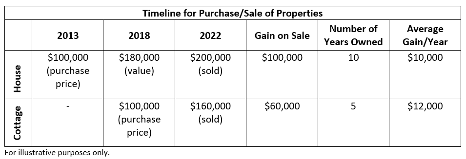

## Table of Contents

## What is a principal private residence in Canada?

In Canada, a principal private residence is the main home where someone lives most of the time. It is different from a vacation home or a rental property. When someone sells their principal private residence, they usually do not have to pay tax on the profit they make from the sale. This is a big benefit because it means people can move to a new home without worrying about paying extra taxes.

To qualify as a principal private residence, the home must be where the person ordinarily lives. This means it's where they have their main connection and where they spend most of their time. If someone has more than one home, they can choose which one is their principal residence each year. This choice can help them save on taxes when they sell their home.

## Why is it important to designate a property as a principal private residence?

Designating a property as a principal private residence is important because it helps you save money on taxes. When you sell your principal private residence, you don't have to pay tax on the profit you make from the sale. This can be a big saving, especially if the value of your home has gone up a lot over the years. Without this benefit, you might have to pay a lot of money in taxes, which could make it harder to move to a new home.

It also gives you flexibility if you own more than one home. You can choose which home is your principal residence each year. This means you can switch your designation to the home that will save you the most money on taxes. This flexibility is helpful if you have a vacation home or if you move around a lot. By making the right choice, you can make sure you're getting the most out of the tax benefits available to you.

## How does one qualify a property as their principal private residence?

To qualify a property as your principal private residence in Canada, you need to show that it's the main home where you live most of the time. This means you need to have your main connection to this home. You should be living there for most of the year, and it should be where you get your mail, where your family lives, and where you're registered to vote. If you have more than one home, you can choose which one is your principal residence each year, but you need to make sure you're actually living in the one you choose as your main home.

When you decide which home is your principal residence, think about where you spend the most time and where you feel most connected. You can only have one principal residence at a time, so if you own multiple properties, you need to be careful about which one you choose. This choice can affect how much tax you have to pay when you sell your home. If you're not sure, it's a good idea to talk to a tax professional who can help you make the best decision based on your situation.

## What are the tax implications of owning a principal private residence?

When you own a principal private residence in Canada, you don't have to pay tax on the profit you make when you sell it. This is a big benefit because it means you can move to a new home without worrying about a big tax bill. The profit, or capital gain, from selling your main home is not taxed, as long as you have lived there most of the time and it's your main home.

If you own more than one home, you can choose which one is your principal residence each year. This choice can help you save money on taxes. You need to be careful about which home you pick because you can only have one principal residence at a time. If you're not sure which home to choose, talking to a tax professional can help you make the best decision for your situation.

## Can a person have more than one principal private residence at the same time?

No, a person can't have more than one principal private residence at the same time. In Canada, you can only have one main home where you live most of the time. This is the home that you won't have to pay tax on when you sell it.

If you own more than one home, you can choose which one is your principal residence each year. This means you can switch your choice to the home that will save you the most money on taxes. But you can only choose one home each year, so you need to be careful about which one you pick.

## What documentation is required to prove a property is a principal private residence?

To prove that a property is your principal private residence, you need to show that it's where you live most of the time. This can be done with documents like your driver's license, which should have the address of your main home. Your utility bills, like electricity or water, should also be sent to this address. If you have a family, their school records or medical records can also help show that you live there. Voting records can be useful too, as they show where you're registered to vote.

If you own more than one home, you need to be able to show which one you consider your main home each year. This can be done by keeping records of how much time you spend at each home. For example, if you have a vacation home, you might keep a calendar showing when you were there and when you were at your main home. It's important to keep these records up to date because they can help you prove which home is your principal residence if you ever need to.

## How does the principal residence exemption work when selling a home?

When you sell your principal private residence in Canada, you don't have to pay tax on the profit you make. This is called the principal residence exemption. It means that if you sell your main home for more money than you paid for it, you can keep all the extra money without paying any tax on it. This is a big help because it makes it easier for people to move to a new home without worrying about a big tax bill.

If you own more than one home, you can choose which one is your principal residence each year. This choice can help you save money on taxes. You need to be careful about which home you pick because you can only have one principal residence at a time. If you're not sure which home to choose, talking to a tax professional can help you make the best decision for your situation.

## What happens if you move out of your principal private residence temporarily?

If you move out of your principal private residence temporarily, you can still keep it as your principal residence as long as you plan to come back to it. For example, if you have to move to another city for work but you know you will return to your main home, you can still consider it your principal residence. You need to show that you still have a strong connection to the home, like keeping your belongings there or getting your mail sent there.

However, if you stay away from your home for a long time, it might be harder to prove that it's still your principal residence. The Canada Revenue Agency looks at how much time you spend at the home and where you feel most connected. If you're away for too long, they might not consider it your main home anymore. It's a good idea to keep good records and talk to a tax professional if you're not sure what to do.

## How do changes in family status affect the principal private residence designation?

Changes in family status, like getting married, having kids, or getting divorced, can affect which home you choose as your principal private residence. If you get married, you and your spouse might decide to live together in one home. This home would become your principal residence because it's where you both live most of the time. If you have kids, the home where your family lives together would usually be considered your principal residence. This is because it's where your family is based and where you spend most of your time.

If you get divorced, things can get more complicated. You and your ex-spouse might need to decide which home is the principal residence. If you both move out of the family home and into separate places, you'll need to choose which one is your main home. Usually, the home where the kids live most of the time would be considered the principal residence. It's important to keep good records and talk to a tax professional to make sure you're making the best choice for your situation.

## What are the rules for non-residents regarding principal private residences in Canada?

Non-residents of Canada can also have a principal private residence, but there are some special rules they need to follow. If a non-resident owns a home in Canada and lives there most of the time, they can claim it as their principal residence. This means they won't have to pay tax on the profit when they sell the home, just like Canadian residents. However, they need to show that they actually live in the home and that it's their main home.

If a non-resident sells their principal residence in Canada, they need to let the Canada Revenue Agency know. They might need to fill out some special forms to claim the principal residence exemption. It's a good idea for non-residents to talk to a tax professional to make sure they're doing everything right and following all the rules.

## How do capital gains tax rules apply to a principal private residence?

When you sell your principal private residence in Canada, you don't have to pay tax on the profit you make. This is called the principal residence exemption. It means that if you sell your main home for more money than you paid for it, you can keep all the extra money without paying any tax on it. This is a big help because it makes it easier for people to move to a new home without worrying about a big tax bill.

If you own more than one home, you can choose which one is your principal residence each year. This choice can help you save money on taxes. You need to be careful about which home you pick because you can only have one principal residence at a time. If you're not sure which home to choose, talking to a tax professional can help you make the best decision for your situation.

## What are the penalties for misrepresenting a property as a principal private residence?

If you say a property is your principal private residence when it's not, you could get in trouble with the Canada Revenue Agency. They might make you pay a penalty, which is extra money on top of the taxes you owe. The penalty can be as much as 50% of the tax you should have paid on the profit from selling the home. This is because the government wants to make sure people are honest about their taxes.

To avoid penalties, it's important to be truthful about which home is your main home. If you're not sure if a home counts as your principal private residence, it's a good idea to talk to a tax professional. They can help you understand the rules and make sure you're doing everything right.

## What are the tax implications and benefits of a principal private residence?

A Principal Private Residence (PPR) holds a pivotal role in shaping the tax landscape for Canadian homeowners. This status significantly impacts tax liabilities when a property is sold. Specifically, the PPR exemption allows homeowners to exclude any gain from the sale of their home from their taxable capital gains. This exemption can lead to substantial tax savings, making understanding the intricacies of PPR status crucial for homeowners aiming to optimize their financial outcomes.

The 'plus 1' rule offers a notable advantage to homeowners, particularly during transitional periods. This rule permits the temporary designation of two PPRs within the same taxation year, which is beneficial when homeowners are in the process of relocating. For example, if a family purchases a new home before selling their existing one, they can apply the PPR exemption to both properties during the overlap period, potentially reducing tax liabilities.

Scenarios where capital gains tax may apply arise if a property does not meet PPR requirements. To qualify as a PPR, the property must be inhabited by the taxpayer, their spouse, or their child at some point during the year. If a property fails to meet these criteria, the seller may face significant capital gains tax on any profit from its sale. The formula for calculating taxable capital gains is:

$$
\text{Taxable Capital Gain} = \frac{1}{2} \times (\text{Sale Price} - \text{Adjusted Cost Base}) - \text{Eligible Deductions}
$$

This formula underscores the importance of ensuring a property meets PPR requirements to avoid unnecessary tax burdens.

Changes in property use, such as converting a principal residence into a rental or business property, can also affect its PPR status. When a homeowner starts to use a property for rental income or business purposes, the property may lose its PPR designation. This shift can trigger a deemed disposition, requiring the owner to declare any appreciable gain as income, thus incurring a tax liability. However, homeowners may elect to defer this deemed disposition to manage their tax liabilities better.

Strategically leveraging PPR benefits is essential for effective wealth accumulation and tax efficiency. By maintaining PPR status, homeowners can maximize tax-saving opportunities upon selling. Additionally, proper planning around property use changes and the timing of sales can further enhance these financial benefits. Consulting with financial advisors or tax professionals can allow homeowners to harness these advantages fully while navigating the complexities of Canadian tax laws.

In conclusion, comprehending the tax implications and advantages of a Principal Private Residence is vital for Canadian homeowners. By skillfully managing PPR designations and understanding the associated tax rules, individuals can significantly reduce their tax burdens and enhance their financial well-being.

 to Algorithmic Trading

Algorithmic trading is a method of executing orders using automated pre-programmed trading instructions that take into account variables such as time, price, and [volume](/wiki/volume-trading-strategy). This method has gained significant traction in capital markets due to its ability to streamline trading processes and enhance market efficiency. Algorithmic trading employs complex algorithms and mathematical models to make high-speed decisions, which can be critical in taking advantage of market opportunities.

Algorithmic strategies leverage automation and advanced algorithms by employing computer programs that monitor live market conditions and execute trades without the need for human intervention. These programs can analyze vast amounts of data at speeds unattainable by manual processes, allowing for the identification of patterns and trends. For instance, algorithms can be designed to execute a trade when a certain price level is reached, or when a specified market condition is met, providing an advantage in both speed and precision.

One of the primary advantages of [algorithmic trading](/wiki/algorithmic-trading) is its speed. With the ability to execute trades in microseconds, algorithmic trading eliminates the delay associated with human decision-making, thereby capitalizing on fleeting market conditions. Additionally, precision is another benefit, as algorithms can be calibrated to execute trades with exact specifications, minimizing the risk of human error. Furthermore, the use of [backtesting](/wiki/backtesting) capabilities allows traders to test algorithms against historical data, refining strategies to optimize performance and reduce potential losses.

However, algorithmic trading is not without risks. Market [volatility](/wiki/volatility-trading-strategies) can significantly impact the effectiveness of trading algorithms, especially when unexpected events cause rapid price changes. Such volatility can lead to substantial financial losses if algorithms are not programmed to account for these situations. Technological glitches also pose a risk; malfunctions in the code or in the trading platform can result in erroneous trades or system failures, leading to financial and reputational damage.

For beginners interested in exploring algorithmic trading, several resources are available. Books such as "Algorithmic Trading: Winning Strategies and Their Rationale" by Ernest P. Chan provide foundational knowledge and insights into developing trading algorithms. Online platforms such as QuantConnect and Alpaca offer environments for testing and deploying algorithms in live markets. Additionally, courses on platforms like Coursera or edX introduce algorithmic trading concepts and practical applications, guided by industry experts.

In summary, algorithmic trading stands as a transformative approach in modern financial markets. By harnessing advanced technology, it increases efficiency, accuracy, and the ability for traders to adapt swiftly to market movements. Despite its inherent risks, when implemented with careful strategy and oversight, algorithmic trading offers considerable advantages, making it an invaluable tool in the landscape of contemporary trading practices.

## References & Further Reading

[1]: Canada Revenue Agency. ["Principal Residence."](https://www.canada.ca/en/revenue-agency/services/tax/individuals/topics/about-your-tax-return/tax-return/completing-a-tax-return/personal-income/line-12700-capital-gains/principal-residence-other-real-estate.html) Government of Canada.

[2]: Chan, Ernest P. ["Algorithmic Trading: Winning Strategies and Their Rationale."](https://github.com/ftvision/quant_trading_echan_book) Wiley Trading, 2013.

[3]: Lopez de Prado, Marcos. ["Advances in Financial Machine Learning."](https://www.amazon.com/Advances-Financial-Machine-Learning-Marcos/dp/1119482089) Wiley, 2018.

[4]: Jansen, Stefan. ["Machine Learning for Algorithmic Trading: Predictive models to extract signals from market and alternative data for systematic trading strategies with Python."](https://github.com/stefan-jansen/machine-learning-for-trading) Packt Publishing, 2020.

[5]: Aronson, David. ["Evidence-Based Technical Analysis: Applying the Scientific Method and Statistical Inference to Trading Signals."](https://www.amazon.com/Evidence-Based-Technical-Analysis-Scientific-Statistical/dp/0470008741) Wiley, 2006.