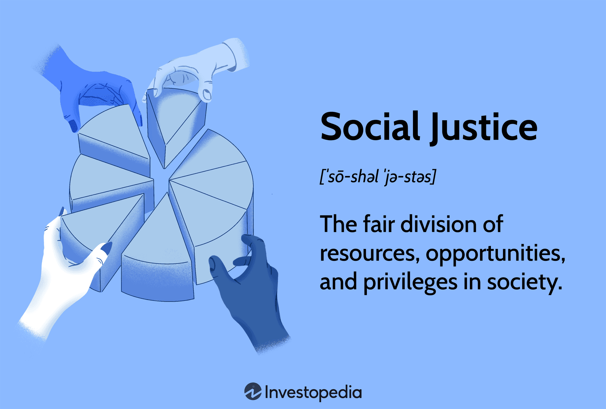

The intersection of social justice and algorithmic trading may not be immediately apparent, but there's a compelling connection. Recognizing how social justice principles can inform the practices of trading, particularly algorithmic trading, can lead to more equitable and ethical financial systems. As technology becomes an integral part of financial markets, it is essential to consider how algorithms, often perceived as neutral, can perpetuate or even exacerbate existing inequalities. For instance, biases in data used by algorithms can result in inequitable trading outcomes, disproportionately affecting marginalized groups. This challenge highlights the importance of incorporating social justice principles to create fairer and more inclusive trading environments.

This article explores the meaning and principles of social justice and how they can be integrated into the rapidly evolving world of algorithmic trading. By bridging these fields, we aim to highlight opportunities to create fairer financial practices. The core tenets of social justice—such as access, equity, participation, and human rights—offer a valuable framework for evaluating and reforming trading algorithms, ensuring that they do not reinforce systemic inequalities. Understanding these principles allows developers, traders, and policymakers to design trading systems that promote fairness and inclusivity.



Algorithmic trading continues to rise in popularity due to its efficiency and effectiveness, but it often raises concerns about fairness and equity. Introducing social justice principles could provide a framework for addressing these concerns. Algorithms, through their capacity for high-frequency trades and decision-making based on complex data patterns, hold significant power in shaping market dynamics. However, without careful consideration of social justice, there is a risk that these technologies may contribute to an uneven playing field, where access and opportunities are limited to those with existing advantages.

By analyzing key concepts and principles, this article seeks to promote an understanding of how social justice can play a role in shaping the future of trading. We will examine historical perspectives, core principles of social justice, and propose how these principles can be applied to algorithmic trading. This exploration is not merely theoretical; it is a call to action for the financial industry to consider the broader implications of their technological innovations. The integration of social justice principles into trading can help mitigate biases, promote transparency, and ensure that financial innovations benefit a diverse range of stakeholders. In doing so, we can move towards a financial system that is more aligned with ethical standards and equitable outcomes.

## Table of Contents

## Understanding Social Justice

Social justice is a multifaceted concept aimed at ensuring the equitable distribution of resources, opportunities, and privileges within a society. It emphasizes fairness within societal institutions and their resultant outcomes, advocating robust protection of human rights and targeting the elimination of entrenched systemic inequalities. At its core, social justice seeks to create an environment where individuals have equal opportunities to thrive and are not hindered by discriminatory practices or institutional biases.

The concept of social justice has deep roots in religious philosophy, where it initially emerged as a moral standard for achieving fairness and justice throughout society. In its modern incarnation, social justice has broadened to encompass dimensions such as economic equality, human rights, access, participation, and equity. Each of these elements plays a crucial role in shaping social frameworks that advocate for justice and equality. 

Economic equality refers to the notion that all individuals should have similar economic opportunities and potential to achieve financial stability. Human rights focus on safeguarding individuals' inherent rights, such as dignity, freedom of expression, and equality before the law. Access involves removing barriers that prevent people from utilizing societal resources, such as education and healthcare. Participation ensures individuals have a voice in decisions impacting them, fostering democratic engagement. Finally, equity recognizes historical disadvantages certain groups face and promotes resource distribution based on need to achieve fair outcomes.

The Enlightenment and the Industrial Revolution were pivotal periods in advancing social justice. The Enlightenment challenged traditional structures and advocated reason, science, and equality, significantly influencing the development of democratic principles. The Industrial Revolution, despite fostering economic growth, exacerbated social inequities and highlighted the need for improved worker rights and conditions. Social reforms throughout the 20th century further emphasized these disparities, driving movements toward more equitable systems and greater protection of human rights.

John Rawls' theory of 'justice as fairness' has been particularly influential in modern discussions of social justice. His philosophical framework suggests that societal structures should be organized to ensure fair distribution of resources and benefits, arguing that inequalities in social or economic advantages are only justifiable if they benefit the least advantaged members of society. Rawls' approach provides a lens through which contemporary social justice can be examined, offering a structured way to reflect on fairness and equity in societal arrangements. His work continues to inform both theoretical and practical applications of social justice principles.

## Main Principles of Social Justice

The main principles guiding social justice serve as the foundational elements in the pursuit of a more equitable and fair society. Understanding these principles is essential as they offer insights into creating systems where all individuals can thrive with dignity and equal opportunity. 

Access is a fundamental principle that ensures every individual has equal access to society's resources, including education, healthcare, and employment opportunities. This principle advocates for the removal of barriers that prevent specific groups from accessing these resources. Access is crucial for leveling the playing field, allowing all people to benefit from the same opportunities and societal goods. 

Equity involves distributing resources and opportunities in a way that addresses historical and systematic disadvantages faced by marginalized groups. Unlike equality, which treats everyone the same, equity recognizes that different communities may require different levels of support to achieve equal outcomes. Implementing equity means providing tailored resources and support to achieve fairness in opportunities and outcomes.

Diversity highlights the importance of representing and including various demographic groups in institutions and decision-making processes. It ensures that different perspectives are recognized and valued, contributing to more comprehensive and informed decision-making. Embracing diversity involves not only acknowledging differences among people but actively seeking to include these varied voices in all levels of a society.

Participation guarantees that all community members have the ability to influence decisions that impact their lives. This principle promotes democratic engagement and curtails exclusion, ensuring that marginalized voices are heard and represented. Participation is vital to maintaining responsive and accountable institutions that reflect the true needs and aspirations of all societal segments.

Human rights, as a fundamental principle, stress the importance of recognizing and respecting individuals' inherent rights. These rights include freedom from discrimination and abuse, as well as the protection of personal autonomy and dignity. Upholding human rights involves ensuring that every person can live without fear of oppression, enjoying the freedoms necessary for self-expression and participation in society.

In summary, access, equity, diversity, participation, and human rights are central principles that guide the quest for social justice. These principles not only aim to address current inequities but also aspire to build systems where fairness and dignity are intrinsic to the societal structure.

## Algorithmic Trading: An Overview

Algorithmic trading, often abbreviated as algo trading, involves utilizing computer programs and algorithms to perform trading activities based on predetermined criteria. This approach allows for rapid and large-scale execution of trades with minimal human intervention, thereby enhancing the efficiency and precision of trading practices. The algorithms, designed by experts in quantitative finance, can evaluate numerous market variables and conditions, executing trades at speeds and volumes beyond human capabilities.

The prevalence of [algorithmic trading](/wiki/algorithmic-trading) has surged with advancements in technology, particularly in financial markets. A key advantage of algo trading is its ability to process and analyze vast amounts of data quickly, executing complex trading strategies that capitalize on market movements. For instance, algorithms can be programmed to identify [arbitrage](/wiki/arbitrage) opportunities, react to market news, and optimize order placement, all within microseconds.

Despite its benefits, algorithmic trading presents several challenges. Ensuring fair access to trading technologies is a primary concern, as disparities in access can exacerbate existing inequalities in financial markets. Large financial institutions may have more resources to develop sophisticated algorithms, potentially marginalizing smaller traders or firms that lack such capabilities.

Moreover, transparency and accountability in automated decision-making processes are critical issues. The opacity of some algorithmic systems can obscure the rationale behind trading decisions, complicating efforts to understand and regulate their impact on the market. There is also a risk of magnifying systemic risks, as shared algorithmic strategies can lead to herding behavior and increased market [volatility](/wiki/volatility-trading-strategies).

Incorporating measures to maintain oversight and promote fairness is essential for the sustainable growth of algorithmic trading. As the field continues to evolve, the integration of ethical considerations into algorithmic design and deployment will be pivotal in ensuring a balanced and equitable trading landscape.

## Applying Social Justice Principles to Algorithmic Trading

Integrating social justice principles into algorithmic trading involves addressing critical issues such as bias, transparency, and accessibility. This integration can potentially lead to a more equitable trading environment and broaden participation by reducing the barriers faced by smaller traders and underrepresented groups.

### Access
Enhancing access to algorithmic trading tools and technologies is crucial for democratizing market participation. This involves ensuring that these advanced tools are available not only to large financial institutions but also to smaller traders and individuals from diverse backgrounds. By lowering the technological and financial barriers, more participants can engage in trading activities, fostering a more inclusive market ecosystem.

### Equity
Equity in algorithmic trading can be achieved by implementing checks that prevent the perpetuation of historical biases. Algorithms should be regularly audited to identify and correct any discriminatory patterns that may arise from biased data. This involves scrutinizing the datasets used to train trading algorithms and ensuring that they reflect a diverse and fair representation. For example, using Python, developers can implement auditing mechanisms as follows:

```python
def audit_algorithm(algorithm, data):
    try:
        results = algorithm.run(data)
        check_for_bias(results)
    except Exception as e:
        print(f"Audit failed: {e}")

def check_for_bias(results):
    # Implement statistical tests to ensure fairness
    if contains_discriminatory_patterns(results):
        raise ValueError("Bias detected in algorithm output.")

# Sample usage
audit_algorithm(trading_algorithm, trading_data)
```

### Participation
To align algorithmic trading platforms with social justice goals, collaboration is essential among tech developers, regulators, and representatives from diverse communities. This collaborative approach ensures that the platforms' design and implementation consider the needs and perspectives of different social groups, ultimately creating a more balanced and equitable trading environment.

### Human Rights and Ethics
To uphold human rights, ethical considerations must be at the forefront of algorithmic trading decisions. Trading algorithms should be designed to avoid manipulative practices that could exploit traders. Ensuring ethical conduct involves adherence to regulatory standards and creating algorithms that prioritize equitable outcomes and respect the autonomy and rights of all participants. Integrating ethical guidelines into the development lifecycle of trading algorithms will safeguard against practices that are detrimental to human rights.

By incorporating these principles, algorithmic trading can evolve to support a fairer financial system that benefits a broader spectrum of society, ultimately creating a market that is as inclusive and just as it is innovative and efficient.

## Challenges and Future Directions

Integrating social justice principles into algorithmic trading shows potential for creating a more equitable financial environment. However, several challenges must be addressed to achieve this goal. One of the primary challenges is finding the right balance between maintaining the efficiency and profitability that algorithmic trading offers while incorporating ethical considerations and ensuring fairness. Algorithmic trading systems are designed to optimize speed and profit, yet these objectives can conflict with the ideals of equitable access and bias prevention required by social justice.

Moreover, achieving widespread understanding and consensus on how to implement social justice principles in financial technology is complex. This complexity arises from differing interpretations of social justice and the varied interests of stakeholders involved in algorithmic trading, such as traders, technology developers, and regulators. Establishing a common framework for integrating social justice principles involves reconciling these diverse perspectives and interests.

Looking toward the future, several directions can facilitate the incorporation of social justice into algorithmic trading. Policy development is fundamental in establishing regulations that mandate the incorporation of social justice principles into trading algorithms. Policymakers should engage with technological experts and social advocates to design policies that balance efficiency and fairness.

Educational initiatives are also critical. Increasing the understanding of social justice issues among those involved in algorithmic trading—from developers to financial analysts—ensures that these considerations are naturally integrated into the development and implementation processes. Training programs and workshops can equip stakeholders with the knowledge needed to identify and mitigate biases in trading algorithms.

Additionally, technological advancements offer the potential to embed social justice considerations directly into algorithmic trading systems. Developing algorithms capable of auditing themselves for biased behaviors and modifying their operations to promote fairness can revolutionize the trading landscape. Such technology could actively contribute to reducing systemic inequalities and increasing transparency in financial transactions.

Collaborative efforts are paramount in realizing a transparent and equitable trading environment. Regulators must work closely with trading firms and social advocates to ensure that trading platforms are aligned with social justice values. This collaboration can lead to the development of industry standards that endorse transparency and promote access for traditionally underserved groups.

Overall, while challenges exist, integrating social justice principles into algorithmic trading offers a compelling opportunity to reshape the equity landscape for financial markets. By pursuing strategic policy development, educational efforts, and technological innovation, stakeholders can work together to create a financial system that is both profitable and just.

## Conclusion

Social justice and algorithmic trading can mutually benefit from integration when approached thoughtfully. By applying the core principles of social justice—access, equity, diversity, participation, and human rights—trading practices can address current issues such as bias, transparency, and accessibility. This approach not only targets the pressing concerns within trading systems but also lays the groundwork for a more equitable financial framework that serves a broader demographic.

The integration of social justice principles into trading practices embraces the vision where technology and ethical considerations unite to foster innovative solutions that transcend traditional financial boundaries. By doing so, the industry positions itself to utilize technological advances in a manner that is inclusive and equitable, ensuring that the benefits of algorithmic trading aren't constrained to a privileged few.

Looking to the future, research and practice should continue to explore this synthesis, fostering a persistent commitment to fairness and inclusivity as trading evolves. Policymakers, technologists, traders, and social advocates are encouraged to collaborate and seek advancements that align with a just society. By continually bridging these fields, we can contribute to a transparent, ethically sound trading environment that not only prioritizes efficiency and growth but also equity and justice.

## References & Further Reading

[1]: Rawls, J. (1971). ["A Theory of Justice."](https://www.jstor.org/stable/j.ctvkjb25m) Harvard University Press.

[2]: Kelsen, H. (1955). ["What is Justice?"](https://archive.org/details/whatisjusticejus0000kels) University of California Press.

[3]: Binns, R. (2018). ["Fairness in Machine Learning: Lessons from Political Philosophy."](https://proceedings.mlr.press/v81/binns18a.html) Journal of Ethics and Information Technology.

[4]: O'Neil, C. (2016). ["Weapons of Math Destruction: How Big Data Increases Inequality and Threatens Democracy."](https://dl.acm.org/doi/10.5555/3002861) Crown Publishing Group.

[5]: Narula, N. (2021). ["The Future of Money: How Digital Revolution is Transforming Currencies and Finance."](https://www.jstor.org/stable/j.ctv33wwv60) Penguin Books.

[6]: MacKenzie, D. (2020). ["Trading at the Speed of Light: How Ultrafast Algorithms are Transforming Financial Markets."](https://ieeexplore.ieee.org/document/9647710) Princeton University Press.

[7]: Lee, A. M. (2019). ["The Ethical Algorithm: The Science of Socially Aware Algorithm Design."](https://dl.acm.org/doi/book/10.5555/3379082) Oxford University Press.