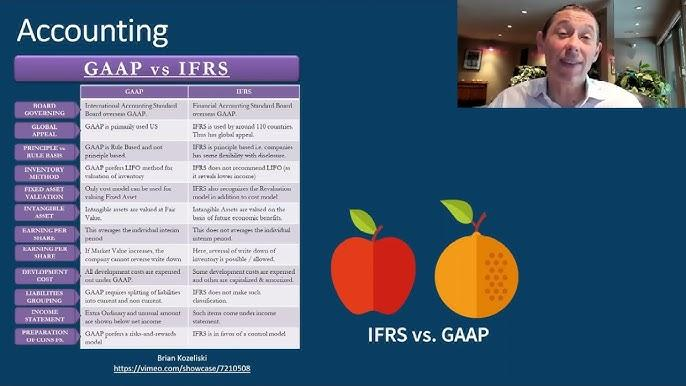

## Table of Contents

## What is principles-based accounting?

Principles-based accounting is a way of setting accounting rules that focuses on broad guidelines rather than specific rules. Instead of telling companies exactly what to do in every situation, it gives them general principles to follow. This approach allows companies to use their judgment and adapt to new situations more easily. For example, instead of a rule saying exactly how to value inventory, a principle might say that inventory should be valued at the lower of cost or market value, leaving room for interpretation.

This method can be more flexible and can better reflect the true economic reality of a company. It encourages accountants to think about the spirit of the law, not just the letter. However, it can also lead to more inconsistency because different companies might interpret the principles differently. This can make it harder for investors to compare financial statements from different companies. Despite these challenges, many believe that principles-based accounting can lead to more transparent and fair financial reporting.

## What is rules-based accounting?

Rules-based accounting is a method where specific rules and detailed guidelines are set for companies to follow. Instead of general principles, it gives exact instructions on how to handle different accounting situations. For example, there might be a rule that says exactly how to calculate depreciation on a certain type of asset. This approach aims to make sure everyone follows the same steps, so financial statements are more consistent and easier to compare.

However, rules-based accounting can be very complex because there are so many rules to follow. It can also lead to companies finding ways to get around the rules without breaking them, which is called "gaming the system." This can make financial reports less honest. On the other hand, having clear rules can make it easier for companies to know exactly what they need to do, which can be helpful, especially for smaller businesses that might not have a lot of accounting expertise.

## How do principles-based and rules-based accounting differ?

Principles-based accounting and rules-based accounting are two different ways to set up accounting rules. Principles-based accounting uses broad guidelines that tell companies the general ideas they should follow. For example, it might say that companies should be honest and fair in their financial reports. This way, companies can use their own judgment to decide how to apply these principles in different situations. It's more flexible and can better show what's really going on with a company's finances. But, it can also lead to different companies doing things differently, which can make it hard to compare their financial statements.

On the other hand, rules-based accounting gives companies very specific rules to follow. Instead of general ideas, it tells companies exactly what to do in many different situations. For example, it might have a rule that says exactly how to calculate the value of inventory. This makes financial statements more consistent and easier to compare because everyone is following the same steps. But, it can also be very complicated because there are so many rules. Sometimes, companies might try to find ways to follow the rules without really following the spirit of them, which can make financial reports less honest.

In summary, principles-based accounting is more flexible and focuses on the spirit of the law, while rules-based accounting is more detailed and focuses on following specific rules. Both have their advantages and challenges, and the choice between them can affect how companies report their finances and how investors understand those reports.

## What are the advantages of using principles-based accounting?

Principles-based accounting has several advantages. One big advantage is that it's flexible. Instead of strict rules, it uses general guidelines that companies can apply in different ways. This means companies can use their own judgment to show what's really going on with their finances. If something new happens, like a new type of business or a new way of doing things, companies can still follow the general principles without needing new rules.

Another advantage is that principles-based accounting encourages honesty and fairness. When companies follow the spirit of the law instead of just the letter, they are more likely to make financial reports that really show the truth. This can make investors trust the company more because they know the company is trying to be fair and honest. In the end, this can lead to better financial reporting and more trust in the market.

## What are the advantages of using rules-based accounting?

Rules-based accounting has a big advantage because it makes things consistent. When everyone follows the same exact rules, it's easier to compare financial statements from different companies. This helps investors and other people understand and trust the numbers they see. It's like having a clear recipe that everyone uses, so you know what to expect.

Another advantage is that rules-based accounting can be easier for companies to follow, especially smaller ones. When the rules are very specific, companies don't have to guess or make up their own ways to do things. They just follow the steps, which can save time and reduce mistakes. This can be really helpful for businesses that don't have a lot of accounting experts on their team.

## What are the potential drawbacks of principles-based accounting?

One big problem with principles-based accounting is that it can lead to different companies doing things in different ways. Because the rules are not very specific, each company might interpret them differently. This can make it hard for investors to compare financial statements from different companies. If one company decides to value its inventory one way and another company does it differently, it can be confusing and make it tough to see which company is doing better.

Another issue is that principles-based accounting can be harder for smaller companies. They might not have a lot of accounting experts to help them figure out how to apply the general principles. This can lead to mistakes or even companies trying to bend the rules to make their financial reports look better. While the flexibility of principles-based accounting is good for showing the true picture of a company's finances, it can also make things more complicated and less clear for some businesses.

## What are the potential drawbacks of rules-based accounting?

One problem with rules-based accounting is that it can be very complicated. There are so many specific rules that companies have to follow, and it can be hard to keep track of them all. This can make it tough for companies, especially smaller ones, to do their accounting correctly. They might need to hire more experts or spend a lot of time making sure they follow all the rules, which can be expensive and time-consuming.

Another issue is that rules-based accounting can lead to companies trying to "game the system." This means they might follow the rules exactly but in a way that doesn't really show the truth about their finances. They can find little loopholes or ways to make their financial reports look better without breaking any rules. This can make it hard for investors to trust the numbers they see and can lead to less honest financial reporting.

## How do international accounting standards align with principles-based or rules-based approaches?

International accounting standards, like those set by the International Accounting Standards Board (IASB), tend to lean more towards principles-based accounting. These standards give companies general guidelines to follow instead of very specific rules. For example, the IASB's standards might say that companies should report their financials in a way that is fair and true, but they don't give exact steps on how to do that. This means companies have to use their own judgment to apply these principles, which can be good for showing the real situation of their finances.

However, international standards also have some rules-based elements. While they focus on principles, there are still some specific rules that companies need to follow. This mix helps to keep things consistent across different countries and makes it easier for investors to compare financial statements. But it can also be a bit confusing because companies still have to figure out how to apply the general principles while following the specific rules.

## Can you provide examples of countries or organizations that use principles-based accounting?

Many countries and organizations around the world use principles-based accounting. One big example is the International Financial Reporting Standards (IFRS), which are used by over 140 countries. IFRS are set by the International Accounting Standards Board (IASB) and focus on general principles instead of strict rules. This means companies in these countries have to use their own judgment to make sure their financial reports are fair and honest.

In the United States, the Financial Accounting Standards Board (FASB) has been moving towards a more principles-based approach, especially with the convergence project with the IASB. While the U.S. still uses Generally Accepted Accounting Principles (GAAP), which are more rules-based, there's a push to make them more like IFRS. This shows that even countries with a strong rules-based tradition are seeing the benefits of principles-based accounting.

## Can you provide examples of countries or organizations that use rules-based accounting?

The United States is a big example of a country that uses rules-based accounting. They use something called Generally Accepted Accounting Principles (GAAP), which have a lot of specific rules. These rules tell companies exactly how to do their accounting, like how to value their inventory or calculate their profits. This makes it easier for investors to compare financial statements from different companies because everyone is following the same steps.

Another example is Japan, which also uses a more rules-based approach. The Japanese accounting standards have many detailed rules that companies need to follow. This helps keep things consistent and clear, but it can also be complicated for companies to keep up with all the rules. Both the U.S. and Japan show how rules-based accounting works in practice, focusing on specific instructions rather than general principles.

## How does the choice between principles-based and rules-based accounting affect financial reporting?

The choice between principles-based and rules-based accounting really changes how companies report their finances. With principles-based accounting, companies follow general guidelines instead of strict rules. This means they can use their own judgment to show what's really going on with their money. It can make financial reports more honest and clear, but it can also be harder to compare reports from different companies because they might do things differently.

On the other hand, rules-based accounting gives companies exact steps to follow. This makes financial reports more consistent and easier to compare because everyone is doing the same thing. But, it can also be very complicated because there are so many rules. Sometimes, companies might try to find ways to follow the rules without really showing the truth about their finances. So, the choice between these two methods can affect how clear, honest, and comparable financial reports are.

## What future trends might influence the shift between principles-based and rules-based accounting?

In the future, more countries might start using principles-based accounting. This is because it lets companies show their true financial situation better. As businesses and the world change quickly, having rules that are too strict can be a problem. Principles-based accounting can help because it's more flexible. Also, as more countries work together, using the same kind of accounting can make it easier to compare financial reports from different places. This could make principles-based accounting more popular, especially with standards like IFRS being used by many countries already.

However, rules-based accounting might still be important, especially for some countries and smaller companies. It can be easier for them to follow clear rules instead of general principles. Also, technology might help make rules-based accounting better. With computers and software, it can be easier to keep track of all the rules and make sure they are followed correctly. So, while there might be a shift towards principles-based accounting, rules-based accounting could still have a place, especially with the help of new technology.

## References & Further Reading

[1]: Bergstra, J., Bardenet, R., Bengio, Y., & Kégl, B. (2011). ["Algorithms for Hyper-Parameter Optimization."](https://papers.nips.cc/paper/4443-algorithms-for-hyper-parameter-optimization) Advances in Neural Information Processing Systems 24.

[2]: ["Advances in Financial Machine Learning"](https://www.amazon.com/Advances-Financial-Machine-Learning-Marcos/dp/1119482089) by Marcos Lopez de Prado

[3]: ["Evidence-Based Technical Analysis: Applying the Scientific Method and Statistical Inference to Trading Signals"](https://www.amazon.com/Evidence-Based-Technical-Analysis-Scientific-Statistical/dp/0470008741) by David Aronson

[4]: ["Machine Learning for Algorithmic Trading"](https://github.com/stefan-jansen/machine-learning-for-trading) by Stefan Jansen

[5]: ["Quantitative Trading: How to Build Your Own Algorithmic Trading Business"](https://www.amazon.com/Quantitative-Trading-Build-Algorithmic-Business/dp/1119800064) by Ernest P. Chan