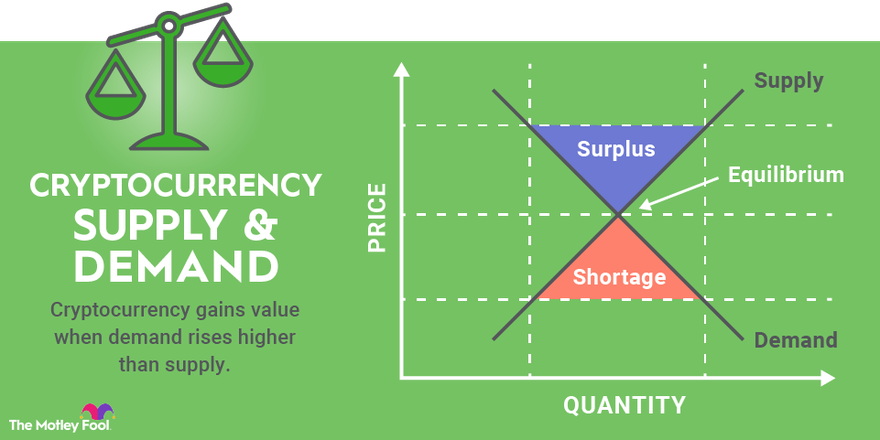

## Table of Contents

## What is cryptocurrency and how does it differ from traditional currency?

Cryptocurrency is a type of digital money that you can use to buy things online. It's different from traditional money, like dollars or euros, because it's not controlled by a government or a bank. Instead, it uses something called blockchain technology, which is like a digital record book that keeps track of all transactions. People can send and receive cryptocurrencies through the internet without needing a bank to help them.

Traditional currency, on the other hand, is physical money or digital money that is issued and regulated by a country's central bank. This means that the government has control over how much money is made and how it is used. When you use traditional money, you usually need a bank account to keep your money safe and to make transactions. Cryptocurrencies don't need banks in the same way, which can make them faster and cheaper to use, but they can also be riskier because their value can change a lot and they are not as widely accepted.

## What are the basic principles of investing in cryptocurrencies?

Investing in cryptocurrencies means buying digital money like Bitcoin or Ethereum with the hope that their value will go up over time. It's important to do your research before you start. Look into different cryptocurrencies and understand what makes them unique. Some are used for buying things, while others are used for other purposes like running computer programs. Also, think about how much risk you're willing to take. Cryptocurrencies can be very unpredictable, so you might lose money if their value drops.

Once you've decided to invest, start with a small amount of money that you can afford to lose. It's a good idea to spread your money across different cryptocurrencies to reduce risk. This is called diversification. Keep an eye on the market and be ready to make changes to your investments if needed. Remember, the [cryptocurrency](/wiki/cryptocurrency) market can be influenced by many things, like new laws or changes in technology, so staying informed is key.

Lastly, consider using a secure wallet to store your cryptocurrencies. There are different types of wallets, like online wallets and hardware wallets, and each has its own level of security. Be careful about scams and only use trusted platforms to buy and sell your cryptocurrencies. Investing in cryptocurrencies can be exciting, but it's important to be patient and not make quick decisions based on short-term changes in the market.

## How can beginners start investing in cryptocurrencies safely?

To start investing in cryptocurrencies safely, beginners should first do their homework. It's important to learn about different cryptocurrencies and what makes them special. For example, Bitcoin is the most well-known, but there are others like Ethereum that have different uses. Once you understand the basics, decide how much money you can afford to lose. Cryptocurrencies can go up and down a lot, so it's smart to only invest money that you don't need right away. Also, think about spreading your money across different cryptocurrencies to reduce risk. This is called diversification.

Next, choose a trustworthy platform to buy and sell cryptocurrencies. Look for exchanges that are well-known and have good security measures. When you're ready to buy, use a secure wallet to store your cryptocurrencies. There are different types of wallets, like online wallets that you can access from your computer or phone, and hardware wallets that are like USB drives and keep your money offline and safer. Always be careful of scams and never share your private keys or passwords with anyone. Remember, investing in cryptocurrencies can be exciting, but it's important to take your time and not rush into decisions.

## What are the most common cryptocurrencies to invest in and why?

The most common cryptocurrencies to invest in are Bitcoin and Ethereum. Bitcoin is the first and most famous cryptocurrency. It's often called "digital gold" because people think it's a good way to store value over time. Many people buy Bitcoin hoping its price will go up. Ethereum is another popular choice. It's not just a currency but also a platform that lets people build and run computer programs called smart contracts. This makes Ethereum useful for things like creating new apps or financial tools.

Besides Bitcoin and Ethereum, there are other cryptocurrencies that are also popular. Litecoin is sometimes called the "silver to Bitcoin's gold" because it's similar to Bitcoin but with faster transaction times. Ripple (XRP) is used by banks and financial institutions to move money quickly and cheaply around the world. Cardano and Solana are also gaining attention because they focus on improving the speed and security of transactions. People invest in these cryptocurrencies for different reasons, like believing in their technology or wanting to diversify their investments.

In summary, Bitcoin and Ethereum are the most common because they are well-known and have been around for a while. Other cryptocurrencies like Litecoin, Ripple, Cardano, and Solana are also popular because they offer unique features or solve specific problems. When choosing which cryptocurrencies to invest in, it's important to understand what each one does and why people might want to use them.

## What role does blockchain technology play in cryptocurrency investments?

Blockchain technology is the backbone of cryptocurrencies. It's like a digital record book that keeps track of all the transactions made with a cryptocurrency. Every time someone sends or receives cryptocurrency, the transaction is recorded on the blockchain. This makes it very hard for anyone to cheat or change the records because the blockchain is spread out across many computers and everyone can see the transactions. When you invest in cryptocurrencies, you're trusting that the blockchain will keep your transactions safe and secure.

The blockchain also helps make cryptocurrencies different from regular money. With traditional money, you need a bank to help you send and receive money. But with cryptocurrencies, the blockchain lets you do this directly with other people without needing a bank. This can make transactions faster and cheaper. When you're thinking about investing in cryptocurrencies, understanding how the blockchain works can help you feel more confident about your investment because it shows how the system keeps everything transparent and secure.

## How do market trends and news affect cryptocurrency prices?

Market trends and news can have a big impact on cryptocurrency prices. When there's good news, like a country saying they will use a certain cryptocurrency, its price might go up because more people want to buy it. On the other hand, if there's bad news, like a big hack or new laws that make it harder to use cryptocurrencies, the price can go down because people might want to sell their cryptocurrency. Trends in the market, like more people starting to use cryptocurrencies for buying things, can also push prices up. But if people start to lose interest, the prices might drop.

It's also important to know that news and trends can affect different cryptocurrencies in different ways. For example, if there's news about a new technology that makes Ethereum faster, its price might go up more than Bitcoin's price. Sometimes, the whole market can move together if there's big news that affects all cryptocurrencies, like changes in laws or big economic events. Keeping an eye on the news and understanding market trends can help investors make better decisions about when to buy or sell their cryptocurrencies.

## What are the risks involved in cryptocurrency investments and how can they be mitigated?

Investing in cryptocurrencies can be risky. One big risk is that the prices can go up and down a lot in a short time. This is called [volatility](/wiki/volatility-trading-strategies). If the price goes down a lot, you could lose money. Another risk is that cryptocurrencies are not backed by a government or a bank, so if something goes wrong, like a hack, you might not get your money back. Scams are also a problem. Some people might try to trick you into giving them your money or your private keys. It's important to be careful and do your research before you invest.

To make your investments safer, start by only investing money you can afford to lose. This way, if the price goes down, it won't hurt you too much. It's also a good idea to spread your money across different cryptocurrencies. This is called diversification, and it can help reduce the risk. Always use a secure wallet to store your cryptocurrencies and be careful about where you buy and sell them. Stick to well-known and trusted platforms. Finally, stay informed about the market and news that could affect cryptocurrency prices. This can help you make better decisions about when to buy or sell.

## How can investors perform technical analysis on cryptocurrencies?

Technical analysis is a way to look at charts and numbers to guess where the price of a cryptocurrency might go next. Investors use special tools called indicators to help them. Some common indicators are moving averages, which show the average price over a certain time, and the Relative Strength Index (RSI), which tells if a cryptocurrency is being bought or sold a lot. By looking at these indicators on a chart, investors can see patterns and trends that might help them decide when to buy or sell.

To start doing technical analysis, investors need to find a good chart platform that shows cryptocurrency prices. Many exchanges and websites offer free charts with tools to help with analysis. Once you have the charts, you can start looking at different time frames, like daily or hourly, to see how the price has moved in the past. This can give you clues about where it might go in the future. It's important to remember that technical analysis is not perfect and the market can be unpredictable, but it can still be a helpful tool for making smarter investment choices.

## What are the tax implications of investing in cryptocurrencies?

When you invest in cryptocurrencies, you need to think about taxes. In many places, if you make money from selling cryptocurrencies, you have to pay taxes on that money. This is called capital gains tax. For example, if you buy Bitcoin at a low price and sell it later for a higher price, the difference between what you paid and what you sold it for is what you might have to pay taxes on. The rules can be different depending on where you live, so it's important to check the tax laws in your country or talk to a tax expert.

Another thing to know is that sometimes, using cryptocurrencies to buy things can also have tax implications. If you use Bitcoin to buy something and the value of the Bitcoin has gone up since you got it, you might have to pay taxes on that increase in value. Keeping good records of all your cryptocurrency transactions is really important because it helps you figure out how much tax you owe. It can be a bit complicated, but understanding the tax rules can help you avoid surprises and stay out of trouble with the tax office.

## How does portfolio diversification apply to cryptocurrency investments?

Portfolio diversification means spreading your money across different types of investments to reduce risk. In the world of cryptocurrencies, this means not putting all your money into just one cryptocurrency like Bitcoin. Instead, you can invest in a mix of different cryptocurrencies, like Ethereum, Litecoin, and others. By doing this, if one cryptocurrency goes down in price, the others might stay the same or even go up, which can help protect your overall investment.

Diversification in cryptocurrencies is important because the market can be very unpredictable. If you only invest in one cryptocurrency and its price drops a lot, you could lose a lot of money. But if you have a variety of cryptocurrencies, the risk is spread out. This way, even if one or two go down, the others might balance it out. It's like not putting all your eggs in one basket. Diversifying your cryptocurrency portfolio can help you feel more secure and potentially make better returns over time.

## What advanced strategies can expert investors use to maximize returns in the cryptocurrency market?

Expert investors can use a strategy called "[arbitrage](/wiki/arbitrage)" to make money from cryptocurrencies. Arbitrage means buying a cryptocurrency on one exchange where the price is low and then quickly selling it on another exchange where the price is higher. This works because the prices of cryptocurrencies can be different on different exchanges at the same time. To do this well, investors need to watch the prices closely and act fast. They also need to think about the fees they have to pay for buying and selling, because these fees can eat into their profits.

Another advanced strategy is called "staking." Some cryptocurrencies, like Ethereum and Cardano, let you earn more coins by holding onto them and helping to keep the network running. This is called staking, and it's like [earning](/wiki/earning-announcement) interest on your money. To do this, you need to lock up your coins for a certain amount of time. The more coins you stake and the longer you keep them locked up, the more you can earn. This can be a good way to make your investment grow without having to buy and sell all the time. But it's important to understand the risks, like the chance that the value of the cryptocurrency might go down while your coins are locked up.

## How can one stay updated with the latest developments in the cryptocurrency space to make informed investment decisions?

To stay updated with the latest developments in the cryptocurrency space, it's helpful to follow reliable news sources. Websites like CoinDesk, CoinTelegraph, and CryptoSlate are good places to find news about cryptocurrencies. You can also sign up for newsletters from these sites to get the latest news sent right to your email. Another way to stay informed is by joining online communities and forums like Reddit's r/CryptoCurrency or following cryptocurrency influencers on social media platforms like Twitter and YouTube. These places can give you different views and insights from other people who are interested in cryptocurrencies.

It's also important to keep an eye on official announcements from cryptocurrency projects. Many projects have their own blogs or social media accounts where they share updates about new features or changes. Subscribing to these can help you stay in the loop. Additionally, attending webinars, conferences, and meetups can give you a chance to learn from experts and network with other investors. By staying informed through these different ways, you can make better decisions about your cryptocurrency investments.

## How can one effectively monitor market trends and news?

Monitoring market trends and news is an essential practice for any cryptocurrency investor aiming to make informed trading decisions. One effective way to achieve this is by utilizing a combination of technical and [fundamental analysis](/wiki/fundamental-analysis), each providing valuable insights into the crypto market dynamics.

**Technical Analysis** involves the use of mathematical indicators to evaluate price patterns and market behavior. Two popular tools in this category are moving averages and the relative strength index (RSI). Moving averages, such as the simple moving average (SMA) and the exponential moving average (EMA), smooth out price data to reveal trends over specific periods. The SMA is calculated by taking the average of a given set of prices over a particular timeframe, whereas the EMA gives more weight to recent prices, making it more responsive to new information.

The formula for a simple moving average is:

$$
\text{SMA} = \frac{\sum_{i=1}^{n} P_i}{n}
$$

where $P_i$ represents the price at each period $i$ and $n$ is the number of periods considered.

On the other hand, RSI is a [momentum](/wiki/momentum) oscillator that measures the speed and change of price movements, oscillating between zero and 100. A common interpretation is that an RSI above 70 indicates an overbought condition, while below 30 indicates an oversold condition.

The RSI is typically calculated as:

$$
\text{RSI} = 100 - \left( \frac{100}{1 + \frac{\text{average gain}}{\text{average loss}}} \right)
$$

Python code for RSI calculation might look like this:

```python
import numpy as np

def calculate_rsi(prices, period=14):
    deltas = np.diff(prices)
    seed = deltas[:period+1]
    up = seed[seed >= 0].sum() / period
    down = -seed[seed < 0].sum() / period
    rs = up / down
    rsi = np.zeros_like(prices)
    rsi[:period] = 100. - 100. / (1. + rs)

    for i in range(period, len(prices)):
        delta = deltas[i - 1]  # because the diff is 1 shorter

        if delta > 0:
            upval = delta
            downval = 0.
        else:
            upval = 0.
            downval = -delta

        up = (up * (period - 1) + upval) / period
        down = (down * (period - 1) + downval) / period
        rs = up / down
        rsi[i] = 100. - 100. / (1. + rs)

    return rsi
```

**Fundamental Analysis** involves evaluating the underlying factors and news that could impact cryptocurrency prices. Investors must stay informed about key developments related to technological advancements, strategic partnerships, and legislative changes. For instance, the adoption of new blockchain technologies or the forging of strategic alliances between prominent crypto firms can drive market sentiment and affect asset pricing. Similarly, legislative announcements regarding regulation, taxation, or legal statuses can have significant ramifications on market dynamics.

Staying abreast of these elements enables investors to blend technical signals with real-world events for a holistic view of market opportunities and risks. Through continuous monitoring and adaptive strategies, investors can make more calculated decisions, potentially achieving better outcomes in the ever-evolving crypto landscape.

## References & Further Reading

[1]: Bergstra, J., Bardenet, R., Bengio, Y., & Kégl, B. (2011). ["Algorithms for Hyper-Parameter Optimization."](https://papers.nips.cc/paper/4443-algorithms-for-hyper-parameter-optimization) Advances in Neural Information Processing Systems 24.

[2]: ["Advances in Financial Machine Learning"](https://www.amazon.com/Advances-Financial-Machine-Learning-Marcos/dp/1119482089) by Marcos Lopez de Prado

[3]: ["Evidence-Based Technical Analysis: Applying the Scientific Method and Statistical Inference to Trading Signals"](https://www.amazon.com/Evidence-Based-Technical-Analysis-Scientific-Statistical/dp/0470008741) by David Aronson

[4]: ["Machine Learning for Algorithmic Trading"](https://github.com/stefan-jansen/machine-learning-for-trading) by Stefan Jansen

[5]: ["Quantitative Trading: How to Build Your Own Algorithmic Trading Business"](https://www.amazon.com/Quantitative-Trading-Build-Algorithmic-Business/dp/1119800064) by Ernest P. Chan