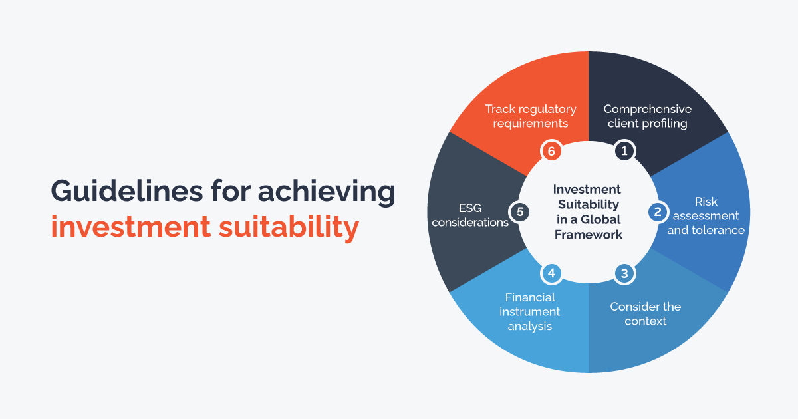

In today's dynamic investment landscape, the integration of systematic investment principles, suitability analysis, and algorithmic trading has become crucial for optimizing investment portfolios. These components collectively enhance an investor's ability to align their investments with personal financial objectives and risk tolerances, leveraging technology to achieve potentially superior returns.

Investment principles form the foundation for crafting a well-balanced portfolio. Key principles such as diversification, risk management, and asset allocation are essential in managing risk and maximizing returns. By understanding and implementing these principles, investors can better navigate market fluctuations and align their portfolios with long-term financial goals. Suitability analysis is a critical aspect of this process, ensuring that each investment fits an individual's financial situation and objectives. This necessitates a thorough assessment of factors like risk tolerance, investment horizon, and financial circumstances.

Algorithmic trading has revolutionized modern investment strategies by offering speed, efficiency, and data processing capabilities. Automated systems execute trades based on predefined criteria, minimizing emotional bias and enhancing adherence to a disciplined trading strategy. While algorithmic trading presents opportunities for improved market engagement, it also introduces risks such as system errors and the potential for increased market volatility.

This comprehensive guide will explore the pivotal aspects of investment suitability, systematic approaches, and the evolving role of algorithmic trading. By integrating these elements, investors can make informed decisions, optimize portfolio management, and adapt to changing market conditions, ultimately achieving a harmonious blend of technology-driven strategies and traditional investment principles.

## Table of Contents

## Understanding Investment Principles

Investment principles provide the foundation for making informed decisions that align with long-term financial goals. These principles encompass diversification, risk management, and a tailored asset allocation according to one's risk profile.

**Diversification**

Diversification refers to spreading investments across various asset classes to reduce risk. This strategy ensures that the poor performance of one asset does not disproportionately affect the entire portfolio. By investing in a mix of stocks, bonds, and other assets, investors can achieve a more stable return profile. 

**Risk Management**

Risk management is a crucial component that involves identifying, assessing, and prioritizing risks, followed by the application of resources to minimize or control the probability of unforeseen events. Key techniques include stop-loss orders, options for hedging, and regular portfolio reviews to maintain alignment with risk tolerance levels.

**Asset Allocation**

A clear understanding of asset allocation is essential for tailoring investment strategies to individual objectives and risk appetites. Asset allocation involves dividing an investment portfolio among different categories, such as equities, fixed income, and cash equivalents, based on the investor's goals, risk tolerance, and investment horizon.

Balanced investment portfolios should consider various asset types, including stocks, bonds, and exchange-traded funds (ETFs). Stocks often provide growth potential, bonds offer income and stability, and ETFs offer diversification benefits with convenient market accessibility.

Investors should also remain vigilant of changing market conditions and adjust their strategies accordingly. This involves adopting a dynamic approach to portfolio management, continually assessing market trends, economic indicators, and personal financial goals to make informed decisions. 

In conclusion, adhering to sound investment principles like diversification and risk management, along with a tailored asset allocation approach, helps minimize risk while maximizing returns within an investor's risk tolerance. This strategic foundation is crucial for sustaining long-term financial growth and adapting to evolving market landscapes.

## Suitability in Investment

Suitability in Investment is a critical concept that dictates how well an investment aligns with an individual's financial situation and objectives. The suitability of an investment is primarily influenced by factors such as risk tolerance, investment horizon, and the individual's unique financial circumstances. Risk tolerance refers to an investor's ability and willingness to endure market [volatility](/wiki/volatility-trading-strategies) and potential losses in pursuit of financial gains. It varies from person to person and can significantly impact investment strategy, guiding decisions on asset allocation and risk exposure.

Investment horizon, another crucial [factor](/wiki/factor-investing), is the expected duration an investor plans to hold an investment before liquidating it. Generally, a longer investment horizon allows for a greater risk tolerance due to the increased potential for market recovery over time. Conversely, a shorter investment horizon necessitates lower risk tolerance to safeguard principal amounts in the face of market fluctuations.

Legal obligations also play a pivotal role in ensuring investment suitability. Financial advisers and brokers are bound by regulations such as the Financial Industry Regulatory Authority (FINRA) Rule 2111. This rule mandates that professionals recommend only those investments that they reasonably believe are suitable for their clients based on comprehensive assessments of the clients' profiles, including their financial status, tax situation, investment experience, and objectives. Prudent investment practices align with these regulations, emphasizing the importance of a personalized approach tailored to each investor's needs and circumstances.

For individual investors, maintaining the suitability of their portfolio is an ongoing responsibility. Regular reviews are essential, particularly in response to life changes that might impact financial standings or objectives, such as marriage, career shifts, or significant market developments. Investors should evaluate their portfolios periodically to ensure alignment with their evolving financial conditions and goals.

Overall, suitability in investment is a balanced approach where the investor's personal situation dictates the appropriateness of investment types, ensuring that investment strategies are both legally compliant and practically sound.

## The Role of Algorithmic Trading

Algorithmic trading, often referred to as algo trading, involves using automated systems to execute trades based on pre-set criteria. This method leverages complex algorithms that analyze market data swiftly and execute trades at optimal times, offering significant advantages like speed, precision, and efficiency. 

In a typical [algorithmic trading](/wiki/algorithmic-trading) setup, computers utilize predefined instructions to [carry](/wiki/carry-trading) out trading activities, capitalizing on market opportunities that might be imperceptible to human traders. For instance, an algorithm can be programmed to identify specific price patterns or [arbitrage](/wiki/arbitrage) opportunities across different markets and execute trades in milliseconds. This capability is crucial, especially in high-frequency trading ([HFT](/wiki/high-frequency-trading-strategies)), where speed is a critical factor.

One of the primary benefits of algorithmic trading is its ability to process vast amounts of data in real time. This capacity enables algorithms to analyze multiple market indicators simultaneously, facilitating informed and timely trading decisions. Additionally, by automating the trading process, algorithms help eliminate human emotions, such as fear and greed, which can influence decision-making negatively. This objectivity ensures strict adherence to the trading strategy defined by the investor, improving consistency in execution.

However, despite these advantages, algorithmic trading is not without risks. One concern is the possibility of system errors or technical failures, which can lead to unintended trades with significant financial repercussions. Moreover, the algorithms can contribute to market volatility, especially when multiple systems react simultaneously to market signals, leading to rapid buy or sell orders. 

Investors and traders need to implement robust risk management protocols to mitigate these risks. Regularly reviewing and updating algorithmic systems is critical to ensuring that they remain aligned with current market conditions and the investor's goals. This involves having fail-safes and fallback mechanisms to correct or halt trades in case of unforeseen events or errors. 

In conclusion, while algorithmic trading brings efficiency and potential for enhanced returns, it requires careful oversight and regular system evaluation to maintain efficacy and alignment with broader investment strategies.

## Integrating Systematic Investment with Algo Trading

Systematic investment is a disciplined approach where investors commit to investing a fixed amount of money at regular intervals, often termed as Dollar-Cost Averaging (DCA). This strategy allows investors to accumulate securities over time, without the need to make investment decisions based on market timing. By purchasing more shares when prices are low and fewer shares when prices are high, investors effectively reduce the average cost per share over time.

When systematic investment is combined with algorithmic trading, the process becomes even more streamlined and effective. Algorithmic trading involves using pre-defined computer programs to automate the trading process, thereby eliminating human error and emotions like fear or greed. By incorporating systematic investment strategies with algorithmic trading, investors can automate their investments to align with their predetermined strategic goals.

Exchange-Traded Funds (ETFs) are particularly suitable for such a strategy. ETFs offer a diversified portfolio of assets, and when combined with an algorithmic approach, they can be systematically acquired to optimize exposure to a broad array of assets. This combination allows investors to leverage the benefits of diversification while maintaining control over their investment strategy.

One significant advantage of integrating algorithmic trading with systematic investment is the mitigation of emotional biases. Automation ensures that investments are executed in a structured manner, based on logical rules and algorithms rather than gut feelings. This structure is beneficial not only in maintaining discipline but also in providing a robust framework for investment decision-making.

The long-term potential of such integrated strategies is significant. As market conditions fluctuate, algorithmic systems can adapt seamlessly to ensure that investments remain aligned with the investor’s overall strategy. The adaptability of these systems ensures that portfolios can be adjusted according to changing market dynamics while supporting sustained portfolio growth potential. 

Moreover, algorithms can be programmed to periodically analyze and rebalance portfolios, ensuring adherence to the desired asset allocation and risk levels. It is crucial for algorithms to be updated and tested regularly to remain effective in the constantly evolving market landscape. Through this integration, investors can achieve a more consistent and potentially more profitable investment journey, harnessing the power of technology to support their financial objectives.

## Challenges and Considerations

Investors navigating the complexities of algorithmic trading must remain vigilant to potential risks such as overfitting and system glitches. Overfitting occurs when a trading algorithm is tailored too closely to historical data, failing to generalize effectively to new data. This can result in suboptimal trading decisions, as the algorithm might respond inappropriately to future market conditions. To mitigate overfitting, it is essential to utilize a robust set of data during the algorithm development, perform out-of-sample testing, and apply regularization techniques that prevent excessive complexity.

System glitches represent another significant risk, where unexpected errors in the trading software can lead to unintended trades or communication failures with exchanges. Such issues may arise from coding mistakes, insufficient testing, or hardware failures. Investors must employ comprehensive testing procedures, including stress tests and failure scenario analyses, to minimize the likelihood of glitches.

Regular review of investment suitability is vital, especially in light of life changes that could alter one's financial strategies. Circumstances such as job changes, major life events, or market fluctuations necessitate a reevaluation of portfolio alignment with personal goals. It is critical to adapt investment approaches to ensure they continue to meet one's risk tolerance and financial objectives.

Compliance with legislation and regulations remains a cornerstone of ethical investing. Regulatory bodies, like the Securities and Exchange Commission (SEC) in the United States, set rules to safeguard investors and uphold market integrity. Adherence to these rules is non-negotiable, requiring investors and firms to maintain up-to-date knowledge of legal obligations and systematically incorporate them into their trading practices.

Risk management through diversification and strategic planning is key to counteracting potential detriments. Diversification spreads investment across various asset classes, reducing the impact of any single asset's poor performance. Implementing stop-loss orders and employing hedging strategies, such as options or futures, further insulates portfolios from volatility.

Continuous education and the refinement of trading algorithms are crucial in adapting to evolving market environments. Algorithm designers must stay informed of technological advancements and market trends, updating their systems to maintain efficiency and effectiveness. This could involve integrating [machine learning](/wiki/machine-learning) techniques to enhance predictive accuracy or modifying parameters to better align with changing market dynamics.

Ultimately, by understanding and addressing these challenges, investors can enhance their algorithmic trading practices, ensuring alignment with both their technological capabilities and financial goals.

## Conclusion

Investment principles, suitability considerations, and algorithmic trading form a cohesive framework vital for effective portfolio management. These elements work together to offer a structured approach that adapts to the complexities of financial markets. By incorporating systematic methodologies and advanced technology, investors can benefit from increased efficiency and potential for higher returns.

A systematic, technology-driven approach enables investors to capitalize on algorithmic trading's strengths, such as speed and data processing capabilities, while maintaining consistency through disciplined investment practices. This meld of strategies can enhance decision-making processes and streamline the execution of trades, minimizing human emotions and biases that often lead to suboptimal performance.

However, the modern strategies offered by algorithmic trading and systematic investing should be balanced with traditional methods, including risk management and suitability assessments. Recognizing personal financial goals and risk tolerance is essential, ensuring that investments align well with individual circumstances and are legally compliant. Regular portfolio evaluations are necessary to maintain this balance, adapting to shifts in market conditions and personal financial situations.

The essence of successful investing lies in informed decision-making and disciplined execution. By integrating these approaches with personalized financial goals, investors can navigate the evolving landscape effectively. Technology, when combined with traditional investment wisdom, provides a robust framework not only for achieving growth but also for mitigating risks and adapting to market volatility.

## References & Further Reading

[1]: Bergstra, J., Bardenet, R., Bengio, Y., & Kégl, B. (2011). ["Algorithms for Hyper-Parameter Optimization."](https://dl.acm.org/doi/10.5555/2986459.2986743) Advances in Neural Information Processing Systems 24.

[2]: ["Advances in Financial Machine Learning"](https://www.amazon.com/Advances-Financial-Machine-Learning-Marcos/dp/1119482089) by Marcos Lopez de Prado

[3]: ["Evidence-Based Technical Analysis: Applying the Scientific Method and Statistical Inference to Trading Signals"](https://www.amazon.com/Evidence-Based-Technical-Analysis-Scientific-Statistical/dp/0470008741) by David Aronson

[4]: ["Machine Learning for Algorithmic Trading"](https://github.com/stefan-jansen/machine-learning-for-trading) by Stefan Jansen

[5]: ["Quantitative Trading: How to Build Your Own Algorithmic Trading Business"](https://www.amazon.com/Quantitative-Trading-Build-Algorithmic-Business/dp/1119800064) by Ernest P. Chan