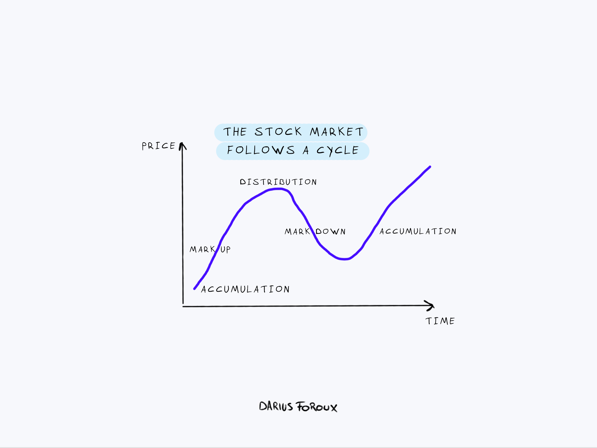

## Table of Contents

## What is timeless investing and why is it important?

Timeless investing is a way of managing money that focuses on long-term goals instead of trying to make quick profits. It means choosing investments that have a good history and are likely to do well over many years. People who use this method believe that it's better to be patient and stick with solid, reliable investments rather than jumping from one trendy thing to another.

This approach is important because it helps people avoid the stress and risk that come with trying to predict short-term market changes. By focusing on the long term, investors can build wealth slowly and steadily. This can lead to more peace of mind and a better chance of reaching financial goals, like saving for retirement or buying a home, without worrying about the ups and downs of the market.

## How do timeless investing strategies differ from short-term trading?

Timeless investing and short-term trading are two very different ways to handle money. Timeless investing is all about looking far into the future. People who use this strategy pick investments that they think will grow steadily over many years. They focus on things like good companies with strong histories, and they don't worry too much about what the market is doing right now. Instead, they believe in holding onto their investments for a long time, even if the market goes up and down.

On the other hand, short-term trading is about trying to make money quickly. Traders who use this method are always watching the market and trying to guess what will happen next. They buy and sell investments in a short amount of time, sometimes even within the same day. This can be exciting, but it's also risky because the market can be hard to predict. Short-term traders need to be very active and often use a lot of information and tools to make their decisions.

The main difference between the two is the time frame and the level of risk. Timeless investing is more patient and less stressful, aiming for steady growth over time. Short-term trading is more intense and can lead to big wins or big losses, depending on how well the trader can predict market movements.

## What are the key principles of timeless investing?

Timeless investing is all about playing the long game. It means [picking](/wiki/asset-class-picking) investments that you think will do well over many years, not just next week or next month. People who use this method look for good, reliable companies that have a strong history. They believe in the power of patience and don't get too worried about short-term ups and downs in the market. Instead, they focus on building wealth slowly and steadily over time.

Another important part of timeless investing is understanding and accepting risk. Investors know that all investments can go up or down, but they're okay with that because they're in it for the long haul. They spread their money across different types of investments to lower the risk. This way, if one investment doesn't do well, others might make up for it. It's about being smart and careful, not trying to get rich quick.

Lastly, timeless investing is about sticking to a plan. Once you've chosen your investments, the idea is to hold onto them and not change your mind every time the market moves. It's easy to get scared or excited and want to sell or buy, but timeless investors try to stay calm and keep their eyes on their long-term goals. This discipline helps them avoid making bad decisions based on short-term feelings.

## Can you explain the concept of compound interest in the context of timeless investing?

Compound interest is like a magic trick for your money when you're using timeless investing. It's what happens when you earn interest not just on the money you first put in, but also on the interest that money earns over time. Imagine you plant a seed and it grows into a tree. Then, that tree produces more seeds, and those seeds grow into more trees. Your money works the same way, growing bigger and bigger as the interest keeps adding up.

In timeless investing, you're letting this magic happen over many years. You don't take your money out or switch it around a lot. Instead, you leave it alone to grow. The longer you keep your money invested, the more powerful compound interest becomes. It's like letting your money have time to create more money, which then creates even more money. This is why timeless investors are patient; they know that over time, compound interest can turn small amounts of money into much larger sums.

## How does diversification play a role in timeless investing strategies?

Diversification is a big part of timeless investing. It means spreading your money across different types of investments instead of putting it all in one place. Imagine you have a basket of eggs. If you put all your eggs in one basket and drop it, you lose all your eggs. But if you spread your eggs across different baskets, dropping one won't ruin everything. In investing, this means you might put money in stocks, bonds, real estate, and other things. That way, if one type of investment does badly, the others might still do well and help balance things out.

This strategy fits perfectly with timeless investing because it helps manage risk over the long term. When you're planning to keep your money invested for many years, you don't want one bad year or one bad investment to mess up your whole plan. By diversifying, you give yourself a better chance of steady growth. It's like building a strong, balanced team where everyone plays a part in helping you reach your financial goals slowly but surely.

## What role does patience play in achieving success with timeless investing?

Patience is super important when you're using timeless investing. It means you're willing to wait a long time for your investments to grow. Instead of getting upset when the market goes down or excited when it goes up, you stay calm and keep your money where it is. You believe that over many years, good investments will get better and better. This patience helps you avoid making quick, bad decisions that could hurt your long-term goals.

When you're patient, you let compound interest do its magic. This means your money earns more money, and that extra money earns even more. The longer you leave your investments alone, the bigger this effect becomes. It's like planting a seed and waiting for it to grow into a big tree. If you keep digging it up to check on it, it won't grow as well. By being patient, you give your investments the time they need to turn into something much bigger and more valuable.

## How can one identify quality investments that align with timeless investing principles?

To find good investments that fit with timeless investing, you need to look at companies that have been around for a long time and have a strong track record. These companies usually have a solid history of making money and growing steadily. They might not be the most exciting or trendy, but they are reliable. You can check things like how much profit they make, how much debt they have, and if they pay dividends. Dividends are like little payments the company gives to its investors, which can be a sign of a healthy business. Also, look at the company's leaders and see if they have a good plan for the future. If a company has been doing well for many years and has smart people in charge, it's a good bet for timeless investing.

Another way to spot quality investments is by understanding the industry the company is in. Some industries, like healthcare or utilities, tend to be more stable over time. These industries often have a steady demand for their products or services, which can make the companies in them good choices for long-term investing. It's also smart to spread your money across different industries to lower your risk. This way, if one industry has a tough time, the others might still do well. By focusing on companies with strong histories, good financial health, and stable industries, you can build a portfolio that grows slowly but surely over many years.

## What are some common mistakes to avoid when applying timeless investing strategies?

One common mistake people make with timeless investing is getting too excited or scared by short-term market changes. They might see the market go up and think they should buy more, or see it go down and want to sell everything. But timeless investing is about being patient and not letting these ups and downs make you change your plans. If you keep switching your investments around because of what's happening right now, you could miss out on the long-term growth that comes from sticking with good, reliable companies.

Another mistake is not diversifying enough. When you put all your money in just one type of investment or one company, you're taking a big risk. If that one investment does badly, you could lose a lot. Timeless investing is about spreading your money across different kinds of investments so that if one doesn't do well, others might help balance it out. By diversifying, you give yourself a better chance of steady growth over many years.

## How do economic cycles affect timeless investing, and how should investors adapt?

Economic cycles are the ups and downs that happen in the economy over time. These cycles can affect timeless investing because they can change how well companies do. When the economy is doing well, companies might make more money, and their stock prices might go up. But when the economy is struggling, companies might make less money, and their stock prices might go down. Even though timeless investing is about looking at the long term, these short-term changes can still make investors feel worried or excited. But the key is to remember that economic cycles are normal and to not let them push you into making quick decisions.

To adapt to economic cycles, timeless investors should keep their focus on the long term. They should stick with their plan and not sell their investments just because the economy is going through a rough patch. It's important to keep a diverse portfolio, so if one type of investment does badly during a certain part of the cycle, others might do better. By staying patient and not trying to predict or react to every little change in the economy, timeless investors can ride out the ups and downs and still reach their long-term goals.

## Can you discuss the impact of inflation on long-term investment strategies?

Inflation is when prices go up over time, making money worth less. This can affect long-term investment strategies because it means your money might not buy as much in the future as it does now. If you're using timeless investing, where you're planning to keep your money in investments for many years, you need to think about how inflation will change the value of your money. Good news is, some investments can help protect against inflation. For example, stocks from companies that can raise their prices when costs go up might do well even when inflation is high. Also, some bonds, called inflation-protected securities, are made to grow with inflation, so they can help keep your money's value safe.

The key for timeless investors is to pick investments that can grow faster than inflation. If your investments grow at a slower rate than inflation, your money will actually lose value over time. That's why it's smart to have a mix of different types of investments. Stocks, real estate, and certain bonds can all help your money grow and keep up with or even beat inflation. By spreading your money across these different types of investments, you can make sure that over the long term, your money keeps its value and grows, even as prices go up.

## How do timeless investing strategies incorporate risk management?

Timeless investing strategies use risk management by spreading money across different types of investments. This is called diversification. It's like not putting all your eggs in one basket. If you invest in many different things, like stocks, bonds, and real estate, you lower the chance that one bad investment will hurt your whole plan. This way, if one investment goes down, others might go up and help balance things out. It's a smart way to protect your money over the long term.

Another part of risk management in timeless investing is choosing investments that have a good history and are likely to do well over many years. These are usually companies that have been around for a long time and have a strong track record. By picking these kinds of investments, you're less likely to lose a lot of money suddenly. Timeless investors also try to stay patient and not make quick decisions based on short-term market changes. This helps them avoid the risk of selling when the market is down or buying when it's too high. By sticking to a plan and being patient, they manage risk and aim for steady growth over time.

## What advanced techniques can expert investors use to enhance their timeless investing approach?

Expert investors can use something called "dollar-cost averaging" to make their timeless investing even better. This means they put money into their investments at regular times, no matter what the market is doing. By doing this, they buy more shares when prices are low and fewer when prices are high. Over many years, this can help them pay a lower average price for their investments. It's a smart way to keep adding to their investments without worrying too much about short-term ups and downs in the market.

Another advanced technique is called "rebalancing." This means checking their portfolio every now and then to make sure it still matches their long-term plan. If one type of investment has grown a lot more than others, they might sell some of it and buy more of the others to keep things balanced. This helps them stick to their original plan and manage risk better. By rebalancing, expert investors make sure their money stays spread out across different types of investments, which can help them reach their long-term goals more smoothly.

## References & Further Reading

[1]: Markowitz, H. (1952). ["Portfolio Selection."](https://onlinelibrary.wiley.com/doi/abs/10.1111/j.1540-6261.1952.tb01525.x) The Journal of Finance, 7(1), 77-91.

[2]: Bodie, Z., Kane, A., & Marcus, A. (2014). ["Investments"](https://books.google.com/books/about/EBOOK_Investments_Global_edition.html?id=BMsvEAAAQBAJ) (10th ed.). McGraw-Hill Education.

[3]: Chan, E. P. (2009). ["Quantitative Trading: How to Build Your Own Algorithmic Trading Business,"](https://github.com/ftvision/quant_trading_echan_book) Wiley.

[4]: Lopez de Prado, M. (2018). ["Advances in Financial Machine Learning."](https://www.amazon.com/Advances-Financial-Machine-Learning-Marcos/dp/1119482089) Wiley.

[5]: Jansen, S. (2020). ["Machine Learning for Algorithmic Trading."](https://github.com/stefan-jansen/machine-learning-for-trading) Packt Publishing.

[6]: Strong, R. A. (2006). ["Practical Investment Management."](https://www.amazon.com/Practical-Investment-Management-Robert-Strong/dp/0324359365) Cengage Learning.

[7]: Roundhill Investments. ["The State of Algorithmic Trading in 2021."](https://www.roundhillinvestments.com/)

[8]: Hsu, J. (2006). ["Cap-Weighted Portfolios are Sub-Optimal Portfolios."](https://www.researchaffiliates.com/content/dam/ra/publications/pdf/p-2006-sept-cap-weighted-portfolios-are-sub-optimal-portfolios.pdf) Journal of Investment Management, 4(3), 7-29.