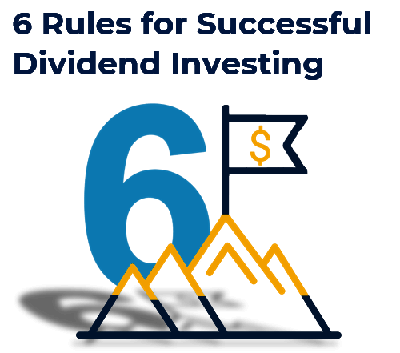

## Table of Contents

## What is dividend investing and why is it important for beginners?

Dividend investing is when you buy stocks that pay you money regularly, kind of like getting a little paycheck from the company. These payments are called dividends. When a company makes a profit, it can choose to share some of that profit with its shareholders by paying dividends. This can be a good way to earn extra money without selling your stocks.

For beginners, dividend investing is important because it can help you start building a steady income from your investments. It's a way to see your money grow over time without having to worry about the ups and downs of the stock market as much. Plus, reinvesting those dividends can help your investment grow even more, because you're buying more shares with the money you get. This can be a smart way to start investing, especially if you're new and want to see some regular returns.

## How do dividends work and what are the different types of dividends?

Dividends are payments that companies give to their shareholders from their profits. When a company decides to pay a dividend, it sets a specific date called the "record date." If you own the stock on that date, you'll get the dividend. The amount you get depends on how many shares you own. For example, if a company pays $1 per share and you own 100 shares, you'll get $100. Companies usually pay dividends quarterly, which means you get payments four times a year.

There are different types of dividends. The most common type is a cash dividend, where the company pays you in cash. Another type is a stock dividend, where instead of cash, the company gives you more shares of the stock. For example, if you get a 5% stock dividend and you own 100 shares, you'll get 5 more shares. There are also property dividends, where the company gives you assets like products or real estate, but these are less common. Lastly, some companies offer special dividends, which are one-time payments that are usually larger than regular dividends and are given when the company has extra profits.

## What are the key factors to consider when selecting dividend-paying stocks?

When [picking](/wiki/asset-class-picking) dividend-paying stocks, it's important to look at the company's history of paying dividends. A company that has paid steady or growing dividends for many years is often a good choice. This shows that the company is stable and committed to sharing its profits with shareholders. Also, check the dividend yield, which is the annual dividend payment divided by the stock's price. A higher yield might look good, but be careful because a very high yield can sometimes mean the company is in trouble and the stock price has fallen a lot.

Another thing to consider is the company's payout ratio, which is the percentage of earnings paid out as dividends. A payout ratio that's too high might mean the company can't keep paying those dividends if its profits drop. A lower ratio usually means the dividends are more sustainable. Also, think about the company's overall financial health. Look at things like its debt levels and cash flow. A company with strong finances is more likely to keep paying dividends even during tough times. By considering these factors, you can choose dividend-paying stocks that are more likely to provide you with steady income over time.

## How can one evaluate the sustainability of a company's dividend payments?

To evaluate the sustainability of a company's dividend payments, you should first look at the company's payout ratio. This is the percentage of its earnings that the company pays out as dividends. A payout ratio that's too high, say over 80%, might mean the company is paying out more than it can afford. This could be risky because if the company's profits drop, it might not be able to keep paying the same dividends. On the other hand, a lower payout ratio, like 50% or less, often means the dividends are more sustainable because the company is keeping enough money to reinvest in the business or save for tough times.

Another important thing to check is the company's financial health. Look at its debt levels and cash flow. A company with a lot of debt might struggle to pay dividends if it has to use its profits to pay off loans. Also, a company with strong cash flow is more likely to keep paying dividends because it has the money coming in to support those payments. By looking at these factors, you can get a better idea of whether a company's dividends are likely to continue in the future.

## What are dividend yield and payout ratio, and how do they influence investment decisions?

Dividend yield is how much money you get back each year from a stock's dividends, shown as a percentage of the stock's price. If a stock costs $100 and pays $5 in dividends each year, the dividend yield is 5%. A higher dividend yield might seem good because it means you're getting more money back for each dollar you invest. But be careful, because a very high yield can sometimes mean the stock's price has gone down a lot, which might be a sign that the company is having problems.

The payout ratio is the percentage of a company's earnings that it pays out as dividends. If a company earns $1 per share and pays out $0.50 in dividends, the payout ratio is 50%. A lower payout ratio usually means the company is keeping more money to grow the business or save for tough times, which can make the dividends more sustainable. A high payout ratio might mean the company is paying out more than it can afford, which could be risky if the company's profits drop. Both dividend yield and payout ratio can help you decide if a stock is a good investment by showing how much money you might get back and how likely the company is to keep paying those dividends.

## What role does diversification play in a dividend investment strategy?

Diversification is really important when you're building a dividend investment strategy. It means spreading your money across different kinds of stocks and industries. If you put all your money into just one or two stocks, you might get in big trouble if those companies start doing badly. But if you have a mix of stocks from different places, it's less likely that all of them will have problems at the same time. This way, even if one company cuts its dividend, you still have other stocks paying you money.

By diversifying, you also get to enjoy dividends from different sectors of the economy. Some industries might be doing well while others are struggling. For example, tech companies might be growing fast, but utility companies might be more stable. By having a mix, you can balance the risk and still get a steady stream of income. Diversification helps make your dividend strategy safer and more reliable over the long run.

## How can reinvesting dividends enhance long-term wealth accumulation?

Reinvesting dividends means using the money you get from dividends to buy more shares of the same stock instead of taking the cash. This can really help you grow your money over time. When you reinvest, you're buying more shares, which means you'll get even more dividends next time. This cycle of reinvesting and getting more dividends can make your investment grow faster than if you just took the cash. It's like planting a seed and letting it grow into a bigger plant that keeps giving you more seeds.

Over many years, this can make a big difference. Let's say you start with 100 shares and the company pays a dividend. If you reinvest that dividend, you'll have more shares next time, so you'll get a bigger dividend, and so on. This can help your money grow a lot, especially if the stock price goes up too. By reinvesting, you're using the power of compounding to turn small dividends into a much larger amount of money over the long term. It's a smart way to build wealth slowly but surely.

## What are the tax implications of dividend investing and how can they be managed?

When you earn dividends, you have to pay taxes on them. In the United States, there are two kinds of dividends: qualified and non-qualified. Qualified dividends are taxed at a lower rate, like the capital gains tax rate, which can be 0%, 15%, or 20% depending on your income. Non-qualified dividends are taxed at your regular income tax rate, which can be much higher. To know which kind of dividend you have, you need to check how long you've owned the stock and other rules set by the IRS.

You can manage the tax on dividends in a few ways. One way is to hold onto your stocks for at least 61 days during the 121-day period that starts 60 days before the ex-dividend date. This can make your dividends qualified and lower your tax rate. Another way is to invest in tax-advantaged accounts like an IRA or a 401(k). In these accounts, you don't have to pay taxes on your dividends until you take the money out, and sometimes you might not have to pay taxes at all if it's a Roth account. By understanding and using these strategies, you can keep more of your dividend earnings.

## How do economic cycles affect dividend-paying stocks and what strategies can mitigate risks?

Economic cycles can have a big impact on dividend-paying stocks. During good times, when the economy is growing, companies usually make more money and can pay bigger dividends. But when the economy slows down or goes into a recession, companies might make less money, and some might even cut their dividends to save cash. This can be tough for investors who rely on those dividends for income. Also, different industries can be affected differently by economic cycles. For example, utility companies might be more stable, while companies that make things people don't need as much during tough times, like luxury goods, might see bigger drops in their dividends.

To handle these risks, investors can use a few strategies. One good way is to diversify your investments across different industries and types of companies. This way, if one industry is doing badly, you still have other stocks that might be doing okay. Another strategy is to focus on companies with strong financials and a history of paying steady dividends, even during tough times. These companies are often more likely to keep paying dividends no matter what the economy is doing. Also, keeping some money in cash or bonds can help you weather economic downturns without having to sell your stocks at a bad time. By using these strategies, you can make your dividend investing safer and more reliable over the long run.

## What advanced metrics and ratios should an expert use to assess the quality of dividend stocks?

When experts look at dividend stocks, they often use a few special numbers and ratios to figure out how good those stocks are. One important number is the dividend coverage ratio. This tells you how many times a company's earnings can cover its dividend payments. A higher number means the company can easily pay its dividends, which is a good sign. Another useful ratio is the free cash flow yield, which compares the company's free cash flow to its market value. If this number is high, it means the company has a lot of cash to pay dividends and grow the business. Experts also look at the return on equity (ROE), which shows how well a company is using the money shareholders have put in to make more money. A high ROE can mean the company is doing a good job and might keep paying good dividends.

Another thing experts look at is the dividend growth rate, which shows how much the dividends have been growing over time. A company that keeps raising its dividends might be a good long-term investment. The payout ratio is also key, as it tells you what part of the company's earnings goes to dividends. A payout ratio that's too high might mean the dividends aren't sustainable, but a lower ratio can be a good sign. Lastly, experts might check the company's debt-to-equity ratio to see how much debt the company has compared to its equity. A lower ratio usually means the company is in a better position to keep paying dividends, even if times get tough. By looking at these numbers and ratios, experts can get a better idea of which dividend stocks are likely to be the best investments.

## How can one construct a dividend growth portfolio and what are the best practices for managing it?

To build a dividend growth portfolio, start by picking companies that have a good history of raising their dividends over time. Look for companies that have increased their dividends for many years in a row. These companies are often in stable industries and have strong financials. You should also check the dividend yield and payout ratio to make sure the dividends are sustainable. A good way to start is by spreading your money across different types of companies and industries. This way, if one industry has a tough time, the others can help keep your income steady. Reinvesting the dividends you get can also help your portfolio grow faster over time.

Managing a dividend growth portfolio well means keeping an eye on the companies you've invested in. Regularly check their financial health and see if they're still raising their dividends. If a company starts to struggle or cuts its dividend, it might be time to sell and find a better option. It's also important to keep your portfolio balanced. This means making sure no single stock or industry takes up too much of your money. As your dividends grow, you can use them to buy more shares, which can help your income keep growing. By staying on top of things and making smart choices, you can build a strong dividend growth portfolio that provides a steady and increasing income over the years.

## What are the latest trends and future outlooks for dividend investing in the global market?

In recent years, dividend investing has seen some interesting trends around the world. More and more investors are looking for stocks that not only pay dividends but also grow those dividends over time. This is because people want their money to keep up with inflation and provide a steady income. Another trend is that companies in emerging markets, like those in Asia and Latin America, are starting to pay more dividends. This is good news for investors because it gives them more options to diversify their portfolios. Also, with interest rates going up in some places, investors are turning to dividend stocks as a safer way to earn income compared to bonds.

Looking ahead, the future of dividend investing looks promising. Experts think that as the global economy grows, more companies will be able to pay and increase their dividends. However, investors should be ready for some ups and downs. Economic cycles can affect how much money companies make and how much they can pay in dividends. But if you pick strong companies with a good history of paying dividends, your investments can be more stable. Overall, dividend investing is likely to stay popular because it offers a way to earn regular income and grow wealth over time, no matter where you are in the world.

## What are the basic principles of investment that one should understand?

Investment principles are fundamental concepts that aid investors in building a robust portfolio capable of weathering various market conditions. A well-constructed portfolio is typically characterized by diversification, risk management, and return optimization.

**Diversification** is a strategy that involves spreading investments across different asset classes, sectors, or geographies to reduce exposure to any single area of risk. This principle is based on the notion that a diversified portfolio is likely to yield smoother returns and less volatility over time. The concept can be understood mathematically by considering the expected return of a portfolio, which is the weighted average of the expected returns of the individual assets. The variance of the portfolio, which is a measure of risk, can be reduced more efficiently than the average variance of the individual assets by including non-correlated or negatively correlated assets.

$$

\sigma_p^2 = \sum_{i=1}^{n} \sum_{j=1}^{n} w_i w_j \sigma_{i,j} 
$$

where $\sigma_p^2$ is the portfolio variance, $w_i$ are the weights of each asset, and $\sigma_{i,j}$ represents the covariance between assets $i$ and $j$.

**Risk Management** involves identifying, assessing, and prioritizing risks followed by the application of resources to minimize, control, and monitor the impact of those risks on the investment portfolio. Effective risk management seeks to balance potential returns with acceptable levels of risk. Techniques such as setting stop-loss orders and using derivatives can protect against downside risk. Further, understanding the risk tolerance of the investor—whether conservative, moderate, or aggressive—guides the selection of appropriate investments.

**Return Optimization** is the process of maximizing the expected returns for a given level of risk. This involves choosing the best combination of assets that aim to achieve the highest expected return. The Capital Asset Pricing Model (CAPM) is often used in this context to understand the relationship between the expected return of a security and its risk compared to the market. The CAPM formula is:

$$

E(R_i) = R_f + \beta_i (E(R_m) - R_f) 
$$

where $E(R_i)$ is the expected return of the investment, $R_f$ is the risk-free rate of return, $\beta_i$ represents the investment's sensitivity to market movements, and $E(R_m)$ is the expected market return.

Balancing growth and stability in a portfolio is an essential insight for investors aiming to achieve their financial goals. Growth investments might include stocks with high potential returns but come with increased [volatility](/wiki/volatility-trading-strategies), while stability is often provided by bonds or dividend-paying stocks that offer reliable income streams. Achieving a balance entails adjusting portfolio compositions based on market conditions, investment horizons, and individual risk appetites.

Overall, understanding and applying these basic investment principles allow investors to evaluate various opportunities effectively and align them with their financial objectives, creating portfolios that are designed to perform well in different market scenarios.

## What are the strategies and principles of dividend investing?

Dividend investing is a method that focuses on acquiring stocks known for regular and reliable income generation through dividends. This strategy involves selecting companies that pay dividends consistently, reflecting their financial stability and profitability.

### Key Principles of Dividend Investing

**1. Dividend Yields:**
A dividend yield is a financial ratio that shows how much a company pays out in dividends each year relative to its stock price. It is calculated as:

$$
\text{Dividend Yield} = \left( \frac{\text{Annual Dividends per Share}}{\text{Price per Share}} \right) \times 100\%
$$

A stable or increasing dividend yield can indicate a healthy company, but caution is advised as extremely high yields might signal financial difficulties or an unsustainable dividend.

**2. Payout Ratios:**
The payout ratio indicates the proportion of earnings a company distributes to shareholders in the form of dividends. It is determined by:

$$
\text{Payout Ratio} = \left( \frac{\text{Dividends per Share}}{\text{Earnings per Share}} \right) \times 100\%
$$

A lower payout ratio suggests a company retains more earnings for growth, while a high ratio could imply limited reinvestment in the business or potential vulnerability if earnings decline.

**3. Dividend Growth Rates:**
Monitoring the growth rate of dividends provides insights into a company's financial health and its commitment to returning profits to shareholders. Consistent growth in dividends typically reflects strong earnings growth and prudent capital management. Calculating the compound annual growth rate (CAGR) of dividends over a specific period can quantify this growth, often calculated as:

$$
\text{Dividend Growth Rate (CAGR)} = \left( \frac{\text{Dividend at End of Period}}{\text{Dividend at Start of Period}} \right)^{\frac{1}{\text{Number of Years}}} - 1
$$

### Prioritizing Quality and Stability

Investors are generally encouraged to emphasize quality and stability rather than merely chasing high yields. High-yield stocks can be appealing for income; however, they may come with increased risk if the company's financial underpinnings are weak. By prioritizing firms with a track record of stable or growing dividends and robust business models, investors aim to balance income generation with long-term capital appreciation.

### Benefits of Dividend Aristocrats

Dividend aristocrats are companies that have consistently increased their dividends for at least 25 consecutive years. This elite group is often regarded as financially healthy, with substantial cash flow and efficient management practices. Investing in dividend aristocrats can offer benefits such as lower volatility and increased total returns over time, combining dividends with potential capital gains.

### Significance of Dividend Reinvestment

Dividend reinvestment plans (DRIPs) allow investors to automatically reinvest their cash dividends into additional shares, often at no extra cost. This approach harnesses the power of compounding, gradually increasing the number of shares owned without requiring additional capital. Over the long term, reinvestment can significantly enhance the overall returns of a dividend investment strategy by accumulating more shares that, in turn, generate additional dividends. 

In summary, dividend investing relies on key financial metrics and strategies to enable the sustainable generation of income, underscoring the significance of quality, growth, and reinvestment in building a robust investment portfolio.

## References & Further Reading

#