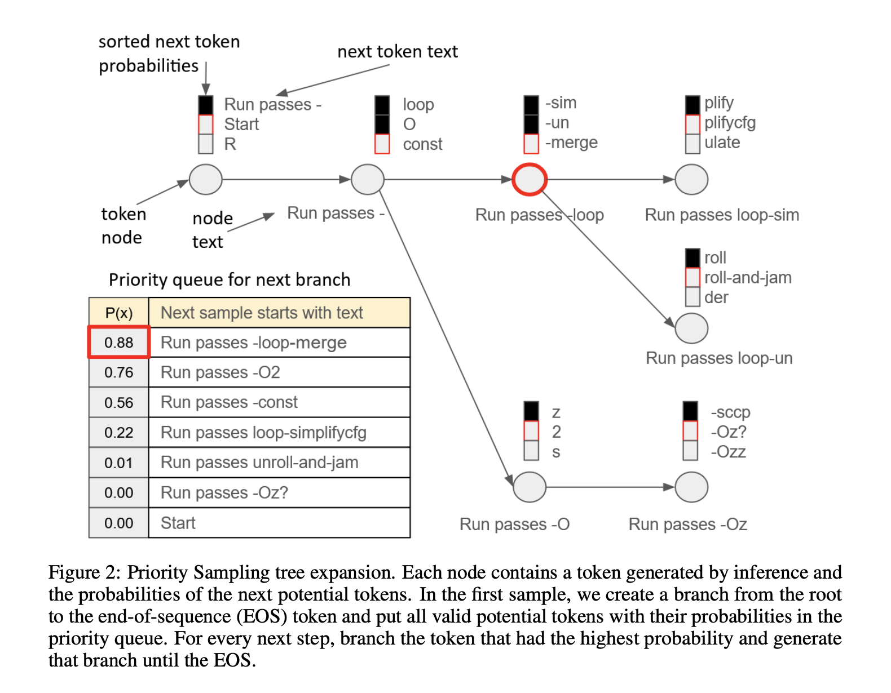

## Table of Contents

## What is Prioritized Sampling in the context of machine learning?

Prioritized Sampling is a technique used in machine learning to focus more on the data points that are harder for the model to learn. Instead of treating all data equally, this method gives more attention to the samples that the model is not doing well on. This can help the model learn faster and perform better, especially when there are a lot of data points or when some data points are more important than others.

In practice, Prioritized Sampling often involves calculating a priority score for each data point. This score is usually based on how much error the model makes on that point. For example, if a data point leads to a large error, it gets a high priority score and is more likely to be chosen for the next training round. This way, the model can improve more quickly by focusing on its weaknesses. The priority score can be calculated using a formula like $$p_i = \frac{|\delta_i|^\alpha}{\sum_j |\delta_j|^\alpha}$$ where $$p_i$$ is the priority of the i-th sample, $$\delta_i$$ is the error for that sample, and $$\alpha$$ is a hyperparameter that controls how much emphasis is placed on the errors.

## How does Prioritized Sampling differ from random sampling?

Prioritized Sampling and random sampling are two different ways to pick data points for training a machine learning model. In random sampling, every data point has an equal chance of being chosen. It's like picking names out of a hat; you don't know which one you'll get, and each name has the same chance. This method is simple and works well when all data points are equally important.

On the other hand, Prioritized Sampling focuses more on the data points that the model finds hard to learn. Instead of [picking](/wiki/asset-class-picking) data points randomly, it uses a priority score to decide which points to use more often. For example, if a data point leads to a big mistake by the model, it gets a higher priority score. The priority score can be calculated using a formula like $$p_i = \frac{|\delta_i|^\alpha}{\sum_j |\delta_j|^\alpha}$$ where $$p_i$$ is the priority of the i-th sample, $$\delta_i$$ is the error for that sample, and $$\alpha$$ is a number that controls how much the errors matter. This way, the model can improve faster by paying more attention to its mistakes.

## What are the main benefits of using Prioritized Sampling in machine learning models?

Prioritized Sampling helps [machine learning](/wiki/machine-learning) models learn faster and better by focusing on the data points that are hard for the model to understand. Instead of treating all data the same way, this method gives more attention to the samples where the model makes big mistakes. This can make the training process more efficient, especially when there are a lot of data points or when some data points are more important than others. By using a formula like $$p_i = \frac{|\delta_i|^\alpha}{\sum_j |\delta_j|^\alpha}$$ to calculate a priority score for each data point, the model can choose which samples to learn from more often, helping it improve quickly.

Another benefit of Prioritized Sampling is that it can help the model perform better on challenging parts of the data. When a model struggles with certain types of data, it might keep making the same mistakes over and over if it's using random sampling. But with Prioritized Sampling, those hard-to-learn data points get more chances to be used in training. This means the model can fix its mistakes and get better at handling those tough cases. As a result, the overall performance of the model can improve, making it more reliable and useful for real-world applications.

## Can you explain the concept of Adaptive Training Sample Selection (ATSS)?

Adaptive Training Sample Selection (ATSS) is a method used in machine learning to pick the right data points for training a model. Instead of using all the data points the same way, ATSS changes how it picks them based on how well the model is doing. It looks at the model's predictions and decides which data points are most important for the model to learn from. This way, the model can focus on the data that will help it improve the most.

ATSS works by figuring out a score for each data point that shows how useful it is for training. This score can change as the model learns, so the method is called "adaptive." For example, if a data point leads to a big mistake by the model, it might get a higher score and be used more often in training. This helps the model learn faster and better by paying more attention to its weaknesses. The score can be calculated using a formula like $$p_i = \frac{|\delta_i|^\alpha}{\sum_j |\delta_j|^\alpha}$$ where $$p_i$$ is the score for the i-th sample, $$\delta_i$$ is the error for that sample, and $$\alpha$$ is a number that controls how much the errors matter.

## How does Prioritized Iterative Sampling Algorithm (PISA) work?

The Prioritized Iterative Sampling Algorithm (PISA) is a way to help machine learning models learn better by focusing on the data points that are hard for them. Instead of using all the data the same way, PISA gives more attention to the samples where the model makes big mistakes. It does this by calculating a priority score for each data point. The score is based on how much error the model makes on that point. For example, if a data point leads to a large error, it gets a high priority score and is more likely to be chosen for the next training round. This way, the model can improve more quickly by focusing on its weaknesses. The priority score can be calculated using a formula like $$p_i = \frac{|\delta_i|^\alpha}{\sum_j |\delta_j|^\alpha}$$ where $$p_i$$ is the priority of the i-th sample, $$\delta_i$$ is the error for that sample, and $$\alpha$$ is a number that controls how much the errors matter.

PISA works in a loop, where it keeps updating the priority scores and choosing new data points to train on. At the start, the model might not be very good, so it makes a lot of mistakes. PISA uses these mistakes to figure out which data points are important. As the model gets better, the priority scores change, and PISA keeps picking the data points that will help the model the most. This process continues until the model is good enough or until a set number of rounds is reached. By always focusing on the hardest data points, PISA helps the model learn faster and perform better, especially when there are a lot of data points or when some data points are more important than others.

## What is Online Hard Example Mining (OHEM) and how does it relate to Prioritized Sampling?

Online Hard Example Mining (OHEM) is a technique used in machine learning to help models learn better by focusing on the toughest data points. Instead of using all data equally, OHEM picks out the examples that the model struggles with the most. These hard examples are the ones where the model makes big mistakes. By training more on these hard examples, the model can improve faster. OHEM works by calculating a score for each data point based on how much error the model makes on it. For example, if a data point leads to a large error, it gets a high score and is more likely to be used in the next training round.

OHEM is closely related to Prioritized Sampling because both methods aim to improve the model's performance by focusing on its weaknesses. In Prioritized Sampling, data points are given a priority score based on the model's error, like $$p_i = \frac{|\delta_i|^\alpha}{\sum_j |\delta_j|^\alpha}$$ where $$p_i$$ is the priority of the i-th sample, $$\delta_i$$ is the error for that sample, and $$\alpha$$ is a number that controls how much the errors matter. OHEM can be seen as a specific type of Prioritized Sampling where the focus is on the hardest examples. Both techniques help the model learn more efficiently by choosing which data points to use based on how well the model is doing on them.

## What is IoU-Balanced Sampling and how does it improve object detection?

IoU-Balanced Sampling is a way to help machines get better at spotting objects in pictures by picking the right parts of the picture to learn from. When a machine tries to find objects, it makes guesses about where those objects are. These guesses are called "bounding boxes." IoU-Balanced Sampling looks at how well these guesses match up with the real objects, using something called the Intersection over Union (IoU) score. If the guess is way off, the IoU score is low. If it's close, the score is high. By choosing more guesses with different IoU scores, the machine can learn to spot objects better, no matter if they're easy or hard to find.

This method helps because it makes sure the machine doesn't just learn from the easy guesses. Instead, it gets a mix of easy, medium, and hard guesses to train on. This mix helps the machine improve faster and be more accurate at finding objects in all kinds of situations. For example, if the machine is good at finding big, clear objects but bad at finding small or hidden ones, IoU-Balanced Sampling will make sure it practices more on those tricky cases. By using a formula like $$IoU = \frac{Area\ of\ Overlap}{Area\ of\ Union}$$ to figure out which guesses to use, IoU-Balanced Sampling helps the machine get better at spotting objects overall.

## How can Prioritized Sampling be implemented in a machine learning pipeline?

Prioritized Sampling can be added to a machine learning pipeline by figuring out which data points are the hardest for the model to learn. First, you need to train the model on some data and see how well it does. For each data point, you calculate a priority score based on how much error the model makes. For example, if the model makes a big mistake on a certain data point, that point gets a high priority score. The priority score can be calculated using a formula like $$p_i = \frac{|\delta_i|^\alpha}{\sum_j |\delta_j|^\alpha}$$ where $$p_i$$ is the priority of the i-th sample, $$\delta_i$$ is the error for that sample, and $$\alpha$$ is a number that controls how much the errors matter. Once you have these scores, you can use them to pick which data points to use more often in the next round of training.

After calculating the priority scores, you can change your training process to use these scores. Instead of picking data points randomly, you can use the scores to decide which ones to use more often. This means the model will focus more on the data points it's not doing well on, helping it learn faster and better. You keep updating the priority scores as the model improves, so the model keeps getting better at spotting its weaknesses. By doing this over and over, the model can improve a lot, especially when there are a lot of data points or when some data points are more important than others.

## What are the challenges and potential drawbacks of using Prioritized Sampling?

One challenge of using Prioritized Sampling is that it can make the model focus too much on the hard data points. If the model keeps seeing the same hard examples over and over, it might not learn as well from the easier ones. This can make the model good at handling tough cases but not as good with the simpler ones. Another problem is that calculating the priority scores can take a lot of time, especially if you have a lot of data. The formula for the priority score, like $$p_i = \frac{|\delta_i|^\alpha}{\sum_j |\delta_j|^\alpha}$$, needs to be updated often, which can slow down the training process.

A potential drawback is that Prioritized Sampling can make the model overfit to the hard examples. Overfitting means the model learns the hard examples too well and might not work as well on new data. This can happen because the model sees the hard examples more often and might start to memorize them instead of learning the general patterns. Also, if the priority scores are not calculated correctly, the model might focus on the wrong data points. This can happen if the errors used in the formula are not a good measure of how hard the examples are.

## How does Prioritized Sampling affect the training time and performance of a model?

Prioritized Sampling can make the training time longer because it needs to calculate a priority score for each data point. This score is based on how much error the model makes on that point, and the formula used is something like $$p_i = \frac{|\delta_i|^\alpha}{\sum_j |\delta_j|^\alpha}$$ where $$p_i$$ is the priority of the i-th sample, $$\delta_i$$ is the error for that sample, and $$\alpha$$ is a number that controls how much the errors matter. Calculating these scores and updating them often can slow down the training process, especially if you have a lot of data. But, even though it might take longer, the model can learn faster and better because it focuses more on the hard data points.

The performance of the model can get better with Prioritized Sampling because it helps the model learn from its mistakes. By focusing on the data points where the model makes big errors, it can improve more quickly on those tough cases. This means the model can become more accurate and reliable, especially when dealing with challenging data. But, there's a risk that the model might focus too much on the hard examples and not learn as well from the easier ones. This can make the model overfit to the hard examples, which means it might not work as well on new data. So, while Prioritized Sampling can boost performance, it needs to be used carefully to avoid these problems.

## Can you provide a comparative analysis of ATSS, PISA, OHEM, and IoU-Balanced Sampling?

Adaptive Training Sample Selection (ATSS), Prioritized Iterative Sampling Algorithm (PISA), Online Hard Example Mining (OHEM), and IoU-Balanced Sampling are all methods that help machine learning models learn better by choosing the right data points to focus on. ATSS changes how it picks data points based on how well the model is doing. It gives a score to each data point that shows how useful it is for training, and this score can change as the model learns. PISA works in a similar way by calculating a priority score for each data point based on the model's error, like $$p_i = \frac{|\delta_i|^\alpha}{\sum_j |\delta_j|^\alpha}$$ where $$p_i$$ is the priority of the i-th sample, $$\delta_i$$ is the error for that sample, and $$\alpha$$ is a number that controls how much the errors matter. OHEM is a bit different because it focuses only on the hardest examples, picking them out based on the model's errors. IoU-Balanced Sampling is used in object detection and picks guesses (bounding boxes) based on how well they match up with the real objects, using the Intersection over Union (IoU) score.

Each of these methods has its own way of helping the model learn better. ATSS and PISA are more general and can be used in many types of machine learning tasks because they focus on the model's errors and adapt as the model learns. OHEM is good for tasks where you want the model to get really good at the hardest examples, like in image recognition where some images are much harder to classify than others. IoU-Balanced Sampling is great for object detection because it makes sure the model practices on a mix of easy, medium, and hard guesses, helping it improve at spotting objects in all kinds of situations. While all these methods can make the model learn faster and better, they also have their own challenges. For example, focusing too much on hard examples can make the model overfit, and calculating priority scores can take a lot of time.

## What are the latest advancements and future directions in Prioritized Sampling research?

Recent advancements in Prioritized Sampling research have focused on making the method more efficient and effective. Researchers are working on new ways to calculate priority scores that take into account not just the error the model makes, but also other factors like the importance of different data points or the model's confidence in its predictions. For example, some new methods use a formula like $$p_i = \frac{|\delta_i|^\alpha \cdot w_i}{\sum_j |\delta_j|^\alpha \cdot w_j}$$ where $$w_i$$ is a weight that shows how important the i-th sample is. This helps the model focus on the data points that matter the most. Another big area of research is using Prioritized Sampling with other techniques, like [reinforcement learning](/wiki/reinforcement-learning), to make the model learn even faster.

Looking to the future, researchers are interested in making Prioritized Sampling work better in real-time applications, where the data is always changing. They want to find ways to update the priority scores quickly and accurately as new data comes in. There's also a lot of interest in using Prioritized Sampling for big data problems, where there are millions or even billions of data points. Researchers are trying to figure out how to use Prioritized Sampling on such a large scale without slowing down the training process too much. By solving these challenges, they hope to make machine learning models even smarter and more useful for all kinds of tasks.

## References & Further Reading

[1]: Schaul, T., Quan, J., Antonoglou, I., & Silver, D. (2016). ["Prioritized Experience Replay."](https://arxiv.org/abs/1511.05952) arXiv preprint arXiv:1511.05952.

[2]: Shrivastava, A., Gupta, A., & Girshick, R. (2016). ["Training Region-based Object Detectors with Online Hard Example Mining."](https://arxiv.org/abs/1604.03540) Proceedings of the IEEE Conference on Computer Vision and Pattern Recognition.

[3]: Lin, T.-Y., Goyal, P., Girshick, R., He, K., & Dollar, P. (2017). ["Focal Loss for Dense Object Detection."](https://ieeexplore.ieee.org/document/8237586) Proceedings of the IEEE International Conference on Computer Vision.

[4]: Cunningham, P., Delany, S.J. (2007). ["k-Nearest Neighbour Classifiers - A Tutorial."](https://dl.acm.org/doi/10.1145/3459665) ACM Computing Surveys.

[5]: Sutton, R.S., & Barto, A.G. (2018). ["Reinforcement Learning: An Introduction."](https://ieeexplore.ieee.org/book/6267343) MIT Press.

[6]: Freund, Y., & Schapire, R.E. (1997). ["A Decision-Theoretic Generalization of On-Line Learning and an Application to Boosting."](https://www.sciencedirect.com/science/article/pii/S002200009791504X) Journal of Computer and System Sciences.