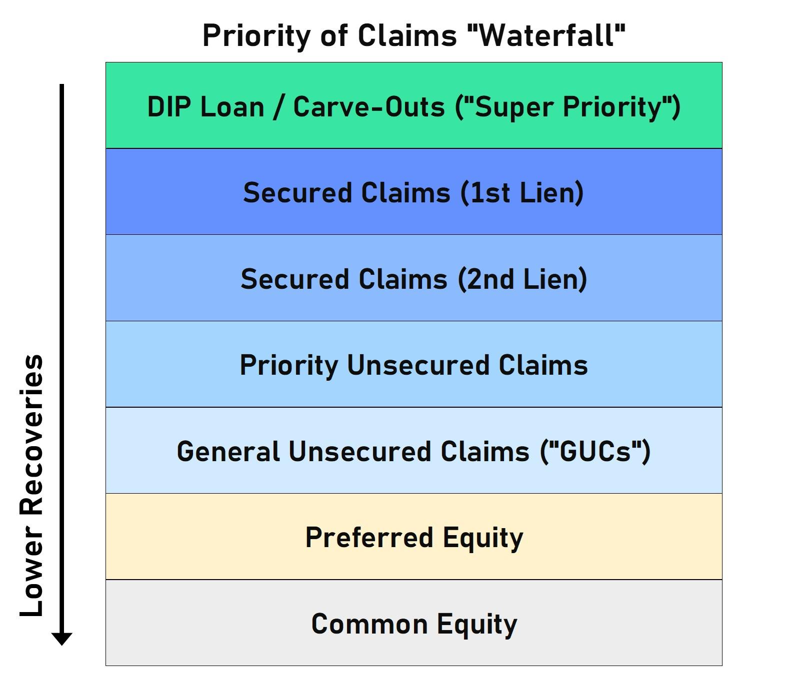

In the complex world of finance, understanding the nuances of creditor liquidation, debt priority, and algorithmic trading is paramount for both maintaining financial stability and maximizing investment returns. These topics are intricately connected within the financial ecosystem, significantly influencing outcomes during corporate liquidations. 

When a corporation faces insolvency, liquidation becomes a critical process involving the distribution of the firm’s remaining assets to satisfy outstanding obligations. Creditors, those to whom the company owes money, are paid off systematically based on a legal framework that prioritizes certain debts over others. This hierarchy is crucial, as it delineates the order in which different classes of creditors receive payments, ultimately affecting the recovery prospects of each stakeholder involved.



Simultaneously, algorithmic trading has revolutionized financial markets, including debt management. It employs computer algorithms to execute trades at speeds and frequencies that are impossible for human traders. In the context of debt markets and liquation scenarios, algorithmic trading facilitates better-informed decision-making by analyzing large datasets to identify trends and execute trades that align with risk preferences and market conditions. This technological advancement aids investors in managing complex portfolios and reacting swiftly to market fluctuations—an essential capability during the dynamic phases of corporate restructuring and liquidation.

This article will explore how creditors are prioritized during liquidation processes and the role of algorithmic trading in managing these events. We aim to elucidate the implications for investors navigating these critical components of financial markets, thus equipping them with the requisite knowledge to effectively manage risk and seize opportunities in distressed asset transactions.

## Table of Contents

## Understanding Creditors Liquidation

Liquidation is a crucial process undertaken when a company becomes insolvent, meaning it can no longer meet its financial obligations. This process involves the systematic selling of a company's assets to generate funds required to settle its outstanding liabilities. The key players in this scenario are the creditors, entities or individuals to whom the company owes money. Their repayment during liquidation is carefully organized and follows a predetermined hierarchy, ensuring an equitable distribution of the company's remaining value.

In the United States, the order in which creditors are repaid during liquidation is primarily determined by the Bankruptcy Code, particularly Section 507. This section outlines the priority of various claims, ensuring that the distribution of assets is both fair and legally compliant. The creditors are classified into different categories based on the nature of their claims, and each category must be fully satisfied before proceeding to the next.

The process begins with the secured creditors, who have loaned money against specific collateral. These creditors are given the highest priority because their loans are backed by tangible assets. Should there be any remaining funds after settling the secured debts, the liquidation process then addresses unsecured creditors. This group, which includes tax agencies and employees with unpaid wages, is often divided into preferred and non-preferred categories. Preferred unsecured creditors have claims that are given priority over those of non-preferred unsecured creditors, such as regular suppliers or service providers.

It is essential that liquidation administrators adhere strictly to the hierarchy established by legal frameworks like Section 507. This not only ensures fairness in the distribution of assets but also upholds the legal and ethical standards expected during such financial proceedings. The structure provided by these regulations is designed to reduce the chaos that can arise during insolvency, offering a clear and transparent process that aims to minimize financial losses for all parties involved. By understanding these principles and adhering to them, the liquidation process not only resolves the financial issues at hand but also maintains trust and integrity in the financial system.

## The Debt Priority Hierarchy

Debt priority is a fundamental concept in the process of corporate liquidation, dictating the sequence in which creditors receive payment from the sale of an insolvent company's assets. The order of repayment is primarily influenced by the type of creditor involved, which is governed by legal frameworks such as Section 507 of the United States Bankruptcy Code. This hierarchy is crucial in determining the risk profile of different financial instruments and the likelihood of recovery for various stakeholders.

**Secured Creditors**

Secured creditors stand at the top of the debt hierarchy, owing to the collateral backing their loans. This collateral provides a legal claim or lien on specific assets of the debtor, granting secured creditors a preferential position during liquidation. As a result, secured creditors are typically the first to be reimbursed from asset sales, minimizing their risk exposure. The underlying legal principle is that secured debts are tied to specific assets, which are liquidated to satisfy these obligations before addressing any unsecured debts.

**Unsecured Creditors**

Following secured creditors in the hierarchy are unsecured creditors, who do not have specific assets pledged as collateral against the debts owed to them. Within this broad category, further distinctions are made based on the specific nature of the unsecured claims.

1. **Priority Unsecured Creditors**: This subgroup includes certain unsecured creditors who are granted preferential treatment by law. Key examples are government tax agencies and employees with claims for unpaid wages or benefits. These creditors rank higher in the unsecured category because public policy prioritizes taxes and employee welfare.

2. **General Unsecured Creditors**: These are creditors without any collateral backing and who do not fall under the priority unsecured creditor category. They are paid after the claims of priority unsecured creditors have been settled. General unsecured creditors may include suppliers, customers with deposits, or unsecured bondholders. Their claims are often satisfied on a pro-rata basis depending on the remaining asset pool.

**Equity Shareholders**

Equity shareholders represent the owners of the company and occupy the lowest rung in the debt priority hierarchy. Within this category, there is a distinction between preferred and common shareholders. Preferred shareholders have a higher claim on assets compared to common shareholders, often receiving dividends prior to common shareholders and having a superior position in the event of liquidation. Nonetheless, both preferred and common shareholders are subordinate to all creditors. Common shareholders are typically the last to be compensated, often receiving no proceeds in a liquidation unless all other obligations have been fulfilled in full.

Understanding this hierarchy aids investors and stakeholders in assessing the risks associated with various types of financial instruments, particularly in potential liquidation scenarios. This awareness can influence investment strategy, particularly when considering investment in distressed companies or assets with varying levels of seniority.

## Algorithmic Trading in Debt Markets

Algorithmic trading involves the utilization of advanced computer algorithms to automate and manage trading activities. In debt markets, such algorithms are specifically designed to process large datasets and execute trades with speed and precision that human traders cannot match. These algorithms make use of statistical techniques and [machine learning](/wiki/machine-learning) models to maximize decision-making efficiency. They analyze market signals, price trends, and [liquidity](/wiki/liquidity-risk-premium) dynamics to optimize trading strategies in real-time.

In the context of liquidation and debt priority, [algorithmic trading](/wiki/algorithmic-trading) provides the ability to make rapid decisions on buying and selling distressed debt. When a company approaches insolvency, the value of its liabilities and the order in which they will be satisfied become crucial considerations. Algorithms can model these financial scenarios, assess risk levels, and identify potentially profitable investment opportunities in real-time. For instance, when a large [volume](/wiki/volume-trading-strategy) of bonds becomes available due to liquidation, algorithms can swiftly evaluate factors such as interest rates, recovery rates, and collateral details, executing trades that align with the investor’s risk-management strategies.

Moreover, algorithmic systems are equipped to handle the high-frequency trading necessary in volatile markets, where the price of debt securities can fluctuate dramatically within short time frames. Algorithms can be programmed to monitor these fluctuations and execute trades based on pre-set triggers or thresholds, thereby implementing strategies such as [arbitrage](/wiki/arbitrage), trend-following, or mean-reversion. Python, a popular language for developing trading algorithms, offers libraries such as Pandas and NumPy for data manipulation, while packages like SciPy and TensorFlow are used for advanced statistical and machine learning tasks.

Here is a simple example of a Python script that could be used for an algorithmic trading strategy:

```python
import pandas as pd
import numpy as np
from sklearn.linear_model import LinearRegression

# Sample data loading (assuming 'data' is a DataFrame with historical prices)
data = pd.read_csv('debt_market_data.csv')

# Calculate moving average as a trading signal
data['20_MA'] = data['Price'].rolling(window=20).mean()
data['50_MA'] = data['Price'].rolling(window=50).mean()

# Generate trading signals
data['Signal'] = 0
data.loc[data['20_MA'] > data['50_MA'], 'Signal'] = 1
data.loc[data['20_MA'] < data['50_MA'], 'Signal'] = -1

# Example of a linear regression model for prediction
X = data[['Price']].values
y = data['Signal'].values
model = LinearRegression().fit(X, y)

# Predict future movement
data['Prediction'] = model.predict(X)
```

For investors, the adaptation of algorithmic trading strategies in debt markets offers a competitive advantage. It facilitates informed decision-making based on comprehensive analysis and instantaneous execution, thereby enhancing the potential for favorable outcomes in debt-related investments. By employing algorithms, investors can keep pace with ever-changing market conditions and respond to corporate liquidation events with speed and accuracy, making algorithmic trading an indispensable tool in debt market dynamics.

## Implications for Investors

In the context of corporate liquidations, investors must prioritize understanding the hierarchy of creditor claims to assess risk accurately. This knowledge informs decisions about potential investments in distressed assets, helping investors predict the likelihood of debt recovery. Awareness of debt priority is essential for formulating effective investment strategies in companies facing financial distress. 

Secured creditors have the highest priority, meaning they are usually compensated before others using collateral associated with their loans. This positions them favorably in recovery scenarios, making investments related to secured debt potentially lower risk compared to less-secured forms of debt. Understanding the pecking order—where unsecured creditors, preferred creditors, and equity holders follow—allows investors to gauge not only the risk of their investments but also the potential returns based on the recovery sequence.

Algorithmic trading presents investors with the tools to react swiftly to new information, including liquidation announcements. By deploying sophisticated algorithms, investors can execute transactions at high speeds and volumes, thus maintaining a competitive edge. These automated systems analyze financial metrics and market data in real-time, enabling quick adaptations to shifts in debt markets. For instance, an algorithm might prioritize buying secured debt over equity in a distressed company, based on an evaluation of recovery prospects.

The integration of algorithmic trading strategies can enhance decision-making processes, allowing investors to optimize their portfolios. The ability of algorithms to process large datasets and execute trades without human intervention minimizes response times to market events, which is crucial during the sensitive periods of liquidations.

By combining a deep understanding of creditor hierarchy with the strategic implementation of algorithmic trading, investors can effectively manage risks associated with distressed investments. This dual approach ensures that investors are not only aware of their position in the liquidation queue but are also able to capitalize on timely market decisions to maximize potential recoveries and returns.

## Conclusion

The synergy between creditors' liquidation processes, debt priority rules, and algorithmic trading forms a vital trifecta in financial markets. These elements, when understood collectively, provide a comprehensive framework that is essential for navigating the complexities associated with corporate liquidations and investment in distressed assets. 

For both seasoned investors and newcomers, grasping the intricacies of how creditors are prioritized during liquidation proceedings is fundamental. This knowledge aids in assessing the risk and potential yield of investments within distressed or insolvent companies. As liquidation payouts follow a legal hierarchy, an investor's awareness of the position within this hierarchy can directly affect investment strategies and expectations of financial recovery.

Algorithmic trading further enhances this understanding by providing real-time data analysis and trade execution capabilities. This technological advancement allows investors to respond swiftly to market fluctuations and announcements regarding a company's financial state. Algorithms can assess vast amounts of market data and execute trades at speeds far beyond human capability, thus offering a competitive advantage in efficiently managing portfolios.

Continuous education is a critical [factor](/wiki/factor-investing) that empowers investors to effectively utilize these modern tools and insights. By staying informed about new developments in liquidation processes, changes in debt priority regulations, and advancements in algorithmic trading, investors can mitigate risks and optimize returns. Leveraging these elements not only secures current investments but also provides a strategic advantage in capitalizing on future opportunities within the financial markets.

## References & Further Reading

[1]: Warren, E. (1987). ["Bankruptcy Policy"](https://chicagounbound.uchicago.edu/uclrev/vol54/iss3/1/). *University of Pennsylvania Law Review*, 96(4), 776-788.

[2]: ["Corporate Bankruptcy: Economic and Legal Perspectives"](https://assets.cambridge.org/97805214/57170/frontmatter/9780521457170_frontmatter.pdf) by Jagdeep S. Bhandari and Lawrence A. Weiss

[3]: Mendelson, M. (2012). ["The Legal Aspects of Bank Regulation in the Post-Crisis Era"](https://journals.sagepub.com/doi/full/10.1177/1611894420974252). *Public Law and Legal Theory Papers.*

[4]: Zhang, W. B. (2016). ["Algorithmic Trading: Winning Strategies and Their Rationale"](https://www.wiley.com/en-us/Algorithmic+Trading%3A+Winning+Strategies+and+Their+Rationale-p-9781118460146) by Ernie Chan

[5]: Haugen, R. A. (2001). ["The New Finance: The Case Against Efficient Markets"](https://archive.org/details/newfinancecas00haug) by Robert A. Haugen