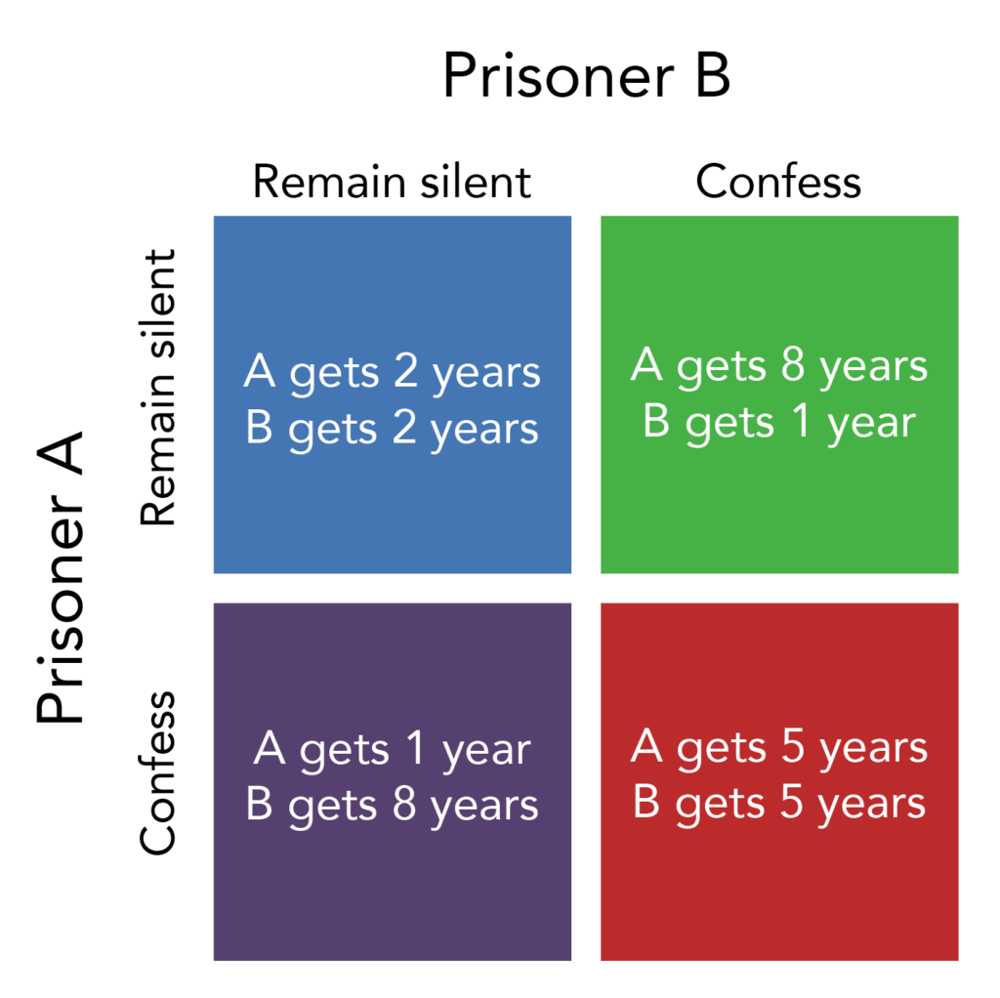

## Table of Contents

## What is the Prisoner's Dilemma?

The Prisoner's Dilemma is a famous problem in game theory that shows how two people might not work together even if it's in their best interest. Imagine two criminals are arrested and kept in separate rooms. The police don't have enough evidence to convict them of a big crime, but they can convict them of a smaller crime. The police offer each prisoner a deal: if one prisoner betrays the other by confessing, the betrayer goes free while the other gets a long sentence. If both betray each other, they both get a medium sentence. If neither betrays, they both get a short sentence for the smaller crime.

This situation creates a dilemma because each prisoner has to decide whether to betray the other or stay silent. If they could trust each other and both stay silent, they would both get the short sentence. But because they can't communicate and might not trust each other, each one might think it's safer to betray the other to avoid the long sentence. In the end, they often both betray each other and get the medium sentence, which is worse than if they had cooperated. This shows how hard it can be to cooperate, even when it would be better for everyone involved.

## How does the Prisoner's Dilemma apply to business scenarios?

The Prisoner's Dilemma can be seen in business when companies have to decide whether to work together or compete. Imagine two companies that could make more money if they both set their prices high. If one company keeps its prices high and the other lowers its prices, the one with lower prices will get more customers and make more money. But if both companies lower their prices, they will both make less money than if they had kept prices high. This is like the prisoners deciding whether to betray each other. If the companies could trust each other to keep prices high, they would both make more money. But because they might not trust each other, they might both lower their prices and end up making less money.

Another example is in advertising. Two companies might spend a lot of money on ads to try to get more customers. If both companies spend a lot on ads, they might cancel each other out and not gain many new customers. But if one company spends on ads and the other doesn't, the one that advertises might get more customers. If neither company advertises, they save money but might not grow as fast. This is similar to the prisoners' choice to stay silent or betray. If the companies could agree not to advertise, they would save money. But because they might not trust each other, they might both end up spending a lot on ads and not gaining much from it.

## Can you provide a simple example of the Prisoner's Dilemma in a business context?

Imagine two small coffee shops, Shop A and Shop B, in the same neighborhood. They both sell coffee for $3 a cup. If they keep their prices at $3, they both make a good profit. But one day, Shop A thinks about lowering its price to $2 to attract more customers. If Shop A lowers its price and Shop B keeps its price at $3, Shop A will get more customers and make more money, while Shop B will lose customers and make less money. But if Shop B also lowers its price to $2, they will both get more customers but make less profit per cup. If both shops keep their prices at $3, they both make a good profit. But if they both lower their prices to $2, they both make less profit.

This situation is like the Prisoner's Dilemma. If Shop A and Shop B could trust each other to keep their prices at $3, they would both make more money. But because they might not trust each other, they might both lower their prices to $2 and end up making less money. This shows how hard it can be for businesses to cooperate, even when it would be better for both of them.

## What are the key strategies businesses can use when facing a Prisoner's Dilemma situation?

One key strategy businesses can use when facing a Prisoner's Dilemma situation is to try to communicate and build trust with the other business. If the two coffee shops in our example could talk to each other and agree to keep their prices at $3, they would both make more money. Building trust can be hard, but it can help businesses avoid the bad outcomes of the Prisoner's Dilemma. They can do this by sharing information, making agreements, or even working together on other projects.

Another strategy is to look at the long-term effects of their decisions. In the short term, one coffee shop might make more money by lowering its price to $2. But if both shops keep lowering their prices, they will both make less money in the long run. By thinking about the future, businesses can see that working together and keeping prices high might be better for both of them. This can help them choose to cooperate instead of competing in a way that hurts them both.

A third strategy is to use a tit-for-tat approach. This means a business will do what the other business did last time. If one coffee shop keeps its price at $3, the other shop will do the same next time. But if one shop lowers its price to $2, the other shop will lower its price next time too. This can encourage both businesses to keep their prices high because they know the other will do the same. Over time, this can lead to more cooperation and better outcomes for both businesses.

## How does the concept of Nash Equilibrium relate to the Prisoner's Dilemma in business?

The Nash Equilibrium is a concept in game theory that helps explain what happens in the Prisoner's Dilemma. It's a situation where no one can do better by changing their own strategy if everyone else keeps their strategy the same. In the Prisoner's Dilemma, the Nash Equilibrium is when both prisoners betray each other. This is because if one prisoner stays silent while the other betrays, the silent one gets a longer sentence. So, even though both would be better off if they both stayed silent, the fear of the other betraying makes betraying the safer choice for each one.

In a business context, the Nash Equilibrium in a Prisoner's Dilemma situation can be seen when two companies both lower their prices. If one company keeps its prices high while the other lowers them, the one with lower prices will get more customers. But if both companies lower their prices, they will both make less money than if they had kept prices high. The Nash Equilibrium here is when both companies lower their prices because neither can do better by keeping prices high if the other company lowers them. This shows how businesses can end up in a situation where they both do worse than they could have if they had cooperated.

## What are the potential outcomes of the Prisoner's Dilemma in economic markets?

In economic markets, the Prisoner's Dilemma can lead to situations where businesses end up making less money than they could have. Imagine two companies that sell the same product. If they both keep their prices high, they both make good profits. But if one company lowers its price to get more customers, the other company might feel forced to lower its price too. This can lead to a situation where both companies lower their prices and make less money. This is like the Nash Equilibrium, where both companies end up doing worse than they could have if they had worked together.

This kind of situation can also affect the whole market. When companies lower their prices to compete, it can lead to a price war. This means that prices keep going down, and all the companies in the market make less money. Customers might be happy because they pay less, but the companies suffer. If the companies could trust each other and agree to keep prices high, they would all make more money. But because they might not trust each other, they end up in a situation where they all do worse. This shows how hard it can be for businesses to cooperate, even when it would be better for everyone.

## How can understanding the Prisoner's Dilemma help in negotiating business deals?

Understanding the Prisoner's Dilemma can help businesses negotiate better deals by showing them how important trust and communication are. If two companies are trying to agree on a price for a product, they might be tempted to lower their offer to get a better deal. But if both companies do this, they might end up with a price that's too low for either of them to make a good profit. By understanding the Prisoner's Dilemma, the companies can see that it's better to talk to each other and agree on a fair price that works for both of them. This way, they can avoid the bad outcome of both trying to get the best deal and ending up with a deal that's bad for both.

In negotiations, knowing about the Prisoner's Dilemma can also help businesses think about the long-term effects of their decisions. If one company offers a low price to get the deal, the other company might feel forced to accept it. But if they both keep offering lower prices, they might end up with a deal that's not good for either of them. By thinking about the future, the companies can see that it's better to work together and agree on a deal that's fair for both. This can help them build a good relationship and make better deals in the future.

## What role does trust play in resolving the Prisoner's Dilemma in business relationships?

Trust is really important when businesses are trying to solve the Prisoner's Dilemma. If two companies trust each other, they can work together and make better decisions. For example, if two coffee shops trust each other to keep their prices high, they can both make more money. But if they don't trust each other, they might both lower their prices and end up making less money. Trust helps businesses feel safe to cooperate and make choices that are good for both of them.

Building trust can be hard, but it's worth it. Companies can build trust by talking to each other and sharing information. They can also make agreements or work together on other projects. When businesses trust each other, they are more likely to choose to cooperate instead of competing in a way that hurts them both. This can lead to better outcomes for everyone involved.

## How have real-world businesses historically navigated the Prisoner's Dilemma?

Real-world businesses have often faced the Prisoner's Dilemma and found different ways to deal with it. One famous example is the airline industry. Airlines sometimes have to decide whether to keep their prices high or lower them to attract more customers. If one airline lowers its prices, others might feel forced to do the same, leading to a price war where all airlines make less money. To avoid this, some airlines have tried to work together and set prices at a level that's good for everyone. They do this by talking to each other and making agreements, like when airlines form alliances to coordinate their flights and prices. This helps them build trust and avoid the bad outcomes of the Prisoner's Dilemma.

Another example is in the technology industry, where companies often have to decide whether to share their technology or keep it secret. If two tech companies share their technology, they can both benefit and create better products. But if one company shares and the other keeps its technology secret, the one that shares might lose its advantage. To solve this, some tech companies have formed partnerships where they agree to share their technology and work together. By building trust and working together, they can avoid the Prisoner's Dilemma and create better products that help both companies.

## What advanced game theory models extend beyond the basic Prisoner's Dilemma in economic analysis?

Beyond the basic Prisoner's Dilemma, game theory includes more advanced models like the Iterated Prisoner's Dilemma. This model looks at what happens when the same game is played many times. In business, this can show how companies might change their strategies over time. For example, if two companies keep lowering their prices to compete, they might realize that it's better to work together and keep prices high. By playing the game many times, they can learn to trust each other and make better decisions.

Another advanced model is the Stag Hunt, which also deals with cooperation but in a different way. In the Stag Hunt, two hunters can choose to hunt a stag together or hunt rabbits alone. If they work together and catch the stag, they both get a big reward. But if one hunter goes for a rabbit while the other tries to hunt the stag, the one hunting the stag will fail and get nothing, while the other gets a small reward from the rabbit. This model can show how businesses might choose to work together for a big reward or go alone for a smaller, safer reward. In business, this can help companies decide whether to take a risk and work together for a big project or play it safe and work alone on smaller projects.

## How can repeated interactions change the dynamics of the Prisoner's Dilemma in business?

When businesses play the Prisoner's Dilemma many times, it changes how they make decisions. In the basic Prisoner's Dilemma, businesses might choose to compete and lower their prices because they don't trust each other. But when they play the game many times, they can start to learn from each other's actions. If one business sees that the other always tries to cooperate and keep prices high, they might start to trust them more. Over time, this can lead to more cooperation because businesses know that working together can be better for both of them in the long run.

In a real-world example, two companies might start by lowering their prices to compete. But as they keep playing the game, they might see that this just leads to less money for both. They can then decide to try working together and keeping prices high. By doing this over and over, they can build trust and find a way to make more money together. This shows how repeated interactions can help businesses move from competing to cooperating, leading to better outcomes for everyone involved.

## What are the limitations of applying the Prisoner's Dilemma model to complex economic systems?

The Prisoner's Dilemma is a useful tool for understanding some business decisions, but it can be too simple for complex economic systems. Real economies have many businesses, not just two, and they all affect each other in different ways. The Prisoner's Dilemma doesn't show how businesses might work with many other companies or how they might change their strategies based on what lots of other businesses are doing. It also doesn't consider things like government rules, different kinds of products, or how businesses might care about more than just making money, like their reputation or the environment.

Another limitation is that the Prisoner's Dilemma assumes that businesses always know what the best choice is and that they can easily predict what the other business will do. In real life, businesses often don't have all the information they need and can't be sure what other businesses will do. This makes it hard for them to make the best decisions. Also, the Prisoner's Dilemma doesn't show how businesses might change their goals over time or how they might be influenced by things outside the game, like changes in the economy or new technology. So, while the Prisoner's Dilemma can help explain some business situations, it's not perfect for understanding all the complexities of real economic systems.

## References & Further Reading

[1]: Flood, M. M., & Dresher, M. ("On the Game of 'Checkers.'") RAND Corporation. [Link to RAND Archive](https://en.wikipedia.org/wiki/Merrill_M._Flood)

[2]: Stackelberg, H. (1934). "The Theory of the Market Economy." [Link to Google Books](https://archive.org/details/theoryofmarketec0000stac)

[3]: Osborne, M. J., & Rubinstein, A. (1994). ["A Course in Game Theory."](https://sites.math.rutgers.edu/~zeilberg/EM20/OsborneRubinsteinMasterpiece.pdf) Princeton University Press.

[4]: Dixit, A. K., & Nalebuff, B. J. (2008). ["The Art of Strategy: A Game Theorist's Guide to Success in Business and Life."](https://www.amazon.com/Art-Strategy-Theorists-Success-Business/dp/0393337170) W. W. Norton & Company.

[5]: McMillan, J. (1992). ["Games, Strategies, and Managers: How Managers Can Use Game Theory to Make Better Business Decisions."](https://www.amazon.com/Games-Strategies-Managers-Business-Decisions/dp/0195108035) Oxford University Press.

[6]: Hansen, L. P., & Sargent, T. J. (2008). ["Robustness."](https://press.princeton.edu/books/paperback/9780691170978/robustness) Princeton University Press.

[7]: Lopez de Prado, M. (2018). ["Advances in Financial Machine Learning."](https://www.amazon.com/Advances-Financial-Machine-Learning-Marcos/dp/1119482089) Wiley.