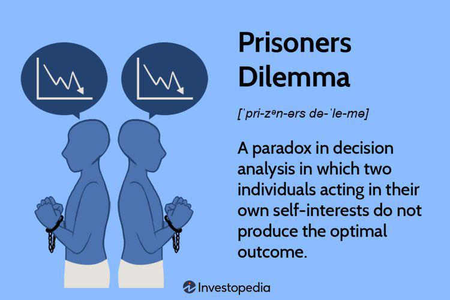

Economic theory provides a framework to understand market dynamics, consumer behavior, and the allocation of resources. It helps businesses develop strategies by offering insights into how markets operate and the factors that drive competition and cooperation. Essential to this is game theory, a branch of mathematics that examines strategic interactions between rational decision-makers. Within game theory, the Prisoner's Dilemma stands out as a critical concept. It illustrates a scenario where two individuals, acting in their self-interest, may end up worse off than if they had cooperated, highlighting the complexities of decision-making in competitive environments.

Strategic decision-making is vital in business as it determines a firm's ability to compete effectively and achieve long-term success. Companies continuously face choices that affect their competitive positioning, market share, and profitability. The willingness to cooperate or compete, akin to the choices in the Prisoner's Dilemma, can significantly impact a firm's performance. This highlights the importance of understanding strategic interactions and making informed decisions to enhance competitive advantage.



Algorithmic trading embodies strategic decision-making within financial markets. It involves using algorithms to execute trades at speeds and frequencies beyond human capability. These algorithms can be designed using principles from game theory to optimize trading strategies and react swiftly to market changes. This intersection of economic theory, game theory, and advanced computing enables financial institutions to gain a competitive edge, demonstrating the practical application of these theories in creating business strategies.

This article aims to explore the interconnectedness of economic theory, the Prisoner's Dilemma, and strategic decision-making, particularly through the lens of algorithmic trading. By examining how these concepts influence business strategy, the article seeks to provide insights into how organizations can effectively navigate competitive environments and leverage theoretical models for strategic advantage.

## Table of Contents

## Understanding Economic Theory

Economic theory is a framework that seeks to understand and explain how economies operate, focusing on the allocation of resources, production, distribution, and consumption of goods and services. Central to economic theory is the study of market dynamics, which refers to the forces that impact supply and demand, and consequently, prices and quantities in various markets. Through the analysis of market dynamics, economic theory provides insights into how individual and collective actions influence economic outcomes and helps predict future trends.

Game theory, a significant component within economic theory, specifically addresses situations where the outcome of an individual's choice depends on the decisions made by others. This aspect of economic theory is particularly relevant in strategic settings where entities—be they individuals, firms, or nations—interact in competitive environments. Game theory facilitates the understanding of strategic behavior, offering a structured approach to analyzing how decisions are made in interconnected environments.

The insights economic theory provides into competitive behavior are crucial for identifying patterns and predicting how firms will respond to competitive pressures. For instance, economic models such as the Cournot and Bertrand models capture the strategic interactions between companies within oligopolistic markets, where few players have market power. Applying these models helps firms anticipate competitors' pricing strategies and adjust their own tactics accordingly.

Moreover, economic theory extends to strategic decision-making by offering tools that organizations can utilize to optimize their choices in complex environments. The concepts of Nash Equilibrium and Pareto Efficiency, derived from game theory, are instrumental in assessing the potential outcomes of strategic interactions and ensuring that strategies align with overall organizational goals.

Economists and strategists employ various analytical frameworks to inform decision-making processes. For example, predictive modeling and simulations are often used to assess potential market scenarios and their implications for business strategy. By incorporating assumptions about consumer behavior, technological advancements, and regulatory changes, these models guide organizations in formulating strategies that enhance competitive advantage.

In conclusion, economic theory serves as a cornerstone for understanding and predicting market dynamics and competitive behavior. It equips businesses with the analytical tools necessary to make informed strategic decisions, thereby fostering sustainable growth and enhancing their capacity to navigate complex economic landscapes.

## Exploring the Prisoner's Dilemma

The Prisoner's Dilemma is a classic problem in game theory, originating from the work of Merrill Flood and Melvin Dresher in the 1950s, and it was formalized by Albert W. Tucker. It serves as a fundamental example of the complexities involved in strategic decision-making where individual rationality leads to a collectively suboptimal outcome. The dilemma is typically presented as follows: two individuals are arrested and accused of a crime. The authorities offer each prisoner a deal: betray the other by testifying against them, or remain silent. The outcomes are structured such that if one betrays the other while the other remains silent, the betrayer goes free and the silent accomplice receives the full punishment. If both betray each other, they both receive a moderate punishment. If both remain silent, they receive a minor punishment. The dilemma illustrates that rational prisoners will betray each other, leading to a worse outcome for both than if they had cooperated by remaining silent.

Mathematically, this can be represented in a payoff matrix:

|             | Prisoner B Stays Silent | Prisoner B Betrays |
|-------------|-------------------------|--------------------|
| Prisoner A Stays Silent | (-1, -1)                | (-3, 0)            |
| Prisoner A Betrays      | (0, -3)                 | (-2, -2)           |

Here, the numbers represent the years of imprisonment each prisoner faces. The strategy profile (Betray, Betray) is the Nash equilibrium, since neither player can unilaterally improve their outcome by changing their strategy.

In business contexts, the Prisoner's Dilemma captures scenarios where competitive strategies lead to suboptimal outcomes for all parties involved. One common example is the pricing strategies of competing firms. Consider two companies in an oligopolistic market: if both keep prices high, they enjoy larger profits, but each has an incentive to undercut the other to gain a larger market share. If both undercut, prices fall, and profits diminish for both.

The implications of the Prisoner's Dilemma for competitive strategies are significant. It highlights the challenge of sustaining cooperation in an environment where individual incentives drive entities toward competitive actions. To mitigate the suboptimal outcomes, businesses might employ strategies like tacit collusion or build mechanisms to foster trust and collaboration.

For instance, companies might form alliances or engage in reputation-building exercises to signal cooperative intent. Developing repeated interactions or long-term relationships could also encourage cooperative behavior, as mutual gains over time outweigh short-term advantages of betrayal. The dilemma underscores the necessity of considering not only immediate gains but also the broader strategic landscape where long-term cooperation can yield superior outcomes.

## Business Strategy Insights from the Prisoner's Dilemma

The Prisoner's Dilemma is a paradox in decision analysis in which two individuals acting in their own self-interest do not produce the optimal outcome. This scenario often challenges cooperative strategies in business settings by analogizing situations where entities may fail to cooperate, even when it seems mutually beneficial.

### Challenges in Cooperative Strategies

In a business context, the Prisoner's Dilemma is often observed in situations where companies might benefit from cooperation but are driven by competitive pressures to act otherwise. For example, consider two companies operating in the same market that could achieve higher profits by maintaining high prices. But individually, they each have an incentive to undercut the other to gain market share, ultimately driving prices down to less profitable levels.

### Strategies to Overcome the Dilemma

Businesses can employ several strategies to address these challenges:

1. **Establish Trust and Communication**: By fostering open communication and building trust, businesses can align their strategies to better understand and predict each other's actions. This minimizes the uncertainty that drives competitive behavior.

2. **Enforceable Agreements and Contracts**: Creating legally binding agreements can ensure cooperation by detailing specific actions and repercussions for failing to adhere to agreed-upon strategies.

3. **Tit-for-Tat Strategy**: This strategy involves cooperating initially and then replicating the opponent's last action. If the other company cooperates, so do you; if they defect, you reciprocate this defection. Over time, this can encourage sustained cooperation.

### Decision-Making for Long-Term Gains

Businesses must balance short-term gains against long-term profitability. Choosing short-term strategies often leads to suboptimal outcomes, as evidenced by the classic dilemma. For example, aggressive pricing tactics might yield immediate market share increases but at the cost of reduced margins and potential retaliatory actions. Instead, a focus on collaboration and value creation can stabilize markets and foster innovation, proving more beneficial in the long run.

### Case Studies

Several companies have demonstrated effective strategies by applying these principles:

- **Apple and IBM**: In their 2014 partnership, Apple and IBM overcame traditional competitive barriers by focusing on mutual strengths. This collaboration allowed both companies to penetrate new markets and enhance their offerings.

- **Airlines and Code-sharing Agreements**: Airlines worldwide engage in code-sharing, an agreement whereby two or more airlines share the same flight. These collaborations help airlines operate efficiently, improve customer service, and expand networks without the expense of additional flights.

By learning from these examples, companies can implement strategies that transcend the immediate gains of competitive markets and focus on sustainable business practices that align with the principles elucidated by the Prisoner's Dilemma.

## Algorithmic Trading and Game Theory

Algorithmic trading, an application of computer algorithms to execute trading strategies autonomously, has significantly transformed financial markets by increasing speed, efficiency, and trading [volume](/wiki/volume-trading-strategy). By automating decision-making processes, [algorithmic trading](/wiki/algorithmic-trading) allows for rapid execution and can operate in complex market environments that are challenging for human traders. Game theory, a mathematical tool used to analyze strategic interactions where the outcome for each participant depends on the actions of others, plays a crucial role in the design and operation of these trading algorithms. 

Algorithms can incorporate game theory principles to optimize their trading strategies. For instance, in markets where participants interact strategically, such as during auctions or high-frequency trading, algorithmic traders anticipate competitors' moves, similar to players in a game theory model. In these contexts, the algorithms are designed to achieve Nash Equilibria, situations where no participant can benefit by changing strategies unilaterally. This equilibrium can be modeled and computed using game theoretic concepts, allowing traders to predict market moves and adjust their strategies accordingly.

Consider a simplified example: suppose a trader uses an algorithm to decide whether to buy or sell shares based on predicted price moves of a particular stock. Game theory can be employed to analyze not only the historical price patterns of the stock but also the strategic behavior of other market participants trading the same stock. If the algorithm can predict that other traders will respond to market news in a specific way, it can adjust its buy/sell strategy to optimize the trader's payoff. For this, the algorithm might solve a payoff matrix to determine the optimal strategy, considering the likely responses of its competitors.

High-frequency trading ([HFT](/wiki/high-frequency-trading-strategies)) is particularly influenced by game theory. In HFT, trades occur at extremely high speeds—measured in microseconds—and involve executing thousands of orders per second. Game theory assists in modeling the strategic environment of HFT. Algorithms in HFT are designed to detect patterns and operational cues from other algorithms, reacting faster than human traders ever could. For instance, in a classic game theoretic scenario, if an algorithm detects that others are poised to react to a certain price movement, it can preemptively execute trades to capitalize on the anticipated response, exploiting temporary price inefficiencies.

Python can be used to implement such algorithms. An example of a simple strategic decision-making process using game theory in a trading context may look like this:

```python
import numpy as np

# Define a simple payoff matrix, where rows are the strategies of the trader and columns are the strategies of the competitor
payoff_matrix = np.array([[3, 2], [1, 4]])

# Function to find the Nash Equilibrium
def nash_equilibrium(payoff_matrix):
    num_strategies = payoff_matrix.shape[0]
    for i in range(num_strategies):
        for j in range(num_strategies):
            row_best_response = payoff_matrix[i, :] >= payoff_matrix[i, j]
            column_best_response = payoff_matrix[:, j] >= payoff_matrix[i, j]
            if row_best_response.all() and column_best_response.all():
                return i, j

equilibrium = nash_equilibrium(payoff_matrix)
print(f"Nash Equilibrium found at strategy combination: {equilibrium}")
```

This simplistic example encapsulates a decision-making process where each participant (the algorithm) selects strategies to maximize payoff, considering the potential decisions of competitors. 

As markets continue to evolve, the continuous refinement of these game-theoretic strategies in algorithmic trading highlights the dynamic interplay between algorithmic technology and economic theory. The strategic component introduces a multifaceted layer to trading that extends beyond mere technical analysis or market predictions.

## Integrating Economic Theory with Business Strategy

Economic theory provides a structured framework that companies can leverage to gain a sustainable competitive advantage. By understanding and applying core principles such as supply and demand, market equilibrium, and competitive behavior, businesses can make informed strategic decisions. For instance, leveraging the insights of demand elasticity helps companies understand consumer sensitivity to price changes, enabling more effective pricing strategies.

Predictive analytics and algorithms play a pivotal role in strategic planning, as they enable businesses to forecast market trends, consumer preferences, and potential disruptions. Through the use of sophisticated models and large data sets, companies can predict future events with increasing accuracy. For example, a retail company might use predictive analytics to anticipate inventory needs based on seasonal demand patterns, thereby optimizing stock levels and minimizing waste.

Game theory offers robust tools for enhancing decision-making processes by analyzing competitive interactions. In scenarios where the actions of competitors are interdependent, game theory can identify optimal strategies. For instance, Nash Equilibrium, a concept from game theory, helps businesses determine a set of strategies where no player can benefit by changing their strategy unilaterally. This can be particularly useful in oligopolistic markets, where a few firms dominate and must carefully consider their competitors' likely responses to any strategic moves.

Case studies exemplify how theory-informed strategies can lead to business success. One notable example is the airline industry, where companies have effectively used game theory to optimize pricing strategies. Southwest Airlines, for example, employed a strategy of price leadership intertwined with operational efficiency grounded in economic principles to become a formidable competitor. By maintaining low fares and a no-frills service model, it affected the strategic pricing of its competitors, ultimately benefiting from increased market share.

Moreover, the integration of predictive analytics into dynamic pricing models in hospitality and retail showcases another successful application. Marriott International, for instance, uses algorithms to continuously adjust room rates based on factors such as booking patterns, competitor pricing, and local event schedules. This practice, known as revenue management, has been instrumental in maximizing occupancy rates and profit margins.

In summary, the integration of economic theory into business strategy allows companies to construct predictive, analytical, and competitive models that drive sustainable advantages. By leveraging predictive analytics, applying game theoretical frameworks, and studying real-life applications, businesses can refine their strategic decision-making and maintain an edge in competitive markets.

## Challenges and Ethical Considerations

Applying theoretical concepts such as game theory and economic principles to real-world scenarios presents several challenges. Real-world situations often involve complexities and uncertainties that are not fully captured by theoretical models. These models typically assume rational behavior and complete information, which rarely exist in practice. For instance, the Prisoner's Dilemma and other game-theoretical constructs often simplify interactions to two players, while real-world markets involve multiple actors with varying motivations and information asymmetries. Consequently, businesses may struggle to implement strategies derived from these theories if they do not account for such variances.

Ethical considerations arise as businesses and financial institutions apply game-theoretical strategies. The use of algorithms designed based on these principles, especially in settings like high-frequency trading (HFT), raises concerns about fairness and market stability. Algorithmic trading can exacerbate [volatility](/wiki/volatility-trading-strategies), leading to consequences such as flash crashes that can destabilize financial systems. Furthermore, strategies that prioritize competitive advantage can result in actions that harm competitors, manipulate markets, or exploit consumers, raising ethical questions about the balance between profit and societal impact.

Regulation plays a vital role in mitigating these ethical concerns, specifically in the context of algorithmic trading. Regulatory bodies, such as the Securities and Exchange Commission (SEC) in the United States and the European Securities and Markets Authority (ESMA) in Europe, have established guidelines to ensure market transparency and fairness. These regulations often include requirements for algorithm testing, the prevention of market manipulation, and mechanisms to safeguard against systemic risks. However, the rapid evolution of technology and strategies often outpaces regulatory frameworks, necessitating continuous updates and enhancements to these guidelines.

To address these challenges and ethical issues, several solutions and best practices have emerged. Companies should incorporate ethical considerations into their strategic planning and decision-making processes. This might include implementing robust risk management practices, ensuring transparency in their operations, and engaging with stakeholders to understand the broader impacts of their strategies. In algorithmic trading, firms should adhere to rigorous testing and validation processes for their trading algorithms to ensure they perform as expected under various market conditions and do not inadvertently harm market stability. Additionally, fostering a culture of ethical responsibility within organizations and promoting ongoing education and awareness about the implications of strategic actions can help align business objectives with societal good. 

Through these strategies, businesses can navigate the complexities of real-world applications of theoretical concepts while maintaining ethical integrity and complying with regulatory standards.

## Conclusion

Economic theory, the Prisoner's Dilemma, and algorithmic trading are intertwined elements that play a significant role in shaping business strategies. These concepts offer a framework for understanding market dynamics, decision-making processes, and the competitive nature of industries. Recognizing the relevance of these theories can enhance strategic planning and execution within businesses, ultimately leading to sustainable success.

Economic theory serves as a foundation for comprehending how markets operate and how competitive behaviors affect market outcomes. It offers insights into market structures, consumer behavior, and pricing strategies, enabling businesses to anticipate and adapt to market changes effectively. Game theory, a branch of economic theory, provides a structured way of analyzing strategic interactions in scenarios where the outcomes depend on the actions of multiple decision-makers. The Prisoner's Dilemma is a classic example illustrating the complexities and potential conflicts inherent in cooperative strategies. Recognizing these dynamics helps businesses navigate competitive environments more effectively, fostering collaboration and strategic alliances where beneficial.

Algorithmic trading exemplifies the application of these theoretical concepts in a real-world context. By employing mathematics and game theory principles, it allows for automated decision-making and trading actions in financial markets. This approach enhances efficiency and precision in trading, optimizing outcomes based on predefined strategic parameters. The use of high-frequency trading underscores how these theories can impact decision-making processes in fast-paced environments, influencing market trends and opportunities.

Integrating these concepts into business strategy is crucial for achieving a competitive advantage. By harnessing predictive analytics and employing game-theoretical models, companies can refine their strategic planning, anticipating competitor moves and industry shifts. This strategic foresight not only empowers organizations to make informed decisions but also positions them to exploit emerging opportunities proactively.

The future of strategic business practices will likely be shaped by advancements in technology and analytics. As data accessibility and computational power continue to grow, businesses will increasingly rely on sophisticated algorithms and models to enhance decision-making capabilities. Embracing these developments will be essential for organizations seeking to stay ahead in increasingly complex and competitive markets.

In conclusion, businesses are encouraged to incorporate economic and game theory insights into their strategic frameworks. This integration not only improves decision-making but also fosters a culture of innovative thinking and adaptability, essential for thriving in the rapidly evolving business landscape.

## References & Further Reading

[1]: Flood, M. M., & Dresher, M. ("On the Game of 'Checkers.'") RAND Corporation. [Link to RAND Archive](https://en.wikipedia.org/wiki/Merrill_M._Flood)

[2]: Stackelberg, H. (1934). "The Theory of the Market Economy." [Link to Google Books](https://archive.org/details/theoryofmarketec0000stac)

[3]: Osborne, M. J., & Rubinstein, A. (1994). ["A Course in Game Theory."](https://sites.math.rutgers.edu/~zeilberg/EM20/OsborneRubinsteinMasterpiece.pdf) Princeton University Press.

[4]: Dixit, A. K., & Nalebuff, B. J. (2008). ["The Art of Strategy: A Game Theorist's Guide to Success in Business and Life."](https://www.amazon.com/Art-Strategy-Theorists-Success-Business/dp/0393337170) W. W. Norton & Company.

[5]: McMillan, J. (1992). ["Games, Strategies, and Managers: How Managers Can Use Game Theory to Make Better Business Decisions."](https://www.amazon.com/Games-Strategies-Managers-Business-Decisions/dp/0195108035) Oxford University Press.

[6]: Hansen, L. P., & Sargent, T. J. (2008). ["Robustness."](https://press.princeton.edu/books/paperback/9780691170978/robustness) Princeton University Press.

[7]: Lopez de Prado, M. (2018). ["Advances in Financial Machine Learning."](https://www.amazon.com/Advances-Financial-Machine-Learning-Marcos/dp/1119482089) Wiley.