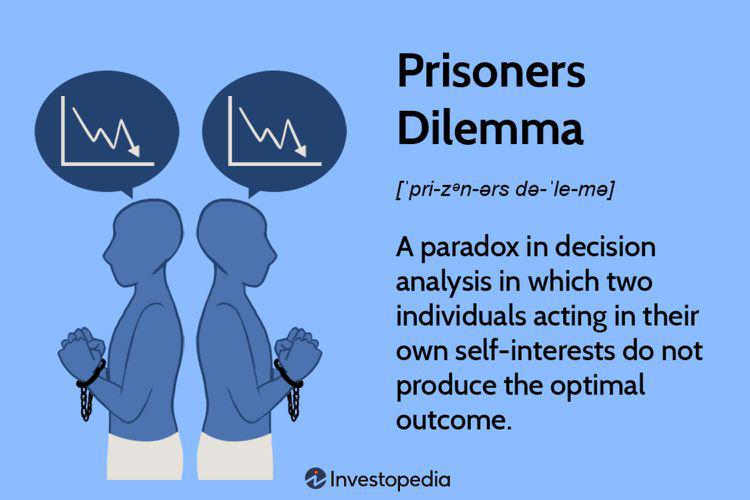

The Prisoner's Dilemma is a pivotal concept in game theory and strategic interaction, illustrating the complexities of decision-making processes among rational individuals. Conceptually, it highlights how two people, acting in their self-interest, might choose not to cooperate even when cooperation would lead to a more favorable outcome. This paradox reveals significant insights into human behavior, economic dynamics, and even extends into modern technological applications such as algorithmic trading.

Understanding the strategic dynamics in the Prisoner's Dilemma is crucial for individuals and organizations aiming to optimize decision-making in varied scenarios. For instance, in business and economics, recognizing these dynamics can illuminate why entities may engage in competitive behaviors like price wars, despite the potential benefits of collaboration. Similarly, in algorithmic trading, grasping the interplay of cooperative versus competitive strategies can aid in developing algorithms that maximize profitability while mitigating risks.

Through the lens of the Prisoner's Dilemma, one can assess how cooperation may be incentivized or how individual strategy may be aligned with collective goals, leading to improved outcomes both at micro and macro levels. By leveraging the insights gained from this canonical model, strategic planners can formulate approaches that not only enhance individual gains but also contribute positively to collective welfare.

## Table of Contents

## What is the Prisoner's Dilemma?

The Prisoner's Dilemma is a fundamental concept in game theory that exemplifies the tension between individual and collective rationality. In this scenario, two rational individuals, referred to as prisoners, are arrested and interrogated separately. Each prisoner has two options: to cooperate with the other by remaining silent or to betray the other by confessing to the authorities. The critical element of the dilemma is that neither prisoner knows the other's decision at the time of their own, leading to a strategic decision-making process.

The outcomes of the Prisoner's Dilemma depend significantly on the combination of choices made. The traditional payoff structure can be represented in a payoff matrix, with the following general outcomes:

1. If both prisoners cooperate by remaining silent, they receive a moderate sentence, mutually benefitting from their cooperation.
2. If one prisoner betrays the other while the other remains silent, the betraying prisoner goes free, while the silent one receives the maximum penalty.
3. If both prisoners betray each other, they both receive substantial, but not maximal, penalties.

This situation reveals a paradox where betrayal appears to be the rational choice for each individual to minimize personal loss. The logic stems from the idea that regardless of the other's decision, betraying promises a better personal outcome: either immediate freedom if the other cooperates or a reduced sentence if the other also betrays. This strategy is commonly known as the Nash Equilibrium of the Prisoner's Dilemma, where each player's optimal choice remains unaltered regardless of the opponent's decision.

Yet, despite the rationality in betrayal, the collective outcome where both prisoners cooperate results in a lesser total penalty, demonstrating how mutual cooperation yields superior results compared to mutual defection. Thus, the Prisoner's Dilemma underscores a critical insight: while individual rational decisions may culminate in suboptimal outcomes for everyone involved, fostering cooperative strategies can lead to more desirable collective results. This principle extends beyond theoretical exercises, offering profound implications for real-world interactions in economics, politics, and social behavior.

## Historical and Theoretical Aspects

First developed in the 1950s during the Cold War by mathematicians Merrill Flood and Melvin Dresher, the Prisoner's Dilemma arose from attempts to understand the strategic interactions akin to those between two competing nations. The context of the Cold War, with its emphasis on competitive strategies and nuclear deterrence, provided a backdrop for the exploration of decision-making processes in situations where individuals or groups must choose between cooperative and non-cooperative actions.

The concept gained prominence through the work of game theorist Albert W. Tucker, who coined the term "Prisoner's Dilemma." Tucker provided a narrative to explain the scenario: two prisoners are arrested and isolated, with prosecutors offering each a deal to betray the other for reduced punishment. The dilemma surfaces because mutual cooperation leads to a better collective outcome, yet rational individuals—seeking to minimize their personal losses independently—may choose betrayal, resulting in a suboptimal outcome for both.

The theoretical significance of the Prisoner's Dilemma lies in its illustration of the conflict between individual rationality and collective benefit. It highlights situations where, despite mutual advantages, rational entities refrain from cooperation due to self-interest-driven strategies. This paradox has driven significant discourse in game theory, illustrating why entities fail to achieve optimal outcomes through non-cooperative behavior.

Moreover, the Prisoner's Dilemma serves as a foundation for numerous extensions and variations in game theory, exploring repeated games, signaling, and commitment strategies. Repeated interactions introduce the possibility of building trust and establishing cooperation through reputational effects, transforming the one-shot dilemma into a complex strategic landscape. This theoretical framework not only underpins economic models and political strategies but also informs multidisciplinary research in psychology, sociology, and computer science, emphasizing its enduring influence and applicability.

## Applications in Economics and Business

The Prisoner's Dilemma is a crucial framework within economics and business for understanding competitive dynamics such as price wars and cartel behaviors. In a typical scenario, two competing firms face the decision to either keep prices stable (cooperate) or lower prices to gain market share (defect). While mutual cooperation would lead to sustained profits, the incentive to defect is high, often leading to a price war that diminishes profits for all parties involved. 

This is evident in the concept of Nash Equilibrium, a situation where each player in a non-cooperative game chooses their optimal strategy, given the strategies of all other players. In the context of a price war, when both firms decide to lower prices, neither can benefit by unilaterally changing their strategy if the other's strategy remains unchanged. The outcome may not be optimal, but it is stable under the given strategy set.

Cartel behavior offers another illustration of the Prisoner's Dilemma. While cartels are formed with the intent of maintaining higher prices to maximize overall profits, individual members have the temptation to secretly lower prices or produce more than agreed upon to capture a larger market share. This breach of trust can lead to the collapse of cartel agreements, resulting in a competitive market scenario.

An understanding of these dynamics provides valuable insights into how businesses can implement strategies to encourage better cooperation. For instance, repeated interactions among firms may change the payoff matrix, encouraging cooperation. The concept of "tit-for-tat" is described in Axelrod's work on the evolution of cooperation, where businesses mimic their competitors' previous actions in future interactions. This potentially fosters a more cooperative environment, as firms recognize that mutual benefit can be achieved over time.

Strategic alliances and mergers can also be analyzed through the lens of the Prisoner's Dilemma. While forming alliances might seem counterintuitive in competitive markets, they often lead to increased market stability and shared resources, ultimately benefiting the involved parties. Firms that successfully navigate these dynamics can reduce uncertainties and optimize economic outcomes, illustrating the power of using game theoretic models to anticipate and influence competitive behavior in business contexts.

## Algorithmic Trading and Game Theory

Algorithmic trading represents a significant application of game theory principles, including the Prisoner's Dilemma, to devise strategies that account for competitor actions and fluctuations in market conditions. In this setting, algorithms function to either 'cooperate' or 'defect', reflecting strategies aimed at maximizing financial gains while mitigating risks. These decisions are made based on the anticipated behavior of other market participants.

The application of game theory in [algorithmic trading](/wiki/algorithmic-trading) involves modeling the actions of traders as strategic games where each participant's payoff depends not just on their actions but also on those of others. For example, a common scenario in trading is akin to the classic Prisoner's Dilemma: if all traders choose a cooperative strategy (e.g., not engaging in aggressive sell-offs), the market remains stable, benefiting everyone. However, if one party defects for short-term gain, it might prompt others to follow, potentially driving the market to a less desirable state.

Algorithms are typically programmed to execute trades by analyzing multiple factors, including historical price data, trading [volume](/wiki/volume-trading-strategy), and patterns indicative of others' strategies. Mathematically, this can be represented through payoff matrices and Nash Equilibria, highlighting optimal strategies under competitive conditions. For example, if $p$ is the probability of cooperation, the expected utility, $U$, of alternating between cooperation and defection strategies can be calculated as:

$$
U = p \times \text{Payoff(cooperate, cooperate)} + (1-p) \times \text{Payoff(defect, defect)}
$$

In practice, such algorithms employ [machine learning](/wiki/machine-learning) and statistical models to predict actions by others, allowing for adaptive strategy development. For instance, [reinforcement learning](/wiki/reinforcement-learning) techniques can enable trading systems to learn optimal strategies from past interactions, constantly refining decision-making processes to better anticipate and react to market dynamics.

The strategic interactions modeled through game theory enable traders to identify suboptimal choices that could result from purely competitive behavior. By incorporating these insights, algorithmic trading systems can potentially improve market efficiency, stabilize trading environments, and yield better collective outcomes over time.

## Strategic Interaction in Markets

Markets epitomize complex systems where strategic interactions akin to the Prisoner's Dilemma frequently occur. In these environments, participants often face decisions involving cooperation or competition without full visibility into the strategies of others. This lack of transparency can lead to suboptimal outcomes, where individual decision-making aggregates into market inefficiencies.

In these scenarios, understanding the strategic consequences of either cooperating or defecting is crucial for optimizing interactions. For instance, in a market comprising automated actors like trading algorithms, each participant may aim to maximize returns through strategic decision-making. However, if all market participants act non-cooperatively by aggressively pursuing self-interest, the result may be a price environment unfavorable to all—akin to the Nash Equilibrium observed in the classical Prisoner's Dilemma where both parties choose to defect.

Applying game theory insights can help mitigate these suboptimal outcomes. Algorithm-based strategies, for example, may incorporate anticipations of competitor behavior to decide when to signal cooperative intentions. Such strategies could improve overall market efficiency. Algorithm designers often use historical data analytics and predictive modeling to incorporate these elements into algorithmic trading systems, aiming at mutual benefits rather than merely competitive advantage.

Mathematically, these strategic interactions can be modeled using payoff matrices, analyzing the consequences of different strategy combinations. For example, if $A$ and $B$ are two trading algorithms, their strategies could be structured as follows:

$$
\begin{array}{c|c|c}
 & \text{Cooperate} & \text{Defect} \\
\hline
\text{Cooperate} & (R, R) & (S, T) \\
\hline
\text{Defect} & (T, S) & (P, P) \\
\end{array}
$$

Where $R$ represents the reward for mutual cooperation, $T$ the temptation to defect, $S$ the sucker's payoff, and $P$ the punishment for mutual defection. By understanding these payoffs, traders can tailor their strategies to foster better market conditions.

Through the integration of strategic modeling in automated systems, traders can predict market shifts better and make informed decisions, potentially enhancing the collaborative outcome of market participation. Such strategic programming not only aligns individual objectives with market efficiency but also advances the sophistication of trading practices, steering markets away from the pitfalls of the classic Prisoner's Dilemma scenarios.

## Conclusion

The Prisoner's Dilemma remains a crucial model in game theory for comprehending the dynamics of competition and cooperation. Its relevance extends across various fields, including economics and algorithmic trading, highlighting its importance in understanding strategic interactions. In economics, the dilemma aids in explaining phenomena like price wars and cartel behaviors, which can lead to suboptimal outcomes without cooperation. Recognizing the play of individual and collective rationality inherent in the Prisoner's Dilemma enables economists to recommend mechanisms that encourage cooperative strategies, ultimately benefiting all parties involved.

In algorithmic trading, the principles of the Prisoner's Dilemma are harnessed to craft algorithms that adapt strategically to market conditions. Programs often simulate cooperation or defection based on competitor actions and market trends, striving to maximize gains while minimizing risks. Here, the dilemma underscores the necessity for algorithms to incorporate strategic thinking, thereby enhancing their performance and market outcomes.

By applying the insights garnered from the Prisoner's Dilemma, individuals and organizations can develop strategies that optimize their own outcomes while contributing to better collective results. This dual optimization is critical in competitive environments where cooperative strategies are not just beneficial but often essential for long-term success. The continued applicability of the Prisoner's Dilemma in these fields attests to its enduring significance as a model for strategic interaction and decision-making.

## References & Further Reading

[1]: Tucker, A. W. (1950). ["A Two-Person Dilemma."](https://www.jstor.org/stable/pdf/3027092.pdf) Readings in Games and Information.

[2]: Axelrod, R. (1984). ["The Evolution of Cooperation."](https://ee.stanford.edu/~hellman/Breakthrough/book/pdfs/axelrod.pdf) Basic Books.

[3]: Flood, M. & Dresher, M. (1950). ["Some Experiments on Sequential Prisoner’s Dilemma."](https://www.researchgate.net/publication/24089297_Cooperation_and_fairness_The_Flood-Dresher_experiment_revisited) RAND Corporation.

[4]: Osborne, M. J. (2003). ["An Introduction to Game Theory."](https://mathematicalolympiads.files.wordpress.com/2012/08/martin_j-_osborne-an_introduction_to_game_theory-oxford_university_press_usa2003.pdf) Oxford University Press.

[5]: Poundstone, W. (1992). ["Prisoner's Dilemma: John Von Neumann, Game Theory, and the Puzzle of the Bomb."](https://www.amazon.com/Prisoners-Dilemma-Neumann-Theory-Puzzle/dp/038541580X) Anchor Books.