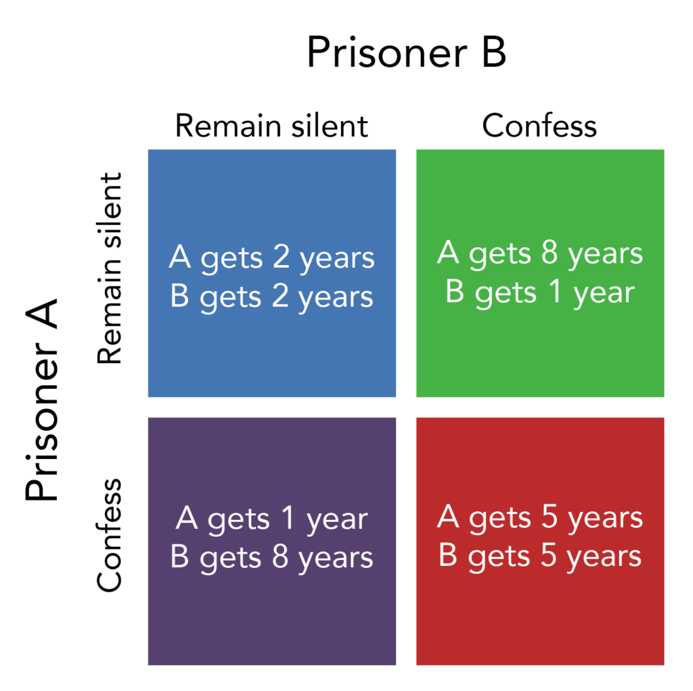

## Table of Contents

## What is the Prisoner's Dilemma?

The Prisoner's Dilemma is a famous game theory problem that shows how two people might not work together even if it's best for both of them. Imagine two criminals are arrested and kept in separate rooms. The police don't have enough evidence to convict them of a big crime, but they can charge them with a smaller crime. The police offer each prisoner a deal: if one prisoner betrays the other by confessing, the betrayer goes free while the other gets a long sentence. If both betray each other, they both get a medium sentence. If neither betrays, they both get a short sentence for the smaller crime.

This situation creates a dilemma because each prisoner has to decide whether to betray or stay silent without knowing what the other will do. If they could talk and trust each other, staying silent would be the best choice because they would both get a short sentence. But because they can't communicate and might not trust each other, each one might choose to betray to avoid the risk of getting a long sentence if the other betrays. This often leads to both betraying and getting a medium sentence, which is worse than if they had both stayed silent. The Prisoner's Dilemma shows how individual choices can lead to a worse outcome for everyone involved.

## Who developed the Prisoner's Dilemma?

The Prisoner's Dilemma was developed by two mathematicians, Merrill Flood and Melvin Dresher, who worked at the RAND Corporation in the early 1950s. They were trying to understand how people make decisions when they can't trust each other. They created a game to show this problem, but it didn't have a name yet.

Later, a friend of theirs named Albert W. Tucker heard about their game. He came up with the story about the two prisoners and gave the game its name, the Prisoner's Dilemma. Tucker's story made the game easier to understand and it became very popular in the study of how people make choices.

## What are the basic elements of the Prisoner's Dilemma?

The Prisoner's Dilemma has a few key parts that make it work. First, there are two players who have to make a choice without talking to each other. They can either cooperate, which means they both choose to stay silent, or they can defect, which means they choose to betray the other. Each player's choice affects what happens to both of them. The choices lead to different outcomes, and each player wants to pick the choice that is best for them.

The outcomes are set up in a way that makes the game tricky. If both players cooperate and stay silent, they both get a good result, like a short sentence. But if one player defects and the other cooperates, the one who defects gets the best result, like going free, while the other gets the worst result, like a long sentence. If both players defect and betray each other, they both get a medium result, like a medium sentence. This setup makes players think hard about what the other might do, and often leads to both choosing to defect even though they could both do better by cooperating.

## How does the payoff matrix work in the Prisoner's Dilemma?

The payoff matrix in the Prisoner's Dilemma is a table that shows what happens to each player based on their choices. It has four boxes, one for each possible combination of choices: both players cooperate, both players defect, player one cooperates while player two defects, and player one defects while player two cooperates. Each box has two numbers, one for each player's outcome. For example, if both players cooperate, they might each get -1 (a short sentence), but if one defects and the other cooperates, the defector might get 0 (go free) while the cooperator gets -3 (a long sentence).

The numbers in the payoff matrix are set up so that defecting is always better for a player if they don't know what the other will do. If both players think the other might defect, they will choose to defect too, even though they would both be better off if they cooperated. This is why the Prisoner's Dilemma is interesting: it shows how people might not work together even when it would be best for both of them.

## What are the possible outcomes in the Prisoner's Dilemma?

In the Prisoner's Dilemma, there are four possible outcomes based on the choices the two players make. If both players choose to cooperate and stay silent, they both get a good result. For example, if they are prisoners, they might each get a short sentence. This is the best outcome for both of them if they could trust each other and work together. But if one player chooses to cooperate while the other defects and betrays, the one who defects gets the best result, like going free, while the one who cooperated gets the worst result, like a long sentence. This shows how one player can take advantage of the other if they don't trust each other.

If both players choose to defect and betray each other, they both get a medium result. For example, they might both get a medium sentence. This outcome is worse than if they had both cooperated, but it's better than getting the worst result. The tricky part is that each player might choose to defect because they are worried the other might defect too. This often leads to both players choosing to defect, even though they would be better off if they had both cooperated. The Prisoner's Dilemma shows how individual choices can lead to a worse outcome for everyone involved.

## Why is cooperation difficult to achieve in the Prisoner's Dilemma?

Cooperation is hard to achieve in the Prisoner's Dilemma because each player doesn't know what the other will do. If you think the other person might betray you, it makes sense to betray them first to avoid getting the worst result. This fear of being taken advantage of makes people choose to defect, even though they would be better off if they both cooperated.

The setup of the game also makes cooperation difficult. The payoff matrix shows that if one player defects while the other cooperates, the defector gets the best result. This reward for betraying the other person encourages players to defect. Even though both players would get a better outcome if they both cooperated, the risk of getting the worst result if the other defects makes cooperation a risky choice.

## What is the dominant strategy in the Prisoner's Dilemma?

In the Prisoner's Dilemma, the dominant strategy is to defect, or betray the other player. This means that no matter what the other player does, you will always be better off if you choose to defect. If the other player cooperates, you get the best result by defecting. If the other player defects, you get a better result by defecting too, instead of cooperating and getting the worst result.

The problem with the dominant strategy is that if both players follow it, they both end up worse off than if they had both cooperated. If both players defect, they get a medium result, which is worse than the good result they would have gotten if they had both cooperated. But because each player can't trust the other and wants to avoid the worst result, they often choose to defect, even though it leads to a worse outcome for both of them.

## How does the Prisoner's Dilemma apply to real-world situations?

The Prisoner's Dilemma can be seen in many real-world situations where people or groups have to make choices without knowing what the other will do. For example, in business, two companies might be thinking about lowering their prices to get more customers. If both companies lower their prices, they both make less money. But if one company keeps its prices high while the other lowers theirs, the company with the lower prices gets more customers and makes more money. This can lead both companies to lower their prices, even though they would both be better off if they kept them high.

Another example is in international relations, where countries might be deciding whether to increase their military spending. If both countries increase their spending, they both spend more money without being any safer. But if one country increases its spending while the other doesn't, the country that spends more might feel safer. This can lead both countries to spend more on their military, even though they would both be better off if they spent less. The Prisoner's Dilemma shows how people and groups might not work together, even when it would be best for everyone.

## What are some variations of the Prisoner's Dilemma?

One variation of the Prisoner's Dilemma is called the Iterated Prisoner's Dilemma. Instead of making a choice just once, the players make choices over and over again. They can see what the other player did in the last round and use that information to decide what to do next. This can make players more likely to cooperate because they know they will play again. If someone defects, the other player might defect next time to get back at them. This version shows how trust and revenge can affect choices over time.

Another variation is the Multiplayer Prisoner's Dilemma, where more than two players are involved. Each player has to decide whether to cooperate or defect, and their choice affects everyone's outcome. This can make the game even more complicated because players have to think about what many others might do. It can show how groups of people might work together or not, and how hard it can be to get everyone to cooperate when there are many people involved.

## How does repeated interaction change the dynamics of the Prisoner's Dilemma?

When people play the Prisoner's Dilemma over and over again, it changes how they make choices. In the regular Prisoner's Dilemma, players only make one choice, so they might choose to defect because they don't know what the other will do. But in the repeated version, they can see what the other did last time and use that to decide what to do next. This can make players more likely to cooperate because they know they will play again. If someone defects, the other player might defect next time to get back at them. This shows how trust and revenge can affect choices over time.

In the repeated Prisoner's Dilemma, players might start to work together more because they see that cooperating can lead to better results in the long run. If both players cooperate, they both do well each time they play. But if one player defects, the other might start defecting too, which can lead to a cycle of bad outcomes. This version of the game helps show how people can learn to trust each other and work together when they know they will keep interacting. It also shows how important it is to think about the future when making choices, not just what happens right away.

## What role does communication play in the Prisoner's Dilemma?

In the Prisoner's Dilemma, communication can make a big difference. When players can talk to each other, they can make promises and plans. They might agree to both cooperate and stay silent, knowing that it will be better for both of them. If they trust each other and believe the other will keep their promise, they are more likely to cooperate. This can lead to a better outcome for both players because they can work together.

But even with communication, there's still a risk. If one player doesn't trust the other or thinks the other might break their promise, they might choose to defect anyway. This can happen if they think the other player might try to take advantage of them. So, while communication can help players cooperate, it doesn't always work because trust is hard to build and easy to lose.

## What are the implications of the Prisoner's Dilemma for game theory and economics?

The Prisoner's Dilemma has big effects on game theory and economics. It shows how people might not work together even when it would be best for both of them. This is important because it helps us understand how people make choices when they can't trust each other. In game theory, the Prisoner's Dilemma is used to study how people act in situations where their choices affect others. It helps explain why people might choose to compete instead of work together, even when cooperation would be better for everyone.

In economics, the Prisoner's Dilemma can show why businesses might not work together to keep prices high, even though it would be better for them. For example, if two companies could agree to keep their prices high, they would both make more money. But if one company thinks the other might lower their prices, they might lower theirs first to get more customers. This can lead to a situation where both companies lower their prices and make less money. The Prisoner's Dilemma helps economists understand these kinds of problems and think about ways to solve them, like making rules to help people work together better.

## How do Algorithmic Trading and Game Theory intersect?

Algorithmic trading represents a significant application of game theory principles, including the Prisoner's Dilemma, to devise strategies that account for competitor actions and fluctuations in market conditions. In this setting, algorithms function to either 'cooperate' or 'defect', reflecting strategies aimed at maximizing financial gains while mitigating risks. These decisions are made based on the anticipated behavior of other market participants.

The application of game theory in [algorithmic trading](/wiki/algorithmic-trading) involves modeling the actions of traders as strategic games where each participant's payoff depends not just on their actions but also on those of others. For example, a common scenario in trading is akin to the classic Prisoner's Dilemma: if all traders choose a cooperative strategy (e.g., not engaging in aggressive sell-offs), the market remains stable, benefiting everyone. However, if one party defects for short-term gain, it might prompt others to follow, potentially driving the market to a less desirable state.

Algorithms are typically programmed to execute trades by analyzing multiple factors, including historical price data, trading [volume](/wiki/volume-trading-strategy), and patterns indicative of others' strategies. Mathematically, this can be represented through payoff matrices and Nash Equilibria, highlighting optimal strategies under competitive conditions. For example, if $p$ is the probability of cooperation, the expected utility, $U$, of alternating between cooperation and defection strategies can be calculated as:

$$
U = p \times \text{Payoff(cooperate, cooperate)} + (1-p) \times \text{Payoff(defect, defect)}
$$

In practice, such algorithms employ [machine learning](/wiki/machine-learning) and statistical models to predict actions by others, allowing for adaptive strategy development. For instance, [reinforcement learning](/wiki/reinforcement-learning) techniques can enable trading systems to learn optimal strategies from past interactions, constantly refining decision-making processes to better anticipate and react to market dynamics.

The strategic interactions modeled through game theory enable traders to identify suboptimal choices that could result from purely competitive behavior. By incorporating these insights, algorithmic trading systems can potentially improve market efficiency, stabilize trading environments, and yield better collective outcomes over time.

## How does strategic interaction occur in markets?

Markets epitomize complex systems where strategic interactions akin to the Prisoner's Dilemma frequently occur. In these environments, participants often face decisions involving cooperation or competition without full visibility into the strategies of others. This lack of transparency can lead to suboptimal outcomes, where individual decision-making aggregates into market inefficiencies.

In these scenarios, understanding the strategic consequences of either cooperating or defecting is crucial for optimizing interactions. For instance, in a market comprising automated actors like trading algorithms, each participant may aim to maximize returns through strategic decision-making. However, if all market participants act non-cooperatively by aggressively pursuing self-interest, the result may be a price environment unfavorable to all—akin to the Nash Equilibrium observed in the classical Prisoner's Dilemma where both parties choose to defect.

Applying game theory insights can help mitigate these suboptimal outcomes. Algorithm-based strategies, for example, may incorporate anticipations of competitor behavior to decide when to signal cooperative intentions. Such strategies could improve overall market efficiency. Algorithm designers often use historical data analytics and predictive modeling to incorporate these elements into algorithmic trading systems, aiming at mutual benefits rather than merely competitive advantage.

Mathematically, these strategic interactions can be modeled using payoff matrices, analyzing the consequences of different strategy combinations. For example, if $A$ and $B$ are two trading algorithms, their strategies could be structured as follows:

$$
\begin{array}{c|c|c}
 & \text{Cooperate} & \text{Defect} \\
\hline
\text{Cooperate} & (R, R) & (S, T) \\
\hline
\text{Defect} & (T, S) & (P, P) \\
\end{array}
$$

Where $R$ represents the reward for mutual cooperation, $T$ the temptation to defect, $S$ the sucker's payoff, and $P$ the punishment for mutual defection. By understanding these payoffs, traders can tailor their strategies to foster better market conditions.

Through the integration of strategic modeling in automated systems, traders can predict market shifts better and make informed decisions, potentially enhancing the collaborative outcome of market participation. Such strategic programming not only aligns individual objectives with market efficiency but also advances the sophistication of trading practices, steering markets away from the pitfalls of the classic Prisoner's Dilemma scenarios.

## References & Further Reading

[1]: Tucker, A. W. (1950). ["A Two-Person Dilemma."](https://www.jstor.org/stable/pdf/3027092.pdf) Readings in Games and Information.

[2]: Axelrod, R. (1984). ["The Evolution of Cooperation."](https://ee.stanford.edu/~hellman/Breakthrough/book/pdfs/axelrod.pdf) Basic Books.

[3]: Flood, M. & Dresher, M. (1950). ["Some Experiments on Sequential Prisoner’s Dilemma."](https://www.researchgate.net/publication/24089297_Cooperation_and_fairness_The_Flood-Dresher_experiment_revisited) RAND Corporation.

[4]: Osborne, M. J. (2003). ["An Introduction to Game Theory."](https://mathematicalolympiads.files.wordpress.com/2012/08/martin_j-_osborne-an_introduction_to_game_theory-oxford_university_press_usa2003.pdf) Oxford University Press.

[5]: Poundstone, W. (1992). ["Prisoner's Dilemma: John Von Neumann, Game Theory, and the Puzzle of the Bomb."](https://www.amazon.com/Prisoners-Dilemma-Neumann-Theory-Puzzle/dp/038541580X) Anchor Books.