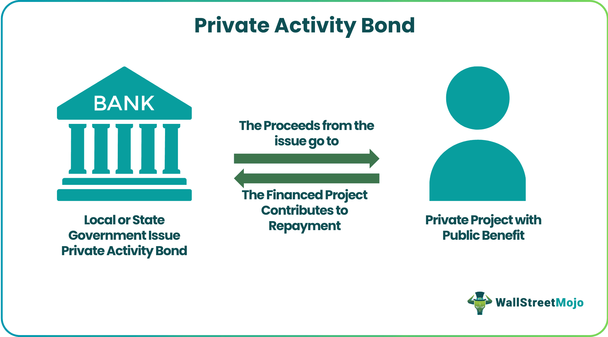

## Table of Contents

## What are Private Activity Bonds (PABs)?

Private Activity Bonds (PABs) are a type of bond issued by a government or a government-related entity to finance projects that usually benefit private entities. These bonds are often used to fund projects like airports, affordable housing, and student loans. Even though they are issued by a public entity, the projects they finance are mostly for private use, which is why they are called "private activity" bonds.

The main advantage of PABs is that the interest earned by investors is usually tax-exempt. This means that people who buy these bonds don't have to pay federal income tax on the interest they earn. This makes PABs attractive to investors and helps lower the cost of borrowing for the projects they fund. However, there are limits on how much of these bonds can be issued each year, and they need to meet certain rules to keep their tax-exempt status.

## How do Private Activity Bonds differ from other types of bonds?

Private Activity Bonds (PABs) are different from other types of bonds because they are used to fund projects that mainly benefit private groups or companies, but they are issued by a government or a government-related group. For example, PABs might be used to build a new airport or to help people buy homes they can afford. Most other bonds, like general obligation bonds or revenue bonds, are used to fund things that directly help the public, like building schools or roads.

Another big difference is that the interest you earn from PABs is usually not taxed by the federal government. This makes them more attractive to people who want to invest their money because they can keep more of the interest they earn. Other types of bonds, like corporate bonds, usually have taxable interest, which means investors have to pay taxes on the money they make from them. Because of this special tax benefit, there are rules about how many PABs can be issued each year and what kinds of projects they can be used for.

## What is the purpose of Private Activity Bonds?

Private Activity Bonds (PABs) are used to help pay for big projects that mostly help private groups or companies, but they are issued by a government or a group related to the government. These projects can be things like building new airports, making affordable homes, or helping students pay for college. The government uses PABs to encourage these projects because they can be good for the community, even though they mainly help private groups.

One big reason people like to buy PABs is because the interest they earn from them is usually not taxed by the federal government. This means that investors can keep more of the money they make from these bonds, which makes PABs more attractive to them. But, because of this special tax benefit, there are rules about how many PABs can be issued each year and what kinds of projects they can be used for.

## Who can issue Private Activity Bonds?

Private Activity Bonds, or PABs, can be issued by government groups or groups that are connected to the government. This can include things like state or local governments, special districts, or other public agencies. They are the ones who actually put out the bonds and collect the money from investors.

The reason these government groups issue PABs is to help pay for big projects that will mostly help private companies or groups. But, these projects are still good for the community. For example, they might use PABs to help build a new airport or to make more affordable homes for people. By issuing these bonds, the government can encourage these important projects to happen.

## What types of projects can Private Activity Bonds finance?

Private Activity Bonds, or PABs, can finance many different kinds of projects. These projects often help private companies or groups but are still good for the community. Some common projects include building new airports or improving old ones. PABs can also be used to create affordable homes for people who need them. This helps make sure that everyone has a place to live.

Another type of project that PABs can finance is helping students pay for college. This can be through student loans that make it easier for people to go to school. PABs can also be used for things like building hospitals or other health facilities. These projects are important because they help keep people healthy and improve the community's overall well-being.

## What is the tax treatment of Private Activity Bonds for issuers?

When a government or a government-related group issues Private Activity Bonds, or PABs, they don't have to pay taxes on the money they get from selling these bonds. This is a big help because it means they can use more of the money they raise to pay for the projects they want to do. These projects can be things like building new airports or making homes that people can afford.

However, there are special rules about how many PABs can be issued each year and what kinds of projects they can be used for. This is because the interest that people earn from these bonds is usually not taxed by the federal government. To make sure these bonds keep their special tax-free status, the projects they finance need to follow these rules.

## How are Private Activity Bonds taxed for investors?

When people invest in Private Activity Bonds, or PABs, the interest they earn is usually not taxed by the federal government. This means that investors can keep all of the interest they make without having to pay federal income tax on it. This makes PABs attractive to people who want to invest their money because they get to keep more of what they earn.

However, there are some rules that PABs need to follow to keep this special tax-free status. The projects that PABs help pay for need to meet certain requirements set by the government. If these rules are not followed, the interest might become taxable, which means investors would have to pay taxes on it. This is why it's important for both the issuers and the investors to make sure the projects fit within these rules.

## What are the volume caps and how do they affect the issuance of PABs?

Volume caps are limits set by the federal government on how many Private Activity Bonds (PABs) can be issued each year. These limits are put in place to make sure that the tax benefits of PABs are used wisely and not too much. Each state gets a certain amount of volume cap that they can use for issuing PABs. This means that if a state wants to issue more PABs than their cap allows, they have to wait until the next year or find a way to share the cap with other projects.

These volume caps affect the issuance of PABs because they control how many new projects can be started each year. If a state has used up all of its volume cap, it can't issue any more PABs until the next year. This can slow down important projects like building new airports or making affordable homes. States sometimes have to choose which projects are most important and prioritize them within the limits of the volume cap.

## What are the alternative minimum tax (AMT) implications for PABs?

When people invest in Private Activity Bonds, or PABs, they usually don't have to pay federal income tax on the interest they earn. But there's something called the Alternative Minimum Tax, or AMT, that can change this. The AMT is a special tax that makes sure people who use a lot of tax breaks still pay at least some tax. Some PABs can be subject to the AMT, which means that even though the interest is usually tax-free, investors might still have to pay this special tax on it.

Not all PABs are affected by the AMT though. It depends on what the bond is used for. For example, PABs that help build airports or make affordable homes might not be subject to the AMT. But PABs used for other projects, like certain types of student loans, might be. Investors need to know which PABs could be hit by the AMT because it can change how much tax they have to pay and affect how good of an investment the bond is for them.

## How do federal tax reforms impact the use and benefits of Private Activity Bonds?

Federal tax reforms can change how Private Activity Bonds (PABs) are used and what benefits they offer. When the government changes tax laws, it can affect things like how much interest on PABs is taxed or how much of these bonds can be issued each year. For example, if new laws make the interest on PABs taxable, fewer people might want to invest in them because they won't get to keep as much of the interest they earn. This can make it harder for the government to use PABs to pay for important projects.

Also, tax reforms can change the rules about volume caps, which are limits on how many PABs can be issued each year. If the government makes these limits smaller, states might not be able to start as many new projects that need PABs. On the other hand, if the limits are made bigger, more projects could be funded. Changes in tax laws can also affect the Alternative Minimum Tax (AMT), which might make some PABs less attractive to investors if they have to pay this special tax on the interest they earn.

## What are the compliance requirements for issuers of Private Activity Bonds?

Issuers of Private Activity Bonds have to follow certain rules to make sure their bonds keep their special tax-free status. They need to make sure the money from the bonds is used for projects that help the community, like building airports or making affordable homes. They also need to keep good records of how the money is spent and report this to the government. This helps show that the projects are following the rules and that the bonds are being used the right way.

Another important rule is that issuers have to stay within the volume cap, which is a limit on how many PABs can be issued each year. They need to check how much of their state's cap is left before they can issue more bonds. If they go over the limit, the bonds might lose their tax-free status, and investors might have to pay taxes on the interest they earn. This can make the bonds less attractive to investors and cause problems for the projects they are trying to fund.

## How can issuers optimize the tax benefits of Private Activity Bonds?

Issuers of Private Activity Bonds can optimize the tax benefits by making sure the projects they fund meet all the rules set by the government. This means they should choose projects that help the community, like building new airports or making affordable homes. By doing this, they can keep the interest on the bonds tax-free for investors. This makes the bonds more attractive to people who want to invest their money because they can keep all the interest they earn without paying federal income tax on it.

Another way to optimize the tax benefits is to stay within the volume cap, which is a limit on how many PABs can be issued each year. Issuers need to check how much of their state's cap is left before issuing more bonds. If they use up all of the cap, they can't issue any more bonds until the next year. By planning carefully and choosing the most important projects first, issuers can make sure they use the cap in the best way possible. This helps them fund more projects and keep the tax benefits for investors.

## What is an Overview of Municipal Bonds?

Municipal bonds, often referred to as "munis," are debt securities issued by state governments, municipalities, or counties to fund public projects such as schools, highways, and other infrastructure. One of the primary attractions of investing in municipal bonds is their tax-exempt status. The interest income generated by these bonds is typically exempt from federal income tax, and in some cases, state and local taxes as well, making them particularly appealing to investors in higher tax brackets.

These bonds are categorized into two main types: general obligation bonds and revenue bonds. General obligation bonds are backed by the full faith and credit of the issuing government entity, which pledges to use its taxing power to repay the bondholders. In contrast, revenue bonds are repaid from the income generated by the particular project or facility they are issued to finance, such as toll roads or hospitals.

The tax-exempt nature of municipal bonds often results in lower yields compared to taxable bonds. However, when considering the after-tax return, municipal bonds can offer a competitive yield, particularly for investors in higher tax brackets. The equivalent taxable yield can be calculated using the formula:

$$
\text{Equivalent Taxable Yield} = \frac{\text{Tax-Exempt Yield}}{1 - \text{Tax Rate}}
$$

For instance, if a municipal bond offers a 3% tax-exempt yield and an investor is in the 35% tax bracket, the equivalent taxable yield would be:

```python
tax_exempt_yield = 0.03
tax_rate = 0.35

equivalent_taxable_yield = tax_exempt_yield / (1 - tax_rate)
equivalent_taxable_yield
```

This calculation helps investors compare the returns from municipal bonds with those from taxable bonds, taking their tax situation into account.

Beyond the tax benefits, municipal bonds are also admired for their strong credit quality. Historically, the default rates for municipal bonds have been low compared to corporate bonds, making them a safer investment option. This reliability, combined with tax advantages, makes municipal bonds a staple in many conservative investment portfolios and in strategies focused on income preservation. 

Investors should be aware of potential risks, particularly [interest rate](/wiki/interest-rate-trading-strategies) risk, which can affect bond prices as prevailing interest rates change. Despite these risks, municipal bonds remain a vital component in the landscape of fixed-income investments, offering both safety and efficiency in tax planning.

## References & Further Reading

[1]: ["Private Activity Bonds: Background and Current Legislative Issues," by Steven Maguire.](https://crsreports.congress.gov/product/pdf/RL/RL31457/22) Congressional Research Service, 2012.

[2]: Fabozzi, Frank J. (2007). ["The Handbook of Municipal Bonds."](https://onlinelibrary.wiley.com/doi/book/10.1002/9781119198093) Wiley.

[3]: Chincarini, Ludwig B., & Kim, Daehwan. (2006). ["Quantitative Equity Portfolio Management: An Active Approach to Portfolio Construction and Management."](https://www.amazon.com/Quantitative-Equity-Portfolio-Management-Construction/dp/0071459391) McGraw-Hill.

[4]: ["Algorithmic and High-Frequency Trading"](https://www.amazon.com/Algorithmic-High-Frequency-Trading-Mathematics-Finance/dp/1107091144) by Álvaro Cartea, Sebastian Jaimungal, and José Penalva.

[5]: ["Municipal Bonds: A Comprehensive Introduction to the Tax Treatment of Municipal Bonds"](https://www.investopedia.com/articles/investing-strategy/090116/think-twice-buying-taxfree-municipal-bonds.asp) by James E. Spiotto, Chapman and Cutler LLP, 2017.

[6]: ["Tax Exempt and Taxable Municipal Bond Analysis," by Robert Doty.](https://taxfoundation.org/research/all/federal/reexamining-tax-exemption-municipal-bond-interest/) Bloomberg Press, 2012.