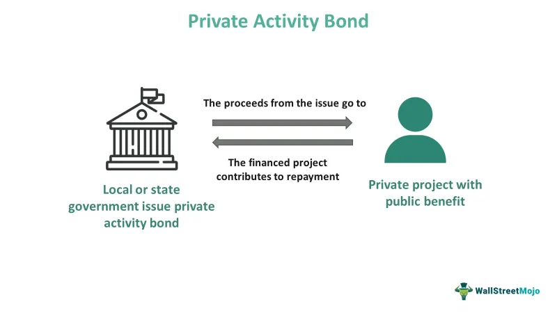

Municipal bonds and Private Activity Bonds (PABs) are critical instruments in the landscape of public and private financing. These bonds serve as vital conduits for channeling investments into projects that deliver societal benefits, such as infrastructure enhancement, educational facilities, and health care development. The distinctive feature of municipal bonds, particularly their tax-exempt status, poses interesting opportunities for investors, primarily those situated in higher tax brackets. Understanding the tax treatment associated with these bonds is paramount for investors who wish to optimize their portfolio returns and minimize liabilities.

Private Activity Bonds represent a specialized subset of municipal bonds, designed to attract private investment into projects that afford public utility, albeit with distinct qualification criteria and tax implications. These projects typically meet localized needs, such as building hospitals, airports, and other essential community services. The intricacies embedded in their tax treatment, such as the requirement to align with certain public use criteria to maintain tax-exempt status, necessitate a thorough comprehension by investors aiming for tax-efficient investment outcomes.



The financial markets are further complicated by the advent of algorithmic trading technologies. Algorithmic trading employs programmed instructions to execute trades at high speeds, allowing market participants to exploit momentary inefficiencies. In the context of bonds, particularly municipal and PABs, algorithmic trading can influence market dynamics, impacting liquidity and price discovery while introducing potential volatility. Consequently, this evolution in trading technology adds another dimension that investors must consider when engaging with these financial instruments.

This article will explore the nuances of municipal bonds, including Private Activity Bonds, their associated tax treatments, and the emerging influence of algorithmic trading. By doing so, it aims to provide investors with a comprehensive understanding of how these factors affect their investment strategies and portfolio management.

## Table of Contents

## Overview of Municipal Bonds

Municipal bonds, often referred to as "munis," are debt securities issued by state governments, municipalities, or counties to fund public projects such as schools, highways, and other infrastructure. One of the primary attractions of investing in municipal bonds is their tax-exempt status. The interest income generated by these bonds is typically exempt from federal income tax, and in some cases, state and local taxes as well, making them particularly appealing to investors in higher tax brackets.

These bonds are categorized into two main types: general obligation bonds and revenue bonds. General obligation bonds are backed by the full faith and credit of the issuing government entity, which pledges to use its taxing power to repay the bondholders. In contrast, revenue bonds are repaid from the income generated by the particular project or facility they are issued to finance, such as toll roads or hospitals.

The tax-exempt nature of municipal bonds often results in lower yields compared to taxable bonds. However, when considering the after-tax return, municipal bonds can offer a competitive yield, particularly for investors in higher tax brackets. The equivalent taxable yield can be calculated using the formula:

$$
\text{Equivalent Taxable Yield} = \frac{\text{Tax-Exempt Yield}}{1 - \text{Tax Rate}}
$$

For instance, if a municipal bond offers a 3% tax-exempt yield and an investor is in the 35% tax bracket, the equivalent taxable yield would be:

```python
tax_exempt_yield = 0.03
tax_rate = 0.35

equivalent_taxable_yield = tax_exempt_yield / (1 - tax_rate)
equivalent_taxable_yield
```

This calculation helps investors compare the returns from municipal bonds with those from taxable bonds, taking their tax situation into account.

Beyond the tax benefits, municipal bonds are also admired for their strong credit quality. Historically, the default rates for municipal bonds have been low compared to corporate bonds, making them a safer investment option. This reliability, combined with tax advantages, makes municipal bonds a staple in many conservative investment portfolios and in strategies focused on income preservation. 

Investors should be aware of potential risks, particularly [interest rate](/wiki/interest-rate-trading-strategies) risk, which can affect bond prices as prevailing interest rates change. Despite these risks, municipal bonds remain a vital component in the landscape of fixed-income investments, offering both safety and efficiency in tax planning.

## Understanding Private Activity Bonds (PABs)

Private Activity Bonds (PABs) represent a subset of municipal bonds that are tailored to harness private investment in projects conferring public benefits. They serve as pivotal financial instruments in funding niche ventures like healthcare facilities, airports, and affordable housing initiatives. Their design caters to leveraging private investment to spur development in areas traditionally underscored by public sector funding deficits.

One of the primary characteristics distinguishing PABs from typical municipal bonds is their targeted use in financing projects that exhibit private rather than purely public use. The Internal Revenue Service (IRS), through stringent guidelines, regulates PABs under the Internal Revenue Code. To qualify as a PAB, at least 10% of the bond proceeds must benefit a private entity, and a minimum of 5% must be secured by or derived from property used in a private trade or business. 

Financially, PABs offer considerable advantages, notably in sectors where public needs intersect with private interests. For instance, hospital infrastructure improvements, development of educational facilities, and expansion of mass transit systems often qualify for PAB funding due to their substantial public utility despite primary benefit lying with private corporations.

The distinctiveness of PABs within municipal bonds is further accentuated by their tax implications. While generally federal tax-exempt, the interest earned on PABs might be subject to the Alternative Minimum Tax (AMT) for certain investors. This [factor](/wiki/factor-investing) necessitates a precise understanding from investors, as it affects the net yield compared to other tax-exempt securities.

In summary, Private Activity Bonds are crafted to incentivize private investment in public-benefiting projects. They seamlessly bridge the gap between private enterprise and public necessity, though they demand rigorous adherence to regulatory qualifications and bear tax nuances that underscore their uniqueness in the municipal bond landscape.

## Tax Treatment of Private Activity Bonds

Private Activity Bonds (PABs) present a unique case in municipal securities concerning their tax treatment. Typically, the interest income generated from municipal bonds is exempt from federal income tax, which provides a significant advantage to investors in higher tax brackets. However, PABs differ due to their alignment with projects offering both private and public benefits. This dual nature influences their tax treatment, including exposure to the Alternative Minimum Tax (AMT) and specific IRS regulations under the Internal Revenue Code.

### Tax-Exempt Status of PABs

For PABs to offer tax-exempt interest, they must adhere to strict criteria set out by the IRS. These criteria ensure that the project financed by the PAB primarily benefits the public, even if there is a significant private component. Qualifying projects often include infrastructure developments, hospitals, airports, and affordable housing initiatives. Only bonds that finance projects meeting these public-benefit criteria can maintain their tax-exempt status.

### Alternative Minimum Tax (AMT) Implications

One critical consideration for investors is the potential applicability of the AMT. The AMT is a parallel tax system designed to ensure that high-income individuals and corporations pay at least a minimum amount of tax. Under the AMT framework, interest earned from PABs may be considered taxable. Consequently, PABs become less attractive to certain investors seeking purely tax-exempt investment options. For those subject to the AMT, PAB interest will affect their overall tax liability, necessitating a careful tax planning strategy.

### IRS Regulations and Classifications

The Internal Revenue Code contains detailed provisions regarding the classification and tax treatment of PABs. Important sections like 26 U.S. Code § 141 explicitly delineate what constitutes a private activity bond and outlines the criteria for maintaining tax-exempt status. The IRS requires that a significant portion of the bond proceeds be used for qualified purposes, limiting the extent to which private enterprises can benefit.

Furthermore, the IRS mandates regular compliance checks and reporting to ensure adherence to these rules. Any deviations can lead to the revocation of the tax-exempt status, converting the interest from tax-free to taxable, with retroactive penalties. This regulatory framework incentivizes careful monitoring and management of PAB-funded projects to preserve their financial advantages over their lifecycle. 

In conclusion, while PABs offer tax-exempt benefits similar to traditional municipal bonds, the presence of stipulations like AMT exposure and rigorous IRS regulations create a distinctive landscape. Investors must undertake thorough analysis and planning to navigate these requirements effectively, ensuring that the benefits of PABs align with their overall investment strategies.

## Algorithmic Trading in the Bond Market

Algorithmic trading employs computers to execute bond trades efficiently by using pre-defined algorithms that allow rapid decision-making based on market data and trends. This mode of trading can significantly improve the execution speed, reduce transaction costs, and leverage market inefficiencies that may not be immediately apparent to human traders.

In the context of municipal and Private Activity Bonds (PABs), [algorithmic trading](/wiki/algorithmic-trading) impacts several critical aspects of the market. Firstly, it influences [liquidity](/wiki/liquidity-risk-premium) by facilitating a higher [volume](/wiki/volume-trading-strategy) of trades than conventional methods. This increased trading velocity can enhance the market's ability to absorb larger transactions without significantly affecting prices, thereby improving liquidity. For instance, the presence of algorithmic trading can ensure that there are always willing buyers and sellers, which stabilizes price fluctuations and encourages investor participation.

Price discovery is another area where algorithmic trading plays a vital role. By analyzing vast amounts of data and executing trades in real-time, algorithms can contribute to a more efficient price-setting process. This efficiency arises from the algorithm's capability to quickly adjust to new market information, such as changes in interest rates or economic indicators, thereby reflecting the true value of bonds more accurately in their prices. Enhanced price discovery aids investors in making more informed decisions regarding the valuation of municipal and PAB securities.

However, the integration of algorithmic trading also introduces heightened [volatility](/wiki/volatility-trading-strategies) in certain cases. The rapid execution of large volumes of trades can lead to abrupt price movements, particularly in less liquid markets like those for niche PABs. Moreover, algorithms can sometimes react similarly to specific market signals, resulting in herd behavior that amplifies market swings. This phenomenon can pose risks, as significant and swift price changes may not always reflect the underlying economic conditions.

Investors in municipal bonds and PABs must grasp how digital automation shapes trading dynamics. Algorithm-driven strategies may optimize trading efficiency, but they also necessitate heightened awareness of potential market instability. Understanding these effects is crucial for devising strategies that align with one's investment objectives while managing the risks associated with automated trading systems.

In summary, algorithmic trading fundamentally reshapes the bond market landscape, offering considerable efficiencies while also presenting new challenges. Investors should consider these factors carefully, particularly when engaging with specialized bond markets like those for municipal and PABs.

## Challenges and Opportunities

The tax structure surrounding Private Activity Bonds (PABs) is intricate, necessitating a meticulous approach for investors aiming to enhance their profit margins. Given that PABs can be subject to the Alternative Minimum Tax (AMT), their tax-exempt advantage becomes less straightforward, requiring investors to navigate the Internal Revenue Service (IRS) rules carefully. The IRS criteria for PAB classification can affect the overall yield from these investments, urging investors to engage in thorough tax planning and financial analysis.

Algorithmic trading offers a dual-edged sword within the municipal and PAB markets. The ability of algorithms to execute trades at high speeds allows investors to exploit market inefficiencies, potentially leading to better pricing and enhanced liquidity. However, such technological advancements also introduce elements of volatility and market instability, particularly as algorithms can amplify market swings in response to fluctuating data. The automation of trades necessitates investors to be vigilant about algorithmic triggers and their impact on bond prices, particularly in less liquid markets like PABs.

Python can be employed to analyze trading data and develop strategies to optimize trading decisions. For example, using Python libraries such as NumPy or pandas, investors can process large datasets and perform regression analysis to predict bond price movements. Here is a basic example of how an investor might use Python to analyze bond data:

```python
import pandas as pd
import numpy as np

# Example dataset of bond prices
data = {
    'bond': ['PAB1', 'PAB2', 'PAB3'],
    'price': [102.5, 98.7, 100.2],
    'volume': [1000, 1500, 1200]
}

df = pd.DataFrame(data)

# Calculate the average bond price
average_price = np.mean(df['price'])
print("Average Bond Price:", average_price)

# Simple moving average could be used for price trend analysis
df['moving_average'] = df['price'].rolling(window=2).mean()
print(df)
```

This script performs basic calculations that can aid investors in assessing bond behavior. Complex algorithmic strategies can be built upon such foundational analyses, integrating [machine learning](/wiki/machine-learning) algorithms to predict market trends and automate trading decisions.

In summary, while the tax complexities of PABs require investors to perform detailed diligence, algorithmic trading holds the promise of increased market efficiency with the caveat of potential price volatility. Investors must balance these challenges and opportunities to effectively harness their potential in the bond market.

## Conclusion

Investors must weigh the benefits and drawbacks of municipal bonds, including Private Activity Bonds (PABs), in their overall portfolio strategy. Municipal bonds offer potential tax advantages, making them appealing for individuals in higher tax brackets. The tax-exempt status of these bonds can enhance after-tax returns, but requires prudent analysis, particularly for PABs where tax treatment can be complex. Specifically, PABs may be subject to the Alternative Minimum Tax (AMT), which may reduce their attractiveness for certain investors. It is vital for investors to consider the tax implications, as ignoring these could lead to suboptimal investment outcomes.

Regarding trading technology, algorithmic trading introduces both opportunities and challenges. While it can improve trading efficiency and provide better market liquidity, it also increases the potential for market volatility. For municipal and PAB markets, which are typically less liquid than corporate bonds, the influence of algorithmic trading can be significant. Therefore, investors need to understand the mechanics of how such trading strategies affect bond pricing and market dynamics.

As financial technology continues to advance, it is imperative that investors stay informed about these developments. Remaining updated allows investors to effectively adapt their strategies, maximizing returns while mitigating risks in an ever-evolving bond market. This approach ensures that investment decisions are made with a comprehensive understanding of both current tax legislation and trading technologies. By combining knowledge of tax treatment with insights into algorithmic trading impacts, investors can navigate the bond markets more effectively, optimizing portfolio performance in line with their financial goals.

## References & Further Reading

[1]: ["Private Activity Bonds: Background and Current Legislative Issues," by Steven Maguire.](https://crsreports.congress.gov/product/pdf/RL/RL31457/22) Congressional Research Service, 2012.

[2]: Fabozzi, Frank J. (2007). ["The Handbook of Municipal Bonds."](https://onlinelibrary.wiley.com/doi/book/10.1002/9781119198093) Wiley.

[3]: Chincarini, Ludwig B., & Kim, Daehwan. (2006). ["Quantitative Equity Portfolio Management: An Active Approach to Portfolio Construction and Management."](https://www.amazon.com/Quantitative-Equity-Portfolio-Management-Construction/dp/0071459391) McGraw-Hill.

[4]: ["Algorithmic and High-Frequency Trading"](https://www.amazon.com/Algorithmic-High-Frequency-Trading-Mathematics-Finance/dp/1107091144) by Álvaro Cartea, Sebastian Jaimungal, and José Penalva.

[5]: ["Municipal Bonds: A Comprehensive Introduction to the Tax Treatment of Municipal Bonds"](https://www.investopedia.com/articles/investing-strategy/090116/think-twice-buying-taxfree-municipal-bonds.asp) by James E. Spiotto, Chapman and Cutler LLP, 2017.

[6]: ["Tax Exempt and Taxable Municipal Bond Analysis," by Robert Doty.](https://taxfoundation.org/research/all/federal/reexamining-tax-exemption-municipal-bond-interest/) Bloomberg Press, 2012.