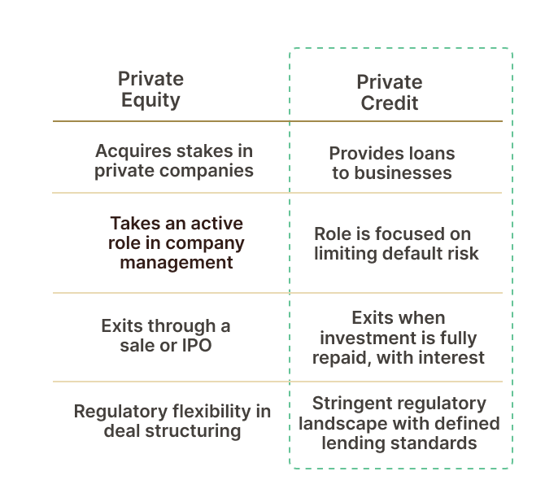

## Table of Contents

## What is private credit?

Private credit is a type of loan that businesses or people get from private investors instead of banks. These loans can help companies grow or manage their money when they can't get help from regular banks. Private investors might be rich people, investment funds, or special companies that lend money. They often make deals that fit the specific needs of the borrower, which can be different from what banks offer.

These loans can be riskier for the investors because they are not as safe as bank loans. But, they can also earn more money if the borrower pays back the loan with interest. Private credit is becoming more popular because more investors are looking for new ways to make money, and more businesses need different kinds of loans. This type of lending helps fill gaps where traditional banks might not lend, making it an important part of the financial world.

## What is private equity?

Private equity is when investors buy parts or all of a company that is not listed on a public stock market. These investors, often called private equity firms, use their own money or money from rich people and big funds to buy these companies. They want to make the companies better and then sell them for a profit later. This is different from buying stocks in a public company where anyone can buy and sell shares easily.

Private equity firms usually work closely with the companies they buy. They might change how the company is run, help it grow, or fix problems to make it more valuable. After a few years, they try to sell the company for more money than they paid. This can be to another company, back to the public through an IPO, or to another private investor. Private equity is a big part of the financial world because it helps companies grow and change in ways they might not be able to on their own.

## How do private credit and private equity differ in terms of investment focus?

Private credit and private equity have different focuses when it comes to investing. Private credit is all about lending money. Investors in private credit give loans to companies or people who need money but can't get it from banks. These loans come with interest, and the investors make money if the borrowers pay back the loans on time. The focus here is on the interest income and getting the loan repaid, not on owning part of the business.

On the other hand, private equity is about buying ownership in companies. Investors in private equity buy parts or all of a company, aiming to improve it and sell it later for a profit. They focus on making the company more valuable over time. This could mean changing how the company works, helping it grow, or fixing problems. The goal is to make money from selling the company at a higher price than what they paid for it.

## What are the typical sources of capital for private credit and private equity?

Private credit gets its money from different places. Rich people, called high-net-worth individuals, often put their money into private credit because they want to earn more interest than what banks offer. Big investment funds, like pension funds and insurance companies, also give money to private credit. They do this because they need to find ways to make money for the people they serve. Sometimes, special companies called private debt funds collect money from many investors and then lend it out as private credit.

Private equity also gets money from various sources. High-net-worth individuals and family offices, which manage money for rich families, often invest in private equity. They hope to make a lot of money when the companies they invest in get better and are sold. Big institutional investors, like pension funds and endowments, also put a lot of money into private equity. They see it as a way to grow their money over time. Private equity firms raise money by creating funds that many investors can put money into, and then they use that money to buy and improve companies.

## How do the risk profiles of private credit and private equity investments compare?

Private credit investments can be riskier than regular bank loans because they often go to companies that banks won't lend to. This means there's a higher chance the borrower might not pay back the loan. But, to make up for this risk, private credit loans usually have higher interest rates. This can make them more rewarding if everything goes well. Also, private credit investors often get to put rules in place, like taking control of the company's assets if the loan isn't paid back, which can help manage the risk a bit.

Private equity investments are risky in a different way. When investors buy a company, they hope to make it better and sell it for more money later. But, there's no guarantee they can do this. If the company doesn't improve, or if the market changes, the investors might lose money. On the other hand, if the company does well, the rewards can be huge. Private equity investors often have more control over the company than private credit investors, which can help them manage risks but also means they're more directly responsible for the company's success or failure.

## What are the common return expectations for investments in private credit versus private equity?

Investors in private credit usually expect to earn steady returns from the interest they get on the loans they give out. These returns are often higher than what you'd get from regular bank loans because private credit is riskier. People who put money into private credit might expect to earn between 5% to 12% a year, depending on how risky the loan is. The goal is to get a good, regular income from the interest payments, but there's always a chance the borrower might not pay back the loan, which can affect the returns.

On the other hand, private equity investors are looking for bigger, but less predictable, returns. They buy companies, make them better, and then sell them for a profit. Because this involves more risk and takes longer, investors in private equity might expect to earn much more, often aiming for returns of 20% or more a year. The returns can be very high if everything goes well, but there's also a bigger chance of losing money if the company doesn't improve or if the market changes.

## How do the investment durations typically differ between private credit and private equity?

Private credit investments usually last for a shorter time than private equity investments. When someone invests in private credit, they are lending money to a company or person. The loan has to be paid back with interest over a set period, which can be anywhere from a few years to around 10 years. The goal is to get the money back with interest as quickly as possible, so the investment duration is shorter.

Private equity investments take much longer. When investors put money into a company through private equity, they are buying part or all of it. They then work to make the company better, which can take several years. Usually, private equity investments last from 5 to 10 years, but sometimes even longer. The idea is to improve the company and then sell it for a profit, which needs more time than just getting loan payments back.

## What are the key roles of private credit and private equity in a diversified investment portfolio?

Private credit can play a big role in a diversified investment portfolio by offering steady income. When you invest in private credit, you're lending money to companies or people who need it. They pay you back with interest, which can be higher than what you get from regular bank loans. This can help balance out the riskier parts of your portfolio because you get regular payments. It's good for investors who want to earn a bit more than what banks offer but don't want to take too much risk.

Private equity, on the other hand, can add growth potential to your portfolio. When you invest in private equity, you're buying part or all of a company that's not on the stock market. The goal is to make the company better and sell it for more money later. This can take a long time and is riskier, but if it works out, you can make a lot more money than with private credit. It's a good choice for investors who are okay with taking more risk and waiting longer for their money to grow.

## How do the regulatory environments for private credit and private equity differ?

The regulatory environment for private credit is different from that of banks. Banks have to follow strict rules from the government about how much money they can lend and to whom. Private credit, on the other hand, doesn't have to follow these same strict rules because it's not a bank. But, private credit still has to follow some rules to make sure they're being fair and honest. These rules can vary depending on where the private credit company is based and where it's lending money. It's less regulated than banks, but still has to play by some rules to protect investors and borrowers.

Private equity also faces its own set of regulations, but these are different from private credit. Private equity firms have to follow rules about how they raise money from investors and how they manage the companies they buy. These rules can come from the country where the private equity firm is based and also from the countries where the companies they invest in are located. The rules are there to make sure private equity firms are honest with their investors and don't take too much risk. Like private credit, private equity is less regulated than public companies, but it still has to follow some important rules to keep things fair and safe.

## What are the main strategies used in private credit and how do they compare to those in private equity?

In private credit, the main strategies focus on lending money to businesses or people who can't get loans from banks. One common strategy is direct lending, where private credit investors give loans straight to the borrower. Another strategy is distressed debt, where investors buy loans that are at risk of not being paid back, hoping to make money if the borrower gets better or if they can sell the loan for more later. There's also mezzanine financing, which is a mix of debt and equity, giving the lender the chance to own part of the company if the loan isn't paid back. These strategies aim to earn steady interest income and sometimes get a bit of the company's growth.

Private equity strategies are all about buying and improving companies to sell them later for a profit. One big strategy is called leveraged buyouts, where private equity firms use borrowed money to buy a company, then try to make it better and pay back the loan with the company's profits. Another strategy is growth equity, where investors put money into fast-growing companies to help them expand even more. There's also venture capital, which is about investing in new, risky companies with the hope they'll become big successes. These strategies focus on making the company more valuable over time, which can lead to big profits but also involves more risk than private credit.

## How do the exit strategies for private credit investments differ from those in private equity?

Private credit investments usually have a clear exit strategy because they are loans that need to be paid back. The main way to exit is when the borrower pays back the loan with interest. This can happen over time with regular payments, or all at once at the end of the loan term. Sometimes, if the borrower can't pay back the loan, the private credit investor might take control of the company's assets to get their money back. The goal is to get the money back as quickly as possible, so the exit strategy is simpler and more predictable than in private equity.

Private equity investments have more complicated exit strategies because they involve owning part or all of a company. The most common way to exit is by selling the company for a profit after improving it. This could be through a sale to another company, a sale to another investor, or by taking the company public through an IPO. Another way to exit is through a recapitalization, where the company takes on new debt to pay back the private equity investors. These strategies take longer and are less predictable because they depend on how well the company does and what's happening in the market.

## What advanced considerations should be taken into account when structuring deals in private credit versus private equity?

When structuring deals in private credit, one important thing to think about is how to make sure the loan gets paid back. This means setting up the loan with the right interest rate and terms that match how risky the borrower is. Private credit investors might also want to add rules that let them take control of the company's assets if the loan isn't paid back. They need to think about how to protect their money if things go wrong. Another thing to consider is how to make the loan fit the borrower's needs, like making the payments easier to handle or giving the borrower some time before they have to start paying back the loan. This can help the borrower do well and pay back the loan on time.

In private equity, structuring deals is about figuring out how to buy the company and make it better. Investors need to decide how much of the company to buy and how much money to borrow to do it. They also need to think about how they will work with the company to make it more valuable. This might mean changing how the company is run, helping it grow, or fixing problems. Private equity investors need to plan how they will exit the investment, like selling the company to someone else or taking it public. They have to think about what will happen in the future and how to make the most money from their investment.

## References & Further Reading

[1]: Lopez de Prado, M. (2018). ["Advances in Financial Machine Learning."](https://www.amazon.com/Advances-Financial-Machine-Learning-Marcos/dp/1119482089) Wiley.

[2]: Chan, E. P. (2009). ["Quantitative Trading: How to Build Your Own Algorithmic Trading Business."](https://github.com/ftvision/quant_trading_echan_book) Wiley.

[3]: Kaplan, S. N., & Strömberg, P. (2009). ["Leveraged Buyouts and Private Equity."](https://www.aeaweb.org/articles?id=10.1257/jep.23.1.121) Journal of Economic Perspectives.

[4]: Brown, S. J., & Harding, J. P. (2008). ["Private Equity Performance: Returns, Persistence, and Capital Flows."](http://web.mit.edu/aschoar/www/KaplanSchoar2005.pdf) Journal of Finance.

[5]: Jansen, S. (2020). ["Machine Learning for Algorithmic Trading."](https://github.com/stefan-jansen/machine-learning-for-trading) Packt Publishing.