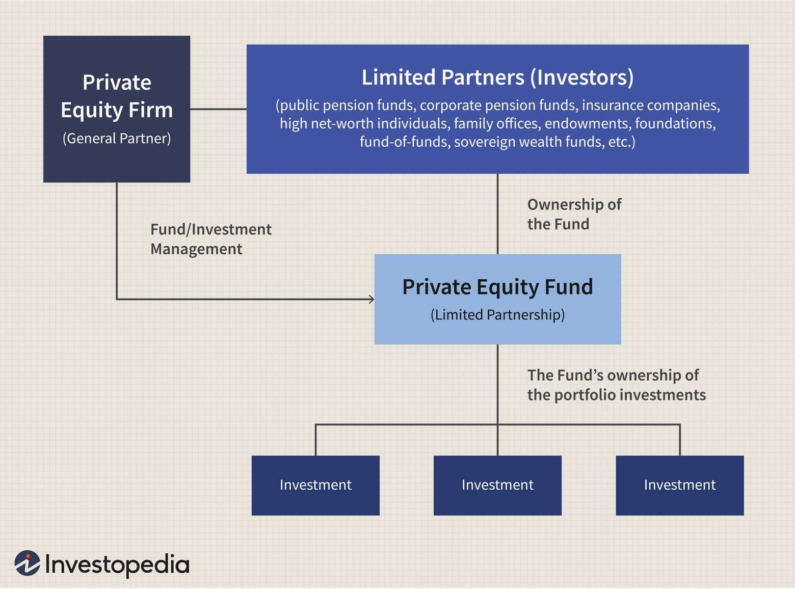

Alternative investments have gained significant traction in recent years as investors seek to diversify their portfolios beyond conventional assets like stocks and bonds. These investments typically include asset classes and strategies that are not broadly available in the public market, offering investors avenues to potentially enhance returns and manage risk differently. Among these, private credit, private equity, and algorithmic trading have emerged as prominent strategies attracting attention due to their distinct characteristics and opportunities for returns.

Private credit involves non-bank lending to companies, often as an alternative to traditional financing models offered by banks. Unlike publicly traded debt, private credit involves direct lending, mezzanine financing, and other forms of private debt arrangements. This strategy is valued for its potential to generate higher yields compared to public credit markets, while also diversifying income sources for investors. However, it also presents challenges such as illiquidity and heightened credit risk, demanding careful due diligence.

Private equity refers to the investment in companies that are not listed on public exchanges. This strategy encompasses various forms, including venture capital, which targets early-stage companies, and buyouts, which focus on acquiring controlling stakes in established firms. Private equity investments are renowned for their potential to deliver substantial returns through active management and restructuring of the target companies. Yet, these opportunities come with inherent risks, including market fluctuations and the typically long-term nature of such investments.

Algorithmic trading leverages computer algorithms to execute trades in financial markets at high speed and precision. This method includes strategies like statistical arbitrage and high-frequency trading, providing benefits such as cost efficiencies and the ability to exploit small price discrepancies across markets. Nonetheless, algorithmic trading carries risks tied to technological failures, unexpected market volatility, and the ever-evolving regulatory landscape.

Investors are tasked with comparing these diverse investment types to make informed financial decisions aligned with their risk tolerance, investment horizon, and financial objectives. This article aims to provide a comprehensive comparison between private credit, private equity, and algorithmic trading, analyzing their risk-return profiles, liquidity considerations, regulatory environments, and ethical implications. A thorough understanding of these factors is essential for potential investors to strategize effectively and achieve their desired financial outcomes.

## Table of Contents

## Understanding Private Credit Investments

Private credit refers to debt investment opportunities that occur outside of the traditional banking system and public bond markets. Unlike conventional loans provided by banks or publicly traded bonds, private credit involves non-bank institutions supplying debt financing directly to businesses. This market exists primarily to offer capital to companies that may not have access to traditional financing channels or prefer the flexibility that private credit offers.

The primary distinction between private credit and traditional lending lies in the method and source of funding. Traditional lending typically involves banks extending loans based on depositors' funds, with terms regulated by banking laws and requirements. Public credit markets, on the other hand, involve issuing bonds that are traded on public exchanges, subject to public disclosure regulations and market dynamics.

Private credit investments encompass various forms, including direct lending and mezzanine financing. Direct lending implies that funds are provided directly by investors to the borrowing entities, bypassing traditional financial intermediaries like banks. This direct approach often allows for more tailored terms and conditions. Mezzanine financing, meanwhile, is a hybrid form of capital, integrating elements of debt and equity. It typically comes with higher yields than senior debt due to its subordinated status in capital structure yet offers potentially lower risk than pure equity investments.

Investing in private credit can offer substantial benefits. One of the primary advantages is the potential for high yields. Due to the relative novelty and complexity of these markets, investors may command a premium, thus achieving higher returns than those commonly available through traditional fixed-income securities. Additionally, private credit investments facilitate diversification within an investment portfolio, as they tend not to correlate directly with public equity and bond markets, potentially reducing overall portfolio risk.

Despite these benefits, private credit also poses certain risks and challenges. Illiquidity is a significant concern, given that private credit investments often come with longer holding periods and limited options for premature [exit](/wiki/exit-strategy). Investors should be prepared to commit capital for several years without easy access to secondary markets. Furthermore, credit risk remains an integral challenge, as the potential for borrower default could lead to substantial losses. Thorough due diligence and assessment of the borrower's creditworthiness are imperative to mitigate this risk.

Overall, private credit investments provide a compelling alternative to traditional financial avenues, balancing opportunities for high returns with the necessity for rigorous risk management practices.

## Exploring Private Equity Investments

Private equity is an investment strategy that involves investing capital in private companies or acquiring public companies to delist them from stock exchanges, thereby making them private. This form of investment focuses on the strategic management and growth of the acquired enterprises, often with the aim of improving their financial performance and eventually realizing a return through avenues such as public market re-entry via initial public offerings (IPOs) or selling to another private entity.

Various types of private equity investments exist, each with unique characteristics. Venture capital is a subset focused on early-stage companies, providing capital for startups believed to have high growth potential. These investments are generally high-risk due to the developmental stage of the companies but can yield substantial returns if the ventures succeed. Buyouts, on the other hand, involve purchasing a significant portion or the entirety of an established company. Leveraged buyouts, in particular, utilize borrowed funds to finance the acquisition, with the expectation that the acquired company's cash flow and potential asset sales will cover the debt.

The potential returns on private equity investments are often substantial. Private equity firms aim to unlock value in the companies they acquire through active management, strategic restructuring, and improved operational efficiencies. This active involvement can lead to enhanced company performance and, therefore, potentially higher investment returns. According to historical data, private equity has consistently outperformed public equities, though the returns may vary significantly based on the specific sector and the execution strategy of the private equity firm involved.

Despite the potential for high returns, private equity investments are not without risks. One prominent risk is market risk—the fluctuation in value due to economic conditions, technological changes, or shifts in consumer preferences can impact the profitability and valuation of the acquired businesses. Additionally, the long-term nature of private equity investments requires investors to commit their capital for several years, often without certainty of when returns will be realized. This extended investment horizon can be a drawback for those seeking [liquidity](/wiki/liquidity-risk-premium) or more immediate financial outcomes.

Moreover, private equity transactions entail complex structures and substantial amounts of borrowed funds in cases like leveraged buyouts, which can magnify the financial impact of adverse business performance. Thus, while private equity provides opportunities for significant financial returns through active company management and revitalization strategies, it also presents considerable risks stemming from market conditions, long-term capital commitments, and financial structuring intricacies.

 to Algorithmic Trading

Algorithmic trading is a method of executing trades using computer algorithms that automatically make trading decisions, submit orders, and manage those orders after submission. These algorithms analyze market data at speeds that are impossible for human traders to achieve, executing trades based on pre-defined criteria and data inputs. The reliance on computer algorithms allows trades to be executed swiftly, optimizing the timing and pricing for large volumes of stock trades.

Several strategies characterize [algorithmic trading](/wiki/algorithmic-trading), each with unique approaches and objectives. Statistical [arbitrage](/wiki/arbitrage), for instance, involves the use of complex mathematical models to identify and exploit price inefficiencies between different markets or securities. This strategy typically relies on mean reversion theories and vast amounts of historical data to identify and act on short-term opportunities. High-frequency trading ([HFT](/wiki/high-frequency-trading-strategies)), another prominent strategy within algorithmic trading, seeks to capitalize on very small price fluctuations over extremely short timeframes. Trades are executed in fractions of a second, often involving huge volumes of trades to capture tiny spreads that add up over time.

The advantages of algorithmic trading are significant. One of the primary benefits is speed; algorithms can process market signals and execute orders far more rapidly than a human trader can. This speed translates into better pricing and reduced transaction costs, as trades can be made at the most opportune moments. Precision is also a critical advantage, as algorithms can follow set strategies without the emotional biases that might influence human traders. Consequently, there's potential for cost reductions due to increased efficiency and reduced need for human oversight.

However, the deployment of algorithmic trading comes with risks. Market [volatility](/wiki/volatility-trading-strategies) is one such risk; algorithms might exacerbate market swings if they operate on flawed assumptions or in highly reactive markets. Furthermore, technological failures present a significant challenge, as any glitches or errors in the algorithm can lead to unintended orders being executed, potentially incurring large financial losses. Additionally, the regulatory landscape for algorithmic trading is complex and constantly evolving, with authorities scrutinizing these strategies for potential market manipulation or instability. Compliance with these regulations requires continual monitoring and adaptability.

In summary, while algorithmic trading offers substantial benefits in terms of speed, precision, and cost-effectiveness, it also poses risks related to market volatility, technological reliability, and regulatory compliance. Understanding these factors is crucial for effectively navigating and utilizing algorithmic trading strategies.

## Comparing Risk and Return Profiles

Alternative investments encompass a broad range of strategies, each with distinct risk and return profiles that make them suitable for different types of investors. Private credit, private equity, and algorithmic trading exhibit unique characteristics influenced by diversification and market factors. This section analyzes these aspects, providing insights into their historical performance and suitability based on investor risk tolerance.

### Private Credit Risk and Return Profiles

Private credit refers to non-bank lending to private companies or projects, offering potentially higher yields by accepting credit risk and illiquidity. The risk profile of private credit is characterized by credit risk, default risk, and [interest rate](/wiki/interest-rate-trading-strategies) sensitivity. However, diversification within a portfolio of private credit investments can mitigate these risks, as spreading exposure across industries and geographical regions reduces the impact of a single default event.

Historical performance data indicates that private credit has offered attractive risk-adjusted returns compared to traditional fixed income assets. For example, over the past decade, private credit has yielded returns ranging from 5% to 10% annually, depending on the strategy and economic conditions. This return profile appeals to investors with moderate to high-risk tolerance seeking income and portfolio diversification.

### Private Equity Risk and Return Profiles

Private equity involves investing in private companies, often through buyouts or venture capital. The strategy is associated with higher returns due to active management and operational improvements in portfolio companies. However, it also entails substantial risks, including market risk, liquidity risk, and the long-term horizon required for successful realization of investments.

Diversification in private equity is typically achieved by investing across various sectors and stages of business development. Historical data shows that private equity has consistently outperformed public equity markets, with average annual returns ranging from 10% to 20%, particularly for top-tier funds. This makes private equity suitable for long-term investors willing to accept illiquidity for potentially superior returns.

### Algorithmic Trading Risk and Return Profiles

Algorithmic trading uses computer algorithms to execute trades with strategies like [statistical arbitrage](/wiki/statistical-arbitrage) and high-frequency trading. The key advantages include speed, precision, and the ability to exploit market inefficiencies. However, it is susceptible to risks such as technological failures, market volatility, and regulatory constraints.

The risk and return profile of algorithmic trading is largely contingent on the specific strategy employed. High-frequency trading, for instance, often generates modest individual trade returns but can accumulate significant gains at scale. Backtesting data and historical performance suggest that algorithmic trading can offer attractive returns, particularly for those with the technical expertise to develop and maintain robust algorithms. It is suitable for sophisticated investors with a high tolerance for risk and a preference for shorter investment horizons.

### Comparative Analysis

The risk-return profiles of these strategies differ, reflecting their underlying market dynamics and operational facets. Private credit offers stable income with moderate risk, making it ideal for income-focused investors. In contrast, private equity suits those willing to commit capital over the long term for higher returns. Algorithmic trading caters to technologically adept investors prepared for the challenges of rapid market movements.

Investors must weigh their risk tolerance, investment horizon, and diversification needs when selecting between these strategies. While private credit and private equity offer portfolio diversification and access to unique market segments, algorithmic trading provides agility and potential short-term gains.

In conclusion, understanding the risk and return profiles of alternative investments is crucial for making informed investment decisions. By balancing potential returns against inherent risks, investors can better align their portfolios with personal financial goals.

## Liquidity Considerations

Liquidity is a fundamental aspect of any investment strategy as it influences an investor's ability to enter or exit positions and manage their overall portfolio effectively. In the context of private credit, private equity, and algorithmic trading, liquidity considerations vary significantly, impacting the investment horizon and investor flexibility.

### Private Credit Liquidity

Private credit markets are characteristically illiquid compared to public markets. These investments often involve lending directly to companies or projects without an established secondary market for trading such instruments. This illiquidity mandates a longer commitment from investors, often spanning several years, during which capital cannot be readily accessed. The lack of liquidity can pose challenges, particularly in volatile market conditions where an investor might need to rebalance their portfolio or meet unforeseen cash flow requirements. 

The illiquid nature of private credit can impact scenarios such as economic downturns, where rising default rates may exacerbate the difficulty of liquidating positions. Consequently, investors must be prepared for a potential mismatch between their cash flow needs and the investment horizon.

### Private Equity Liquidity

Similar to private credit, private equity investments exhibit limited liquidity due to their focus on acquiring and managing private companies which are not publicly traded. The investment horizon for private equity can extend from several years to over a decade, reflecting the time required for portfolio companies to mature and achieve an exit event, such as a sale or initial public offering (IPO). 

Liquidity constraints in private equity become especially pronounced during periods of market stress or economic downturn, where exits may be deferred, delaying capital returns to investors and potentially affecting their ability to pursue new investment opportunities or fulfill liquidity needs in their broader portfolios.

### Algorithmic Trading Liquidity

In contrast to private credit and private equity, algorithmic trading typically benefits from high liquidity, particularly when employed in public securities markets. Algorithmic strategies often capitalize on liquid markets to execute trades rapidly and efficiently, leveraging speed to capture market inefficiencies. 

However, liquidity can occasionally be a double-edged sword in algorithmic trading. High-frequency trading, a subset of algorithmic trading, relies heavily on market liquidity to function optimally. During periods of extreme market volatility, liquidity may dry up, leading to unexpected slippage or difficulty in executing trades at desired prices.

Liquidity challenges in algorithmic trading may also arise from regulatory changes that impact market microstructure or trading environments, potentially reducing the effectiveness of certain strategies.

### Conclusion

Understanding the liquidity profiles of private credit, private equity, and algorithmic trading is crucial for investors to align their strategies with their financial needs and risk tolerances. While private credit and private equity demand a long-term commitment due to their inherently illiquid nature, algorithmic trading allows for more flexible and swift adjustments but is not immune to market conditions that can temporarily limit liquidity. Investors should carefully consider these factors when allocating capital across these alternative investment strategies, ensuring that their liquidity requirements and investment horizons are congruent with their chosen strategies.

## Regulatory and Ethical Considerations

The regulatory environment for alternative investments such as private credit, private equity, and algorithmic trading plays a critical role in shaping their operation and attractiveness to investors. Each investment type is distinct in its regulatory oversight, affecting investor protection, market stability, and transparency.

### Private Credit

Private credit investments, including direct lending and mezzanine financing, often operate within a less regulated spectrum compared to public credit markets. While they offer flexibility in deal structuring and higher yield opportunities, they are not typically subject to the same level of scrutiny by regulatory bodies like the Securities and Exchange Commission (SEC) in the United States. However, certain regulations in the form of financial disclosure requirements and adherence to anti-money laundering (AML) standards still apply. For investors, this implies a need for thorough due diligence to comprehend the underlying credit risks and contractual terms, given the absence of a stringent regulatory framework.

### Private Equity

Private equity investments are primarily regulated through frameworks such as the Dodd-Frank Wall Street Reform and Consumer Protection Act in the U.S., which has imposed reporting requirements and limits on leverage. These regulations aim to enhance transparency and reduce systemic risk within financial markets. Investors need to be aware of the potential for market risk and the complexity of transactions that involve multiple stakeholders and regulatory jurisdictions. Ethical considerations arise regarding the impact of private equity on employment and corporate governance. Critics argue that the focus on restructuring and profitability can sometimes lead to negative social consequences, such as job losses or reduction in corporate responsibility.

### Algorithmic Trading

Algorithmic trading faces stringent regulatory oversight aimed at ensuring market integrity and preventing systemic risks. Regulations such as the Markets in Financial Instruments Directive (MiFID II) in Europe and SEC rules in the U.S. require significant transparency, risk management protocols, and audit capabilities. Ethical concerns include the fairness of these practices, as algorithms can potentially exploit market inefficiencies and contribute to volatility, impacting the broader market. The 'flash crash' of 2010 is often cited as an example where the lack of adequate safeguards in algorithmic trading resulted in significant disruption.

### Recent Regulatory Changes

Recent regulatory changes continue to shape the landscape of these alternative investments. For private equity, increased scrutiny on environmental, social, and governance ([ESG](/wiki/esg-investing)) factors has led to more stringent reporting requirements. This shift reflects growing investor demand for transparency on non-financial metrics. In algorithmic trading, regulators are focusing on implementing robust risk controls and ensuring fair access to trading technologies, amid increasing concerns about the impact of high-frequency trading.

In conclusion, understanding the regulatory and ethical considerations surrounding private credit, private equity, and algorithmic trading is crucial for investors. These frameworks not only dictate operational conduct but also influence the perceived risks and rewards associated with these investment strategies. Investors must stay informed of regulatory developments and consider the ethical implications to align with their risk tolerance and investment goals.

## Conclusion

In concluding the comparative analysis of private credit, private equity, and algorithmic trading, it is evident that each investment strategy offers unique advantages and challenges. Private credit provides investors with potential high yields and diversification benefits but is accompanied by risks such as illiquidity and credit exposure. Private equity, while offering the possibility of substantial returns through active management and value creation in private companies, involves substantial market risk and a prolonged investment horizon. Algorithmic trading, characterized by its reliance on advanced computational techniques, offers benefits such as speed and precision but is susceptible to market volatility and technological failures.

The decision to engage in any of these investment strategies must be driven by individual investor goals, risk tolerance, and financial circumstances. An investor prioritizing consistent income might favor private credit, whereas one focused on high growth potential might consider private equity. Meanwhile, investors attracted to innovation and rapid execution might explore algorithmic trading.

Given the complexities and varying risk profiles of these strategies, thorough due diligence is essential. Investors are encouraged to meticulously evaluate each option and remain informed of the latest market conditions and regulatory developments. Professional advice from financial advisors can further aid in navigating these investment avenues, ensuring alignment with personal financial objectives and maximizing potential outcomes.

## References & Further Reading

[1]: Lopez de Prado, M. (2018). ["Advances in Financial Machine Learning."](https://www.amazon.com/Advances-Financial-Machine-Learning-Marcos/dp/1119482089) Wiley.

[2]: Chan, E. P. (2009). ["Quantitative Trading: How to Build Your Own Algorithmic Trading Business."](https://github.com/ftvision/quant_trading_echan_book) Wiley.

[3]: Kaplan, S. N., & Strömberg, P. (2009). ["Leveraged Buyouts and Private Equity."](https://www.aeaweb.org/articles?id=10.1257/jep.23.1.121) Journal of Economic Perspectives.

[4]: Brown, S. J., & Harding, J. P. (2008). ["Private Equity Performance: Returns, Persistence, and Capital Flows."](http://web.mit.edu/aschoar/www/KaplanSchoar2005.pdf) Journal of Finance.

[5]: Jansen, S. (2020). ["Machine Learning for Algorithmic Trading."](https://github.com/stefan-jansen/machine-learning-for-trading) Packt Publishing.